> 主要写于2023年的考研前
> [应用题和代码题打卡表](https://docs.qq.com/sheet/DRm1VQ09ycENsbWFo?tab=BB08J2)

**战术勤奋，战略懒惰**

[数组、链表、树代码题总结——一休](https://docs.qq.com/doc/DRWprVVdaUWlXTXhH)
如果文档中有什么问题可以找王道班主任或者直接找我。本来我想讲的东西很多，希望能  够把所有可能用到的东西都展示给大家（比如引用，如果理解不了，考试中怎么通过其他方法避免使用引用），但是时间紧张，之后会考虑制作对应课程包，不同的同学想听的东西不同，大家有什么建议以及这几次课程的评价都可以填问卷或者直接告诉我或班主任，感谢大家的支持，希望你们能学会这种分析做题的方法，那代码题拿分甚至拿满分都是没问题。数据结构其他部分每一小块我也在做总结，但是这个很难做，你们可以去看一下习题视频里面的红黑树和并查集部分，希望可以帮助大家复习。

# 1 考试时如何写代码

考试中的注释也是必不可少的，因为重要的是让老师理解我们的思路，所以在关键位置处写注释有助于老师阅读。①在变量的定义处告知该变量是做什么的；②在使用伪代码处和函数调用处告知这部分实现哪些功能；③代码逻辑复杂的地方告知是做什么的。

很多简单的代码、库函数写起来浪费时间，考试时简写或者写个系统调用即可，只要让老师知道你想干嘛即可，但重要的代码一定不能这样，否则是0 分。比如说本题就是考察快速排序，你直接调用`Qsort`不把快排过程写出来，当然拿不到分。那如何判断？只要这个东西的代码有可能超过你的所有代码1/4（其实就是他很重要），就一定要写。

给大家总结了一些可以偷懒节省时间的地方，考试时简写即可，使用的时候写清楚他的功能即可。

## 1.1 最大最小值`Max_int`、`Min_int`

从名字可以看出来，`Max_int` 是最大的整数值，`Min_int` 是最小的整数值（同理，`float`、`double`、`unsigned` 也可以这样定义），他常用于比较选择最大最小值时，比如初值设为`Max_int`，那遇到任意值都会比他小或者相等，这样只要遇到比他小的就更新为更小的值。

``` c
int D_min=Max_int; //D_min 初始设为最大的整数
for (int i=0; i<n; i++) //遍历D 循环选出最小的D
	if (D[i]<D_min)
		D_min=D[i]; //D[i]比D_min 小，D_min 更新
```

## 1.2 比大小函数 `max(a, b)`、`min(a, b)`

从名字可以看出来，这两个函数是为了得到a 和b 中的最小值和最大值
函数定义如下（不用掌握）：

```c
int max(int a, b){
	if(a>b)
		return a;
	else
		return b;
	}
int min(int a, int b){
	if(a<b)
		return a;
	else 
		return b;
}
```

使用这两个函数能让我们的代码变得简洁、清晰：

```c
int D_min=Max_int; //D_min 初始设为最大的整数
for (int i=0; i<n; i++) //遍历D 循环选出最小的D
	D_min=min(D_min, D[i]); //D_min=D_min 和D[i]中的较小值
```

## 1.3 输入输出函数`Cin`、`Cout`

C 语言中的输入、输出函数分别是scanf 和printf 函数，因为和变量的类型有关，写起来比较麻烦，在考试中可以用C++，那我们可以使用C++的cin、cout 函数来输入、输出，而不用管变量的类型，会简洁很多。

```c++
cin>>A[0]; //读入A[0]，cin 是左箭头
cin>>b>>c; //读入b、c
cout<<A[0]; //输出a
cout<<b<<c<<endl; //输出b、c，并输出回车
scanf(“%d”, A[0]); //读入A[0]
scanf(“%d”, &b); //读入b
```

使用cin、cout 函数不用管是不是要加&，也不用管他是什么类型的变量，可以节省考试时间，也减少出错可能：
```c++
int D_min=Max_int; //D_min 初始设为最大的整数
for (int i=0; i<n; i++) //遍历D 循环选出最小的D
	D_min=min(D_min, D[i]); //D_min=D_min 和D[i]中的较小值
for (int i=0; i<n; i++)
	cout<<A[i]<<” ”; //循环输出数组A 以及空格
```

当然还有一种更简单的写法，写中文。比如直接写输出数组A、输入数组A：

```c
int D_min=Max_int; //D_min 初始设为最大的整数
for (int i=0; i<n; i++) //遍历D 循环选出最小的D
	D_min=min(D_min, D[i]); //D_min=D_min 和D[i]中的较小值
for (int i=0; i<n; i++)
	输出数组A
```

## 1.4 `A[i++]`和`A[++i]`

这两个写法是不一样的，`A[i++]`中i 在前表示先使用i，再i++；`A[++i]`中先i++，再使用i（此时i 是i++后的结果）。这两种写法相当于两步缩写成了一步，如果记不住还是拆开写成两步比较稳妥。

比如对于`cout<<A[i++]`，相当于先用再加：
```c++
cout<<A[i]; //输出A[i]
i++; //i 自增
```

比如对于`cout<<A[++i]`，相当于先加再用：
```c++
i++; //i 自增
cout<<A[i]; //输出A[i]
```

## 1.5 交换函数`swap(a, b)`

函数定义如下（不用掌握）：
```c
int swap(int *a, *b){
	int temp=a;
	a=b;
	b=temp;
}
```

让我们看看这两种不同的写法：

①不使用`swap` 函数：
```c
for(int i=n-1; i>1; i--)
	for (int j=0; j<i; j++)	//冒泡排序
        if (A[i]<A[j]){	//交换A[i]和A[j]
			temp=A[i];
			A[i]=A[j];
			A[j]=temp;
		}
```

②使用`swap` 函数：
```c
for(int i=n-1; i>1; i--)
	for (int j=0; j<i; j++) //冒泡排序
		if (A[i]<A[j])
			swap(A[i], A[j]); //交换A[i]和A[j]
```

# 2 复杂度问题

如无特殊说明，数据结构大题中问的时间和空间复杂度都是<u>最坏情况下的复杂度</u>，只有一个例外：快速排序（考虑平均复杂度，或者给快速排序增加一种优化）。

在计算机学科中，$\log_2n$ 常常写作$\log n$，他们都是以2为底的对数运算。

## 2.1 时间复杂度

时间复杂度是对时间增长速度的一个估计。时间复杂度为$O(f(n))$表示该算法执行的指令数的上界是$O(f(n))$级别的，可以简单的用极限理解，若所有指令总执行次数T，时间复杂度为$O(f(n))$的算法表示=K（K 为常数）。

例如$T1=n^2+n$，$T2=2n^2-n$，通过极限的思想得到这两个算法的$f(n)=n$ 即时间复杂度都是$O(n^{2})$，常数$K1=1$，$K2=2$，$K1\ne K2$，但复杂度是一样的，所以常数系数不影响复杂度；本例中时间复杂度只有最高次决定，所以较低次项不影响复杂度。总之我们就是需要查看算法的指令执行次数T 的最高次项（而不考虑他的系数）。

$O(\log_2n)$和$O(\log_3n)$其实是相等的，因为$\log_2n=\log_23*\log_3n$，而$\log_23$ 是常数，所以$O(\log_2n)=O(\log_3n)$，考虑复杂度时，所有的$\log$ 都尽量写成$\log_2n$ 或者$\log n$ 的形式。

对于考试时写的代码，时间复杂度只需要考虑循环和递归次数。
### 循环次数

建议尽量写for 循环，所有循环都可以写成for 循环

1) 对于多层for 循环，如果每一层的变量都是自增1，则直接把每层执行次数相乘

```c
for (i=0;i<n;i++)
	for (j=0;j<n;j++)
		for (k=0;k<n;k++)
			if (A[i][j]>A[i][k]+A[k][j])
				A[i][j]=A[i][k]+A[k][j];
```


他的每一层都是变量自增，且变量都是从0~n-1 共n 次，所以总次数是$n^3$，时间复杂度是$O(n^3)$。

2. 对于多层for 循环，如果每一层的变量都是自增1，但第二三层变量取值范围和第一层变量有关

```c
for (i=0;i<n;i++)
	for (j=0;j<i;j++)
		for (k=0;k<j;k++)
			if (A[i][j]>A[i][k]+A[k][j])
				A[i][j]=A[i][k]+A[k][j];
```

时间复杂度和第①种一样，但不用考虑具体次数，时间复杂度是$O(n^3)$。

3. 对于两层循环，变量不是自增1（这种情况主要针对小题）

```c
//22 考研真题
for (i=1;i<n;i*=2)
	for (j=0;j<i;j++)
		sum++;
```

需要讨论第一层变量i 取不同值时，j 的取值有x 种，然后对x 求和。比如本题，i=1, 2, 4, 8…2k(2k<n≤2k+1)时，第二层j 有i 个取值，所以总次数是对i 求和，即T=1+2+4+2k=2k+1-1，n<T<2n，时间复杂度就是O(n)。

### 递归次数

递归<u>总次数和时间复杂度有关，而最大递归层数和空间复杂度有关。</u>

对于树中序遍历的递归写法，每个节点都会调用一次所以总共调用次数是$O(n)$级别的，时间复杂度是$O(n)$，而递归使用的层数最多是树高 $h$ ，空间复杂度是$O(h)$。

```c
void inorder(BTNode *p){
	if (p==NULL) return;
	inorder(p->lchild);
	visit(p); //对p 节点的访问等
	inorder(p->rchild);
}
```

## 2.2 空间复杂度

只算<u>额外空间</u>开销，不考虑题目中已经给出的数据所占的空间，比如题目中给出了一个数组，这个数组是不计入空间复杂度的。

* 定义的数组、链表：单个定义的变量都不需要考虑，但定义的数组中元素个数以及链表中节点个数都要计入空间复杂度中。
* 递归层数：是在递归栈中最多出现多少个过程函数，层数和总次数比较见时间复杂度的递归次数。

## 2.3 注意题目关于复杂度的要求

共有五种情况：

1) 时间上尽可能高效：表示只要求时间复杂度，对空间复杂度不做要求
2) 时间和空间两方面都尽可能高效：时间和空间复杂度都要求尽量小，时间复杂度小优先。
3) 尽可能高效：要求同②
4) 空间复杂度为$O(1)$且时间上尽可能高效的算法：要求算法的空间复杂度是$O(1)$，时间复杂
    度尽可能小。
5) 没有描述：只要能做出来就行，不要求复杂度是多少，常见于树中

# 3 顺序表

推荐流程：想出暴力解法->分析暴力解法复杂度->在暴力解法基础上思考优化

如果我们孤注一掷的求最优解可能最后连暴力解的分都拿不到，做过真题的同学会发现有一些年份的最优解是比较难的，在考试中很难做出来，所以不管怎么样至少都要拿到暴力解法的分数。

①对于基础不够好的同学目标就是做出暴力，如果正好自己能够做出来更优解就写，以节省时间为主。②对于基础牢固的同学，目标应该是先想出暴力解放有个保底分，然后在暴力的基础上做出改进优化后的算法，即保暴力分，冲满分。③对于经常刷机试题、算法扎实的同学目标就应该是最优解，但如果实在想不到，还是应该写暴力解。

如果我们不满足于暴力解法，就应该想，暴力解法浪费了什么，我们在什么地方可以对他优化，优化一般要使时间或者空间复杂度减小（主要是时间复杂度），比如说题目给的是有序数组，但是我们没有用到有序性，这是有条件没用；或者题目不需要排序，只要求中位数，但是我们对他排序了，超额完成任务，本来可以不做这么多的，这就是浪费。最好的情况就是我们完美的利用了题目的条件，而且又不多做一丁点事，这样的算法一般都更优秀。

## 3.1 暴力解法

### 枚举法

枚举法是最容易想到的方法，<u>把所有可能的情况都考虑到，然后从中选出符合题目要求的情况</u>，通常使用`for` 循环遍历。

### 快速排序

<u>对于一个无序的数组可以先通过排序把他变成有序再处理，排序使用快速排序。</u>考试中直接默写快速排序，然后注意调用快速排序时的参数即可。

快速排序是一种分治思想，每一轮快排分为两个步骤：①选择枢值key。②枢值移动到他的最终位置，左右划分为两个区间，左边区间的所有元素都小于枢值，右边区间的所有元素都大于枢值。然后对左右区间分别进行快排，不断重复直到当前处理区间元素个数小于等于1（即L>=R）。

快速排序的平均时间复杂度是$O(n\log_2n)$，平均空间复杂度是$O(\log_2n)$，是考试中最快的不稳定排序算法，一般要用到排序时都使用快速排序。快速排序的最坏时间复杂度是$O(n^2)$，最坏空间复杂度都是$O(\log_2n)$，但我们只需要加一个小优化就能避免最坏情况：即随机选择一个元素作为枢值。优化后最坏时间复杂度$O(n\log_2n)$，最坏空间复杂度$O(\log_2n)$。


```C
void Qsort(int A[], L, R){	//a 数组保存数据，L 和R 是边界
	if (L>=R) return;	//当前区间元素个数<=1 则退出
	int key, i=L, j=R;	//i和j是左右两个数组下标移动                                       
	把a数组中随机一个元素和A[L]交换//快排优化，使得基准值的选取随机
	key=A[L];	//key作为枢值参与比较
	while (i<j){
		while (i<j && A[j]>key)		j--;
		while (i<j && A[i]<=key)	i++;
		if (i<j)		swap(A[i], A[j]);	//交换A[i]和A[j]
	}
	Swap(A[L], A[i]);
	Qsort(A, L, i-1);	//递归处理左区间
	Qsort(A, i+1, R);	//递归处理右区间
}
```

## 3.2 思考优化的方向

主要是三个方向：

1. 有没有条件没有使用到，如有序性，那如何利用这个条件？
2. 有没有超额完成题目中没有要求的任务，比如题目要求求最小值，但我们却将他排序了，这是没有必要的，那如何不做这个任务？
3. 除了暴力的思考方向，还有没有别的方向？

## 3.3 进阶需要掌握的算法

### 利用有序性——折半查找

> 条件：一个数组、有序

在线性表中如果需要查找权值为x 的元素，时间复杂度是$O(n)$，也就是说不管什么线性表，查
找元素的复杂度下界是$O(n)$。如果要实现查找的时间复杂度是$O(\log_2n)$，因为待查找元素可能出现在
任意位置，那需要每次查找都能够排除一半情况，这就是折半查找的逻辑。折半查找前提：①数列
必须是有序的，升序或者降序；②只能是顺序表（数组），不能是链表。

考试中当我们看到出现了一个**有序数组**（如果是链表一定不能使用）的时候，首先想想是否需要查找，能不能使用折半查找，这是经常考察的点，2011、2018、2020 年都可以使用折半查找。

折半查找，也叫二分查找，假设我们在升序数组`A[L~R]`中查找x，L 和R 是上下界（即Left 和Right），mid=(L+R)/2，每次把x 与A[mid]比较：如果x>A[mid]，说明x 一定不会出现在`A[L\~mid]`，只可能出现在A[mid+1~R]，更新L=mid+1；而如果x<=A[mid]，说明x 一定不会出现在`A[mid+1\~R]`，只可能出现在A[L~mid]，更新R=mid。重复比较——更新过程，直到`L==R`，此时A[L]就是我们要找的元素，如果A[L]不等于x 说明x 不在数组A 中。

时间复杂度$O(\log_{2}n)$，空间复杂度$O(1)$

注意如果是题目中返回查找成功时的下标可以直接使用这段代码，否则需要调整最后一个if 语句。

代码如下：

```c
int Binary_Search(int A[], L, R, x){ //A[]和x 不一定是int 型
	int mid;
	while (L<R){ //如果L>R 则范围错误
		mid=(L+R)/2; //mid 取中间数，向下取整
		if (x<=A[mid])
			R=mid;
		else
			L=mid+1;	//更新查找范围
	}
	if (A[L]==x) return L; //查找成功，返回数组下标L
	else return -1; //查找失败
}
```

### 设置多指针后移

> 条件：多个线性表、有序

多指针后移常用于有序线性表（顺序表和链表都可以），如果考试中给出有序的线性表，优先考虑这种方式，这种方式可以用于合并多个有序线性表、查找第k 个元素等等，归并排序就是用到了这种思想。

例题：定义距离$d = |x – y|$，给定2 个长度为n= 的升序数组A、B，x 是数组A 中的某个元素，y 是数组B 中的某个元素。请设计一个尽可能高效的算法，计算并输出所有可能的最小距离D。例如数组$A = \{–16, –8, 5, 8, 13\}$，$B =\{-2, 0, 2, 6, 10\}$，则最小距离为1，相应的$x=5, y=6$, $d= |5 – 6|=1$。

这是2 个升序数组，查找一种最小的情况，可以考虑使用指针后移，设置两个指针（实际上是两个int 变量）i 和j 保存此时正在处理的数组A、B 元素的下标，每次只比较`A[i]`和`B[j]`，数组A 和B都是升序，每次i 或j 后移都会导致x 或y 变大，最终要求的是最小的d，所以我们的每次选择i 还是j 后移的时候原则就是尽量不让d 变大，即要让`A[i]`和`B[j]`中较小的那个后移。初始时i=j=0, x=-16,y=-2, d=14，`A[i]`小，应该i 后移即i++，这样会缩小x 和y 的差距，而如果j 后移会继续拉大x 和y的差距。①如果i++，则x=-8, y=-2，d=6；②如果j++，则x=-16, y=-0，d=16。我们的目的是求出最小的d，所以②这种情况是没意义的，选①情况，每次比较完 x 和 y 后把较小的那个值指针后移。最终每一个数组都只会遍历一次，不会回头，所以时间复杂度是O(n)。

### 简单动态规划

> 以空间换时间，空间保存状态

### 贪心思想

> 每次选最有利的，局部最优→整体最优

## 3.4 分析复杂度

分析所用算法的时间和空间复杂度，常见时间复杂度： $O(\log n)$ 、 $O(n)$ 、 $O(n\log n)$ 、 $O(n^{2})$ 、 $O(n^{3})$ 。
到这一步我们仍然只是思考还未进行书写，下一步开始书写。

## 3.5 书写

先思考清楚整个算法需要做哪些事情已经对应流程，分析完复杂度再开始写。
第一小问：设计思想
主要介绍逻辑，告诉老师你用了什么，比如快速排序，重要的是让老师知道用的方法是什么。
第二小问：描述算法
注释要详实，用来介绍变量、过程的作用，提示老师。对于快速排序和折半查找（注意是否查
找成功）可以直接默写，过程函数不需要改动，注意调用的参数即可。
第三小问：求时间和空间复杂度
直接写复杂度，不用过程，要检验是否符合代码。

# 4 链表
代码题中的链表一般都是**单链表**，我们复习时就按照单链表复习即可，如果万一考到双链表，只需要知道他和单链表最大的不同就是双链表可以向前和向后查找，而单链表只能向后查找。

做题推荐流程：和顺序表一样，想出暴力解法->分析暴力解法复杂度->在暴力解法基础上思考优化，但在暴力解和优化的方向上也有不同。

## 4.1 需要注意的地方

### 4.1.1 特点

1) <u>是线性表</u>。线性表能用的方法他都能用，比如归并两个有序序列，所以数组指针后移的方法也可以用到链表中。
2) <u>无法随机访问</u>。如果一个方法需要利用随机访问的特性，那就不能用在链表上，比如<u>说折半查找和快速排序</u>。
3) <u>只能向后查找，无法回头</u>。比如要求倒数第k 个结点，无法从最后一个结点往前查，得转化成正数第x 个结点，从前往后查，或者采用前后指针固定间距。

### 4.1.2 题目的要求

1) 如果题目要求空间复杂度是 $O(1)$ ，这就意味着不能额外设置数组，不能将链表先用数组保存然后再进行处理。
1) 如果题目要求不可修改链表结构，意思是我们不能随意的对链表元素顺序进行修改以及随意的插入和删除。

### 4.1.3 考察结构

题目中经常会有如下描述：

> 2）根据设计思想，采用C 或C++或Java 语言描述算法，关键之处给出注释。

我们需要提前记忆模板，然后考试中根据题目要求进行改动（仔细审题）：

单链表（data 是该节点的权值，一般可以定义成int；next 是指向下一个节点的指针，保存的是下一个节点的位置）：

```c
typedef struct LNode{
	Elemtype data; 		//该节点的权值
	struct LNode *next;	 //next 指向下一个节点
}LNode;


//双链表（不需要特别记忆，只是比单链表多一个prior 指针而已）：
typedef struct LNode{
	Elemtype data;			 //该节点的权值
	struct LNode *prior,*next;	 //prior 指向上一个节点
}LNode;
```

## 4.2 暴力解法

### 枚举法直接处理

链表的一些题目可以先采用最直接易想的方法，比如要改变链表元素顺序的话，可以将需要重排的元素一个一个拆下来重新插入。这些方法一般看起来比较憨，但是容易想到。

> 一般数组for循环，链表while循环（数组的话长度已知）

### 将链表用数组保存，再处理

可以使用数组保存链表中的结点地址或者直接保存数据，然后再按照数组的做题方法操作即可。

注意：①如果题目中求的是处理之后的链表；②如果题目要求空间复杂度为$O(1)$；这两种情况都不能使用数组保存链表的结点。

## 4.3 思考优化的方向

主要是三个方向：

1. ①有没有条件没有使用到，如有序性，那如何利用这个条件？
2. ②有没有超额完成题目中没有要求的任务，比如题目要求求最小值，但我们却将他排序了，这是没有必要的，那如何不做这个任务？
3. ③除了暴力的思考方向，还有没有别的方向？

## 4.4 适用于链表的优化算法

### 利用链表的操作

* 前后指针：前后指针的距离是一样的->查找倒数第k个指针，[2009年最优解](# 2009 年)
* 快慢指针：如果有环，快指针早晚追上慢指针
* 头插法：逆置

<iframe frameborder="0" style="width:100%;height:300px;" src="https://viewer.diagrams.net/?tags=%7B%7D&highlight=0000ff&nav=1&title=%E6%8F%92%E5%85%A5%E6%8E%92%E5%BA%8F.drawio#R7VnRcqIwFP2aPHbHEEB4FKXb3bUzO9OHbp86GYmQbSQ0xor79RsgCIh13GqF7RRnNPfkhiT3npwEBGi8SL8KnES3PCAMGIMgBWgCDMN0TfWdAZsCMEogFDQoIFgBd%2FQP0eBAoysakGXDUXLOJE2a4IzHMZnJBoaF4Oum25yzZq8JDkkLuJth1kbvaSCjAnWMYYXfEBpGZc%2FQdouaBS6d9S2WEQ74uoDyySEfoLHgXBalRTomLItdGZciAtev1G4HJkgsj2mw9iduePv9x%2BPTt5tH3zXu8XR6BfVoXzBb6Rnr0cpNGQISqIhokwsZ8ZDHmPkV6gm%2BigOS9TNQVuUz5TxRIFTgbyLlRqcXryRXUCQXTNcupeBPZMwZF3mfaJxfqqYYTTaEV6ddxpevxIwcmqumDxYhkYf8nG12FKsJXxApNqqhIAxL%2BtIcCNb8Crd%2BVQpUQWfhHzJi2F0kgKRU%2Fsqaf7G09aBvlpUnad3YlEas5ltrlJkP9bqqWW6V7eY8lnogMLcpY7XUz9XlOPtIca0u2%2B6GFPaJnMibjoTAm5pDwmksl7U7%2F8wA5aDVU6%2FogdZOe2eB73gj85C7KhTdV9TczuPtbIVt%2BfAtMDKBZwJ%2FCDwPuCgrOAbw3Bax1xGV5C7BeYbWav9okhIvk0LS5zTNyK3z%2FkKEJOnhzLczpYPi6BitKzEvwxbVdLzEzr68rV7o7RkXkHHkAjI7FdU9NDWA4sLIrgpdsrNsYDeXcNdsHfaCrbsbhJV9LnVqMC%2B0QZzGb%2FPz0HDBQ8OxnIBWJ6eGHRGxDh8bTOOQ%2B%2FscG8yWriSC9EGADbNfAgztTwW2L7XaTpPgYX8kGL5JguH%2FJMFHk6LTh%2Fn26n0%2BWeV2wr4NbivsyEYuOpMuIqNfuui0ZVE9dzoucCbAd8HIBR484gFUBUQeehMV85jshFxDmNEwVuZMBZAo3MvCS2eYjXTFggZBvsb35be57s%2BxbyGrkR%2FYzo%2B1Jz%2Fo3fYttGffspnUMtLIgv284mXF1TIXmJFygIMkzYNT1qtSmP%2BqTHuTPK%2FblLczXXSmBl%2F0p5t%2BWAIg2DMCHPGio4PznTnol46Vsvpx3gdB58id2ehyY4Z7NpAe0NO5FDuVWf3zVDzVVX%2FfIf8v"></iframe>

### 设置多指针后移

类似于前面的数组多指针后移，在链表中也可以使用这种方法，在数组中每次后移是i++，而链表中则是p=p->next，本质上都是一样的。

例题：已知两个长度分别为m 和n 带头节点的升序链表L1 和L2，若将它们合并为一个长度为m + n的升序链表，头节点为L3。请设计一个时间和空间上尽可能高效的算法，返回新的头节点L1。要求：
（1）给出算法的基本设计思想。
（2）根据设计思想，采用C 或C++语言描述算法，关键之处给出注释。
（3）说明你所设计算法的时间复杂度和空间复杂度。

这是2 个升序链表，要合并这两个链表得到新的升序链表，可以考虑使用指针后移，设置两个指针p 和q 分别保存此时正在处理的链表L1 和L2 中的结点，每次比较p 和q 所指结点的权值，把权值较小的那个结点取下来尾插入新的链中，然后对应指针后移一个结点，重复进行直到一条链遍历完，然后把另一条链连在L3 末尾，得到的L3 就是升序序列。最终每个结点都只会遍历一次，不会回头，所以时间复杂度是O(n+m)。

### 动态规划

设置数组保存状态，以空间换时间

## 4.5 分析复杂度

分析所用算法的时间和空间复杂度，常见时间复杂度：O(logn)、O(n)、O(nlogn)、O(n^2)、O(n^3)。
书写部分类似于数组，有的题目会要求写出对应结点结构。

## 4.6 一些基本操作

有很多同学经常会不知道插入、删除等操作该怎么写，特别是步骤应该按什么顺序，怕断链，其实有一种很简单的做法：只要把所有涉及到的结点都事先用指针保存下来就不可能断链。如下图，我们可以实现自己约定好当前删除结点就用指针p 指向，前一个结点就用pre 指向，后一个就用post指向。代码的顺序可以改变（注意，下面的代码在操作之前就已经用对应的指针如pre、p、post 指向对应结点了，在写之前请确认）。
### 4.6.1 取出/删除p 指向的结点
取出p 指向的结点：
pre->next=post;
p->next=null; //不写也没关系，之后会改变p->next;
删除p 指向的结点：
pre->next=post;
free(p); //不写也没关系，考试不会扣分的
### 4.6.2 将p 结点插入到pre 结点后面
p 插入pre 后面的结点：
p->next=post;
pre->next=p; //不写也没关系，之后会改变p->next;

### 4.6.3 头插法插入p
需要将p 插入到L 和post=L->next 之间
```c
p->next=post;
L->next=p; //不写也没关系，之后会改变p->next;
```

### 4.6.4 遍历链表
对于线性表（数组+链表）的遍历，如果表中元素个数确定就用for 循环，否则用while 循环。
在遍历过程中访问指针p 每次都需要后移即p=p->next，不要忘记。
已知元素个数n：

```C
Node* p=L->next;
for (int i=0; i<n; i++){
	visit(p); //访问p 结点
	p=p->next;
}
```


不知道元素个数：
```C
Node* p=L->next;
while (p!=null){
	visit(p); //访问p 结点
	p=p->next;
}
```

# 5 树

## 5.1 需要注意的地方

### 5.1.1 题目的要求

树的题目一般不会特别要求复杂度，如果没有特别要求的话，考试中只要做出来就可以直接写，
不用考虑优化问题。一般都会考察树的遍历，除非特别说明，否则遍历就用递归写，不要写非递归。

### 5.1.2 考察结构

firstchild 是指向该节点第一个儿子节点的指针，nextbro 是指向下一个兄弟节点的指针

```c
typedef struct TNode{
	Elemtype data; //每个节点的权值
	struct TNode *firstchild, *nextbro;
}TNode; //树节点
```

树和森林（节点用双亲表示法存储，常用于并查集）
一般采用数组表示，data 数组保存每个节点的权值，father 数组保存每个节点的父亲节点在数组中的下标：

```c
int father[maxsize]; //保存每个节点的父亲节点在数组中的下标
Elemtype data[maxsize]; //保存每个节点的权值
```

也可以

```c
typedef struct TNode{
	Elemtype data; //每个节点的权值
	struct TNode *father; //father 是指向该节点父亲节点的指针
}TNode; //树节点
```

二叉树（左右孩子表示）

```c
typedef struct BTNode{
	Elemtype data; //每个节点的权值
	struct BTNode *lchild,*rchild; //指向左右孩子节点的指针
}BTNode; //二叉树节点
```

## 5.2 树的遍历（递归）

树的遍历是408 代码题的常考点，包括2014、2017、2022 年，只要考察树必然需要用到遍历，一般是考察树的遍历+某种树的定义（如二叉搜索树），而二叉树的遍历包括前序中序后序遍历，他们又分为递归和非递归两种方式，每一种遍历的非递归逻辑都完全不一样，复习起来很痛苦也没有必要，而递归的代码逻辑非常简单，所以考试中除了特殊情况，树的遍历请一定使用递归（递归真的非常简单好用）。

前中后序的递归遍历时间复杂度为$O(n)$，空间复杂度为$O(h)$，n 是总节点数，h 是树高。

前序（根左右）：

```c
void preorder(BTNode *p){
	if (p==NULL) return;
	visit(p);	//对p 节点的访问等
	preorder(p->lchild);
	preorder(p->rchild);
	/*这三条语句，visit 在先就是先序，在中就是中序，在后就是后序*/
}
```

中序（左根右）：

```c
void inorder(BTNode *p){
	if (p==NULL) return;
	inorder(p->lchild);
	visit(p);	//对p 节点的访问等
	inorder(p->rchild);
}
```

后序（左右根）：

```c
void postorder(BTNode *p){
	if (p==NULL) return;
	postorder(p->lchild);
	postorder(p->rchild);
	visit(p);	//对p 节点的访问等
}
```

## 5.3 可能考察的点

对平衡二叉树、二叉排序树的判断
哈夫曼树的遍历、计算和判断

# 6 用真题检验上述做题方法

## 6.1 真题

### 2009 年 #链表

已知一个带有表头结点的单链表，结点结构为`data, link`。假设该链表只给出了头指针list。在不改变链表的前提下，请设计一个尽可能高效的算法，查找链表中倒数第k 个位置上的结点（k 为正整数）。若查找成功，算法输出该结点的data 域的值，并返回1；否则，只返回0。要求：

1. 描述算法的基本设计思想。
2. 描述算法的详细实现步骤。
3. 根据设计思想和实现步骤，采用程序设计语言描述算法（使用C、C++或Java 语言实现），关键之处请给出简要注释。

#### 暴力解1

> 枚举，依次列出最后一个结点

1）两层循环，外层是遍历 $i$ ，内层是找到倒数第 $i$ 个元素，比如上一轮查找到倒数第 $i-1$ 个结点是q，那下一轮当p->link==q 时p 就是倒数第 $i$ 个结点。

2）算法如下：

```c
int ans(node* list, int k){
	node* p, q=null;	//q=null 是倒数第0个结点
	for (int i=1; i<=k; i++){
		p=list->link;
		if (q==p)
			return 0;	//找不到倒数第k个结点
		while (p->link!=q)
			p=p->link;	//p 最终是倒数第i个结点
		q=p;	  	
	}
	cout<<p;	//输出倒数第k个结点
	return 1;
}
```

3）时间复杂度：$O(n^2)$ 空间复杂度：$O(1)$ #怀疑有误 我怎么感觉时间复杂度是O(n)

#### 暴力解2

> 递归+链表遍历，把各个结点依次压入栈中，然后不断弹出，弹出的第 $k$ 个即为所求

1. 递归调用一个一个访问节点，全局变量t 表示此时访问的结点是倒数第几个结点，如果 `t==k` 说明是倒数第 $k$ 个结点，输出该结点。

2）算法如下：

```c
int t=0;	//t 表示当前访问的是倒数第k个节点
void find(node* p, int k){
	if (p==null)
		return;
	find(p->link, k);	//在找到最后一个结点之前，都在这里进入递归
	t++;
	if (t==k)
		cout<<p;	//输出倒数第k个元素
}
int ans(node* list, int k){
	find(list->link, k);
	if (t<k)		//如果t<k，就不会输出元素，进而到这里报错
		return 0;
	return 1;
}
```



3）时间复杂度：$O(n)$ 空间复杂度：$O(n)$

#### 暴力解3

> 数组保存所有链表结点

1）遍历链表，将所有结点都存放在数组中，最后输出数组中倒数第k个元素即可。

2）算法如下：

```c
int ans(node* list, int k){
	node* A[maxn];		//结点数组
	node* p=list->link;	//正在遍历的结点
	int n=0;		//数组中结点个数
	while (p!=null){
		A[n++]=p;
		p=p->link;
	}
	if (n<k)
		return 0;
	cout<<A[n-k];
	return 1;
}
```

3）时间复杂度：$O(n)$ 空间复杂度：$O(n)$

#### 暴力解4

> 类似暴力解2

1）递归调用一个一个访问节点，全局变量t 表示此时访问的结点是倒数第几个结点，如果t==k说明是倒数第k 个结点，输出该结点。

2）算法如下：

```c
int t=0;	//t 表示当前访问的是倒数第k 个节点
int find(node* p, int k){
	if (p==null)
		return 0;
	t=1+find(p->link, k);//这里自己改过
	if (t==k)
		cout<<p;	//输出倒数第k 个元素
}
int ans(node* list, int k){
	find(list->link, k);
	return 1;
}
```

3）时间复杂度：$O(n)$ 空间复杂度：$O(1)$

#### 较优解

> 也是最优，遍历链表两次，第一次求出链表长度，从而知道所求结点是正数第几个，然后遍历寻找所求结点

1）要找到倒数第k 个结点，但链表不能回退，所以需要知道他是正数第t 个结点（不算头结点），t=n-k+1，n 是总结点数，那我们只需要先遍历一次链表求出n，然后再遍历一次链表找到第t 个结点。

2）算法如下：

```c
int ans(node* list, int k){
	node* p=list->link;
	int t, n=0;
	while (p!=null){
		n++;
		p=p->link;
	}
	t=n-k+1;
	if (t<0)
		return 0;
	p=list->link;
	for (int i=0; i<t; i++)
		p=p->link;
	cout<<p;	//输出p;
	return 1;
}
```

3）时间复杂度：$O(n)$ 空间复杂度：$O(1)$

#### 最优解

> 链表操作技巧——前后双指针

1）初始时设置两个指针p 和q 都指向头结点，q 指针先后移k 次，若此过程中q 指向了null 则查找失败，返回0。然后将p 和q 同时后移，直到p 指向null 为止，因为p 和q 直接相差k 次移动，所以此时p 一定指向倒数第k 个结点，输出p，返回1。

2）算法如下：

```c
typeof int ElemType;
typeof struct LNode{
	ElemType dada;
	struct Lnode *link;
}*LinkList;


int ans(LinkList list, int k){
	Linklist p=q=list->link;//带头结点
	for (int i=0; i<k; i++){//链表元素个数小于k
		q=q->link;
		if (q==null)
			return 0;
	}
	while (q!=null){
		p=p->link;
		q=q->link;
	}
	cout<<p;	//输出p;
	return 1;
}
```



3）时间复杂度：$O(n)$ 空间复杂度：$O(1)$

### 2010 年 #数组

设将$n~~(n > 1)$个整数存放到一维数组R 中。试设计一个在<u>时间和空间两方面都尽可能高效</u>的算法。将R 中保存的序列循环左移$p~(0 < p < n)$个位置，即将R 中的数据由$(X_0, X_1,…,X_{n-1})$变换为$(X_p, X_{p+1},…, X_{n-1}, X_0, X_1,…, X_{p-1})$。要求：<!--前p个元素到了后p个位置-->

1. 给出算法的基本设计思想。
2. 根据设计思想，采用C、C++或Java 语言描述算法，关键之处给出注释。
3. 说明你所设计算法的时间复杂度和空间复杂度。

参考：[189. 轮转数组](https://leetcode.cn/problems/rotate-array/)
#### 暴力解

> 另设一个数组，再移动

1）原序列保存在数组A中，设另一个数组B，将$A_0, A_1,…, A_{p-1}$放到$B_{n-p}, B_{n-p+1},…, B_{n-1}$中，将$A_p,A_{p+1},…, A_{n-1}$放到$B_0, B_1,…, B_{n-p-1}$中，数组B即是所求。

2）算法如下：

```c
void ans(int A[], n){
	int B[n];
	for (int i=0; i<p; i++)//前p个元素到了后p个位置
		B[i+n-p]=A[i];
	for (int i=p; i<n; i++)//剩余元素前移p个位置
		B[i-p]=A[i];
	输出B数组
}
```

3）时间复杂度：$O(n)$ 空间复杂度：$O(n)$

#### 最优解

> 技巧，数组翻转

1）原序列保存在数组A 中，将数组A[0]\~A[p-1]翻转，然后将数组A[p]\~A[n-1]翻转，最后将数组A[0]\~A[n-1]翻转。

2）算法如下：

```c
void Reverse(int A[], L, R){
	num=(R-L)/2;
	for (int i=0; i<=num; i++)
		swap(A[L+i],A[R-i]); //交换这两个数
}
void ans(int A[], n){
	Reverse(A, 0, p-1);
	Reverse(A, p, n-1);
	Reverse(A, 0, n-1);
}
```


3）时间复杂度：$O(n)$ 空间复杂度：$O(1)$

### 2011 年 #数组

一个长度为$L(L≥1)$的升序序列S，处在第$\left \lfloor L/2 \right \rfloor$个位置的数称为S 的中位数。例如，若序列S1 = (11, 13, 15, 17, 19)，则S1 的中位数是15，两个序列的中位数是含它们所有元素的升序序列的中位数。例如，若S2 = (2, 4, 6, 8, 20)，则S1 和S2 的中位数是11。现在有两个等长升序序列A 和B，试设计一个<u>在时间和空间两方面都尽可能高效</u>的算法，找出两个序列A 和B 的中位数。要求：

1. 给出算法的基本设计思想。
2. 根据设计思想，采用C、C++或Java 语言描述算法，关键之处给出注释。
3. 说明你所设计算法的时间复杂度和空间复杂度。

#### 暴力解

> 都放入新数组中快速排序

1）将数组A 和数组B 中的数据都存入数组C 中，C 数组长度为2n，对数组C 进行快速排序，
输出排序后数组中的C[n-1]。
2）算法如下：

```c
void Qsort(int A[], L, R){ //a 数组保存数据，L 和R 是边界
	if (L>=R) return; //当前区间元素个数<=1 则退出
	int key, i=L, j=R; //i 和j 是左右两个数组下标移动
	把a 数组中随机一个元素和A[L]交换//快排优化，使得基准值的选取随机
	key=A[L]; //key 作为枢值参与比较
	while (i<j){
		while (i<j && A[j]>key)
			j--;
		while (i<j && A[i]<=key)
			i++;
		if (i<j)
		swap(A[i], A[j]); //交换A[i]和A[j]
	}
	swap(A[L], A[i]);
	Qsort(A, L, i-1); //递归处理左区间
	Qsort(A, i+1, R); //递归处理右区间
}
void ans(int A[], B[], n){
	for (int i=0; i<n; i++){
		C[i]=A[i];
		C[n+i]=B[i];
	}
	Qsort(C, 0, 2n-1); //快速排序处理C[0]~C[2n-1]
	cout<<C[n-1]; //输出C[n-1]
}
```

3）时间复杂度：$O(n\log_{2}n)$ 空间复杂度：$O(n)$

#### 较优解1

> 归并排序，数组指针后移把数存入第三个数组

1）采用归并的方式合并数组A 和B 到新的数组C 中，给A、B 数组设置变量i 和j 保存数组下标，初始时都为0，每次比较A[i]和B[j]，数组C 的下一个空位保存小的那个数，并且对应指针后移，直到一个数组遍历完，将另一个数组中剩下的元素依次保存到C 空位中。

2）算法如下：

```c
void ans(int A[], B[], n){
	int i=j=k=0;
	while (i<n && j<n)
		if (A[i]<B[j]) C[k++]=A[i++];
		else C[k++]=B[j++];
	cout<<C[n-1]; //输出C[n-1]
}
```

3）时间复杂度：$O(n)$ 空间复杂度：$O(n)$

#### 较优解2

> 数组指针后移，较优解超1额完成任务，本身不需要输出有序数组

1）给A、B 数组设置变量i 和j 保存数组下标，计数k 表示此时是第几小的元素，初始时都为0，每次比较A[i]和B[j]，取较小的那个数对应指针后移且k++，<u>直到k等于n，输出这个数</u>。

2）算法如下：

```c
void ans(int A[], B[], n){
	int i=j=0, k;
	for (k=1; k<n; k++) //共移动n-1 次
		if (A[i]<B[j]) i++;
		else j++;
	cout<<min(A[i], B[j]); //输出A[i]和B[j]中的小值
}
```

3）时间复杂度：$O(n)$ 空间复杂度：$O(1)$

#### 最优解

> 多有序数组折半查找，较优解2超额完成任务，本身不需要求有序数组

1）对A、B 数组进行折半查找，设L1、R1 为数组A 的左右查找边界，L2、R2 为B 的左右查找边界。数组[L1\~R1]和B[L2\~R2]的中位数，设为a 和b，求序列A、B 的中位数过程如下：

* 若a<b 则舍弃序列A中较小的一半A[L1\~mid-1]，同时舍弃序列B中较大的一半B[mid+1\~R1]。
* 若a>=b 则舍弃序列A 中较大的一半A[mid+1~R1]，同时舍弃序列B 中较小的一半B[L1~mid-1]。

重复过程①、②，且需要保证数组A、B 中的元素个数相同，如果不同则从长的数组中舍弃一个（因为我们取mid 时都是向下取整，所以这里舍弃最小的那个值），直到两个序列中均只含一个元素时为止，较小者即为所求的中位数。

2）算法如下：

```c
void ans(int A[], B[], n){
	int mid1, mid2, L1=L2=0, R1=R2=n-1;
	while (L1<=R1){	//如果L>R 则范围错误
		mid1=(L1+R1)/2;
		mid2=(L2+R2)/2;	//取中间数，向下取整
		if (A[mid1]<B[mid2]){
			L1=mid1;
			R2=mid2;	//更新查找范围
			if (R1-L1!=R2-L2)
			L1++;	//保证R1-L1=R2-L2
		}
		else{
			R1=mid1;
			L2=mid2;	//更新查找范围
			if (R1-L1!=R2-L2)
			L2++;	//保证R1-L1=R2-L2
		}
	}
	if (A[L]==x) return L;	//查找成功，返回数组下标L
	else -1;	//查找失败
	cout<<min(A[L1],B[L2]);	//输出A[L1]和B[L2]较小值
}
```

3）时间复杂度：$O(\log_{2}n)$ 空间复杂度：$O(1)$

### 2012 年 #链表

假定采用带头结点的单链表保存单词，当两个单词有相同的后缀时，则可共享相同的后缀存储空间，例如，“loading”和“being”的存储映像如下图所示。


设str1 和str2 分别指向两个单词所在单链表的头结点，链表结点结构为`data, next`，请设计一个<u>时间上尽可能高效</u>的算法，找出由str1 和str2 所指向两个链表共同后缀的起始位置（如图中字符i 所在结点的位置p）。要求：

1. 给出算法的基本设计思想。
2. 根据设计思想，采用C 或C++或Java 语言描述算法，关键之处给出注释。
3. 说明你所设计算法的时间复杂度。

链表
暴力解：枚举str1 和str2 共同后缀起始位置时间：O(n2) 空间：O(1)
暴力解：链表转数组，数组保存结点地址时间：O(n) 空间：O(n)
最优解：链表操作，双指针时间：O(n) 空间：O(1)

#### 暴力解1

> 枚举str1 和str2 起始位置

1）设str1 和str2 的长度较大的值是n，两层for 循环枚举str1 和str2 相同后缀的起始位置。

2）算法如下：

```c
void ans(Node* str1, str2){
	Node* p=str1->next;	//str1 的后缀起始位置
	Node* q;	//之后循环中会赋初值
	while (p!=null){
		q=str2->next;	//每次进入内层循环前要给q 赋初值
		while (q!=null){
			if (p==q){
				cout<<p;	//后缀完全匹配
				return;
			}
			q=q->next;
		}
		p=p->next;
	}
	cout<<null;	//无相同后缀，可不写
}
```

3）时间复杂度：$O(n^2)$ 空间复杂度：$O(1)$

#### 暴力解2

> 链表转数组，数组保存结点地址
>
> 从后往前的第k位都相同

1）设str1 和str2 的长度较大的值是n，设置两个新数组S1 和S2 分别保存str1 和str2 链中的每个结点的地址。

2）算法如下：

```c
void ans(Node* str1, str2){
	Node* S1[n], S2[n];	//保存str1 和str2 各结点地址
	Node* p=str1->next;	//str1 的后缀起始位置
	Node* q=str2->next;	//str2 的后缀起始位置
	Len1=Len2=0;
	while (p!=null){
		S1[Len1++]=p;
		p=p->next;
	}
	while (q!=null){
		S2[Len2++]=q;
		q=q->next;
	}
	if (S1[Len1]!=S2[Len2]){
		cout<<null;	//无相同后缀，可不写
		return;
	}
	for (int i=1; i<min(Len1, Len2); i++)
		if (S1[Len1-i]!=S2[Len2-i]){
			cout<<S1[Len1-i+1];	//输出起始地址
			return;
		}
	cout<<S1[Len1-i];	//有一条链遍历完了
}
```

3）时间复杂度：$O(n)$ 空间复杂度：$O(n)$

#### 最优解

> 链表操作， 双指针
>
> 把长的串的前面部分剪掉，使两个串的长度相同，然后再同步遍历

1）每个链表设置一个指针，先求出两个链的长度，然后长的链指针往后移动x 次（x 是长度差的绝对值），使得两链剩余未访问结点数相同，然后两链表的指针同步往后移动比较，直到指向的是同一个结点。

2）算法如下：

```c
void ans(Node* str1, str2){
	Node* p=str1->next;	//指针p 用来遍历str1
	Node* q=str2->next;	//指针q 用来遍历str2
	Node* first;	//保存相同后缀起始地址
	int Len1=Len2=0;
	while (p!=null){
		Len1++;
		p=p->next;
	}
	while (q!=null){
		Len2++;
		q=q->next;
	}
	if (Len1>Len2)
		for (int i=0; i<Len1-Len2; i++)
			str1=str1->next;
	else
		for (int i=0; i<Len2-Len1; i++)
			str2=str2->next;
	int Len=min(Len1, Len2);
	for (int i=0; i<Len; i++){
		if (str1==str2){
			cout<<str1;	//输出相同后缀起始地址
            //感觉不太对，万一前面一个元素相同，然后后面元素不同就不行，可能需要判断后面的元素
			return;
		}
		str1=str1->next;
		str2=str2->next;
	}
	cout<<null;	//无相同后缀起始地址
}
```

3）时间复杂度：$O(n)$ 空间复杂度：$O(1)$

### 2013 年 #数组

已知一个整数序列$A = (a_0, a_1,…, a_{n-1})$，其中$0≤a_i＜n(0≤i < n)$。若存在$a_{p1} = a_{p 2} =\cdots=a_{pm}= x$ 且$m > n/2~~(0≤p_k < n, 1≤k≤m)$，则称x 为A 的主元素。例如$A= (0, 5, 5, 3, 5, 7, 5, 5)$，则5为主元素；又如$A = (0, 5, 5, 3, 5, 1, 5, 7)$，则A 中没有主元素。假设A 中的n 个元素保存在一个一维数组中，请设计一个<u>尽可能高效</u>的算法，找出A 的主元素。若存在主元素，则输出该元素；否则输出-1。要求：

1. 给出算法的基本设计思想。
2. 根据设计思想，采用C、C++或Java 语言描述算法，关键之处给出注释。
3. 说明你所设计算法的时间复杂度和空间复杂度。

#### 暴力解1

> 枚举，分别判断每个数是不是主元素

1）双重循环枚举，判断每个元素是否是主元素

2）算法如下：

```c
void ans(int A[], n){
	int m;
	for (int i=0; i<n; i++){
		m=0;
		for (int j=0; j<n; j++)
			if (A[i]==A[j])
				m++;
		if (m>n/2){
			cout<<A[i];	//找到了主元素
			return;
		}
	}
	cout<<-1;	//未找到主元素
	return;
}
```

3）时间复杂度：$O(n^2)$ 空间复杂度：$O(1)$

#### 暴力解2

> 快速排序，然后查找主元素

1）先快速排序得到升序序列，权值相同的元素都会相邻，扫描一趟数组，L 是之前相邻的相同元素最左边的元素下标，i 是此时正在扫描的元素下标，如果A[i]不等于A[L]则说明碰到了新的元素。

2）算法如下：

```c
void Qsort(int A[], L, R){	//a 数组保存数据，L 和R 是边界
	if (L>=R) return;	//当前区间元素个数<=1 则退出
	int key, i=L, j=R;	//i 和j 是左右两个数组下标移动
	把a 数组中随机一个元素和A[L]交换//快排优化，使得基准值的选取随机
	key=A[L];	//key 作为枢值参与比较
	while (i<j){
		while (i<j && A[j]>key)
			j--;
		while (i<j && A[i]<=key)
			i++;
		if (i<j)
			swap(A[i], A[j]);	//交换A[i]和A[j]
	}
	swap(A[L], A[i]);
	Qsort(A, L, i-1);	//递归处理左区间
	Qsort(A, i+1, R);	//递归处理右区间
}
void ans(int A[], n){
	Qsrot(A, 0, n-1);
	int L=0;
	for (int i=1; i<n; i++)
		if (A[i]!=A[L]){	//遇到了新的元素A[i]
			if (i-L>n/2){	//A[L]是主元素
				cout<<A[L];
				return;
			}
		L=i;	//更新判断元素
		}
	cout<<-1;	//未找到主元素
	return;
}
```

3）时间复杂度：$O(n\log_2n)$ 空间复杂度：$O(\log_2n)$

#### 较优解

> 动态规划，以空间换时间，之前从来没有用到过$0≤a_i＜n(0≤i < n)$

1）设置一个数组count[0~n-1]统计每个数字出现的次数，比如count[1]表示数字1 出现了1 次，遍历一次A 数组统计所有数字出现的次数，处理完后扫描一次count 数组找到是否有主元素，如果有则输出主元素，否则输出-1。

2）算法如下：

```c
void ans(int A[], n){
	int count[n];	//count 统计数字出现频率
	for (int i=0; i<n; i++)
		count[A[i]]++;
	for (int j=0; j<n; j++)
		if (count[j]>n/2){
			cout<<j;	//找到了主元素，输出主元素
			return;
		}
	cout<<-1;	//未找到主元素，输出-1
	return;
}
```

3）时间复杂度：$O(n)$ 空间复杂度：$O(n)$

#### 最优解

> 技巧，条件：数量超过一半，同时去掉一个主元素和一个其他元素，数组主元素仍然不变（当然如果去掉两个不是主元素的元素，主元素仍然不变）

1）变量j 保存可能的主元素，初始时`j=A[0]`，m=1，从A[1]开始扫描一次数组A，如果`j==A[i]`则m++，否则m--，如果m<0 则更新`j=A[i]`且m 变成1。之后在扫描一次数组A，判断 j 是否是主元素，如果是则输出j，否则输出-1。

2）算法如下：

```c
void ans(int A[], n){
	int j=A[0], m, t=1;	//取A[0]作为可能主元素
	for (int i=1; i<n; i++)	//留下来的才可能成为主元素
		if (A[i]==j) t++;
		else{
			t--;
			if (t<0){
				j=A[i];
				t=1;
			}
		}
	m=0;
	for (int i=0; i<n; i++)
		if (A[i]==j)
			m++;
	if (m>n/2) cout<<j;	//j 是主元素，输出j
	else cout<<-1;	//j 不是主元素，输出-1
}
```

3）时间复杂度：$O(n)$ 空间复杂度：$O(1)$

### 2014 年 #树

二叉树的带权路径长度（WPL）是二叉树中所有叶结点的带权路径长度之和。给定一棵二叉树T，采用二叉链表存储，结点结构如下：`left, weight, right`。其中叶结点的weight 域保存该结点的非负权值。设root为指向T的根结点的指针，请设计求T的WPL的算法，要求：

1. 给出算法的基本设计思想。
2. 使用 C 或C++语言，给出二叉树结点的数据类型定义。
3. 根据设计思想，采用C 或C++语言描述算法，关键之处给出注释。

带权路径长度（哈夫曼树中的内容）

WPL 有两种计算方法：

* WPL 的定义：WPL=所有（叶结点的权值W~i~*该结点深度D~i~）求和
* 在哈夫曼树中，WPL=所有非叶结点的权值和。本题不是哈夫曼树，不能这样计算。

解法：二叉树遍历（建议递归） 时间： $O(n)$  空间： $O(h)$ 

1）先序遍历二叉树，设置全局变量WPL，每次访问到叶子结点时，将他的权值与深度相乘，再累加到WPL 中。

2）类型定义：

```c
typedef struct BTNode{
	int weight;
	struct BTNode *left,*right;
}BTNode,*BTree;
```

3）算法如下：

基于先序遍历（强化课）

```c
int WPL = 0;	//WPL 是全局变量
void preorder(BiTree p, int d){		//当前结点p，深度d
	if (p==null)	return;					//p 是空结点
	if (p->left==null && p->right==null)	//p 是叶结点
		WPL += d*p->weight;
	preorder(p->left, d+1);		//递归调用左孩子
	preorder(p->right, d+1);	//递归调用右孩子
}
void ans(BiTNode* T){
	preorder(T, 0);	//根结点深度为0
}
```

基于先序遍历（王道真题）

```c
int WPL(BiTree root){
    return wpl_PreOrder(root, 0);
}
int wpl_PreOrder(BiTree root, int deep){
    static int wpl = 0;
    if(root->lchild==null & root->rchild==null)
        wpl += deep*root->weight;
    if(root->lchild!=null)
        wpl_PreOrder(root->lchild, deep+1);
    if(root->rchild!=null)
        wpl_PreOrder(root->rchild, deep+1);
    return wpl;
}
```

基于层次遍历

```c
#define MaxSize 100
int wpl_LevelOrder(BiTree root){
    int end1 = end2 = 0;	//头指针指向队头元素，尾指针指向队尾的后一个元素
    int wpl = deep = 0;
    BiTree lastNode;		//记录当前层的最后一个结点
    BiTree newlastNode;		//记录下一层的最后一个结点
    lastNode = root;
    newlastNode = null;
    q[end2++] = root;		//根结点入队
    while(end1 != end2){
        BiTree t = q[end1++];	//拿出队列的头一个元素
        if(t->rchild==null && t->lchild==null)
            wpl += deep*t->weight;
        if(t->lchild!=null){
            q[end2++] = t->lchild;
            newlastNode = t->lchild;
        }
        if(t->rchild!=null){
            q[end2++] = t->rchild;
            newlastNode = t->rchild;
        }
        if(t==lastNode){
            lastNode = newlastnode;
            deep += 1;
        }
    }//while
    return wpl;
}
```


### 2015 年 #链表

用单链表保存m 个整数，结点的结构为`data, link`，且$|data|\leqslant n$（n 为正整数）。现要求设计一个<u>时间复杂度尽可能高效</u>的算法，对于链表中data 的绝对值相等的结点，<u>仅保留第一次出现的结点而删除其余绝对值相等的结点</u>。例如，若给定的单链表HEAD 如下：

 

则删除结点后的HEAD 为

 

要求：

1. 给出算法的基本设计思想。
2. 使用C 或C++语言，给出单链表结点的数据类型定义。
3. 根据设计思想，采用C 或C++语言描述算法，关键之处给出注释。
4. 说明你所设计算法的时间复杂度和空间复杂度。

链表
暴力解：枚举，每一个结点都和其他结点比较时间：O(m2) 空间：O(1)
最优解：空间换时间时间：O(m) 空间：O(n)

#### 暴力解

> 枚举，每一个结点都和其他结点比较

1）两层循环枚举所有结点的两两比较，外层遍历链表中的结点p，内层遍历p 之后的结点将和p 绝对值相等的结点删除（只保留第一个出现的p）。

2）算法如下：

```c
typedef struct Node{
	int data;	//该节点权值
	struct Node *link;	//下一个结点
}Node;

void ans(Node* HEAD){
	Node* p=HEAD->link;		//外层遍历结点p
	Node* q, r;				//q 是r 前一个结点
	while (p!=null){
		q=p;	//q 从p 开始
		while (q->link!=null){
			r=q->link;	//r 表示待比较结点（因为后面可能要删除，所以设置中间变量）
			if (abs(r->data)==abs(p->data)){
				q->link=r->link;
				free(r);
			}
			q=q->link;
		}
	p=p->link;
	}
}
```

3）时间复杂度：$O(m^2)$ 空间复杂度：$O(1)$

#### 最优解

> 空间换时间

1）data 的绝对值≤n，那可以用数组`count[0~n]`来保存对于每一个绝对值是否出现过，比如count[1]>0 表示该绝对值已经出现过了，之后再出现就可以删除当前访问的结点。遍历一次链表，更新count 数组以及删除后面重复出现的结点。

2）算法如下：

```c
typedef struct Node{
	int data;		//该节点权值
	struct Node *link;	//下一个结点
}Node;

void ans(Node* HEAD){
	Node* p=HEAD->link;		//当前访问结点p
	Node* pre=HEAD;			//p的前一个结点pre
	bool count[n+1];		//可以加上数组初始化
	while (p!=null){
		if (count[abs(p->data)]==false)
			count[abs(p->data)]=true;	//p的权值第一次出现
		else{	//p 的权值前面已经出现过
			pre->link=p->link;
			free(p);
			p=pre;
		}
		pre=p;			//更新pre
		p=pre->link;	//更新p
	}
}
```

3）时间复杂度：$O(m)$ 空间复杂度：$O(n)$ 

### 2016 年 #数组

已知由$n~(n≥2)$个正整数构成的一个集合$A = \{a_k|0≤k < n\}$，将其划分为两个不相交的子集A1和A2，元素个数分别是$n_1$和$n_2$，A1和A2中元素之和分别为$S_1$和$S_2$。设计一个尽可能高效的划分算法，满 足$|n_1-n_2|$最小且$|S_1-S_2|$最大。要求：<!--数量接近的基础上差最大-->

1. 给出算法的基本设计思想。
2. 根据设计思想，采用C 或C++语言描述算法，关键之处给出注释。
3. 说明你所设计算法的平均时间复杂度和空间复杂度。

数组
暴力解：快速排序时间：O(nlogn) 空间：O(logn)
最优解：类快排思想找中位数枢值时间：O(n) 空间：O(n)

#### 暴力解

> 快速排序

1）对数组A[0~n-1]进行快速排序得到升序，排序后集合S1 是A[0~n/2-1]（向下取整），集合
S2 是A[n/2~n-1]（向下取整）。

2）算法如下：

```c
void Qsort(int A[], L, R){	//a 数组保存数据，L 和R 是边界
	if (L>=R) return;	//当前区间元素个数<=1 则退出
	int key, i=L, j=R;	//i 和j 是左右两个数组下标移动
	把a 数组中随机一个元素和A[L]交换//快排优化，使得基准值的选取随机
	key=A[L];	//key 作为枢值参与比较
	while (i<j){
		while (i<j && A[j]>key)
			j--;
		while (i<j && A[i]<=key)
			i++;
		if (i<j)
			swap(A[i], A[j]);	//交换A[i]和A[j]
	}
	A[i] = key;		//原来是，但感觉写错了swap(A[L], A[i]);
	Qsort(A, L, i-1);	//递归处理左区间
	Qsort(A, i+1, R);	//递归处理右区间
}
void ans(int A[], n){
	Qsort(A, 0, n-1);
	输出S1：A[0~n/2-1]
	输出S2：A[n/2~n-1]	//奇数时中间数发给S2
}
```

3）时间复杂度：$O(n\log_{2}n)$ 空间复杂度：$O(\log_{2}n)$

#### 最优解

> 类快排思想，找中位数枢值（超额完成任务，我们只需要分组，不需要排序）

1）对数组A[0~n-1]进行类似快速排序的做法，<u>在处理左右区间时只处理可能包含中位数的区间</u>，即如果区间的范围是[l, r]，则只有l<=n/2-1<=r 才会处理该区间。对快排的递归调用稍作修改即可。

2）算法如下：

```c
void Qsort(int A[], L, R){	//a数组保存数据，L和R是边界
	if (L>=R) return;	//当前区间元素个数<=1 则退出
	int key, i=L, j=R;	//i和j是左右两个数组下标移动
	把a数组中随机一个元素和A[L]交换//快排优化，使得基准值的选取随机
	key=A[L];	//key 作为枢值参与比较
	while (i<j){
		while (i<j && A[j]>key)		 j--;
		while (i<j && A[i]<=key)	i++;
		if (i<j)	swap(A[i], A[j]);	//交换A[i]和A[j]
	}
	swap(A[L], A[i]);
	if (n/2-1>=L && n/2-1<=i-1)	//n/2-1 在左区间范围中
		Qsort(A, L, i-1);	//递归处理左区间
	if (n/2-1>=i+1 && n/2-1<=R)	//n/2-1 在右区间范围中
		Qsort(A, i+1, R);	//递归处理右区间
}
void ans(int A[], n){
	Qsort(A, 0, n-1);
	输出S1：A[0~n/2-1]
	输出S2：A[n/2~n-1]
}
```

3）时间复杂度：$O(n)$ 空间复杂度：$O(\log_{2}n)$

### 2017 年 #树

请设计一个算法，将给定的表达式树（二叉树）转换为等价的中缀表达式（通过括号反映操作符的计算次序）并输出。例如，当下列两棵表达式树作为算法的输入时，输出的等价中缀表达式分别为$(a+b)\cdot (c\cdot (−d))$和$(a\cdot b)+(−(c−d))$。


二叉树结点定义如下：

``` c
typedef struct node{
	char data[10]; //存储操作数或操作符
	struct node *left, *right;
}BTree;
```

要求：

1. 给出算法的基本设计思想。
2. 根据设计思想，采用C 或C++语言描述算法，关键之处给出注释。

二叉树

解法：中序遍历，递归时间：$O(n)$ 空间：$O(h)$

1）中序遍历二叉树，对于当前访问的非空结点p，则先输出”(“，然后递归调用左子树，输出p的权值，递归调用右子树，输出”)”，如果p 是根或者叶结点则不需要输出”(”或”)”。

2）算法如下：

```c
void inorder(BTree* p){	//当前结点p
	if (p==null)	return;
	if (p->left!=null || p->right!=null)	printf("(");
	inorder(p->left);	//递归调用左子树
	printf("%s", p->data);
	inorder(p->right);	//递归调用右子树
	if (p->left!=null || p->right!=null)	printf(")");
}
void ans(BTNode* T){
	inorder(T->left);	//调用根左子树
	printf(T->data);	//输出根操作数
	inorder(T->right);	//调用根右子树
}
```

### 2018 年 #数组

给定一个含$n(n≥1)$个整数的数组，请设计一个在<u>时间上尽可能高效</u>的算法，找出数组中未出现的最小正整数。例如，数组$\{-5, 3, 2, 3\}$中未出现的最小正整数是1；数组$\{1, 2, 3\}$中未出现的最小正整数是4。要求：

1. 给出算法的基本设计思想。
2. 根据设计思想，采用C 或C++语言描述算法，关键之处给出注释。
3. 说明你所设计算法的时间复杂度和空间复杂度。

#### 暴力解1

> 枚举

1）可以证明最小未出现的正整数t 一定≤n+1（因为如果t>n+1，则1~t-1 都会出现一次，但
只有n 个整数，所以t-1≤n，即t≤n+1），枚举所有可能的未出现最小正整数，扫描一次数组判断
是否符合。

2）算法如下：

```c
void ans(int A[], n){
	bool flag;	//flag 表示是否出现
	for (int i=1; i<n+1; i++){
		flag=false;	//假设未出现
		for (int j=0; j<n; j++)
			if (i==A[j]){
				flag=true;	//此时i 出现了，flag 变成true
				break;	//此时i 已经出现，跳出内层循环
			}
	if (flag==false){	//若i 未出现过则输出i
		cout<<i;
		return;
		}
	}
}
```

3）时间复杂度：$O(n^2)$ 空间复杂度：$O(1)$

#### 暴力解2

> 快速排序，然后扫描一遍数组

1）先对数组A 快速排序得到升序序列，然后遍历数组找到第一个未出现的最小正整数。

2）算法如下：

```c
void Qsort(int A[], L, R){	//a 数组保存数据，L 和R 是边界
	if (L>=R) return;	//当前区间元素个数<=1 则退出
	int key, i=L, j=R;	//i 和j 是左右两个数组下标移动
	把a 数组中随机一个元素和A[L]交换//快排优化，使得基准值的选取随机
	key=A[L];	//key 作为枢值参与比较
	while (i<j){
		while (i<j && A[j]>key)
	j--;
	while (i<j && A[i]<=key)
		i++;
	if (i<j)
		swap(A[i], A[j]);	//交换A[i]和A[j]
	}
	swap(A[L], A[i]);
	Qsort(A, L, i-1);	//递归处理左区间
	Qsort(A, i+1, R);	//递归处理右区间
}
void ans(int A[], n){	//算法代码
	Qsort(A, 0, n-1);
	int i=0;
	while (i<n && A[i]<=0)
		i++;	//i为非正数的个数
	if (i==n){	//数组A 全是非正数
		cout<<1;	//输出1
		return;
	}
	/*到这里，A[i]是数组中最小的正数*/
	for (int j=i; j<n; j++)
		if (A[j]!=j-i+1) {		//j-i+1 空缺
			cout<<j-i+1;	//输出j-i+1
			return;
		}
	cout<<n-i+1;	//1~n-i 都没有空缺，输出n-i+1
}
```

3）时间复杂度：$O(n\log_2n)$ 空间复杂度：$O(\log_2n)$

#### 最优解

> 动态规划，空间换时间

1）可以证明最小未出现的正整数t 一定≤n+1（因为如果t>n+1，则1~t-1 都会出现一次，但只有n个整数，所以t-1≤n，即t≤n+1），设置一个数组count，count[i]表示i 是否在原数组A 中出现过，扫描一遍数组A，更新count 数组，之后再扫描一遍count 数组输出未出现的最小正整数。

2）算法如下：

```c
void ans(int A[], n){
	int count[n+2];	//0~n+1
	for (int i=0; i<n; i++)	//扫描数组A
		if (A[i]>0 && A[i]<=n+1)	//当0<A[i]<=n+1 时才修改
			count[A[i]]++;
	for (int j=1; j<=n+1; j++)	//扫描count 数组
		if (count[j]==0)	//j 未出现过，是最小未出现正整数
			return j;	//输出j
}
```

3）时间复杂度：$O(n)$ 空间复杂度：$O(n)$

### 2019 年 #链表

设线性表$L=(a_{1},a_{2},a_{3},\cdots ,a_{n-2},a_{n-1},a_{n})$采用<u>带头结点</u>的单链表保存，链表中的结点定义如下：

```c
typedef struct node {
	int data;
	struct node* next;
} NODE；
```

请设计一个<u>空间复杂度为$O(1)$且时间上尽可能高效</u>的算法，重新排列L 中的各结点，得到线性表$L'=(a_{1},a_{n},a_{2},a_{n-1},a_{3},a_{n-2},\cdots)$。要求：

1. 给出算法的基本设计思想。
2. 根据设计思想，采用C 或C++语言描述算法，关键之处给出注释。
3. 说明你所设计的算法的时间复杂度。

[2010年](#2010 年 #数组)的题目中，改变数组的结点顺序

#### 暴力解

> 将后一半链表取下来每个结点从头插入

1）从 $a_{\left \lceil n/2\right \rceil -1}$ 到$a_n$一个一个取下来从头开始插入，对于$a_{n-i}$从$a_1$开始往后移动i次即可找到插入位
置，然后插入该位置即可。

2）算法如下：

```c
void ans(Node* L, int n){
	int t=(n+1)/2;	//即n/2 向上取整
	Node* pre=L, p, q, qq;	//q 为指向后半段链的指针
	for (int i=0; i<t; i++)
		pre=pre->next;	//pre 指向a⌈n/2⌉
	q=pre->next;	//q 指向a⌈n/2⌉+1
	pre->next=null;	//a⌈n/2⌉的下一个结点为空
	len=n-t;		//后一半链长度
	for (int i=len; i>0; i--){	//一个一个重新插入
		pre=L;
		for (int j=0; j<i; j++)	//找到插入位置
			pre=pre->next;
		p=pre->next;	//pre 是插入位置
		pre->next=q;	//插入q
		qq=q->next;		//qq 暂存q 的下一个结点
		q->next=p;		//q 下一个结点是插入位置后的点
		q=qq;			//q 指向qq 所指结点
	}
}
```

3）时间复杂度：$O(n^2)$ 空间复杂度：$O(1)$

#### 最优解

> 将后半段逆置（头插法），再重新插入

1）从$a_{\left \lceil n/2\right \rceil -1}$ 到从$a_n$这一段链逆置，再一个一个插入（只需要在上一次插入结点后两位插入即可）。

2）算法如下：

```c
void ans(Node* L, int n){
	int t=(n+1)/2;	//即n/2向上取整***************************
	Node* pre=L, p, q, qq;	//q为指向后半段链的指针
	for (int i=0; i<t; i++)
		pre=pre->next;	//pre指向a⌈n/2⌉
	q=pre->next;	//q指向a⌈n/2⌉+1
	pre->next=null;	//分为链条链表，a⌈n/2⌉的下一个结点为空

	Node L1;	//给后半段链设置头节点L1
	L1.next=null;	//链L1初始没有其他结点
	Node* q1;
	while (q!=null){		//逆置，q 是待处理结点
		q1=q->next;			//q1 指向结点q 的下一个结点
		q->next=L1->next;	//q 的下一个结点变成L->next
		L1->next=q;			//L 的下一个结点是q，q 完成头插
		q=q1;				//更新q，准备处理下一个结点
	}

	len=n-t;	//后一半链长度
	p=L->next;
	q=L1->next;
	for (int i=len; i>0; i--){	//一个一个重新插入
		pp=p->next;	//p 是插入位置前的结点
		p->next=q;	//插入q

		qq=q->next;	//qq 暂存q 的下一个结点
		q->next=p;	//q 下一个结点是插入位置后的点
		q=qq;	//q 指向qq 所指结点
		p=pp;	//下一个插入位置
	}
}
```
<iframe frameborder="0" style="width:100%;height:300px;" src="https://viewer.diagrams.net/?highlight=0000ff&edit=_blank&nav=1&title=%E6%8F%92%E5%85%A5%E6%8E%92%E5%BA%8F.drawio#R3VhBk5owFP41HLdDEmTl6KrddsaePLR76mQgQmogbIyK%2FfVNIAgY1nU72%2BJ6cXhf8kje9733EnHQNC0eBc6TbzwizIFuVDho5kDoBZ761cChAmANxIJGFQQaYEl%2FEwO6Bt3SiGw6EyXnTNK8C4Y8y0goOxgWgu%2B701acdVfNcUwsYBliZqPfaSSTCh3D%2Bwb%2FQmic1CsDP6hGUlxPNpFsEhzxfQtCcwdNBeeyekqLKWGau5qXyu%2FzC6PHjQmSyUscvoLl4%2FrnePSULtGaIlq4ubirad5htjURm93KQ00BiRQjxuRCJjzmGWbzBn0QfJtFRK%2FjKquZs%2BA8VyBQ4C8i5cHIi7eSKyiRKTOj1Zp6oReDM9CGb0VIzkVkkgSLmMgz84KjBCp1CU%2BJFAflJwjDku66%2B8AmieLjvIZn9WCofgvt3hAsk4LKH9r908hYT62RWWHeXBqH2shUvC0nbR69tNG4lVbtN4Ci3qCKWnW0AJbG%2B4RKssxxGe5e9cuuPniTVy1sRQutsyFxR4QkxXka7bBNvx2bAt83zcszUNLqWzX27ryMbq2%2FwI%2BQjdBmfQ4dlQsTv3kYMjtrB9%2Fk3ZVk6%2F2tZat3Ybb6g%2FbOQVjuPw3dvzoN3f93Gl6q6KD3G8%2Bqo%2BdraDfHxnEl7ca3aRr20mAcELwunoB9u%2FrgfTm4sIrhkFUcvM76AMk5vrLcRDZL6ooVAGeilnSf7xzo41TzEqutPGSk0DtagD78lF1ZTm4TupGCr8mUMy4UkvFMJ%2FaKMnYCYUbjTJmhIpUo%2FEFTTkPMJmYgpVFUVkWfgt1KeQfNAOiKhmzRAOpRDf0z1Xr%2BlxjVVCRuvzxoZp9iNyPRSVkB70KJ4NslUmbz2asca307RPM%2F"></iframe>

3）时间复杂度：$O(n)$ 空间复杂度：$O(1)$

### 2020 年 #数组

定义三元组$(a，b，c)$（$a，b，c$均为正数）的距离$D = |a – b| + |b – c| + |c – a|$。给定3 个非空整数集合S1、S2 和S3，按升序分别存储在3 个数组中。请设计一个<u>尽可能高效</u>的算法，计算并输出所有可能的三元组 $(a，b，c)(a\in S1，b\in S2，c\in S3)$ 中的最小距离。例如$S1 = \{–1，
0，9\}$，$S2 = \{–25，–10，10，11\}$，$S3 =\{2，9，17，30，41\}$，则最小距离为2，相应的三元组为$(9，10，9)$。要求：

1. 给出算法的基本设计思想。
2. 根据设计思想，采用C 或C++语言描述算法，关键之处给出注释。
3. 说明你所设计算法的时间复杂度和空间复杂度。

#### 暴力解

> 三重循环将abc 都扫描一次

1）数组A、B、C 的长度分别为n、m、l，三重循环枚举abc，对于每一组abc 求出对应的距离D，并从中选出最小的距离。

2）算法如下：

```c
void ans(int A[], n, B[], m, C[], l){	//n、m、l 为三个数组长度
	int D_min=Maxint, D;	//Dmax 赋值为最大整数
	for (int i=0; i<n; i++)
		for (int j=0; j<m; j++)
			for (int k=0; j<l; k++){	//三重循环枚举abc
				D = abs(A[i]-B[j]) + abs(B[j]-C[k]) + abs(C[k]-A[i]);
				if (D<D_min)
					D_min=D;	//更新最小D 值
			}
	cout<<D_min;	//输出最小D 值
}
```

3）时间复杂度：$O(nml)$或$O(n^3)$空间复杂度：$O(1)$

#### 较优解1

> 两重循环扫描ab，而c 数组指针后移

1）数组A、B、C 的长度分别为n、m、l，两重循环枚举a、b，对数组C 设置变量k 存储数组下标不断后移，初始k=0，只要移动后的D 更小，就选择往后移动，然后对于每一组abc 求出对应的距离D，并从中选出最小的距离。

2）算法如下：

```c
//k永远后移，不回去（利用有效性），c在 a b 中间时，距离和不变；c在最右边的时候不能右移
int DD(int a, b, c){
	return abs(a-b)+abs(b-c)+abs(c-a);
}
void ans(int A[], n, B[], m, C[], l){	//n、m、l 为三个数组长度
	int D_min=Maxint, D;	//Dmax 赋值为最大整数
	/*  D是本轮a、b 确定的情况下最小的距离，D_min 是所有情况最小距离*/
	int k=0;	//数组C 的下标初始为0
	for (int i=0; i<n; i++)
		for (int j=0; j<m; j++) {	//三重循环枚举a、b
			D=DD(A[i], B[j], C[k]);	//枚举a、b 得到的初始D
			while (k<l-1 && DD(A[i], B[j], C[k+1])<D)
				D=DD(A[i], B[j], C[++k]);	//更新下标k 和距离D
			if (D<D_min) D_min=D;	//更新D_min 值
		}
	cout<<D_min;	//输出最小D 值
}
```

3）时间复杂度：$O(nm)$ 或$O(n^2)$ 空间复杂度：$O(1)$

#### 较优解2

> 一重循环扫描a，两轮折半查找b、c

1）本解法可以证明当a 确定时，b 只能是数组B 中<a 且最接近a 的那个数或>=a 且最接近a的那个数，c 也只能是数组C 中<a 且最接近a 的那个数或>=a 且最接近a 的那个数，所以只需要枚举a 并折半查找确定b 和c 可能的值然后选择最小的D。
数组A、B、C 的长度分别为n、m、l，一重循环枚举a=A[i]，通过两次折半查找可以查找到插入位点j 和k 保证B[j]<A[i]<B[j+1]，C[k]<A[i]<C[k+1]（如果插入位点是最左端和最右端另外判断），然后判断<A[i], B[j], C[k]>、<A[i], B[j+1], C[k]>、<A[i], B[j], C[k+1]>、<A[i], B[j+1], C[k+1]>哪种情况D 最小即可，就能得到a 确定的情况下最小可能的D，枚举a 更新D_min 即可。最后输出最小值D_min。

2）算法如下：

```c
int DD(int a, b, c){
	return abs(a-b)+abs(b-c)+abs(c-a);
}
int Binary_Search(int A[], L, R, x){
	int mid;
	while (L<R){	//如果L>R 则范围错误
		mid=(L+R)/2;	//mid 取中间数，向下取整
		if (x<=A[mid]) R=mid;
		else L=mid+1;	//更新查找范围
	}
	return L;	//查找到位置，返回数组下标L
}
void ans(int A[], n, B[], m, C[], l){	//n、m、l 为三个数组长度
	int D_min=Maxint, D;	//Dmax 赋值为最大整数
	/*D 是本轮a、b 确定的情况下最小的距离，D_min 是所有情况最小距离*/
	int k, l=0;	//数组C 的下标初始为0
	for (int i=0; i<n; i++){
		j=Binary_Search(B[], 0, m, A[i]);//根据A[i]折半查找
		k=Binary_Search(C[], 0, m, A[i]);//根据A[i]折半查找
		对<A[i],B[j-1] 或B[j] 或B[j+1],C[k-1] 或C[k] 或C[k+1]>排列组合求出最小的D 并与D_min 比较更新//更新D_min 值
	}
	cout<<D_min;	//输出最小D 值
}
```

3）时间复杂度：$O(n\cdot\log_{2}m\cdot\log_{2}l)$或$O(n\log_{2}^{2}n)$，空间复杂度：$O(1)$

#### 最优解

> 贪心，a、b、c 数组指针后移，任意三个点，只有最左边的点可以移动（这样才有可能减少距离）

1）数组A、B、C 的长度分别为n、m、l，对数组A、B、C 分别设置变量i、j、k 存储数组下标不
断后移，初始i=j=k=0，可以证明如果是往后移动，<u>只有当移动A[i]、B[j]、C[k]最小的那个时，D=2L3</u>
<u>才有可能减小</u>，所以每次都只后移动所指元素值最小的对应数组下标变量，一直重复进行，并更新
D 的最小值D_min，直到所指元素值最小的对应数组无法在后移，最后输出最小值D_min。

2）算法如下：

```c
int DD(int a, b, c){
	return abs(a-b)+abs(b-c)+abs(c-a);
}
void ans(int A[], n, B[], m, C[], l){	//n、m、l 为三个数组长度
	int D_min=Maxint, D;	//Dmax 赋值为最大整数
	/*D 是本轮a、b 确定的情况下最小的距离，D_min 是所有情况最小距离*/
	int i=j=k=0;	//数组C 的下标初始为0
	while(i<n && j<m && k<l){
		D_min=min(DD(A[i], B[j], C[k]), D_min);	//更新D_min
		if (A[i]<B[j] && A[i]<C[j])		i++;
		else if (B[j]<C[k])		j++;
		else k++;
	}
	cout<<D_min;	//输出最小D 值
}
```

3）时间复杂度：$O(n+m+l)$或$O(n)$ 空间复杂度：$O(1)$ 

### 2021年 #图

已知无向连通图G由顶点集V和边集E组成，$|E| > 0$，当G中度为奇数的顶点个数为不大于2的偶数时，G存在包含所有边且长度为$|E|$的路径（称为EL路径）。设图G采用邻接矩阵存储，类型定义如下：

```c
typedef struct{	//图的定义
	int numVertices,numEdges;	//图中实际的顶点数和边数
	char VerticesList[MAXV];	//顶点表。MAXV为已定义常量
	int Edge[MAXV][MAXV]；	//邻接矩阵
}MGraph;
```

请设计算法`int IsExistEL(MGraph G)`，判断G是否存在EL路径，若存在，则返回1，否则返回0。要求：

1. 给出算法的基本设计思想。
2. 根据设计思想，采用C或C++语言描述算法，关键之处给出注释。
3. 说明你所设计算法的时间复杂度和空间复杂度。

```c
int IsExistEL(MGraph G) {
	int degrees[G.numVertices];
	memset(degrees, 0, sizeof(degrees));
	// 遍历无向图统计所有点的度
	for(int i=0; i < G.numVertices; i++){
		for(int j=0; j < G.numVertices; j++){
			degrees[i] += G.Edge[i][j];
		}
	}
	int count = 0;
	// 遍历degrees数组统计度为奇数的点的个数
	for(int i=0; i < G.numVertices; i++){
		if(degrees[i] % 2 != 0){
			count++;
		}
	}
	// 检查度为奇数的点个数是否为0或者2
	if(count==0 || count==2)
		return 1;	// 存在EL路径
	else
		return 0;	// 不存在EL路径
}
```

最优解

> 不需要统计出每个结点的度，我们只需要知道度是奇数的结点的数量

```c
int IsExistEL(MGraph G) {
	int degree = 0, count = 0;
	//遍历无向图统计结点的度，如果度为奇数就count++
	for(int i=0; i < G.numVertices; i++){
		for(int j=0; j < G.numVertices; j++)
			degree += G.Edge[i][j];
		if(degree %2 != 0)
			count++;
	}
	if(count==0 || count==2)
		return 1;	// 存在EL路径
	else
		return 0;	// 不存在EL路径
}
```

### 2022年 #数组

已知非空二叉树T的结点值均为正数，采用顺序存储方式保存，数据结构定义如下：

```C
typedef struct {					// MAX_SIZE为已定义常量
	Elemtype SqBiTNode[MAX_SIZE];	// 保存二叉树结点值的数组
	int ELemNum;					// 实际占用的数组元素个数
}SqBiTree;
```

请设计一个尽可能高效的算法，判定一棵采用这种方式存储的二叉树是否为二叉搜索树，若是，则返回
true，否则，返回false，要求：
⑴ 给出算法的基本设计思想。
⑵ 根据设计思想，采用C或C++语言描述算法，关键之处给出注释。

采用顺序存储方式的二叉树，根结点保存在 `SqBiTNode[0]` 中；当某节点保存在 `SqBiTNode[i]` 中时，若有左孩子，则其值保存在 `SqBiTNode[2i+1]` 中；若有右孩子，则其值保存在 `SqBiTNode[2i+2]` 中；若有双亲结点，则其值保存在 `SqBiTNode[(i-1)/2]` 中。

二叉搜索树需要满足的条件是：任一结点值大于其左子树中的全部结点值，小于其右子树中全部结点值。中序遍历二叉搜索树将得到一个升序序列

使用整型变量 `val` 记录中序遍历过程中已遍历结点的最大值，初值为一个负整数。若当前遍历的结点值小于 `val` ，则算法返回false。否则将 `val` 值更新为当前结点的值。

```c
#define false 0
#define true 1
typedef int bool;
int val;
bool judgeInOrderBST(SqBiTree bt, int k){
    if(k<bt.ElemNum && bt.SqBiTNode[k]!=-1){
        if(judgeInOrderBST(bt,2*k+1,val) == false)//左孩子
            return false;
        if(bt.SqBiTNode[k]<=*val)
            return false;
        val = bt.SqBiTnode[k];
        if(judgeInOrderBST(bt,2*k+2,val) == false)//右孩子
            return false;
    }
    return ture;
}
```

```c
boolean t = true;		//全局变量，作为最后的返回结果
int temp = INI_MIN;	//定义一个最小值，用于处理第一个元素
void inorder(Sqlist a, int i){
    if(i>a.num || a.Sqlistdata[i]==-1 || t == false){
        return;
    }
    
    inorder(a, 2*i+1);	//中序遍历
    if(temp >=a.Sqlistdata[i]){
         t=false;
         reutrn
     }
     temp = a.Sqlistdata[i];
    inorder(a,2*i+2);
}
boolean ans(Sqlist a){
    inordr(a,0);
    return t;
}
```


## 6.2 补充习题

在数组中，某个数字减去它右边的数字得到一个数对之差。求所有数对之差的最大值。例如，在数组$\{2, 4, 1, 16, 7, 5, 11, 9\}$中，数对之差的最大值是11，是16 减去5 的结果。设计一个在时间上尽可能高效的算法输出所有数对之差的最大值。

1. 给出算法的基本设计思想。
2. 根据设计思想，采用C 或C++语言描述算法，关键之处给出注释。
3. 说明你所设计算法的时间和空间复杂度。

---

有一个数组A 由$2n+1$ 个互不相同的正整数组成，该序列中的数先减后增，第n+1 个数是最小值，输入一个整数key。请设计一个时间和空间上尽可能高效的算法，判断key 是否在该数组中，是的话返回数组下标，否则返回-1。例如对应$A=\{10, 7, 5, 2, 6, 13, 15\}$，key=5 时返回true，若key=8则返回false。

1. 给出算法的基本设计思想。
2. 根据设计思想，采用C 或C++语言描述算法，关键之处给出注释。
3. 说明你所设计算法的时间复杂度和空间复杂度。

# 7 问答环节

Q：如何使用模板，自己整理的模板与老师给的模板不一样怎么办？
一休：一定要记住的是快排和折半查找的模板，其他的可以自己发挥，很多算法的写法不一样，自己整理的只要保证正确当然更好，毕竟模板是为了节省考试时间，一般情况模板都可以直接作为一个过程使用，只要调整参数即可，但注意如2016 年的类快排思想就需要在快排基础上进行修改。

Q：那些线性表里的栈，队列，循环链表会考算法吗
一休：算法题不会考，重要的是用，重要的是怎么使用，比如说队列在BFS 中就需要使用，
很多时候不是非得用某种方法才行，队列那我可以用数组表示也可以直接调用，当然这只是针
对算法题，应用题有可能会考各种定义什么的。

# 8 测验

## 第1题

（王道P164页第14题）已知一棵非空二叉树 T 高度为h，结点总数为n，采用二叉链表存储结构。请设计一个算法，求树 T 的宽度（即具有结点数最多的那一层的结点个数），要求：

1. 给出算法的基本设计思想。
2. 使用C或C++语言，给出二叉树结点的数据类型定义。
3. 根据设计思想，采用C或C++语言描述算法，关键之处给出注释。

1）算法思想：

由题目已知二叉树高度为H，因此可设置用于统计的数组 width[H]，其中，width[i] 表示第 i 层共有几个结点（不妨规定层数从0开始）；

使用二叉树前序遍历的思想，<u>遍历的同时，判断结点所处层数 i，令 width[i]++；</u>

遍历完所有结点后，找到 width 数组中最大的值，即为二叉树的宽度。

2）二叉树结点的数据类型定义如下

```c
//二叉树的结点（链式存储）
typedef struct BiTNode{
	char data;						            //数据域
	struct BiTNode	*lchild,*rchild;	                    //左、右孩子指针
}BiTNode,*BiTree;
```

3）算法代码如下

```c
//先序遍历，同时统计各层结点总数
void PreOder(BiTree T, int level, int width[]){
	if (T == NULL)
		return;
	width[level]++;	//根据当前结点所处层数，累加该层结点总数
	PreOder(T->lchild, level + 1, width);	//遍历左子树
	PreOder(T->rchild, level + 1, width);	//遍历右子树
}

//求树的宽度
int treeWidth (BiTree T) {
	int width[H];	//定义一个数组，用于统计各层的结点总数
	for (int i=0; i<H; i++)
		width[i]=0;	//数组初始化
	PreOder(T, 0, width);	//前序遍历二叉树，同时统计各层结点总数
	int maxWidth = 0;	//找到最大宽度
	for (int i=0; i<H; i++){
		if(width[i]>maxWidth)
			maxWidth =width[i];
	}
	return maxWidth;	//返回树的宽度
}
```

层序遍历：层序遍历整棵树，然后标记结点所在层数，再统计每一层分别多少结点

```c
typedef struct{
	BiTree data[MaxSize]；	//保存队列中的结点指针
	int level[MasSize];	//保存data中相同下标结点的层次（=父结点层次+1）
	int front,rear;		//队头，队尾
}Qu;

int BTWidth(BiTree b){
	BiTree p;
	int k, max, i, n;
	Qu.front=Qu.rear=-1;	//队列为空
	Qu.rear++;
	Qu.data[Qu.rear]=b;		//根结点指针入队
	Qu.level[Qu.rear]=1;	//根结点层次为1
	while(Qu.front<Qu.rear){
		Qu.front++;			//出队
		p=Qu.data[Qu.front];	//出队结点
		k=Qu.level[Qu.front];	//出队结点的层次
		if(p->lchild!=NULL){	//左孩子进队
			Qu.rear++;
			Qu.data[Qu.rear]=p->lchild;
			Qu.level[Qu.rear]=k+1;
		}
		if(p->rchild!=NULL){	//右孩子进队
			Qu.rear++;
			Qu.data[Qu.rear]=p->lchild;
			Qu.level[Qu.rear]=k+1;
		}
	}//while
	max=0; i=0;		//max保存同一层最多的结点个数
	k=1;			//k表示从第一层开始查找
	while(i<=Qu.rear){	//i扫描队中所有元素
		n=0;		//n统计第k层的结点个数
		while(i<=Qu.rear&&Qu.level[i]==k){
			n++;
			i++;
		}
		k=Qu.level[i];	//扫描到下一层结点
		if(n>max)
			max=n;//保存最大的n
	}
	return max;
}
```

## 第2题

有两个带头节点的<u>降序单链表</u>L1、L2，较长的链表元素个数为n。链表结点定义如下所示。

```c
typedef struct LinkNode {
	double data; //权值
	struct LinkNode *next; //指向单链表的下一个结点
}LinkNode, *LinkList;
```

请设计一个时间上尽可能高效算法，按升序输出两个链表中所有元素的权值。

1. 给出算法的基本设计思想。
2. 根据设计思想，采用C或C++语言描述算法，关键之处给出注释。
3. 说明该算法的时间复杂度、空间复杂度、稳定性。

### 暴力解：数组保存+快速排序

1）算法思想：将两个链表存入数组中，然后从后到前升序输出数组。

2）算法如下：

```c
void Qsort(double A[], int L, int R){		                //a数组保存数据，L和R是边界
	if (L>=R) return;	                                        //当前区间元素个数<=1则退出
	int pivot, i=L, j=R;	                                        //i和j是左右两个数组下标移动
	swap(A[L], A[m]);                 //A[m]是在A[L~R]之间随机选取的一个元素（快排优化）
	pivot=A[L];		                                       //pivot作为枢值参与比较
	while (i<j){
		while (i<j && A[j]>pivot)
			j--;
		while (i<j && A[i]<=pivot)
			i++;
		if (i<j)
			swap(A[i], A[j]);	                    //交换A[i]和A[j]
	}
	swap(A[L], A[i]);
	Qsort(A, L, i-1);			                    //递归处理左区间
	Qsort(A, i+1, R); 			                    //递归处理右区间
}

void ans(Linklist L1, L2){
	double A[maxn];
	int t=0;					                    //t是新数组中元素个数
	Linklist p=L1->next;		                            //p指向L1链表的第一个元素
	while (p!=null){			                            //链表L1转数组保存
 		A[t++]=p->data;
 		p=p->next;
	}
	Linklist q=L2->next;		                            //q指向L2链表的第一个元素
	while (q!=null){			                            //链表L2转数组保存
		A[t++]=q->data;
		q=q->next;
	}
	Qsort(A, 0, t-1);
	for (int i=t-1; i>=0; i--)
 		cout<<A[i];				            //数组从后到前升序输出
}
```

 3）时间复杂度：$O(n\log n)$		空间复杂度：$O(n)$

### 较优解：数组保存+指针后移归并

1）算法思想：将两链表归并存入数组得到降序数组，然后从后到前升序输出数组。

2）算法如下：

```c
void ans(Linklist L1, L2){
	double A[maxn];
	int t=0;		                                            //t是新数组中元素个数
	Linklist p=L1->next;		                            //p指向L1链表的第一个元素
	Linklist q=L2->next;		                            //q指向L2链表的第一个元素
	while (p!=null && q!=null)                            //归并两个降序链表，每次选较大元素
		if (p->data>q->data){
			A[t++]=p->data;
			p=p->next;
 		}
 		else{
			A[t++]=q->data;
			q=q->next;
		}
	while (p!=null){		                                   //如果L1链表中有剩余元素则放在数组末尾
		A[t++]=p->data;
		p=p->next;
	}
	while (q!=null){		                                   //如果L2链表中有剩余元素则放在数组末尾
		A[t++]=q->data;
		q=q->next;
	}
	for (int i=t-1; i>=0; i--)
		cout<<A[i];			                    //数组从后到前升序输出
}
```

 3）时间复杂度：$O(n)$		空间复杂度：$O(n)$

### 最优解：指针后移归并+头插法逆置

1）算法思想：将两链表归并到链表L3中，归并时采用头插法，得到的降序链表L3，依次输出链表中的元素。

2）算法如下：

```c
LinkNode L3;						          //定义全局变量L3
linklist Head_Insert(linklist p){		                  //头插法插入L3中
	linklist p1=p->next;
	p->next=L3->next;
	L3->next=p;
	p=p1;
        return p;
}
void ans(Linklist L1, L2){
	Linklist p=L1->next;			                 //p指向L1链表的第一个元素
	Linklist q=L2->next;			                 //q指向L2链表的第一个元素
	L3->next=null;					         //初始链表L3为空
	while (p!=null && q!=null)	                         //归并两个降序链表，每次选较大元素
		if (p->data>q->data)
			p=Head_Insert(p);		         //将p头插法插入L3中，p指向下一个结点
		else
			q=Head_Insert(q);		         //将q头插法插入L3中，q指向下一个结点
	while (p!=null){            		                //如果L1链表中有剩余元素则头插法插入L3
		p=Head_Insert(p);                            //将p头插法插入L3中，p指向下一个结点
	while (q!=null)				                //如果L2链表中有剩余元素则头插法插入L3
 		q=Head_Insert(q);                             //将q头插法插入L3中，q指向下一个结点
	p=L3->next;
	while (p!=null){				                //依次输出链表L3中的元素
		cout<<p->data;
		p=p->next;
	}
}
```

 3）时间复杂度：$O(n)$			空间复杂度：$O(1)$

## 第3题

已知一个整数序列$A = (a_0, a_1,…, a_{n-1})$，其中 $0 ≤ a_i＜ n(0 ≤ i < n)$。从数组中选择若干个数，要求选择的数中任意两数之差的绝对值$\leqslant K (0 < K < n)$。请设计一个在时间上尽可能高效的算法输出最多可能选择的元素个数。要求：

1. 给出算法的基本设计思想。
2. 根据设计思想，采用C或C++语言描述算法，关键之处给出注释。
3. 说明你所设计算法的时间复杂度和空间复杂度。

### 暴力解：枚举最小的数

1）算法思想：外层循环枚举最小数的在数组中的下标i，则可以选择的数范围是A[i]~A[i]+k，内层循环遍历数组求出被选择的数的个数。

2）算法如下：

```c
void ans(int A[], n, k){
	int L, R, m;
	int Max_m=0;			                                //Max_m存储可以选择的最多元素数
	for (int i=0; i<n; i++){
 		L=A[i];
 		R=L+k;
 		m=0;				                        //m表示在当前范围下可以选择的元素数
 		for (int j=0; j<n; j++)
			if (A[j]>=L && A[j]<=R)
				m++;
 		Max_m=max(Max_m, m);	                //如果m>Max_m，则将Max_m更新
	}
	cout<<Max_m;
}
```

3）时间复杂度：$O(n^2)$			空间复杂度：$O(1)$

### 较优解：快速排序+数组指针移动

1）算法思想：先快速排序得到升序数组，然后设置两个变量i和j分别指向最小的可选元素和最小的大于A[i]+k的元素（即A[j-1]可选A[j]不可选），遍历最小可选元素，j向后移动，直到j移动到超过数组范围。

2）算法如下：

```c
void Qsort(int A[], L, R){		                                //a数组保存数据，L和R是边界
	if (L>=R) return;				                //当前区间元素个数<=1则退出
	int pivot, i=L, j=R;				                //i和j是左右两个数组下标移动
	把a数组中随机一个元素和A[L]交换	                //快排优化
	pivot=A[L];						        //pivot作为基准值参与比较
	while (i<j){
		while (i<j && A[j]>pivot)
			j--;
		while (i<j && A[i]<=pivot)
			i++;
		if (i<j)
			swap(A[i], A[j]);		                 //交换A[i]和A[j]
	}
	swap(A[L], A[i]);
	Qsort(A, L, i-1);				                //递归处理左区间
	Qsort(A, i+1, R); 				                //递归处理右区间
}

void ans(int A[], n, k){
	int L, R;
	int Max_m=0;					                //Max_m存储可以选择的最多元素数
	Qsort(A, 0, n-1);
	j=0;
	for (int i=0; i<n; i++){
		L=A[i];
		R=L+k;
		while (j<n && A[j]<=R)
			 j++;						//j保存的是大于A[j]+k的最小元素
		Max_m=max(Max_m, j-i);		        //如果m>Max_m，则将Max_m更新
	}
	cout<<Max_m;
}
```

3）时间复杂度：$O(n\log_2n)$			空间复杂度：$O(\log_2n)$

### 最优解：空间换时间

1）算法思想：用count数组保存每个数出现的次数，count[i]表示i出现了几次，先扫描一遍序列，更新count数组，然后遍历上界，求出不同上下界最多能选择的元素个数m，统计m的最大值Max_m。

2）算法如下： #技巧

```c
void ans(int A[], n, k){
	int L, R;
	int m=0;			                     //m表示在当前范围下可以选择的元素数
	for (int i=0; i<n; i++)
 		count[A[i]]++;
	for (int i=0; i<=k; i++)	            //统计范围是0~k之间最多选择多少个数
 		m+=count[i];
	Max_m=m;		                    //初始时Max_m保存选择0~k之间最多能选的数个数
	for (int i=k+1; i<n; i++){	            //此时选择数的范围是i-k~i
 		m=m+count[i]-count[i-k-1];  //类似滑动窗口，不选择i-k-1，选择i
        //减一个元素，加一个元素，从而不用每次都累加 #技巧
 		Max_m=max(Max_m, m);   //如果m>Max_m，则将Max_m更新
	}
	cout<<Max_m;
}
```

3）时间复杂度：$O(n)$			空间复杂度：$O(n)$

## 第4题

一个长度为n的升序整数序列S中，只有常数K（K的值已知）出现了若干次，其他数最多都只出现一次。试设计一个在时间和空间两方面都尽可能高效的算法，找出 K 出现的次数。

1. 给出算法的基本设计思想。
2. 根据设计思想，采用C或C++语言描述算法，关键之处给出注释。
3. 说明你所设计算法的时间复杂度和空间复杂度。

### 暴力解：枚举，遍历数组统计k出现的次数

1）算法思想：循环遍历数组，统计数组中k出现的次数。

2）算法如下：

```c
void ans(int A[], n, k){
	int m=0;					            //m统计k出现的次数
	for (int i=0; i<n; i++)
		if (A[i]==k)
			m++;
	cout<<m;
}
```

3）时间复杂度：$O(n)$								空间复杂度：$O(1)$

### 最优解：折半查找两次

1）算法思想：要求出k出现的次数，可以折半查找k-1和k+1的位置，他们之间就是k出现的次数。k-1和k+1最多只会出现一次，通过折半查找k-1和k+1的位置，然后将下标相减就得到k出现的次数。

2）算法如下：

```c
int Binary_Search(int A[], L, R, x){
	int mid;
	while (L<R){			                    //如果L>R则范围错误
		mid=(L+R)/2;		                    //mid取中间数，向下取整
		if (x<=A[mid])
			R=mid;
		else
			L=mid+1;		                    //更新查找范围
	}
	return L;				                    //返回数组下标L
}
void ans(int A[], n, k){
	int L=Binary_Search(int A[], 0, n-1, k-1);
	if (A[L]<k)
		L++;				                    //L是k出现的最小下标
	int R=Binary_Search(int A[], 0, n-1, k+1);
	if (A[R]>k)
		R--;				                     //R是k出现的最大下标
	cout<<R-L+1;
}
```

3）时间复杂度：$O(\log_{2}n)$		空间复杂度：$O(1)$ 

# 总结

## 数组模板整理及技巧总结

* [快速排序](数据结构.md#8.3.2%20快速排序)感觉还是用课本的比较好
```C
void Qsort(int A[], L, R){	//a数组保存数据，L和R是边界
	if (L>=R) return;	//当前区间元素个数<=1 则退出
	int key, i=L, j=R;	//i和j是左右两个数组下标移动                                       
	把a数组中随机一个元素和A[L]交换//快排优化，使得基准值的选取随机
	key=A[L];	//key作为枢值参与比较
	while (i<j){
		while (i<j && A[j]>key)		j--;
		while (i<j && A[i]<=key)	i++;
		if (i<j)		swap(A[i], A[j]);	//交换A[i]和A[j]
	}
	Swap(A[L], A[i]);
	Qsort(A, L, i-1);	//递归处理左区间
	Qsort(A, i+1, R);	//递归处理右区间
}
```
* [折半查找](数据结构#7.2.2.%20折半查找)
```C
//个人理解：把查找值和数组中间的元素对比，一样就返回下标，大了往左找，小了往右找

typedef struct{					//查找表的数据结构（顺序表）（升序）
	ElemType *elem;				//动态数组基址
	int TableLen;				//表的长度
}SSTable;

// 折半查找
int Binary_Search(SSTable L,ElemType key){
	int low=0, high=L.TableLen-1, mid;
	while(low<=high){			//low>high时查找失败
		mid=(low+high)/2;		//取中间位置（向下取整）
		if(L.elem[mid]==key)
			return mid;
		else if(L.elem[mid]>key)
			high=mid-1;			//从前半部分继续查找
		else
			low=mid+1;			//从后半部分继续查找
	}
	return -1;					//查找失败，返回-1
}
```

* [归并排序](数据结构#8.5.1%20归并排序)：把两个部分中的最小元素进行对比，较小者加入到有序表。循环进行，直到某个部分无剩余元素，就把另一个部分中的剩余元素依次添加到有序表中
```C
//创建辅助数组B
int *B=(int *)malloc(n*sizeof(int));	//辅助数组B

//A[low,...,mid]，A[mid+1,...,high] 各自有序，将这两个部分归并
void Merge(int A[], int low, int mid, int high){
	int i, j, k;
	for(k=low; k<=high; k++)	//将A中所有元素复制到B中
		B[k] = A[k];
	for(i=low,j=mid+1,k=i; i<=mid&&j<=high; k++){
		if(B[i]<=B[j])	//将较小值复制到A中，为保证稳定性，两个元素相等时优先使用靠前的那个
			A[k]=B[i++];
		else
			A[k]=B[j++];
	}//for
	 
	//没有归并完的部分复制到尾部（while只会执行一个）
	while(i<=mid)
        	A[k++]=B[i++];	//若第一个表未检测完，复制
	while(j<=high)
        	A[k++]=B[j++];	//若第二个表未检测完，复制
}

//递归操作
void MergeSort(int A[], int low, int high){
	if(low<high){
		int mid = (low+high)/2;		//从中间划分
		MergeSort(A, low, mid);		//对左半部分归并排序
		MergeSort(A, mid+1, high);	//对右半部分归并排序
		Merge(A,low,mid,high);		//归并
	}//if
}
```

## 链表的基本操作

* 插入操作（头插、尾插）代码
* 删除操作代码
* 逆置操作代码
* 前后指针代码
* 快慢指针代码
* 链表的数据结构定义

## 栈的定义和基本操作实现

* P40.1 删除值为x的结点
* P40.5 单链表就地逆置
* P40.6 将链表排序
* P40.11 拆分链表
* P40.12 删除链表中的重复元素
* 将两个递增链表合并成一个递增链表
* P40.13 将两个递增链表合并成一个递减链表
* P40.17 判断一个链表是否对称
* P40.19 依次输出链表中结点值最小的元素
* P40.21 判断链表中是否存在环

## 树

* 树和二叉树的存储结构
  * 树的孩子兄弟结点表示法
  * 树的双亲表示法
  * 二叉树的左右孩子结点表示法
* 树的表示方法
* 树的算法
* others

## 图

* 图的遍历
  * 邻接矩阵表示
  * 邻接表表示
* others
  * Prime算法代码
  * Floyd算法代码
  * 拓扑排序代码