# 1.1 计算机发展历程

## 什么是计算机系统

* 计算机系统 = 硬件 + 软件；计算机性能的好坏取决于软硬件功能的总和
* 软件分为：
	* 系统软件：用来管理整个计算机系统，eg：操作系统、数据库管理系统、标准程序库、网络软件、语言处理程序、服务程序
	* 应用软件：按任务需要编制成的各种程序，eg：抖音、迅雷

## 硬件的发展

| 发展阶段 |    时间     |     逻辑元件     | 速度（次/秒） |   内存    |       外存        |
| :--: | :-------: | :----------: | :-----: | :-----: | :-------------: |
| 第一代  | 1946-1957 |     电子管      |  几千-几万  | 汞延迟线、磁鼓 |     穿孔卡片、纸带     |
| 第二代  | 1958-1964 |     晶体管      | 几万-几干万  |  磁芯存储器  |       磁带        |
| 第三代  | 1964-1971 |   中小规模集成电路   | 几十万-几百万 | 半导体存储器  |      磁带、磁盘      |
| 第四代  |  1972至今   | 大规模、超大规模集成电路 | 上千万-万亿  | 半导体存储器  | 磁盘、磁带、光盘、半导体存储器 |

### 字长
#考前记一记 
* **机器字长**：计算机位数或CPU位数，CPU进行一次整数运算所能处理的二进制数据的位数，通常指CPU内部用于整数运算的数据通路的宽度（数据总线的位数），因此机器字长等于CPU内部用于整数运算的运算器位数和通用寄存器宽度
* ~~**操作系统位数**：操作系统可寻址的位数（注意与机器字长区分）~~==存疑==
* **指令字长**：一个指令字中包含的二进制代码的位数（可能会变），指令字长一般取存储字长的整数倍
* **存储字长**：一个存储单元的二进制代码的长度（通常与MDR位数相同）

摩尔定律：集成电路上可容纳的晶体管数目约每隔18个月便会增加1倍，整体性能也将提升1倍

## 软件的发展

机器语言->汇编语言->高级语言

## 发展趋势

两极分化：微型计算机微型化、巨型机巨型化

# 1.2 计算机系统层次结构

## 1.2.1 计算机硬件的基本组成

### 早期冯诺依曼机结构

特点

* 采用“存储程序”的工作方式，基本工作方式是控制流驱动方式
* 计算机硬件系统由运算器、存储器、控制器、输入设备和输出设备五大部件组成
	* **输入设备**：将信息转换成机器能识别的形式。
	* **存储器**：存放数据和程序。
	* **运算器**：算术运算和逻辑运算。
	* **控制器**：协调其他部件与解析存储器中的程序或指令。
	* **输出设备**：将结果转换为人类熟悉的形式。
* 指令和数据以同等地位存储在存储器中，形式上没有区别，但计算机能区分它们（通过指令周期的不同阶段）
* 指令和数据均用二进制代码表示。指令由操作码和地址码组成。
* 以<u>运算器</u>为中心：输入/输出设备与存储器之间的数据传送通过运算器完成。

存储程序的概念：将指令以二进制代码的形式事先输入计算机的主存储器，然后按其在存储器中的首地址执行程序的第一条指令，以后就按该程序的规定顺序执行其他指令，直到程序执行结束

第一台采用冯诺依曼结构的计算机EDVAC

### 现代计算机的结构

* 以存储器为中心

## 1.2.2 硬件的工作原理

* 主存储器：用于存放程序和数据。 ^d73be5
	* 存储体：存储数据的主体，按地址存取。（相联存储器按内容访存）
		* 存储元：即存储二进制的电子元件，每个存储元可存1bit
		* 存储单元：每个存储单元存放一串二进制代码
		* 存储字：存储单元中二进制代码的组合，即一个存储元存放的数据。
		* 存储字长：存储单元中二进制代码的位数
	* **MAR地址寄存器**(Memory Address Register)：用于指明要读写哪个存储单元。<u>MAR位数 $n$ 反映存储单元数量（存储器容量）$2^n$ ，与程序计数器PC长度相等</u>
	* **MDR数据寄存器**(Memory Data Register)：用于暂存要读写的数据。其<u>MDR位数=存储字长</u>
	* 时序控制逻辑：产生存储器操作时所需的各种时序信号。
* [运算器](./第5章%20中央处理器#运算器的基本结构)：用于算术运算和逻辑运算。
	* ACC累加计数器(Accumulator)：存放操作数、运算的结果
	* MQ乘商寄存器(Multiple-Quotient Register)：进行乘除运算时，用于存放操作数或运算结果
	* X通用寄存器：存放操作数
	* ALU算术逻辑单元(Arithmetic and Logic Unit)：通过内部复杂的电路实现各种算术运算、逻辑运算
	* PSW程序状态字寄存器：也称标志寄存器，用于存放ALU运算得到的一些标志信息或处理机的[状态信息](第2章%20数据的表示和运算.md#标志位的生成)，如结果是否溢出、有无产生进位或借位、结果是否为负等。

&nbsp;|加|减|乘|除
:-:|:-:|:-:|:-:|:-:
ACC|被加数、和|被减数、差|乘积高位|被除数、余数
MQ|&nbsp;|&nbsp;|乘数、乘积低位|商
X|加数|减数|被乘数|除数

* [控制器](./第5章%20中央处理器#控制器的基本结构)
	* PC程序计数器(Program Counter)：存放下一条指令的地址，有自动加一的功能 ^[这里的“一”是指一条指令长度，实际上不一定为1]
	* IR指令寄存器(Instruction Register)：存放当前执行的命令
	* CU控制单元(Control Unit)：分析指令，给出控制信号

* **工作过程** <!--第1章第4个视频：各个硬件的工作原理-->
	* 初始：指令、数据存入主存，PC指向第一条指令
	* 从主存中取指令放入IR，PC自动加1，CU分析指令，CU指挥其他部件执行指令

|      主存地址      |       指令/数据        |          注释           |
| :------------: | :----------------: | :-------------------: |
|       0        | 000001, 0000000101 |      取数 $a$ 至ACC      |
|       1        | 000100, 0000000110 |  乘 $b$ 得 $ab$，存于ACC中  |
|       2        | 000011, 0000000111 | 加 $c$ 得 $ab+c$，存于ACC中 |
|       3        | 000010, 0000001000 |    将 $ab+c$ 存于主存单元    |
|       4        | 000110, 0000000000 |          停机           |
| $5=(0011)_{2}$ | 000000, 0000000010 |      原始数据 $a=2$       |
| $6=(0110)_{2}$ | 000000, 0000000011 |      原始数据 $b=3$       |
| $7=(0111)_{2}$ | 000000, 0000000001 |      原始数据 $c=1$       |
| $8=(1000)_{2}$ | 000000, 0000000000 |      原始数据 $y=0$       |

* 执行地址为0的指令，取指令1\~4，分析指令5，执行指令6\~9。初始状态下(PC)=0，指向第一条指令的存储地址 
	1. (PC)→MAR，导致(MAR)=0，即程序计数器将当前指向的指令地址通过系统总线传输给存储地址寄存器，从而存储地址寄存器的值现在置为0，表示它要处理的指令的主存地址为0。
	2. M(MAR)→MDR，导致(MDR)=000001 0000000101，即根据PC中存储的地址0，在存储体中找到对应的指令000001,0000000101，并把它放入MDR中。
	3. ···
	4. (MDR)→IR，导致(IR)=000001 0000000101，即将MDR中存储的指令放入IR中。
	5. OP(IR)→CU，将IR中指令的操作码送到CU，CU分析后得知，这是“取数”指令
	6. Ad(IR)→MAR，导致(MAR)=5，即将指令的地址码送到MAR
	7. M(MAR)→MDR，导致(MDR)=0000000000000010=2，即存储体根据MAR找到地址为5的数据2，将其放到MDR中。
	8. ···
	9. (MDR)→ACC，导致(ACC)=0000000000000010=2，即将MDR中的数据放入ACC中

* 执行地址为1的指令，取指令1\~4，分析指令5，执行指令6\~10。
	1. $(PC)+=1$，$(PC)=1$：程序计数器完成一条指令自动加一，从而现在指向地址为$1$的指令。
	2. $(PC)\rightarrow MAR$，$(MAR)=1$：存储地址寄存器的值现在置为$1$，表示它要处理的指令的主存地址为$1$。
	3. $M(MAR)\rightarrow MDR$，$(MDR)=000100\,0000000110$：在存储体中找到地址为$1$的指令$000100\,0000000110$，并把它放入存储数据寄存器中。
	4. $(MDR)\rightarrow IR，(IR)=000100\,0000000110$：将存储数据寄存器存储的指令放入指令寄存器中。
	5. $OP(IR)\rightarrow CU$：将指令寄存器的$000100$操作码传输给控制单元中，控制单元根据操作码知道这是“乘法”的指令。
	6. $AD(IR)\rightarrow MAR$：控制单元根据乘法指令，在第一条指令中就得到了其中一个乘数a，现在要另一个乘数$b$，$b$的地址就是指令寄存器的$0000000110$，即取出存储地址为$6$的数据$b=3$，将这个地址交给存储地址寄存器负责取出。
	7. $M(MAR)\rightarrow MDR$，$(MDR)=000000\,0000000011=3$：存储体根据存储地址寄存器的$0000000110$地址找到地址为$6$的数据$3$，并把$3$放到存储数据寄存器中。
	8. $(MDR)\rightarrow MQ$，$(MQ)=000000\,0000000011=3$：由于需要乘法操作，所以将存储数据寄存器的$3$放入乘商寄存器中。
	9. $(ACC)\rightarrow X$，$(X)=2$：然后把$a$的值从累加器中放入通用寄存器中。（乘法操作中被乘数放入通用寄存器中，而乘数放入乘商寄存器中）。
	10. $(MQ)*(X)\rightarrow ACC$，$(ACC)=6$：控制单元通知算术逻辑单元，通过算术逻辑单元对ab进行相乘后放入累加器中。如果乘积太大则需要乘商寄存器辅助存储。
* 执行地址为2的指令，取指令1\~4，分析指令5，执行指令6\~9：
	1. $(PC)+=1$，$(PC)=2$：程序计数器完成一条指令自动加一，从而现在指向地址为2的指令。
	2. $(PC)\rightarrow MAR$，$(MAR)=2$：存储地址寄存器的值现在置为$2$，表示它要处理的指令的主存地址为2。
	3. $M(MAR)\rightarrow MDR$，$(MDR)=000011\,0000000111$：根据存储地址寄存器存储的地址$2$，在存储体中找到对应的指令$000011\,0000000111$，并把它放入存储数据寄存器中。
	4. $(MDR)\rightarrow IR$，$(IR)=000011\,0000000111$：将存储数据寄存器存储的指令放入指令寄存器中。
	5. $OP(IR)\rightarrow CU$：将指令寄存器的$000011$操作码传输给控制单元中，控制单元根据操作码知道这是“加法”的指令。
	6. $AD(IR)\rightarrow MAR$：控制单元根据取数指令，从存储器中取出指令寄存器的地址为$0000000111$的数，即取出存储地址为$7$的数据$c=1$，将这个地址交给存储地址寄存器负责取出。
	7. $M(MAR)\rightarrow MDR$，$(MDR)=000000\,0000000001=1$：存储体根据存储地址寄存器的$0000000111$地址找到地址为$7$的数据$1$，并把$1$放到存储数据寄存器中。
	8. $(MDR)\rightarrow X，X=000000\,0000000001=1$：将存储数据寄存器的$1$放入通用寄存器中。（即加法操作中累加器存放被加数，通用寄存器中存放加数）。
	9. $(ACC)+(X)\rightarrow ACC$，$(ACC)=7$：控制单元通知算术逻辑单元，将$ab$与$c$相加并存回累加器中。
* 执行地址为3的指令，取指令1\~4，分析指令5，执行指令6\~8：
	1. $(PC)+=1$，$(PC)=3$：程序计数器完成一条指令自动加一，从而现在指向地址为3的指令。
	2. $(PC)\rightarrow MAR$，$(MAR)=3$：存储地址寄存器的值现在置为3，表示它要处理的指令的主存地址为$3$。
	3. $M(MAR)\rightarrow MDR$，$(MDR)=000010\,0000001000$：根据存储地址寄存器存储的地址$3$，在存储体中找到对应的指令$000010\,0000001000$，并把它放入存储数据寄存器中。
	4. $(MDR)\rightarrow IR$，$(IR)=000010\,0000001000$：将存储数据寄存器存储的指令放入指令寄存器中。
	5. $OP(IR)\rightarrow CU$：将指令寄存器的000010操作码传输给控制单元中，控制单元根据操作码知道这是“存数”的指令。
	6. $AD(IR)\rightarrow MAR$，$(MAR)=0000001000=8$：控制单元根据存数指令，根据存储的目的地址为$0000001000$。
	7. $(ACC)\rightarrow MDR$，$(MDR)=7$：将运算的结果从累加器中传输为存储数据寄存器中。
	8. $(MDR)\rightarrow$：地址为$8$的存储单元，$y=7$：控制单元根据控制总线，将存储数据寄存器中的数据存储到存储地址寄存器中所指向的地址，所以地址码为$8$的$y$的值就变成了$7$。
* 执行地址为4的指令，取指令1\~4，分析指令5，执行指令6：
	1. $(PC)+=1$，$(PC)=4$：程序计数器完成一条指令自动加一，从而现在指向地址为$4$的指令。
	2. $(PC)\rightarrow MAR$，$(MAR)=4$：存储地址寄存器的值现在置为$4$，表示它要处理的指令的主存地址为4。
	3. $M(MAR)\rightarrow MDR$，$(MDR)=000110\,0000000000$：根据存储地址寄存器存储的地址$4$，在存储体中找到对应的指令$000110\,0000000000$，并把它放入存储数据寄存器中。
	4. $(MDR)\rightarrow IR$，$(IR)=000110\,000000000$：将存储数据寄存器存储的指令放入指令寄存器中。
	5. $OP(IR)\rightarrow CU$：将指令寄存器的$000110$操作码传输给控制单元中，控制单元根据操作码知道这是“停机”的指令。
	6. 操作系统通过中断指令停止程序。

## 1.2.3 计算机软件

系统软件和应用软件：软件按其功能分类，可分为系统软件和应用软件

- **系统软件**：指保证计算机高效、正确运行的基础软件，通常作为系统资源提供给用户使用。主要有操作系统(OS)、数据库管理系统(DBMS)、语言处理程序、分布式软件系统、网络软件系统、标准库程序、服务性程序等
- **应用软件**：指用户为解决某个应用领域中各类问题而编制的程序。

三种级别的语言，详见：[4.3 程序的机器级代码表示](第4章%20指令系统.md#4.3%20程序的机器级代码表示)
- 机器语言：二进制代码
- 汇编语言：助记符
- 高级语言：C++，Java等

- **编译程序**：将高级语言一次性翻译为汇编语言或机器语言。
- **汇编程序**：将汇编语言翻译为机器语言。
- **解释程序**：将高级语言翻译为机器语言，<u>翻译一句执行一句</u>。解释程序不会生成目标程序。
- **翻译程序**：能把高级语言翻译为机器语言的程序称为翻译程序，所以编译程序和解释程序都为翻译程序。

编译器、汇编器、链接器

软件和硬件的逻辑功能等价性

## 1.2.4 计算机系统层次结构

1. 软件：虚拟机器M4（高级语言机器）：用编译程序翻译成汇编语言程序
2. 软件：虚拟机器M3（汇编语言机器）：用汇编语言翻译成机器语言程序
3. 软件：虚拟机器M2（操作系统机器）：向上提供“广义指令”（系统调用）
4. 硬件：传统机器M1（用机器语言的机器）：执行二进制机器指令
5. 硬件：微程序机器M0（微指令系统）：由硬件直接执行微指令

《计算机体系结构》vs《计算机组成原理》

* 计算机体系结构：机器语言程序员所见到的计算机系统的属性概念性的结构与功能特性——如何设计硬件与软件之间的接口
* 计算机组成原理：实现计算机体系结构所体现的属性，对程序员透明（看不见）——如何用硬件实现所定义的接口

# 1.3 计算机的性能指标

* 主存储器
	* MAR位数 $n$ 表示存储单元最多支持 $2^{n}$ 个，反映计算机处理能力和并行能力。
	* MDR位数 = 存储字长 = 每个存储单元的大小（每个有多大），反映计算机一次性处理的数据大小。
	* 总容量=存储单元个数×存储字长 `bit` =存储单元个数×存储字长/8 `Byte`
* CPU
	* 时钟周期：CPU中最小的时间单位
	* CPU周期=机器周期
	* 主频（时钟频率）：CPU内数字脉冲信号振荡的频率，单位赫兹。 $\text{主频}=\dfrac{1}{\text{时钟周期}}$ 
	* CPI(Clock Cycle Per Instruction)：执行一条指令所需要的时钟周期数
	* CPU执行时间=指令条数×(CPI×时钟周期)
	* IPS(Instructions Per Second)：每秒执行多少条指令， $IPS=\dfrac{\text{每秒的时钟周期数}}{执行一条指令需要的时钟周期数}=\dfrac{\text{主频}}{\text{平均}CPI}$  #考前记一记 
	* FLOPS(Floating-point Operations Per Second)：每秒执行多少次浮点运算 #考前记一记
* 系统整体
	* 数据通路带宽：数据总线一次所能并行传送信息的位数（各硬件部件通过数据总线传输数据）
	* 吞吐量：指系统在单位时间内处理请求的数量。系统吞吐量主要取决于主存的存取周期。
	* 响应时间：指从用户向计算机发送一个请求，到系统对该请求作出相应并获得它所需要的结果的等待时间。通常包括CPU时间（运行一个程序所花费的时间）与等待时间（用于磁盘访问、存储器访问、I/O操作、操作系统开销等时间）。
	* 基准程序：即跑分软件，用来测量计算机处理速度的实用程序，以便于被测量的计算机性能可以与运行同程序的其它计算机性能进行比较
* 常用数量单位
	* 描述存储容量时：$K=2^{10}$，$M=2^{20}$，$G=2^{30}$，$T=2^{40}$
	* 描述频率、速率时：$K=10^{3}$，$M=10^{6}$，$G=10^{9}$，$T=10^{12}$