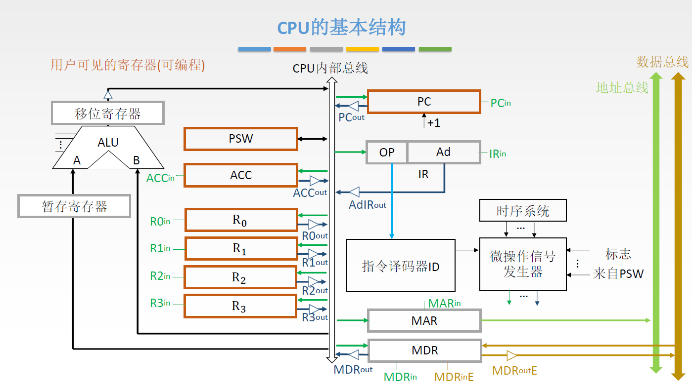

> 控制器如何控制协调各种各样的部件使其配合工作
>
> 控制器如何控制部件之间的数据流动以及如何确定每一步做哪些事情

# 5.1 CPU的功能和基本结构


## 5.1.1 CPU的功能

* **指令控制**：完成取指令、分析指令、执行指令的操作，即程序的顺序控制
* **操作控制**：一条指令的功能往往是由于若干操作信号的组合来实现的。CPU管理并产生由内存取出的每条指令的操作信号，把各种操作信号送往相应的部件，从而控制这些部件按指令的要求进行动作
* **时间控制**：对各种操作加以时间上的控制。时间控制要为每条指令按时间提供应有的控制信号
* **数据加工**：对数据进行算术和逻辑运算
* **中断处理**：对计算机运行过程中出现异常情况和特殊请求进行处理

---
* 运算器：对数据进行加工
* 控制器：协调并控制计算机各部件执行程序的指令序列，基本功能包括取指令、分析指令、执行指令
	* 取指令：自动形成指令地址；自动发出取指令的命令
	* 分析指令：操作码译码（分析本条指令要完成什么操作）；产生操作数的有效地址
	* 执行指令：根据分析指令得到的“操作命令”和“操作数地址”形成操作信号控制序列，控制运算器、存储器以及I/O设备完成相应的操作
	* 中断处理：管理总线以及输入输出；处理异常情况（如掉电）和特殊请求（如打印机请求打印一行字符）

## 5.1.2 CPU的基本结构


### 运算器的基本结构
> 个人理解：指令使用这类部件来执行特定功能

* **算数逻辑单元(ALU)**：主要是进行算术/逻辑运算
* **通用寄存器组**：如AX、BX、CX、DX、SP等，用于存放操作数和各种地址信息等。SP是堆栈指针，用于指示栈顶的地址——其位数取决于机器字长，便于操作和控制
* **暂存寄存器**：用于暂存从主存读来的数据，这个数据不能存放在通用寄存器中，否则会破坏其原有内容
* **累加寄存器(ACC)**：它是一个通用寄存器，用于暂时存放ALU运算的结果信息，用于实现加法运算
* **程序状态字寄存器(PSW)**：保留由算数逻辑运算指令或测试指令的结果而建立的各种状态信息，如溢出标志(OP)、符号标志(SF)、零标志(ZF)、进位标志(CF)等。PSW中的这些位参与并决定微操作的形成
* **移位器**：对运算结果进行移位操作
* **计数器(CT)**：控制乘除运算的操作步数

### 控制器的基本结构
> 个人理解：没有这些部件，指令就无法完成

* **程序计数器(PC)**：用于指出下一条指令在主存中的存放地址。CPU就是根据PC的内容取主存中取指令的。因程序中指令（通常）是顺序执行的，所以PC有自增功能——位数取决于存储器容量
* **指令寄存器(IR)**：用于保存当前正在执行的那条指令——位数取决于指令字长
* **指令译码器**：仅对操作码字段进行译码，向控制器提供特定的操作信号
* **微操作下信号发生器**：根据IR的内容（指令）、PSW的内容（状态信息）以及时序信号产生控制整个计算机系统所需的各种控制信号，其结构有组合逻辑型和存储逻辑型两种
* **时序系统**：用于产生各种时序信号，它们都是由统一时钟(CLOCK)分频得到
* **存储器地址寄存器(MAR)**：用于存放所要访问的主存单元的地址，通常集成在CPU中
* **存储器数据寄存器(MDR)**：用于存放向主存写入的信息或从主存中读出的信息，通常集成在CPU中。$\mathrm{MDR_{in}}$指从CPU内部的总线输入数据的通路是否有效，$\mathrm{MDR_{in}E}$指从外部的数据总线输入数据的通路是否有效；$\mathrm{MDR_{out}}$与$\mathrm{MDR_{out}E}$同理

CPU内部寄存器大致可分为两类：一类是对用户可见的寄存器，可对这类寄存器编程；另一类是用户不可见的寄存器，对用户是透明的，不可对这类寄存器编程
* 用户可见的寄存器：通用寄存器组、程序状态字寄存器PSW、程序计数器PC
* 用户不可见的寄存器：MAR、MDR、IR、暂存寄存器



三态门（小三角，开关）：$\mathrm{XXX_{in}}$、$\mathrm{XXX_{out}}$、$\mathrm{XXX_{op}}$

# 5.2 指令执行过程


## 5.2.1 指令周期

> 一条指令的执行分为不同的阶段

* **指令周期**：CPU从主存中每取出并执行一条指令所需的全部时间，分为**取指周期**、**间址周期**、**执行周期**、**中断周期** 
* 为了区别不同的工作周期，在CPU内设置4个标志触发器 `FE`、`IND`、`EX` 和 `INT` ，它们分别对应取指、间址、执行和中断周期，以“1”为有效。
* 四个工作周期都有CPU访存操作，取指周期是为了取指令，间址周期是为了取有效地址，执行周期是为了取操作数，中断周期是为了保存程序断点
* 指令周期常常用若干个**机器周期**表示，机器周期又叫CPU周期。一个机器周期又包含若干**时钟周期**（也称为节拍、T周期或CPU时钟周期，它是CPU操作的最基本单位）
* 每个指令周期内的机器周期数可以不等，每个机器周期内的节拍数也可以不等

 定长的机器周期、不定长的机器周期


## 5.2.2 指令周期的数据流

> 不同阶段要求依次访问的数据序列，可以参考2015年真题

注：冯诺依曼计算机根据指令周期的不同阶段来区分从存储器取出的是指令还是数据

### 取指周期

根据PC中的内容取出指令代码并存放在IR中

1. 当前指令地址送至存储器地址寄存器，记作：(PC)→MAR
2. CU发出控制信号，经控制总线传到主存，记作：1→R（这里是读信号）
3. 将MAR所指主存中的内容经数据总线送入MDR，记作：M(MAR)→MDR，M(MAR)也写作MEM(MAR)
4. 将MDR中的内容（此时是指令）送入IR，记作：(MDR)→IR
5. CU发出控制信号，形成下一条指令地址，记作：(PC)+1→PC


注意：取指操作自动进行，控制器不需要相应的指令

指令字长等于机器字长的前提下，取指周期等于机器周期；若指令较长时，可能需要进行多次取指

### 间址周期

根据IR中指令地址码取操作数有效地址，如果需要二级间接寻址的话就需要两次间址周期

1. 将指令的地址码送入MAR，记作：Ad(IR)→MAR或Ad(MDR)→MAR
2. CU发出控制信号，启动主存做读操作，记作：1→R
3. 将MAR所指主存中的内容经数据总线送入MDR，记作：M(MAR)→MDR
4. 将有效地址作为地址码字段拼接到IR中，记作：(MDR)→Ad(IR)


### 执行周期

根据指令字的操作码和操作数进行相应的操作

执行周期的任务是根据IR中的指令字的操作码和操作数通过ALU操作产生执行结果。不同指令的执行周期操作不同，因此没有统一的数据流向

### 中断周期

保存断点，送中断向量，处理中断请求

**中断**：暂停当前任务去完成其他任务。为了能恢复当前任务，需要保存间断点。一般使用堆栈来保存断点，这里用SP表示栈顶地址，假设SP指向栈顶元素，进栈操作是先修改指针，后存入数据（地址空间从高到低，栈顶指针指向低地址部分）

1. CU控制SP减1，修改后的地址送入MAR，记作：(SP)-1→SP，(SP)→MAR
2. CU发出控制信号，启动主存做写操作，记作：1→W
3. 将断点（PC内容）送入MDR，记作：(PC)→MDR
4. CU控制器将中断服务程序的入口地址（由向量地址形成部件产生）送入PC，记作：向量地址→PC


### 各种周期的区分

* 时钟周期：时钟周期是计算机操作的最小的单位时间，由计算机的主频决定，是主频的倒数
* 工作脉冲：工作脉冲是控制器的最小时间单位，起定时触发作用，一个时钟周期有一个工作脉冲
* 指令周期：通常将一条指令从取出到执行所需要的时间称为指令周期。指令周期可由多个机器周期组成，一个微程序的周期对应一个指令周期
* 微指令周期：从控制器存储器取出一条微指令并执行相应微操作所需的时间
* 机器周期/CPU周期：包含若干个时钟周期
* 存取周期

## 5.2.3 指令执行方案

> 如何安排多条指令的执行？

### 单指令周期

对所有指令都选用相同的执行时间，即对于执行较快的指令延长到执行较慢的指令

指令之间串行执行；指令周期取决于执行时间最长的指令的执行时间

缺点：对于那些本来可以在更短时间内完成的指令，要使用较长的周期来完成，会降低整个系统的运行速度

### 多指令周期

对于不同类型的指令选用不同的执行步骤完成

指令之间串行执行；可选用不同个数的时钟周期来完成不同指令的执行过程

缺点：需要更复杂的硬件设计

### 流水线方案

详见：[指令流水线](#5.6%20指令流水线)

在每一个时钟周期启动一条指令，尽量让多条指令同时运行，但各自处在不同的执行步骤中

指令之间并行执行。

# 5.3 数据通路功能和基本结构

> 各个部件之间的数据流动的实现，如何设置部件之间的连接路径？描述指令执行过程中信号和数据在这些路径上的传输

CPU可以看成由**数据通路**和**控制部件**两大部分组成。通常将指令执行过程中数据所经过的路径以及路径上的部件称为**数据通路**；将数据通路中专门进行数据运算的部件称为**执行部件**或**功能部件**。
数据通路描述的是信息从哪来，中间经过哪些部件，最后去哪里。数据通路中的数据传送操作是在控制部件的控制下进行的，控制部件根据指令功能的不同，生成对数据通路的控制信号，确保指令的正确执行

## 5.3.1 数据通路的功能——以单总线为例


* **数据通路**：数据在功能部件之间传送的路径
* **内部总线**：内部总线是指同一部件，如CPU内部连接个寄存器以及运算部件之间的总线
* **系统总线**：系统总线是指同一台计算机系统的各部件，如CPU、内存、通道和各类IO接口间互相连接的总线

### 寄存器之间的数据传送

寄存器—寄存器

例如把PC内容送至MAR，实现传送操作的流程及控制信号为：
1. (PC)→Bus：$\mathrm{PC_{out}}$有效，PC内容送至总线<!--Bus指总线-->
2. Bus→MAR：$\mathrm{MAR_{in}}$有效，总线内容送至MAR

也可合并起来，写作：(PC)→Bus→MAR

### 主存与CPU之间的数据传送
> 寄存器—主存

例如CPU从主存读取指令，实现传送操作的流程及控制信号为：

1. (PC)→Bus→MAR：$\mathrm{PC_{out}}$和$\mathrm{MAR_{in}}$有效，现行指令地址→MAR
2. 1→R：CU发出读命令（通过控制总线发出）
3. MEM(MAR)→MDR：$\mathrm{MDR_{in}E}$有效 ^[注：这里是外部总线，王道课本这里可能有误]
4. MDR→Bus→IR：$\mathrm{MDR_{out}}$和$\mathrm{IR_{in}}$有效，现行指令地址→IR

### 执行算术运算或逻辑运算
> 寄存器—算术逻辑单元ALU

例如一条加法指令，微操作序列即控制信号为：

1. Ad(IR)→Bus→MAR：$\mathrm{IR_{out}}$和$\mathrm{MAR_{in}}$有效
   或者Ad(MDR)→Bus→MAR：$\mathrm{MDR_{out}}$和$\mathrm{MAR_{in}}$有效
2. 1→R：CU发出读命令（通过控制总线发出）
3. MEM(MAR)→MDR：$\mathrm{MDR_{in}E}$有效 
4. MDR→Bus→Y：$\mathrm{MDR_{out}}$和$\mathrm{Y_{in}}$有效，将操作数放到暂存寄存器Y中 ^[ALU算术逻辑单元两个输入信号必须同时有效，但CPU内部单总线同一时间只能传输一个信号，所以只能把其中的一个加数存放到暂存寄存器外当中，另一个放在ACC累加寄存器当中]
5. (ACC)+(Y)→Z：$\mathrm{ACC_{out}}$和$\mathrm{ALU_{in}}$有效，CU向ALU发送加命令
6. Z→ACC：$\mathrm{Z_{out}}$和$\mathrm{ACC_{in}}$有效，结构存回ACC中

## 5.3.2 数据通路的基本结构


数据在功能部件之间传送的路径称为**数据通路**，包括数据通路上流经的部件，如ALU、通用寄存器、状态寄存器、异常和中断处理逻辑等。数据通路描述了信息从什么地方开始，中间经过哪个寄存器或多路开关，最后传送到哪个寄存器，这些都需要加以控制。

**专用数据通路方式**：根据指令执行过程中的数据和地址的流动方向安排线路

* 特点：性能较高，基本不存在数据冲突现象，但结构复杂，硬件量大，不易实现
* 如果直接用导线连接，相当于多个寄存器同时并且一直向ALU传输数据——解决方法：
	* 使用多路选择器根据控制信号选择一路输出；
	* 使用三态门（小三角）可以控制每一路是否输出

**CPU内部单总线方式**：将所有寄存器的输入端和输出端都连接到一条公共的通路上
* 结构简单，容易实现，但数据传输存在较多冲突现象，性能较低
* 需要增加暂存寄存器

**CPU内部多总线方式**

# 5.4 控制器的功能和工作原理

> 控制器如何指挥整个系统的工作

内容回顾

* CU发出一个微命令，可完成对应微操作
* 一个节拍内可以并行地完成多个“相容的”微操作
* 同一个微操作可能在不同指令的不同阶段被使用
* 不同指令的执行周期所需的节拍数各不相同。为了简化设计，选择定长的机器周期，以可能出现的最大节拍数为准（通常以访存所需节拍数作为参考）
* 若实际所需节拍数较少，可将微操作安排在机器周期末尾几个节拍上进行
* 根据指令操作码、目前的机器周期、节拍信号、机器状态条件即可确定现在这个节拍下应该发出哪些微命令

|          |                         [微程序控制器](#5.4.3%20微程序控制器)                         |                      [硬布线控制器](#5.4.2%20硬布线控制器)                         |
| :------: | :----------------------------------------------------------: | :----------------------------------------------------------: |
| 工作原理 | 微操作控制信号以微程序的形式存放在控制存储器中，执行指令时读出即可 | 微操作控制信号由组合逻辑电路根据当前的指令码、状态和时序即时产生 |
| 执行速度 |               慢（需要从控制存储器读取微指令）               |                              快                              |
|  规整性  |                            较规整                            |                         繁琐、不规整                         |
| 应用场合 |                  CISC CPU（复杂指令集系统）                  |                  RISC CPU（精简指令集系统）                  |
| 易扩充性 |                          易扩充修改                          |                             困难                             |

补充：硬布线控制器需要结合各微操作的节拍安排，综合分析写出逻辑表达式，再设计成逻辑电路图，因而时序系统比较复杂；而微程序只需按照节拍的安排顺序执行微指令，因而比较简单

## 5.4.1 控制器的结构和功能

## 5.4.2 硬布线控制器

> 用纯硬件实现的控制器，又称组合逻辑控制器


根据指令操作码、目前的机器周期、节拍信号、机器状态条件，即可确定现在这个节拍下应该发出哪些“微命令”。
* CU的输入信号来源如下：
	* 经指令译码器译码产生的指令信息。现行指令的操作码决定了不同指令在执行周期所需完成的不同操作，因此指令的操作码字段是控制单元的输入信号，与时钟配合产生不同的控制信号
	* 时序系统产生的机器周期信号和节拍信号。为了使控制单元按一定的先后顺序、一定的节奏发出各个控制信号，控制单元必须受时钟控制，即一个时钟脉冲使控制单元发送一个操作命令，或发送一组需要同时执行的操作命令
	* 来自执行单元的反馈信息即标志。可能来自运算器的PSW、ACC的符号位等，也可能来自I/O设备、主存
* CU的输出信号：每个输出的控制信号对应一个微命令，也就是对应一个微操作。


### 硬布线的设计步骤

#### 1. 分析每个阶段的微操作序列

（[取指](#取指周期)、[间址](#间址周期)、[执行](#执行周期)、[中断](#中断周期)四个阶段）：确定哪些指令在什么阶段、在什么条件下会使用到的微操作

#### 2. 选择CPU的控制方式

采用定长机器周期还是不定长机器周期，每个机器周期安排几个节拍？

> 后续步骤采用同步控制方式（定长机器周期），一个机器周期内安排3个节拍

* **同步控制方式**：系统有一个统一的时钟，所有的控制信号均来自这个统一的时钟信号。
* **异步控制方式**：不存在基准时标信号，各部件按自身固有的速度工作，通过应答方式进行联络。
* **联合控制方式**：大部分同步控制，小部分一步控制

#### 3. 安排微操作时序

> 如何用3个节拍完成整个机器周期内的所有微操作

安排微操作时序的原则
- 微操作的先后顺序不得随意更改
- 被控对象不同的微操作尽量安排在一个节拍内完成
- 占用时间较短的微操作尽量安排在一个节拍内完成，并允许有先后顺序

> [取指周期](#取指周期)的流程：
> 1. PC→ MAR：将PC地址交给MAR。
> 2. 1→ R：主存发出读命令。只需要存储器空闲就能发出。
> 3. M(MAR)→ MDR：将地址指向指令交给MDR。需要MAR准备好，在1的后面。
> 4. MDR→ IR：将指令交给IR。把MDR有指令，在3后面。
> 5. OP(IR)→ ID：编译指令。IR中要有指令，在4后面。
> 6. (PC)+1→ PC：PC自加1。因为操作完就可以更新，所以在1后面就可以了。

没有依赖的可以尽量往前放，顺序可以变为123645。因为12没有相互依赖，所以可以都安排在 $T_{0}$ 时间；36在1的后面，且36之间用到的设备不一样从而不会冲突，所以都安排在 $T_{1}$ ；而4和5的占用时间都较短，所以可以都安排在 $T_2$ 。3由于需要从主存中取数据，用时较长，所以需要一个时钟周期才能保证微操作的完成。

> [间址周期](#间址周期)的流程：
> 1. Ad(IR)→ MAR：获取IR指令中的地址交给MAR。
> 2. 1→ R：主存发出读命令。
> 3. M(MAR)→ MDR：取出对应的值放到MDR中。
> 4. MDR→ Ad(IR)：将MDR的地址值放入IR的指令中。

与取指周期一致，2可以跟1一起，而34都依赖于1，所以12是 $T_0$ ，3是 $T_1$ ，4是 $T_2$ 。
#### 4. 电路设计

> 确定每个微操作命令的逻辑表达式，并用电路实现

电路设计步骤
1. 列出操作时间表：列出在取指、间址、执行、中断周期， $T_{0}$ 、$T_{1}$ 、$T_{2}$ 节拍内有可能用到的所有操作
2. 写出微操作命令的最简表达式
3. 画出逻辑图

### 硬布线控制器的特点

* 指令越多，设计和实现就越复杂，因此一般用于[RISC](第4章%20指令系统#4.4%20CISC%20和%20RISC%20的基本概念)（精简指令集系统）
* 如果扩充一条新的指令，则控制器的设计就需要大改，因此扩充指令困难
* 由于使用纯硬件实现控制，因此执行速度很快。微操作控制信号由组合逻辑电路即时产生

## 5.4.3 微程序控制器

> 用微程序实现（硬件+软件）的控制器


### 微程序控制的基本概念

* 程序由指令序列组成；**微程序**由微指令序列组成，一个微程序对应一种机器指令；
* **机器指令**是对程序执行步骤的描述；**微指令**是对机器指令执行步骤的描述；机器指令是对微指令功能的“封装”
* 微程序控制器中控制部件向执行部件发出的控制信号称为**微命令**，微命令是微操作的控制信号，**微操作**是微命令的执行过程，微操作与微命令一一对应。而一个微指令中可能包含多个微命令
* **微周期**（微指令周期）：从控制器存储器取出一条微指令并执行相应微操作所需的时间


设计思路：采用“存储程序”的思想，CPU出厂前将所有指令的“微程序”存入“控制器存储器”中

### 微程序控制器的基本结构

* **控制存储器CM**：用于存放各指令对应的微程序，用只读存储器ROM构成（读取快，非易失）。通常在CPU出厂时就把所有的微程序写入
* **微地址寄存器CMAR**：别名μPC，微地址寄存器，接收微地址形成部件送来的微地址，为在CM中读取微指令做准备
* **地址译码器**：将CMAR内的地址码转化为电信号，控制CM读出微指令
* **微指令寄存器CMDR**：别名μIR，用于存放CM中取出的微指令，它的位数同微指令字长相等（包含微指令对应的控制信号和下一条微指令的地址）
* **微地址形成部件**：产生初始微地址和后续微地址，以保证微指令的连续执行（根据机器指令的操作码来确定）。微地址即微指令在CM中的存放地址
* **顺序逻辑**：用于控制微指令的执行顺序，根据某些机器标志和时序信息CLK确定下一条微指令的存放地址
  顺序逻辑可以通过根据指令地址码的寻址特征位判断<u>是否要跳过间址周期</u>和<u>是否要进入中断周期</u>


Q- 所有指令的取指周期、间址周期、中断周期所对应的微指令序列都一样，是否可以共享使用？
A- 处理取指周期、间址周期、中断周期的微指令序列通常是公用的，执行周期的微指令序列各不相同

补充：
* 取值周期微程序通常是公用的，所以如果某指令系统中有 $n$ 条机器指令，则CM中微程序（段）的个数至少是 $n+1$ 个（ $1$ 为公共的取指微程序）
* 通常取指周期的微指令序列固定从`#0`开始存放，执行周期的微指令序列的存放根据指令操作码确定
* 物理上，取指周期、执行周期看起来像是两个微程序，但逻辑上应该把它们看作一个整体，因此“一条指令对应一个微程序”的说法是正确的

### 微指令的设计

> 1. 微指令的具体格式应该如何设计？
> 2. 如何根据微指令发出相应的微命令？


微命令与微操作一一对应，一个微命令对应一条输出线

有的微命令可以并行的执行，因此一条微指令可以包含多个微命令

#### 微指令的格式

* **水平型微指令**：一条微指令能定义多个可并行的微命令
  * 优点：微程序短（条数少），执行速度快
  * 缺点：微指令长，编写微程序较麻烦


* **垂直型微命令**：一条微指令只能定义一个微命令，由微操作码字段规定具体功能（较短）
  * 优点：微指令短，简单规整，便于编写微程序
  * 缺点：微程序长（条数多），执行速度慢，工作效率低


* **混合型微命令**：在垂直型的基础上增加一些不太复杂的并行操作
  * 特点：微指令较短，仍便于编写；微程序也不长，执行速度加快

相容与互斥

* **相容性微命令**：可以并行完成的微命令；
* **互斥性微命令**：不允许并行完成的微命令

#### 微指令的编码方式

> 水平微指令中如何设计操作控制字段

微指令的编码方式又称微指令的控制方式。它是指如何对微指令的控制字段进行编码，以形成控制信号。
编码的目标是在保证速度的情况下，尽量缩短指令字长

**直接编码（直接控制）方式**


* 在微指令的操作控制字段中，每一位代表一个微操作命令，某位为“1”表示该控制信号有效
* 优点：简单、直观，执行速度块，操作并行性好
* 缺点：微指令字长过长， $n$ 个微命令就要求微指令的操作字段有 $n$ 位，造成控制存储器容量极大

**字段直接编码方式**


* 将微指令的控制字段分成若干“段”，每段经译码后发出控制信号
* 微命令字段分段的原则：
	* 互斥性微命令分在同一段内，相容性微命令分在不同段内
	* 每个小段中包含的信息位不能太多，否则将增加译码线路的复杂性和译码时间
	* 一般每个小段还要<u>留出一个状态</u>，表示本字段不发出任何微命令（通常用000表示不操作）
* 优点：可以缩短微命令字长
* 缺点：要通过译码电路后再发出微命令，因此比直接编码方式慢

**字段间接编码方式**

* 一个字段的某些微命令需要由另一个字段中的某些微命令来解释，由于不是靠字段直接译码发出的微命令，故称字段间接编码，又称隐式编码
* 优点：可进一步缩短微命令字长
* 缺点：削弱了微命令的并行控制能力，故通常作为字段直接编码方式的一种辅助手段

#### 微指令的地址形式方式

> 微指令的下地址部分（即顺序控制），即如何确定下一条指令的存放方式

* **由硬件产生微程序入口地址**：
	* 第一条微指令地址由专门硬件产生（用专门的硬件记录取指周期微程序首地址）
	* 中断周期也由硬件产生中断周期微程序首地址（用专门的硬件记录，所有的机器在中断周期要执行的事情相同）
* **根据机器指令的操作码形成**：当机器指令取至指令寄存器后，微指令的地址由操作码经微地址形成部件形成
* **下地址法**：微指令格式中设置一个下地址字段，由微指令的下地址字段直接指出后继微指令的地址，这种方式又称为**断定方式**
* **增量计数法**：`(CMAR)+1`，类似`(PC)+1`
* **分支转移**：微指令=操作控制字段+转移方式+转移地址，转移方式指明判别条件，转移地址指明转移成功后的去向
* **通过测试网络**：顺序逻辑根据标志改变


### 微程序控制单元的设计

微程序控制单元设计的主要任务是编写各条机器指令对应的微程序。具体的设计步骤如下：

1. 分析每个阶段的微操作序列，写出每个周期所需要的微操作
2. 写出对应机器指令的微操作命令及节拍安排，补充微程序控制器特有的微操作：
	* 取指周期
		* Ad(CMDR)→CMAR，除了最后一条微指令外，每条微指令结束之后都需要进行
		* OP(IR)→微地址形成部件→CMAR，取指周期的最后一条微指令完成后，要根据指令操作的操作码确定其执行周期的微程序首地址
	* 执行周期
		* Ad(CMDR)→CMAR，每条微指令结束之后都需要进行，执行周期结束后下地址回`#0`
3. 确定微指令格式（操作码+下地址）
	* 根据微操作个数决定采用何种编码方式，以确定微指令的[操作控制字段的位数](#微指令的编码方式)（操作码位数）
	* 根据CM中存储的微指令总数确定微指令的[顺序控制字段的位数](#微指令的地址形式方式)（下地址位数）
	* 最后按操作控制字段位数和顺序控制字段位数就可以确定微指令字长
4. 编写微指令码点
	* 根据操作控制字段每一位代表的微操作命令，编写每一条微命令的码点

节拍安排|取指周期-硬布线控制器的节拍安排|取指周期-微程序控制器的节拍安排
:------:|:-----------------------------:|:----------------------------:
T0|PC→MAR|PC→MAR
T0|1→R|1→R
T1|M(MAR)→MDR|M(MAR)→MDR
T1|(PC)+1→PC|(PC)+1→PC
T2|MDR→IR|MDR→IR
T2|OP(IR)→ID|OP(IR)→微地址形成部件

考虑读出微指令存放地址以及转入下一机器周期的过程

节拍安排|取指周期-硬布线控制器的节拍安排|取指周期-微程序控制器的节拍安排
:------:|:-----------------------------:|:----------------------------:
T0|PC→MAR|PC→MAR|
T0|1→R|1→R|
T1|M(MAR)→MDR|Ad(CMDR)→CMAR|
T1|(PC)+1→PC|
T2|MDR→IR|M(MAR)→MDR|
T2|OP(IR)→ID|(PC)+1→PC|
T3||Ad(CMDR)→CMAR|
T4||MDR→IR|
T4||OP(IR)→微地址形成部件|
T5||微地址形成部件→CMAR|

### 微程序设计分类

静态微程序设计和动态微程序设计

* 静态：微程序无需改变，采用ROM
* 动态：通过改变微指令和微程序改变机器命令，有利于仿真，采用EPROM

微程序设计和毫微程序设计

* **微程序设计**：用微程序解释机器指令
* **毫微程序设计**：用毫微程序解释微指令（更深层次的套娃）

# 5.5 异常和中断机制

## 5.5.2 异常和中断的分类

详见：[中断的类型](../3%20操作系统/第1章%20计算机系统概述.md#中断的类型)

## 5.5.3 异常和中断响应过程

详见：[中断响应过程](./第7章%20输入输出系统#中断响应过程)

# 5.6 指令流水线

> Q- 为什么引入流水线结构？有哪些结构？会产生什么问题？
> A- 对指令执行过程进行优化


## 5.6.1 指令流水线的基本概念

### 指令流水线的定义

一条指令的执行过程可以分成多个阶段（或过程），根据计算机的不同，具体的分法也可能不同。可以将其分为取指+分析+执行三个阶段——每个阶段用到的硬件不一样

* 取指：根据PC内容访问主存储器，取出一条指令送到IR中
* 分析：对指令操作码进行译码，按照给定的寻址方式和地址字段中的内容形成对操作数的有效地址EA，并从有效地址EA中取出操作数
* 执行：根据操作码字段，完成指令规定的功能，即把运算结果写到通用寄存器或主存中

---
**顺序执行方式**，总耗时 $T=3nt$ 

* 传统冯诺依曼采用顺序执行方式，又称串行执行方式
* 优点：控制简单，硬件代价小
* 缺点：执行指令的速度较慢，在任何时刻，处理机中只有一条指令在执行，各功能部件的利用率低

**一次重叠执行方式**，总耗时 $T=(2n+1)t$ 

* 优点：程序的执行方式缩短了1/3，各功能部件的利用率明显提高
* 缺点：需要付出硬件上较大开销的代价，控制过程也比顺序执行复杂

**两次重叠执行方式**，总耗时 $T=(n+2)t$ 

* 优点：与顺序执行方式相比，指令的执行时间缩短近2/3，这是一种理想的指令执行方式，在正常情况下，处理机中同时有3条指令在执行

注：也可以把每条指令的执行过程分成4个或5个阶段，分[5个阶段](#五段式指令流水线)是比较常见的做法

### 流水线的表示方法

* **指令执行过程图**：横坐标表示时间，纵坐标表示指令序列。（同一指令的不同执行阶段放在一行内）
  主要用于分析指令执行过程以及影响流水线的因素


* **时空图**：横坐标表示时间，纵坐标表示不同的执行阶段（不同指令的同一执行阶段放在一行内）
  主要用于分析流水线的性能


### 流水线的分类

* 根据流水线使用的级别不同，流水线可分为部件功能级流水线、处理机级流水线和处理机间流水线
	* **部件功能级流水线**：将复杂的算数逻辑运算组成流水线工作方式。例如：可以把[浮点加法操作](第2章%20数据的表示和运算#2.3.2%20浮点数的加减运算)分成求阶差、对阶、尾数相加以及结果规格化等四个子过程（部件内部的功能流水线）
	* **处理机级的流水线**：把一条指令解释过程分成多个子过程，如前面提到的取指、译码、执行、访存以及写回5个子过程（这就是之前所说的指令流水线）
	* **处理机间的流水线**：是一种宏流水，其中每一个处理机完成某一个专门任务，各个处理机所得到的功能需存放在与下一个处理机所共享的存储器中
* 按照流水线可以完成的功能，流水线可分为单功能流水线和多功能流水线
	* **单功能流水线**：只能实现一种固定的专门功能的流水线
	* **多功能流水线**：通过各段之间的不同连接方式可以同时或不同时地实现多种功能的流水线
* 按同一时间内各段之间的连接方式，流水线可分为静态流水线和动态流水线
	* **静态流水线**：同一时间内，流水线的各段只能按同一种功能的连接方式工作
	* **动态流水线**：同一时间内，当某些段正在实现某种运算时，另一些段却正在进行另一种运算。这样对提高流水线的效率很有好处，但会使流水线控制变得很复杂。
* 按流水线的各个功能段之间是否有反馈信号，流水线可分为线性流水线与非线性流水线。
	* **线性流水线**：线性流水线中，从输入到输出，每个功能段只允许经过一次，不存在反馈回路。
	* **非线性流水线**：非线性流水线存在反馈回路，从输入到输出过程中，某些功能段将数次通过流水线，这种流水线适合进行线性递归的运算。

## 5.6.2 流水线的基本实现


### 五段式指令流水线

5段式指令流水线：IF(Instruction Fetch，取指令)，ID(Instruction Decode，译码或取数)，EX(Execute，执行)，M(Memory，访存)，WB(Write Back，写回)


为了方便流水线设计，每个阶段耗时取成一样，以最长耗时为准；规定每一条指令所含的阶段数都相同，每个阶段的长度也都相同

流水线每一个功能段部件后面都有一个缓冲寄存器或称为**锁存器**，其作用是保存本流水段的执行结果，提供给下一段流水使用（为了让每一段的时间保持相同）

**运算类指令**

```assembly
ADD Rs, Rd——(Rs)+(Rd)→Rd
ADD #996, Rd——996+(Rd)→Rd
SHL Rd——(Rd)<<<2→Rd
```

* IF：根据PC从指令Cache取指令到IF段的锁存器
* ID：取出操作数到ID段锁存器
* EX：运算，将结果存入EX段锁存器
* M：空段，但时间必须消耗（对于RISC系统，所有的运算类指令得到的结果都是存入寄存器）
* WB：将运算结果写回指定寄存器

**LOAD指令**

> 通常，RISC处理器只有“取数LOAD”和“存数STORE”指令才能访问主存，其他指令都不会直接访问主存，而是来自寄存器或者立即数

```assembly
LOAD Rd, 996(Rs)——(996+(Rs))→Rd
LOAD Rd, mem——(mem)→Rd
```

* IF：根据PC从指令Cache取指令到IF段的锁存器
* ID：将基址寄存器的值放到锁存器A；将偏移量的值放到锁存器Imm
* EX：运算，得到有效地址，将结果存入EX段锁存器
* M：根据得到的有效地址从数据Cache中取数并放入M段锁存器
* WB：将取出的数写回寄存器

**STORE指令**

```assembly
STORE Rs, 996(Rs)——(Rs)→996+(Rd)
STORE Rs, mem——(Rs)→mem
```

* IF：根据PC从指令Cache取指令到IF段的锁存器
* ID：将基址寄存器的值放到锁存器A；将偏移量的值放到锁存器Imm；将要存的数放到锁存器B
* EX：运算，得到有效地址，并将锁存器B的内容放到锁存器Store
* M：根据得到的有效地址写入数据Cache
* WB：空段

**条件转移指令**
> 转移类指令常采用相对寻址

```assembly
beq Rs, Rt, #偏移量
bne Rs, Rt, #偏移量
```

* IF：根据PC从指令Cache取指令到IF段的锁存器
* ID：进行比较的两个数放入锁存器A、B；偏移量放入Imm
* EX：运算，比较两个数
* M：将目标PC值写回PC（WB段只写暂存器）
* WB：空段

**无条件转移指令**

```assembly
jmp #偏移量
```

* IF：根据PC从指令Cache取指令到IF段的锁存器
* ID：偏移量放入Imm
* EX：将目标PC值写回PC（越早完成就越能避免[控制冲突](#控制相关（控制冲突）)）
* M：空段
* WB：空段

## 5.6.3 流水线的冒险与处理

>之前讨论的只是理想情况，一个阶段与另一个阶段可以完美的衔接，但实际工作中并不会如此完美，其原因有哪些？


### 结构相关（资源冲突）

> 类比操作系统中的[互斥问题](../3%20操作系统/第2章%20进程与线程#进程互斥)

由于多条指令在同一时刻争用同一资源而形成的冲突称为**结构相关**


 **解决方法**

1. 后一相关指令暂停一周期
2. 资源重复配置：采用数据存储器+指令存储器，指令和数据放在不同的Cache中


### 数据相关（数据冲突）

> 类比操作系统中的[互斥问题](../3%20操作系统/第2章%20进程与线程#进程互斥)

在一个程序中，下一条指令会用到当前指令计算出的结果，此时这两条指令发生数据冲突。数据冲突可分为三类：考虑两条指令，A和B，A先进入

* RAW（写后读冲突）：A写入之前，B去读，这时候B读出的是错误的
* WAW（写后写冲突）：A写入之前，B先写，这时候寄存器或存储器的内容是A的，但本应该存储B写入的内容
* WAR（读后写冲突）：在A读出之前，B先写，这时候读出的是B写入的内容而不是原先的内容

tip：流水线按序流动时，只可能出现RAW相关，详见：[11.5.6选择11.mp4](file://Z:/考研/计算机/02.计算机组成原理习题精讲/05.第五章%20中央存储器/06.5.6%20指令流水线/11.5.6选择11.mp4#t=108)

---

数据相关指在一个程序中，存在必须等前一条指令执行完才能执行后一条指令的情况，则这两条指令即为数据相关


 **解决方法**：

1. 把遇到数据相关的指令及其后续指令都暂停一至几个时钟周期，直到数据相关问题消失后再继续执行。可分为硬件阻塞（stall）和软件插入“NOP”（空指令）两种方法
	*  
	*   
2. 数据旁路技术（转发机制）：在上一步ALU完成后直接将数据送到下一步的ALU输入端
3. 编译优化：通过编译器调整指令顺序来解决数据相关

### 控制相关（控制冲突）
> 运行到后面发现不用执行下一条指令，而是跳转到别的指令（但是已经读入了下一条指令的一部分）

当流水线遇到转移指令和其他改变PC值的指令（函数的调用、返回等）而造成断流时，会引起控制相关

**解决方法**：

* 转移指令分支预测
	* 简单预测：永远猜true或false
	* 动态预测：根据历史情况动态调整
* 预取转移成功和不成功两个控制流方向上的目标指令<!--两手准备-->
* 加快和提前形成条件码（类似加法器的设计中[提前形成进位信息](./第2章%20数据的表示和运算#并行进位加法器)传给前边的加法器）
* 提高转移方向的猜准率（第一种方法的优化）

## 5.6.4 流水线的性能指标

### 吞吐率TP

* **吞吐率**：单位时间内流水线所完成的任务数量，或是输出结果的数量（单位时间内完成多少条指令）
	* 设任务数为 $n$ ，处理完成 $n$ 个任务所用的时间为 $T_{k}$ ，一条指令的执行分为 $k$ 个阶段，每个阶段耗时 $\Delta t$，则流水线吞吐率 $TP=\dfrac{n}{T_{k}}=\dfrac{n}{(k+n-1)\Delta t}$ 
	* 当连续输入的任务 $n\to\infty$ 时，有最大吞吐率 $TP_{\max}=1/\Delta t$ 
* **装入时间**：第一条指令从取指到结束所需的时间（让部件陆续投入工作）
* **排空时间**：最后一条指令从取指到结束所需的时间（让部件陆续退出工作）

### 加速比S

* **加速比**：完成同样一批任务，不使用流水线所用的时间与使用流水线所用的时间之比
* 设 $T_{0}$ 表示不使用流水线时的执行时间，即顺序执行的时间； $T_{k}$ 表示使用流水线时的执行时间，则流水线加速比$S=\dfrac{T_{0}}{T_{k}}$
* 当连续输入的任务 $n\to\infty$ 时，有最大加速比 $S_{\max}=k$  

### 效率E

* **效率**：流水线的设备利用率
* 在时空图上，流水线的效率定义为完成 $n$ 个任务占用的时空区有效面积与 $n$ 个任务所用的时间与 $k$ 个流水段所围成的时空区面积之比，$E=\dfrac{T_{0}}{kT_{k}}$
* 当连续输入的任务 $n\to\infty$ 时，有最大利用率 $E_{\mathrm{max}}=1$ 

## 5.6.5 高级流水线

> 流水线的多发技术

### 超标量技术

超标量技术：每个时钟周期中内可并发多条独立指令（空分复用）


* 要配置多个功能部件
* 不能调整指令的执行顺序
* 通过编译优化技术，把可并行的指令搭配起来

### 超流水技术

超流水技术：在一个时钟周期内再分段（3段）（时分复用）<!--或者说是一个机器周期-->


* 一个时钟周期内一个功能部件使用多次（3次）
* 不能调整指令的执行顺序
* 靠编译程序解决优化问题

### 超长指令字

* 由编译程序挖掘出指令间潜在的并行性
* 将多条能并行操作的指令组合成一条
* 具有多个操作码字段的超长指令字（可达几百位）
* 采用多个处理部件

# 5.7 多处理器的基本概念


## 5.7.1 SISD、SIMD、MIMD的基本概念

基于指令的数量和数据流的数量，对计算机体系结构分为SISD、SIMD、MISD和MIMD四类。常规的单处理器属于SISD，而常规的多处理器属于MIMD

### SISD（单指令流单数据流）

> Single Instructions stream Single Data Stream，计组课程已经在学的就是SISD

特性

* 各指令序列只能并发、不能并行，每条指令处理一两个数据
* 不是数据级的并行技术

硬件组成

* 一个处理器+一个主存储器
* 若采用指令流水线，则需要设置多个功能部件，采用多模块交叉存储器（提升效率）

### SIMD（单指令流多数据流）

> Single Instructions stream Multiple Data Stream

特性
* 各指令序列只能并发、不能并行，每个时刻只能有一条指令进行，但每条指令可同时处理很多个具有相同特征的数据
* 是一种数据级并行技术

应用示例
* 例1：某些显卡常采用SIMD，图像处理时常对每个像素点进行完全一样的渲染
* 例2：可用于优化for循环中对数组元素的重复处理

硬件组成
* 一个指令控制部件(CU)+多个处理单元/执行单元(如ALU)+多个局部存储器+一个主存储器
* 每个执行单元有各自的寄存器组、局部存储器、地址寄存器
* 不同执行单元执行同一条指令，处理不同的数据

### ~~MISD（多指令流单数据流）~~

> Multiple Instructions stream Single Data Stream

多条指令并行执行，处理同一个数据。现实中不存在这样的计算机

### MIMD（多指令流多数据流）

> Multiple Instructions stream Multiple Data Stream
> 共享存储多处理器系统，如：Intel i5、i7处理器

特性

* 个指令序列可以并行执行，分别处理多个不同的数据
* 是一种线程级并行、甚至是线程级以上（进程级）并行技术

进一步分类：多处理器系统、多计算机系统

#### 多处理器系统

>[多处理器系统](#多处理器系统)=[共享内存多处理器](#5.7.4%20共享内存多处理器的基本概念)=[多核处理器](#5.7.3%20多核处理器的基本概念)

* 特性：各处理器之间可以通过LOAD/STORE指令访问同一个主存储器，可以通过主存相互传送数据
* 硬件组成：一台计算机内，包含多个处理器和一个主存储器，多个处理器共享单一的地址空间

#### 多计算机系统

> 多台计算机组成的“分布式计算系统”

* 特性：各计算机之间，不能通过LOAD/STORE指令直接访问对方的存储器，只能通过“消息传递”相互传送数据，所以又称消息传递系统
* 硬件组成：由多台计算机组成，因此拥有多个处理器和多个主存储器，每台计算机拥有各自的私有存储器，物理地址空间相互独立

### 向量处理机（SIMD思想的进阶应用）

特性

* 一条指令的处理对象是“向量”
* 擅长对向量型数据进行并行计算、浮点数运算，常被用于超级计算机中，处理科学研究中的巨大运算量

硬件组成

* 多个处理单元，多组“向量寄存器”
* 主存储器应采用“多个端口同时读取”的交叉多模块存储器
* 主存储器大小限定了机器的解题规模，因此要有大容量的、集中式的主存储器

## 5.7.2 硬件多线程的基本概念


**硬件多线程**：当线程发生阻塞时，处理器可切换到另一线程继续执行，该实现方式与[MIMD](#MIMD（多指令流多数据流）)有关

|              | 细粒度多线程                         | 粗粒度多线程                                                 | 同时多线程(SMT)                      |
| ------------ | ------------------------------------ | ------------------------------------------------------------ | ------------------------------------ |
| 指令发射     | 各个时钟周期，轮流发射多个线程的指令 | 连续几个时钟周期，都发射同一线程的指令序列，流水线阻塞时，切换另一个线程 | 一个时钟周期内同时发射多个线程的指令 |
| 线程切换频率 | 每个时钟周期切换一次线程             | 只有流水线阻塞时才切换一次线程                               | NULL                                 |
| 线程切换代价 | 低                                   | 高，需要重载流水线                                           | NULL                                 |
| 并行性       | 指令级并行，线程间不并行             | 指令级并行，线程间不并行                                     | 指令级并行，线程级并行               |

Intel处理器中的超线程就是同时多线程SMT，即在一个单处理器或单个核中设置了两套线程状态部件，共享高速缓存和功能部件，让单个处理器实现线程级并行。虽然采用超线程技术能够同时执行两个线程，但是当两个线程同时需要某个资源时，其中一个线程必须暂时挂起，直到这些资源空闲后才能继续运行

## 5.7.3 多核处理器的基本概念

(multi-core)，强调CPU芯片中包含多个处理器

多核处理器是指将多个处理单元集成到单个CPU中，每个处理单元称为一个核

## 5.7.4 共享内存多处理器的基本概念

SMP(Shared Memory multiProcessor)，强调各个处理器可以共享一个主存，并且共享地址。单一地址空间的多处理器有两种类型：

* **统一存储访问(UMA, Uniform Memory Access)** 多处理器：每个处理器对所有存储单元的访问时间是大致相同的，即访问时间与哪个处理器提出访存请求以及访问哪个字无关。
	* 根据处理器与共享存储存储器之间的连接方式，分为基于总线、基于交叉开关网络和基于多级交换网络连接等几种处理器
* **非统一存储访问(NUMA, Nonuniform Memory Access)** 多处理器：某些访存请求比其他的快，具体取决于哪个处理器提出了访问请求以及访问哪个字，这是由于主存被分割并分配给了同一机器上的不同处理器或内存控制器
	* 处理器不带高速缓存时，被称为NC-NUMA；处理器中带有一致性的高速缓存时，被称为CC-NUMA