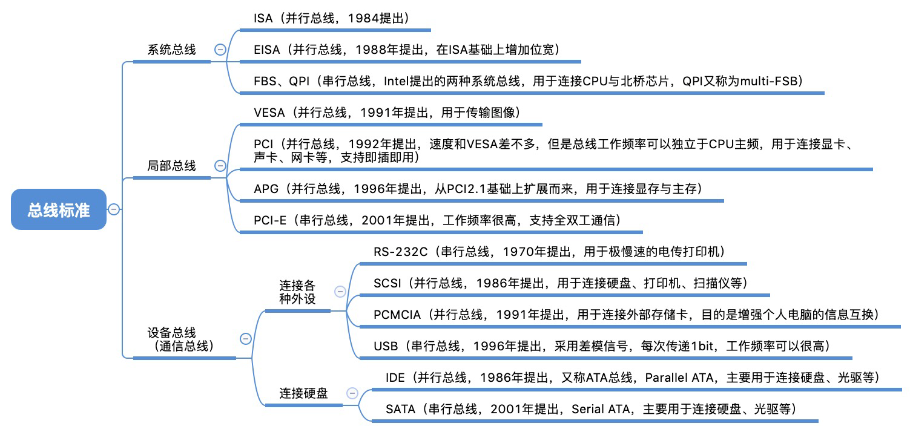
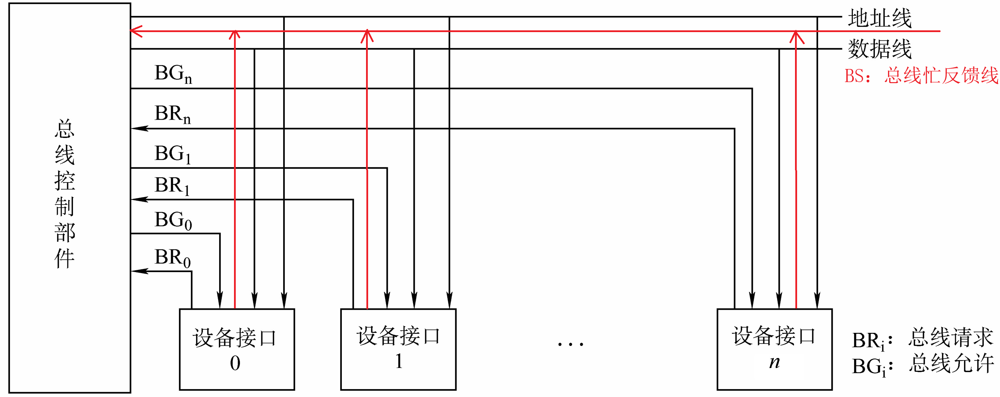
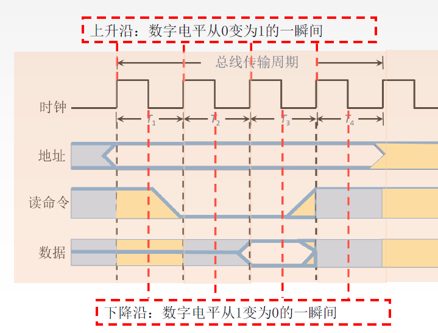
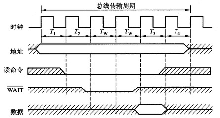

> 数据通路表示的是数据流经的路径，是逻辑上的关系
>
> 数据总线是承载数据流动的物理媒介（地址总线也可以做流动的媒介）

# 6.1总线概述

## 6.1.1 总线基本概念

*  Q-为什么要使用总线？
* A-早期计算机外部设备少时大多采用分散连接的方式，不易实现随时增减外部设备。为了更好的解决IO设备和主机之间连接的灵活性，计算机的结构从分散连接发展为总线连接

### 总线的定义

* **总线**：总线是一组能为多个部件分时共享的公共信息传送线路。若干个信号线组成“一根”总线，所有的硬件部件都可以通过这根总线传递数据。同一时刻只能有一个部件发送数据，但可以有多个部件接收数据
	* **共享**是指总线上可以挂接多个部件，各个部件之间互相交换的信息都可以通过这组线路分时共享
	* **分时**是指同一时刻只允许有一个部件向总线发送信息，如果系统中有多个部件，则它们只能分时地向总线发送信息

### 总线的特性

> 联系[物理层接口特性](../4%20计算机网络/第2章%20物理层.md#物理层接口特性)

* 机器特性：尺寸、形状、管脚数、排列顺序
* 电气特性：传输方向和有效的电平范围
* 功能特性：每根传输线的功能（地址、数据、控制）
* 时间特性：信号的时序关系

## 6.1.2 总线的分类

### 按数据的传输格式

* **串行总线**，如USB
	* 优点：只需要一条传输线，成本低廉，广泛应用于长距离传输；应用于计算机内部时，可以节省布线空间；抗干扰能力强
	* 缺点：在数据发送和接收的时候要进行拆卸和装配，要考虑串行-并行转换的问题
* **并行总线**
	* 优点：总线的逻辑时序比较简单；电路实现起来比较容易
	* 缺点：信号线数量多，占用更多的布线空间；远距离传输成本高昂；由于工作频率较高时，并行的信号线之间会产生严重干扰，对每条线等长的要求也越高，所以无法持续提升工作频率。
* 注意：并行总线传输速率不一定比串行总线高

### 按总线功能

* CPU内部：**片内总线**是芯片内部的总线。它是CPU芯片内部寄存器与寄存器之间、寄存器与ALU之间的公共连接线。
* 计算机内部：**系统总线**是计算机系统内各功能部件（CPU、主存、I/O接口）之间相互连接的总线。按系统总线传输信息内容的不同，又可分为3类：数据总线、地址总线和控制总线。
	* **数据总线**(DB, Data Bus)：传输各功能部件之间的数据信息，包括指令和操作数；位数(根数)与机器字长、存储字长有关；双向。——限制一次可取的数据的位数，即MDR的位数
	* **地址总线**(AB, Address Bus)：传输地址信息，包括主存单元或I/O端口的地址；位数(根数)与主存地址空间大小及设备数量有关；单向。—— 限制可寻址的范围，即存储器的最大容量
	* **控制总线**(CB, Control Bus)：传输控制信息；一根控制线传输一个信号；单根控制线是单向的，但不同控制线有出有入。出：CPU送出的控制命令；入：主存（或外设）返回CPU的反馈信号。——限制一次可以并行传送的控制信息的位数
* 计算机之间：**通信总线**是用于计算机系统之间或计算机系统与其他系统（如远程通信设备、测试设备）之间信息传送的总线，通信总线也称为**外部总线**。

### 按时序控制方式

* **同步总线**：采用公共时钟进行同步
* **异步总线**：采用应答机制进行同步

## 6.1.3 系统总线的结构

注意：以下三种中线结构并不是指只有一根、两根或三根总线，而是指一组、两组或三组功能不同的总线，每组总线中按传送信息的不同可以细分为地址总线、数据总线和控制总线。

### 单总线结构

* 结构：CPU、主存、I/O设备（通过I/O接口）都连接在一组总线上，允许I/O设备之间、I/O设备和CPU之间或I/O设备与主存之间直接交换信息。
* 优点：结构简单，成本低，易于接入新的设备。
* 缺点：带宽低、负载重，多个部件只能争用唯一的总线，且不支持并行传送操作。

### 双总线结构

* 结构：双总线结构有两条总线，一条是**主存总线**，用于CPU、主存和通道之间进行数据传送；另一条是**I/O总线**，用于多个外部设备与通道之间进行数据传送。
* 优点：将较低速的I/O设备从单总线上分离出来，实现存储器总线和I/O总线分离，提升了工作效率。
* 缺点：需要增加通道等硬件设备。、

---
* **通道**：阉割版的CPU，是具有特殊功能的处理器，能对I/O设备进行统一管理。通道程序放在主存中。
* 支持突发传送方式。
* 局部总线：连接计算机硬件系统的某一个子系统或部分部件的总线，这样可以将一些高速外设，如图形卡、硬盘控制器等从系统总线上卸下而通过局部总线直接挂接

### 三总线结构

* 结构：三总线结构是在计算机系统各部件之间采用3条各自独立的总线来构成信息通路，这3条总线分别为主存总线、I/O总线和直接内存访问[DMA](./第7章%20输入输出系统#7.3.3%20DMA方式)总线。
* 优点：提高了I/O设备的性能，使其更快地响应命令，提高系统吞吐量。
* 缺点：三根总线<u>同时只能有一根进行工作</u>，系统工作效率较低。

### 四总线结构

* **桥接器**：用于连接不同的总线，具有数据缓冲、转换和控制功能。
* 靠近CPU的总线速度较快。
* 每级总线的设计遵循[总线标准](#~~6.1.4%20常见的总线标准~~)

## ~~6.1.4 常见的总线标准~~

> 标准：易于实现系统的模块化设计（例如USB）

根据总线在计算机系统中的位置，可分为
* 系统总线：通常与CPU直接相连，用于连接CPU与北桥芯片、或CPU与主存等
* 局部总线：没有直接与CPU连接，通常是连接高速的北桥芯片，用于连接了很多重要的硬件部件（如显卡、声卡等）
* 设备总线、通信总线：通常由南桥芯片控制，用于连接计算机与计算机，或连接计算机与外部I/O设备

常见对应协议
* 系统总线：ISA总线、EISA总线
* 局部总线：VESA总线、PCI总线、PCI-Express总线、AGP总线
* 设备总线：USB总线
* 通信总线：RS-232C总线

---

<!--王道书中习题6.1.29对应的视频有讲解-->

总线标准是国际上公布或推荐的互连各个模块的标准，它是把各种不同的模块组成计算机系统时必须遵守的规范。按总线标准设计的接口可视为通用接口，在接口的两端，任何一方只需根据总线标准的要求完成自身方面的功能要求，而无须了解对方接口的要求。

系统总线标准

* ISA(Industry Standard Architecture)，并行总线
* EISA(Extended Industry Standard Architecture)，扩展的ISA，并行总线，在ISA基础上增加位宽
* FSB(Front Side BUS, 前段总线)、QPI(QuickPath Interconnect, 快速连通互联)：串行总线，Intel提出的两种系统总线，用于连接CPU与北桥芯片，QPI又称multi-FSB

局部总线标准

* PCI(Peripheral Component Interconnect)，并行传输，扩展能力强，局部总线
* AGP(Accelerated Graphics Port)，加速图形接口，局部总线
* VESA(Video Electronics Standards Association)，局部总线
* PCI-E(PCI-Express, 或3GIO)，双向传输，热插拔，点对点，串行传输

设备总线标准

* USB(Universal Serial Bus)，串行传输，热插拔、即插即用，可使用127个外设，差模信号传输（双绞线）

* RS-232C，串行通信总线
* IDE(Integrated Drive Electronics, ATA)，硬盘光驱接口
* SATA(Serial Advanced Technology Attachment)，串行硬盘接口
* PCMCIA(Person Computer Memory Card International Association)，便携设备接口，主要用于PC卡连接
* SCSI(Small Computer System Interface)，智能通用接口

### 为何串行总线取代并行总线？

* **并行总线**：用 $m$ 根线每次传送 $m$ 个比特，用高/低电平表示1/0，通常采用同步定时方式，由于线间信号干扰，因此总线工作频率不能太高。另外，各条线不能有长度差，长距离并行传输时工艺难度大。
* **串行总线**：用两根线每次传送一个比特，采用“差模信号”表示1/0，通常采用异步定时方式，总线工作频率可以很高。
  现在的串行总线通常基于包传输，如80bit为一个数据包，包与包之间有先后关系，因此可以用多个数据通路分别串行传输多个数据包。因此某种程度上现在的串行总线也有“并行”的特点

## 6.1.5 总线的性能指标

* 总线的**传输周期**（总线周期）：一次总线操作所需的时间（包括申请阶段、寻址阶段、传输阶段、结束阶段） ，通常由若干个总线时钟周期构成。
* 总线**时钟周期**：即机器的时钟周期。计算机有一个统一的时钟，以控制整个计算机的各个部件，总线也要受此时钟的控制。（现在的计算机中，总线时钟周期也有可能由桥接器提供）
	* 总线周期与总线时钟周期的关系比较魔幻，
		* 大多数情况下，一个总线周期包含多个总线时钟周期
		* 有的时候，一个总线周期就是一个总线时钟周期
		* 有的时候，一个总线时钟周期可包含多个总线周期
* 总线的**工作频率**：总线上各种操作的频率，为总线周期的倒数。若总线周期=N个时钟周期，则总线的工作频率=时钟频率/N。实际上指一秒内传送几次数据。
* 总线的**时钟频率**：即机器的时钟频率，为时钟周期的倒数。若时钟周期为T，则时钟频率为1/T。实际上指一秒内有多少个时钟周期。
* **总线宽度**：又称为总线位宽，它是总线上同时能够传输的数据位数，通常是指数据总线的根数，如32根称为32位(bit)总线。
* **总线带宽**：可理解为总线的**数据传输率**，即单位时间内总线上可传输数据的位数，通常用每秒钟传送信息的字节数来衡量，单位可用字节/秒(B/s)表示。
	* 总线带宽=总线工作频率×总线宽度(bit/s)=总线工作频率× (总线宽度/8) (B/s)
	* 总线带宽是指总线本身所能达到的最高传输速率。在计算实际的**有效数据传输率**时，要用实际传输的数据量除以耗时。
* **总线复用**：总线复用是指一种信号线在不同的时间传输不同的信息。可以使用较少的线传输更多的信息，从而节省了空间和成本。例如：地址总线与数据总线的复用。
* **信号线数**：地址总线、数据总线和控制总线3种总线数的总和称为信号线数。

# 6.2 总线事务和定时

> 操作和定时：占用总线的一对设备如何进行数据传输？

## 总线事务

**总线事务**是指从请求总线到完成总线使用的操作序列，通常指总线上一对设备之间完成一次信息交换的过程。总线事务是在一个总线周期内发生的一系列活动，总线周期可以分为以下几个阶段：
1. **总线请求**：当CPU或DMA等主设备需要使用总线时，发出总线传输请求。
2. **总线仲裁**：当多个主设备同时发出总线请求时，由总线仲裁机构决定哪个申请者获得下一个传输周期的总线控制权。
3. **寻址阶段**：获得使用权的主设备通过总线发出本次要访问的从设备的地址及有关命令，启动参与本次传输的从设备。
4. **传输阶段**：主设备和从设备进行数据交换，可单向或双向进行数据传送。
5. **结束阶段**：主设备的有关信息均从系统总线上撤除，让出总线使用权。
* **主设备**：发出事务请求且能获得总线控制权的设备。**从设备**：作出响应的设备。
* **总线突发(猝发)传送方式**：指在数据传输中一次性传送在地址上连续的一批数据。即只需要获得这批数据的首地址，就可以在传输阶段传送地址连续的多个单元的数据。

### ~~总线仲裁~~

> **仲裁**：如何解决多个设备争用总线的问题？
> 总线作为一种共享设备，不可避免地会出现同一时刻有多个主设备竞争总线控制权的问题

同一时刻只能有一个设备控制总线传输操作，可以有一个或多个设备从总线接收数据

**总线仲裁**：多个主设备同时竞争主线控制权时，以某种方式选择一个主设备优先获得总线控制权称为总线仲裁

总线仲裁分类
* 集中仲裁方式<!--总裁自己决定-->：[链式查询方式](#链式查询方式)、[计数器定时查询方式](#计数器查询方式)、[独立请求方式](#独立请求方式)
* 分布仲裁方式<!--下面的人商量-->

#### 集中仲裁方式

工作流程

1. 主设备发出请求信号；
2. 若多个主设备同时要使用总线，则由总线控制器的判优、仲裁逻辑按一定的优先等级顺序确定哪个主设备能使用总线；
3. 获得总线使用权的主设备开始传送数据。

|          | 链式查询                       | 计数器定时查询                                               | 独立请求                               |
| -------- | ------------------------------ | ------------------------------------------------------------ | -------------------------------------- |
| 控制线数 | 3：总线请求1总线允许1总线忙1   | $\left \lceil {\log_{2}n} \right \rceil+2$：总线请求1设备地址$\left \lceil {\log_{2}n} \right \rceil$总线忙1 | $2n+1$ ：总线请求n，总线允许n，总线忙1 |
| 优点     | 优先级固定，结构简单，扩充容易 | 优先级较灵活                                                 | 响应速度快，优先级灵活                 |
| 缺点     | 对电路故障敏感、优先级不灵活   | 控制线较多，控制相对复杂                                     | 控制线多，控制复杂                     |

##### 链式查询方式

* BG：总线允许，离总线控制器越近的部件优先级越高
* BR：总线请求
* BS：总线忙，建立者是获得总线控制权的设备

优点

* 链式查询方式优先固定；
* 只需要很少几根控制线就能按一定优先次序实现总线控制，结构简单，扩充容易

缺点

* 对硬件电路的故障敏感，并且优先级不能改变。例如设备1处的BG断路时，后续设备无法使用
* 当优先级高的部件频繁请求使用总线时，会使优先级较低的部件长期不能使用总线。

##### 计数器查询方式

> 计数器依次询问各个接口是否要使用总线

* BR：总线请求
* BS：总线忙
* 设备地址（一组线）

结构特点：用一个计数器控制总线使用权，相对链式查询方式多了一组设备地址线，少了一根总线响应线BG；它仍共用一根总线请求线。

当总线控制器收到总线请求信号，判断总线空闲时，计数器开始计数，计数值通过设备地址线发向各个部件。当地址线上的计数值与请求使用总线设备的地址一致时，该设备获得总线控制权。同时，中止计数器的计数及查询。

优点

* 计数初始值可以改变优先次序
	* 计数每次从“0”开始，设备的优先级就按顺序排列，固定不变；
	* 计数从上一次的终点开始，此时设备使用总线的优先级相等；
	* 计数器的初值还可以由程序设置
* 对电路的故障没有链式敏感

缺点

* 增加了控制线数，若设备有 $n$ 个，则需 $\left \lceil {\log_{2}n} \right \rceil+2$ 条控制线
* 控制相对比链式查询相对复杂

##### 独立请求方式

* 结构特点：每一个设备均有一对总线请求线$\mathrm{BR_{i}}$和总线允许线$\mathrm{BG_{i}}$。
* 当总线上的部件需要使用总线时，经各自的总线请求线发送总线请求信号，在总线控制器中排队。当总线控制器按一定的优先次序决定批准某个部件的请求时，则给该部件发送总线响应信号。

优点

* 响应速度快，总线允许信号BG直接从控制器发送到有关设备，不必在设备间传递或者查询。
* 对优先次序的控制相当灵活。

缺点

* 控制线数量多：若设备有 $n$ 个，则需要 $2n+1$ 条控制线。其中 $+1$ 为BS线，用于设备向总线控制部件反馈已经是否正在使用总线。
* 总线的控制逻辑更加复杂

#### 分布仲裁方式

特点：不需要中央仲裁器，每个潜在的主模块都有自己的仲裁器和仲裁号，多个仲裁器竞争使用总线。

1. 当设备有总线请求时，它们就把各自唯一的仲裁号发送到共享的仲裁总线上；
2. 每个仲裁器将从仲裁总线上得到的仲裁号与自己的仲裁号进行比较；
3. 如果仲裁总线上的号优先级高，则它的总线请求不予响应，并撤销它的仲裁号；
4. 最后，获胜者的仲裁号保留在仲裁总线上。

## 总线定时

* **总线定时**：指总线在双方交换数据的过程中需要时间上配合关系的控制，它的实质是一种协议或规则，主要分为同步定时方式和异步定时方式

### 同步通信（同步定时方式）

> 由统一时钟控制数据传送

实现思路：总线控制器采用一个统一的时钟信号来协调发送和接收双方的传送定时关系。

0. 假设：CPU作为主设备，某个输入设备作为从设备
1. CPU在T1时刻的上升沿给出地址信息
2. 在T2的上升沿给出读命令（低电平有效），与地址信息相符合的输入设备按命令进行一系列的内部操作，且必须在T3的上升沿来之前将CPU所需的数据送到数据总线上。
3. CPU在T3时钟周期内，将数据线上的信息传送到其内部寄存器中。
4. CPU在T4的上升沿撤销读命令，输入设备不再向数据总线上传送数据，撤销它对数据总线的驱动。

同步定时方式是指系统采用一个统一的时钟信号来协调发送和接收双方的传送定时关系。
* 若干个时钟产生相等的时间间隔，每个间隔构成一个总线周期。
* 在一个总线周期中，发送方和接收方可进行一次数据传送。
* 因为采用统一的时钟，每个部件或设备发送或接收信息都在固定的总线传送周期中，一个总线的传送周期结束，下一个总线传送周期开始。
特点
* 优点：传送速度快，具有较高的传输速率；总线控制逻辑简单。
* 缺点：主从设备属于强制性同步；不能及时进行数据通信的有效性检验，可靠性较差。
* 同步通信适用于<u>总线长度较短</u>及总线<u>所接部件的存取时间比较接近</u>的系统。

### 异步通信（异步定时方式）

> 采用应答方式，没有公共时钟标准

实现思路：没有统一的时钟，也没有固定的时间间隔，完全依靠传送双方相互制约的“握手”信号来实现定时控制。
* 主设备提出交换信息的“请求”信号，经接口传送到从设备；
* 从设备接到主设备的请求后，通过接口向主设备发出“回答”信号。
* 根据“请求”和“回答”信号的撤销是否互锁，分为以下3种类型：[不互锁方式](#不互锁方式)、[半互锁方式](#半互锁方式)、[全互锁方式](#全互锁方式)
特点：
* 优点：总线周期长度可变，能保证两个工作速度相差很大的部件或设备之间可靠地进行信息交换，自动适应时间的配合。
* 缺点：比同步控制方式稍复杂一些，速度比同步定时方式慢。

#### 不互锁方式

> 个人理解：从设备有可能收不到信号，主设备有可能收不到确认

* 速度最快，可靠性最差
* 主设备发出“请求”信号后，不必等到接到从设备的“回答”信号，而是经过一段时间，便撤销“请求”信号。
* 从设备在接到“请求”信号后，发出“回答”信号，并经过一段时间，自动撤销“回答”信号。双方不存在互锁关系。

#### 半互锁方式

> 个人理解：主设备必须要等从设备收到信号以后才撤；但主设备有可能收不到从设备的确认信号，一直傻傻地发送请求信号

* 主设备发出“请求”信号后，必须待接到从设备的“回答”信号后，才撤销“请求”信号，有互锁的关系。
* 从设备在接到“请求”信号后，发出“回答”信号，但不必等待获知主设备的“请求”信号已经撤销，而是隔一段时间后自动撤销“回答”信号，不存在互锁关系。

#### 全互锁方式

> 个人理解：主设备必须要等从设备收到信号以后才撤；从设备也必须要确保主设备收到确认信号

* 最可靠，速度最慢
* 主设备发出“请求”信号后，必须待从设备“回答”后，才撤销“请求”信号；
* 从设备发出“回答”信号，必须待获知主设备“请求”信号已撤销后，再撤销其“回答”信号。双方存在互锁关系。

### 半同步通信

> 同步、异步结合，可以很好地适应不同速率设备的数据传输

在统一时钟的基础上，增加一个“等待”响应信号。从设备来不及发送数据时，会发送等待信号。

### 分离式通信

> 充分挖掘系统总线每瞬间的潜力

一个总线传输周期内（以输入数据为例），以上三种通信的共同点：
* 主模块发地址、命令（使用总线）
* 从模块准备数据（未使用总线，总线空闲，优化点）
* 从模块向主模块发数据（使用总线）

分离式通信将一个总线传输周期拆分为两个独立的子周期
* 子周期1：主模块申请占用总线，使用完后放弃总线的使用权
* 子周期2：从模块申请占用总线，将各种信息送至总线上

特点
* 各模块均有权申请占用总线
* 采用同步方式通信，不等对方回答
* 各模块准备数据时，不占用总线
* 总线利用率提高

