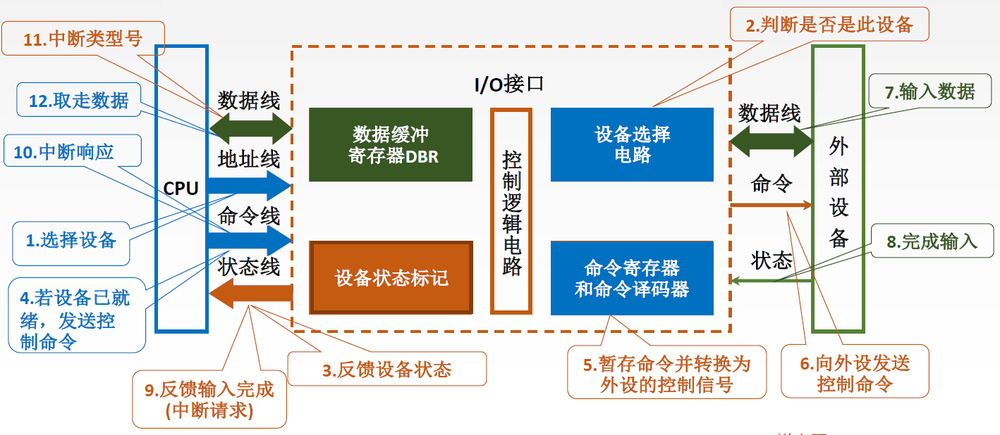

> 联系操作系统[第5章 输入输出管理](../3%20操作系统/第5章%20输入输出管理.md)，不过操作系统中着重软件如何管理，计组中看重硬件实现
# ~~7.1 IO系统基本概念~~

## 7.1.1 输入输出系统

### I/O系统基本组成

一般来说，I/O系统由I/O软件和I/O硬件两部分构成：
* I/O硬件：包括外部设备、I/O接口、I/O总线等。通过设备控制器来控制I/O设备的具体动作，通过I/O接口与主机(总线)相连。
	* [外部设备](#7.1.3%20外部设备)：包括输入/输出设备及通过输入/输出接口才能访问的外存储设备。
	* [I/O接口](#7.2%20I/O接口)：又称IO控制器(I/O Controller)、设备控制器，是各个外设与主机之间传输数据时进行各种协调工作的逻辑部件。协调包括传输过程中速度的匹配、电平和格式转换等。可以把数据输入到计算机，或者可以接收计算机输出数据的外部设备
* I/O软件：包括**驱动程序**、用户程序、管理程序、升级补丁等。通常采用I/O指令和通道指令实现主机和I/O设备的信息交换。<!--不同设备命令码不同，由驱动程序指定-->
	* **I/O 指令**：CPU 指令的一部分。操作码+命令码+设备码（操作码指明了CPU要对IO接口做什么，命令码指明了IO接口要对设备做什么，设备码指明了对哪个设备进行操作）
	* **通道指令**：通道能识别的指令。通道程序提前编制好放在主存中。在含有通道的计算机中，CPU执行I/O指令对通道发出命令，由通道执行一系列通道指令，代替CPU对I/O设备进行管理

## 7.1.2 I/O控制方式
> 如何控制I/O操作的完成？

数据流：键盘→I/O接口的数据寄存器→数据总线→CPU某寄存器→主存

* [**程序查询方式**](#7.3.1%20程序查询方式)：CPU不断轮询检查I/O控制器中的“状态寄存器”，检测到状态为“已完成”之后，再从数据寄存器取出输入数据
* [**程序中断方式**](#7.3.2%20程序中断方式)：等待键盘I/O的过程中，CPU可以先去执行其他程序，键盘I/O完成后I/O控制器向CPU发出中断请求，CPU响应中断请求，并取走输入数据
	* Q-对于快速I/O设备，每准备好一个字就向CPU发送一次中断请求，会导致什么问题？
	* A-CPU需要花费大量的时间来处理中断服务程序，CPU利用率严重下降
* [**DMA控制方式**](#7.3.3%20DMA方式)：主存与高速I/O设备之间有一条直接数据通路（DMA总线）。CPU向DMA接口发出“读/写”命令，并指明主存地址、磁盘地址、读写数据量等参数。DMA控制器自动控制磁盘与主存的数据读写，每完成一整块数据读写（如1KB为一整块），才向CPU发出一次中断请求。
	* DMA：Direct Memory Access，直接内存访问。
	* DMA接口，即DMA控制器，是一种特殊的I/O控制器
* **通道控制方式**
	* 通道是具有特殊功能的处理器，能对I/O设备进行统一管理。可以理解为是“弱鸡版的CPU”。通道可以识别并执行一系列**通道指令**，通道指令种类、功能通常比较单一
	1. CPU向通道发出I/O指令。指明通道程序在内存中的位置，并指明要操作的是哪个I/O设备。CPU就可以去做其他事情
	2. 通道执行内存中的通道程序，（其中指明了要读入/写出多少数据，读/写的数据应存放在内存控制I/O设备完成一系列任务
	3. 通道执行完规定的任务后，向CPU发出中断请求，之后CPU对中断进行处理

## 7.1.3 外部设备

* [输入设备](#输入设备)：用于向计算机系统输入命令和文本、数据等信息的部件。键盘和鼠标是最基本的输入设备。
* [输出设备](#输出设备)：用于将计算机系统中的信息输出到计算机外部进行显示、交换等的部件。显示器和打印机是最基本的输出设备。
* [外存设备](#外部存储器)：是指除计算机内存及CPU缓存等以外的存储器。硬磁盘、光盘等是最基本的外存设备。

### 输入设备

#### 键盘

键盘是最常用的输入设备，通过它可发出命令或输入数据。每个键相当于一个开关，当按下键时，电信号连通；
当松开键时，弹簧把键弹起，电信号断开。键盘输入信息可分为3个步骤：
1. 查出按下的是哪个键；
2. 将该键翻译成能被主机接收的编码，如ASCII码；
3. 将编码传送给主机。
#### 鼠标

鼠标是常用的定位输入设备，它把用户的操作与计算机屏幕上的位置信息相联系。常用的鼠标有机械式和光电式两种。其工作原理为：当鼠标在平面上移动时，其底部传感器把运动的方向和距离检测出来，从而控制光标做相应运动。

### 输出设备

#### 显示器

显示器的主要参数如下：
* 屏幕大小：以对角线长度表示，常用的有12～29英寸等。
* **分辨率**：屏幕上所能显示的像素个数，屏幕上的每一个光点就是一个像素，以宽、高的像素的乘积表示。例如，800×600、1024×768和1280×1024等。
* **灰度级**：在黑白显示器中所显示的像素点的明暗层度，在彩色显示器中则表现为颜色的不同。灰度级越多，图像层次越清楚逼真，典型的有8位（256级）、16位等。$n$ 位可以表示 $2^{n}$ 种不同的亮度或颜色。
* 刷新：光点只能保持极短的时间便会消失，为此必须在光点消失之前再重新扫描显示一遍，这个过程称为刷新。
* **刷新频率**：单位时间内扫描整个屏幕内容的次数，按照人的视觉生理，刷新频率大于30Hz时才不会感到闪烁，通常显示器刷新频率在60～120Hz。
* 显示存储器(VRAM)：也称刷新存储器，为了不断提高刷新图像的信号，必须把一帧图像信息存储在刷新存储器中。其存储容量由图像分辨率和灰度级决定，分辨率越高，灰度级越多，刷新存储器容量越大。
	* **VRAM容量**=分辨率×灰度级位数；**VRAM带宽**=分辨率×灰度级位数×刷新频率
	* 现代计算机中，显存除了作为当前显示帧的缓存，还会用于保存即将渲染的图像数据。
	* 集成显卡计算机中，通常分配一片内存作为显存

种类
* 按照显示器件的不同，可以分为：
	* 阴极射线管显示器(CRT)
	* 液晶显示器(LCD)
	* 发光二极管显示器(LED)
* 按照显示内容的不同，可以分为：
	* 字符显示器：显示字符的方法以点阵为基础
	* 图形显示器：产生矢量图形
	* 图像显示器：产生图像

#### 打印机

* 按印字原理
	* 击打式打印机：利用机械动作使印字机构与色带和纸相撞而打印字符（如银行回执单，防伪性好）
	* 非击打式打印机：采用电、磁、光、喷墨等物理、化学方法来印刷字符
* 按工作方式
	* 针式打印机
	* 喷墨式打印机
	* 激光打印机

### 外部存储器
详见[3.4 外部存储器](第3章%20存储系统#3.4%20外部存储器)

# 7.2 I/O接口

## 7.2.1 I/O接口的功能

I/O接口的主要功能如下：
* 数据缓冲：通过数据缓冲寄存器(DBR)达到主机和外设工作速度的匹配
* 错误或状态监测：通过状态寄存器保存设备的各种错误、状态信息，供CPU查用
* 控制和定时：接收从控制总线发来的控制信号、时钟信号
* 数据格式转换：串-并、并-串等格式转换
通过上述功能，最终实现与主机和设备通信：实现主机—I/O接口—I/O设备之间的通信

## 7.2.2 I/O接口的基本结构

总线
* **数据线**：读写数据、状态字、控制字、中断类型号
* **地址线**：指明[I/O端口](#7.2.4%20I/O端口及其编址)
* **控制线**：读写I/O端口的信号、中断信号
---
寄存器：联系[I/O端口的概念](#I/O端口的概念)
* **数据缓冲寄存器**：暂存与CPU或内存之间传送的数据信息
* **状态寄存器**：记录接口和设备的状态信息
* **控制寄存器**：保存CPU对外设的控制信息
* 控制寄存器、状态寄存器在使用时间上是错开的，因此有的I/O接口中可将二者合二为一
---
* 内部接口：主机侧的接口称为内部接口，通过系统总线与内存、CPU相连
* 外部接口：设备侧的接口称为外部接口，通过接口电缆与外设相连。外部接口的数据传输可以是串行或并行方式，因此I/O接口需具有串/并转换功能。
---
1. 发命令：发送命令字到I/O控制寄存器，向设备发送命令（需要驱动程序的协助）
2. 读状态：从状态寄存器读取状态字，获得设备或I/O控制器的状态信息
3. 读/写数据：从数据缓冲寄存器发送或读取数据，完成主机与外设的数据交换

## 7.2.3 I/O接口的类型

按数据传送方式可分为 ^[注：这里所说的数据传送方式指的是外设和接口一侧的传送方式，而在主机和接口一侧，数据总是并行传送的。接口要完成数据格式转换。]
* 并行接口：一个字节或一个字所有位同时传送。
* 串行接口：一位一位地传送。

按主机访问I/O设备的控制方式可分为
* 程序查询接口：程序查询方式的特定接口
* 程序中断接口：程序中断方式的特定接口
* DMA接口：DMA方式的特定接口

按功能选择的灵活性可分为
* 可编程接口：可通过程序来改变或者选择接口的功能和操作方式
* 不可编程接口：不能由程序来改变接口的功能，但可通过硬连线逻辑来实现不同的功能

## 7.2.4 I/O端口及其编址

### I/O端口的概念

* **I/O端口**：是指I/O接口中CPU可以直接访问的寄存器。I/O端口主要有数据端口、状态端口和控制端口。若干端口加上相应的控制逻辑电路组成I/O接口
	* **数据端口**：I/O接口中的数据缓存寄存器用来存放数据信息，称为数据端口。CPU可以对其中的数据进行读写
	* **控制端口**：I/O接口中的控制寄存器用来存放控制命令，称为控制端口。CPU只能对各种控制命令进行写入
	* **状态端口**：I/O接口中的状态寄存器用来存放状态信息，称为状态端口。CPU只能对各外设的状态进行读取

### 统一编址

> I/O端口的地址与内存地址是一整套的东西，寄存器的编号紧接着内存地址继续

* **统一编址**：又称存储器映射方式，对主存地址空间和I/O地址空间统一进行编址，将主存地址空间的一部分地址划分给I/O端口。
* 区分：根据地址范围来区分内存和I/O设备，I/O地址要求相对固定在地址的某部分
* 直接使用指令系统中的访存指令访问I/O端口
* RISC机器常用，复杂指令集系统也有使用。

优点：
* 不需要专门的输入/输出指令，所有访存指令都可直接访问端口，程序设计灵活性高
* 端口有较大的编址空间
* 读写控制逻辑电路简单

缺点：
* 端口占用了主存地址空间，使主存地址空间变小
* 外设寻址时间长（地址位数多，地址译码速度慢）

### 独立编址

> I/O端口的地址与内存地址相互独立，I/O端口的地址重新从0开始

* **独立编址**，又称I/O映射方式，对主存地址空间和I/O端口地址空间分别进行编址，二者地址取值范围可能有重叠。
* 区分：靠不同的指令区分内存和I/O设备，只能用专门的I/O指令访问I/O端口

优点：
* 使用专用I/O指令，程序编制清晰
* I/O端口地址位数少，地址译码速度快
* I/O端口的地址不占用主存地址空间

缺点：
* I/O指令类型少，一般只能对端口进行传送操作，程序设计灵活性差
* 需要CPU提供存储器读/写、I/O设备读/写两组控制信号，增加了控制逻辑电路的复杂性

# 7.3 IO方式

## 7.3.1 程序查询方式

> CPU不断轮询检查I/O控制器中的“状态寄存器”，检测到状态为“已完成”之后，再从数据寄存器取出输入数据

CPU一旦启动I/O，必须停止现行程序的运行，并在现行程序中插入一段程序。

* 主要特点：CPU有“踏步”等待现象，CPU与I/O串行工作。
* 优点：接口设计简单、设备量少。
* 缺点：CPU在信息传送过程中要花费很多时间用于查询和等待，而且如果采用独占查询在一段时间内只能和一台外设交换信息，效率大大降低。

根据被启动查询的方式不同，可分为独占查询方式与定时查询方式
* **独占查询**：一旦设备被启动，CPU必须连续不断地查询I/O状态。设备的I/O独占CPU，CPU与外设完全串行工作
* **定时查询**：在保证数据不丢失的情况下，CPU周期性地查询I/O状态。查询的间隔内CPU可以执行其他程序

### 程序查询方式的工作过程

1. 预置传送参数：CPU执行初始化程序，并设置计数器、数据首地址参数
	* 计数器：因为数据经常是成批传送，所以需要预先设置交换数据的计数值，即传送数据的个数
	* 数据首地址：传送数据在主存缓冲区的首地址
2. 启动外设：向I/O接口发送命令字，启动I/O设备
3. 取外设状态：CPU从接口读取设备状态信息
4. 外设准备就绪：CPU不断查询I/O设备状态，直到外设准备就绪（实际上只是在CPU分配给这个进程的时间片内不断查询）
	* CPU查询频率至少要比设备输入速率快，来及时的取走缓冲区的数据，避免来不及取被覆盖
	* 由设备的传输速率、缓冲区大小、查询一次的时间可以计算**查询时间占比**
5. 传送一次数据：一般为一个字
6. 修改传送参数：修改主存地址和计数器参数
	* 将主存缓冲区地址加 $1$ ，指向下一个传送数据的地址
	* 将计数器值减 $1$ 
7. 传送完否：判断传送是否结束。一般计数器为0时结束

## 7.3.2 程序中断方式

> 等待键盘I/O的过程中，CPU可以先去执行其他程序，键盘I/O完成后I/O控制器向CPU发出中断请求，CPU响应中断请求，并取走输入数据
>
> 补充：程序中断的响应只能在每条指令执行完毕
### 程序中断的基本概念

**中断**：程序中断是指在计算机执行现行程序的过程中，出现某些急需处理的异常情况或特殊请求，CPU暂时中止现行程序，而转去对这些异常情况或特殊请求进行处理，在处理完毕后CPU又自动返回到现行程序的断点处，继续执行原程序。

### 程序中断方式的工作原理
* CPU在程序中安排好在某个时机启动某台外设，然后CPU继续执行当前的程序，不需要一直等待外设准备就绪。
* 一旦外设完成数据传送的准备工作，就主动向CPU发出中断请求，请求CPU为自己服务。
* 在可以相应中断的条件下，CPU暂时中止正在执行的程序，转去执行中断服务程序为外设服务，在中断服务程序中完成一次主机与外设之间的数据传送。
* 传送完成后，CPU返回原来的程序。

![[pictures/image-20220804163357926.png|800]]

### 程序中断的工作流程

1. 中断请求：中断源向CPU发送中断请求信号。
2. 中断响应：判断能否响应中断。若不在[关中断](#中断请求的分类)状态则响应中断，进行中断判优，即多个中断源同时提出请求时通过中断判优逻辑响应一个中断源。
3. 中断处理：通过中断隐指令将CPU转到正确的中断服务程序，再执行中断服务程序。

#### 中断请求
##### 中断请求的分类

广义的中断包含内中断与外中断，详见[中断的类型](../3%20操作系统/第1章%20计算机系统概述.md#中断的类型)

用中断触发器IF(Interrupt Flag)标记标识关中断，IF=1标识开中断（允许中断），IF=0标识关中断（不允许中断）

**关中断**的作用：实现原子操作（原子操作：几条指令要么一步都不做，要么就一气呵成的全部完成）

* **非屏蔽中断**：关中断时也会被响应（如：掉电、关机等）
  不可屏蔽中断被响应时无中断周期（2021年统考真题）
* **可屏蔽中断**：关中断时不会被响应（大多数中断请求信号）

##### 中断请求标记

每个中断源向CPU发出中断请求的时间是随机的。为了记录中断事件并区分不同的中断源，中断系统需对每个中断源设置**中断请求标记触发器INTR**，当其状态为“1”时，表示中断源有请求。这些触发器可组成中断请求标记寄存器，该寄存器可集中在CPU中，也可分散在各个中断源中。

对于外中断，CPU是在统一的时刻即每条指令执行阶段结束前（[中断阶段](第5章%20中央处理器#中断周期)）向接口发出中断查询信号，以获取I/O的中断请求，也就是说，CPU响应中断的时间是在每条指令执行阶段的结束时刻。

#### 中断判优

> 有多个中断信号同时到来，先处理哪一个？
> 个人理解：**中断响应优先级**是指在多个中断请求同时发生时，确定哪个中断请求将被首先响应的优先级。中断响应优先级由硬件排队电路决定且无法更改，当多个中断请求同时到达时，处理器会根据这些优先级来选择最高优先级的中断请求，然后进入中断处理过程。

中断判优既可以用硬件实现，也可用软件实现：

##### 软件查询方法

* 软件实现是通过**查询程序**实现的。当CPU检查到中断请求时，中断查询程序根据优先级高低依次查询中断请求寄存器各位状态，具有最高优先级的中断源最先检测，其次检查具有次高优先级的中断源，依次类推。查询到第一个有请求的中断源时，转而去执行其中断服务程序。

优先级设置

* 硬件故障中断属于最高级，其次是软件中断；
* 访管的优先级比较高。
* 非屏蔽中断优于可屏蔽中断；
* DMA请求优于I/O设备传送的中断请求；（DMA连接的是高速设备，要防止高速设备数据丢失）
* 高速设备优于低速设备；
* 输入设备优于输出设备；（避免输入信息丢失）
* 实时设备优于普通设备。

##### 硬件判优方法

硬件实现是通过**硬件排队器**实现的，它既可以设置在CPU中，也可以分散在各个中断源中；

#### 中断响应过程

> 中断隐指令并不是一条具体的指令，而是CPU在检测到中断请求时自动完成的一系列动作

CPU响应中断必须满足以下3个条件：
* 有中断源发出中断请求。
* CPU允许中断，即处于开中断状态。
* 一条指令执行完毕，且没有更紧迫的任务。

CPU响应中断后，经过某些操作，转去执行中断服务程序。这些操作是由**硬件直接实现**的，我们将它称为**中断隐指令**。中断隐指令的主要任务有：
1. **关中断**。在中断服务程序中，为了保护中断现场（即CPU主要寄存器中的内容）期间不被新的中断所打断，必须关中断，从而保证被中断的程序在中断服务程序执行完毕之后能接着正确地执行下去。
2. **保存断点**。为了保证在中断服务程序执行完毕后能正确地返回到原来的程序，必须将原来程序的断点（即程序计数器(PC)的内容）保存起来。可以存入堆栈，也可以存入指定单元。
3. **引出中断服务程序**。引出中断服务程序的实质就是取出中断服务程序的入口地址并传送给程序计数器(PC)。两种方法：[软件查询法](#软件识别方式)、[硬件向量法](#硬件识别方式)

#### 进入中断服务程序
> 异常大多采用软件识别方式，而中断可以采用软件识别方式或硬件识别方式

寻找中断服务程序入口地址的方法有软件方式和硬件方式：

##### 软件识别方式

CPU设置一个**异常状态寄存器**，用于记录异常原因。操作系统使用一个统一的异常或中断查询程序，按照优先级顺序查询异常状态寄存器，以检测和中断类型，先查询到的先被处理，然后转到内核中相应的处理程序

##### 硬件识别方式

>[27:13](file://Z:/考研/计算机/02.计算机组成原理/07.第七章%20输入输出系统/03.7.3%20IO方式/02.7.3.2_1%20中断的作用和原理.mp4#t=1753)

**硬件向量法**：用中断向量地址形成部件将[排队器](#中断判优)的输出映射为一个向量地址，再由向量地址找到入口地址
* 每个中断都有唯一的类型号，每个中断类型号都对应一个中断服务程序，每个中断服务程序都有一个入口地址，CPU必须找到入口地址，即**中断向量**。
* 将各个中断服务程序的中断向量集中存放到存储器的某个区域内，这个存放中断向量的存储区就成为**中断向量表**
* CPU响应中断后，通过识别中断源获取（排队器输出？）**中断类型号**，然后据此计算出该中断的**中断向量地址** ^[注：[32:53](file://Z:/考研/计算机/02.计算机组成原理/07.第七章%20输入输出系统/03.7.3%20IO方式/02.7.3.2_1%20中断的作用和原理.mp4#t=1973) 咸鱼这里的中断类型号怀疑说错了，详见萝卜书P343页] ^[注：在8086中，中断向量表占用`0000H`~`03FFH`共1K字节的存储空间；256个中断类型号对应256项，每一项占4个字节，用来存放中断服务程序的入口地址信息。其中高地址的2个字节存放中断服务程序所在段的首地址，低地址的2个字节存放中断服务程序入口地址的段内偏移地址。中断号为 $n$ 的中断服务程序的入口地址存放在中断向量表起始地址为 $n\times 4$ 的4个单元中。（摘自萝卜书）]，再根据该地址访问中断向量表，从中读出中断服务程序的入口地址，并送入PC，以转而执行[中断服务程序](#中断处理过程)。

#### 中断处理过程

中断服务程序的主要任务有：
1. 保护现场。保存通用寄存器和状态寄存器<!--PSW-->的内容（eg：保存ACC寄存器的值），以便返回原程序后可以恢复CPU环境。可使用堆栈，也可以使用特定存储单元。
2. 中断服务（设备服务）。主体部分，如通过程序控制需打印的字符代码送入打印机的缓冲存储器中（eg：中断服务的过程中有可能修改ACC寄存器的值）
3. 恢复现场。通过出栈指令或取数指令把之前保存的信息送回寄存器中（eg：把原程序算到一般的ACC值恢复原样）
4. 中断返回。通过中断返回指令回到原程序断点处。

* CPU处理中断频率至少要比设备输入快，来及时的取走缓冲区的数据，避免来不及取被覆盖
* #考点 ：由设备的传输速率、缓冲区大小、处理一次中断的时间来计算处理中断时间占比

### 多重中断和中断屏蔽技术

* 单重中断：执行中断服务程序时不响应新的中断请求
* 多重中断：又称中断嵌套，执行中断服务程序时可响应新的中断请求。

**中断屏蔽技术**主要用于多重中断，CPU要具备多重中断的功能，须满足下列条件：
1. 在中断服务程序中提前设置开中断指令。
2. 优先级别高的中断源有权中断优先级别低的中断源。

#### 屏蔽字
> 个人理解：**中断处理优先级**是指在多个中断请求被响应并进入中断处理程序时，决定这些中断的处理顺序的优先级。通过中断屏蔽字可以动态调整中断处理优先级，高优先级的中断处理程序会在低优先级的中断处理程序之前执行。

每个中断源都有一个屏蔽触发器，1表示屏蔽该中断源的请求，0表示可以正常申请，所有屏蔽触发器组合在一起，便构成一个屏蔽字寄存器，屏蔽字寄存器的内容称为**屏蔽字**。

屏蔽字设置的规律：
* 一般用‘1’表示屏蔽，‘0’表示正常申请。
* 每个中断源对应一个屏蔽字（在处理该中断源的中断服务程序时，屏蔽寄存器中的内容为该中断源对应的屏蔽字）。
* 屏蔽字中‘1’越多，优先级越高。每个屏蔽字中至少有一个‘1’（自己不能中断自己，所以至少要能屏蔽自身的中断）

>[!example]+ 例题
> 若ABCD四个中断源的中断处理次序为：A>B>C>D，则中断源对应的屏蔽字为：
> 
> | 屏蔽字 |  A   |  B   |  C   |  D   |
> | :----: | :--: | :--: | :--: | :--: |
> |   A    |  1   |  1   |  1   |  1   |
> |   B    |  0   |  1   |  1   |  1   |
> |   C    |  0   |  0   |  1   |  1   |
> |   D    |  0   |  0   |  0   |  1   |

## 7.3.3 DMA方式

> DMA控制器与主存每次传送1个字。当传送完一整块数据后才向CPU发出中断请求
>
> DMA中断请求的响应可以发生在每个机器周期结束（只要总线空闲即可）。

Direct Memory Access，直接内存访问
### DMA控制器

DMA控制器的主要功能如下：
0. CPU向DMA控制器指明要输入还是输出；要传送多少个数据；数据在主存、外设中的地址。
1. DMA控制器接受外设发出的<u>DMA请求</u>（外设传送一个字的请求），并向CPU发出<u>总线请求</u>。 #易错
2. CPU响应此总线请求，发出总线响应信号；DMA控制器接管总线控制权，进入DMA操作周期。
3. 确定传送数据的主存单元地址及长度，并能自动修改主存地址计数和传送长度计数。
4. 规定数据在主存和外设间的传送方向，发出读写等控制信号，执行数据传送操作。
5. 数据块传送结束时，通过中断信号向CPU报告DMA操作的结束。

* DMAC：DMA Controller
* **中断机构**：当一个数据块传送完毕后触发中断机构，向CPU提出中断请求
* **控制/状态逻辑**：由控制和时序电路及状态标志组成，用于指定传送方向，修改传送参数，并对DMA请求信号和CPU响应信号进行协调和同步
* **DMA请求触发器**：每当I/O设备准备好数据后给出一个控制信号，使DMA请求触发器复位
* **主存地址计数器**：简称AR，存放需要交换数据的主存地址。在DMA传送过程中， 每完成一次数据交换，主存地址计数器 $+1$ 。
* **传送长度计数器**：简称WC，存放需要传送数据的总字数。在DMA传送过程中，每完成一次数据交换，传送长度计数器 $-1$ ，直到计数器为0时表示该批数据全部传送完毕
* **数据缓冲寄存器**：用于暂存每次传送的数据

在DMA传送过程中，DMA控制器将接管CPU的地址总线、数据总线和控制总线，CPU的主存控制信号被禁止使用。而当DMA传送结束后，将恢复CPU的一切权利并开始执行其操作。

### DMA传送过程

1. 预处理
	* 申请内存缓冲区(输入)，或在内存中准备数据(输出)
	* 主存起始地址→AR，指明数据存放地址
	* I/O设备地址→DAR，指明设备读写地址
	* 传送数据个数→WC，指明传送多少个数据
	* 启动I/O设备，开始进行响应的准备
2. 数据传送：CPU继续执行主程序，同时完成一批数据的传送。以输入数据为例：
	1. 设备将数据写入数据缓存器DR
	2. 写满后向DMA请求触发器发送DMA请求
	3. 控制逻辑检测到DMA请求，即<u>一个字的传送完成后</u>，向CPU发送总线请求HRQ申请总线控制权<!--每传送一个字发送一次DMA请求-->
	4. CPU给予反馈信号HLDA，将总线控制权交给DMA控制器
	5. DMA控制器接管总线，完成一次数据传送，地址与长度计数器+1
	6. 经过多次传送，长度计数器溢出后将溢出信号发送给中断机构
	7. 中断机构检测到溢出信号后向CPU发出中断请求<!--仅在整个数据块传送完成后发送一次DMA中断请求-->
	8. CPU处理中断请求
3. 后处理
	* 中断服务程序
	* 做DMA结束处理
4. 继续执行主程序

### DMA传送方式

> 如果采用三总线结构，则DMA控制器随时都可以访问主存。当I/O设备与CPU同时访问主存时，可能发生冲突。
> 三种传送方式类似DRAM的三种[刷新策略](第3章%20存储系统#DRAM的刷新)

在DMA方式中，由于DMA接口和CPU共享主存，所以当它们同时访问主存时，CPU必须将总线占有权让给DMA接口使用，而且也会出现二者争用主存的局面。为了实现主存的分时复用，常采用以下3种方法。

#### 停止CPU访问主存

 

* **实现思路**：当I/O设备发送DMA请求时，DMA接口发送一个停止信号给CPU，让CPU放弃总线的控制权，停止使用主存，DMA占用总线开始进行数据传送直到传送结束，然后DMA接口再次发送信号通知CPU可以使用主存，CPU重新获得总线控制权。
* **缺点**：DMA接口在于主存交换数据时，CPU 处于不工作状态或保持状态，未充分发挥CPU 对主存的利用率<!--与DMA的初衷相违背-->

#### DMA与CPU交替访存

 
* **实现思路**：将CPU的工作周期分成两个时间片，一片分给CPU访存，一片分给DMA访存，使得每个CPU周期内，CPU和DMA都可以单独访问主存
* 适用于CPU的工作周期比主存存储周期时间长的情况
* **优点**：不需要总线使用权的申请、建立和归还过程
* **缺点**：硬件逻辑更为复杂

#### 周期挪用（周期窃取）

 
* **实现思路**：前两种方法的折中。当I/O设备发出DMA请求时，会挪用一个或几个主存周期用于DMA接口的数据传送，传送结束后CPU仍可以继续访问主存。I/O设备在请求DMA传送时，会遇到以下三种情况：
	* CPU 此时不访存（无冲突，直接访问）
	* CPU 正在访存（等待存取周期结束后获得总线占用权）
	* CPU 与DMA 同时请求访存（DMA优先）

### DMA方式的特点

* 它使主存与CPU的固定联系脱钩，主存既可被CPU访问，又可被外设访问。
* 在数据块传送时，主存地址的确定、传送数据的计数等都由硬件电路直接实现。
* 主存中要开辟专用缓冲区，及时供给和接收外设的数据。
* DMA传送速度快，CPU和外设并行工作，提高了系统效率。
* DMA在传送开始前和结束后需要CPU参与，在传送开始前要通过程序进行预处理，结束后要通过中断方式进行后处理。
* 选择型DMA控制器不适用于慢速设备。但多路型DMA控制器却适合于同时为多个慢速外围设备服务
* 补充：DMA方式只能用于数据传输，它不具有对异常事件的处理能力，不能中断现行程序，无法应用于鼠标或者键盘

### 三种I/O方式对比

|        |        程序查询方式         |              程序中断方式               |             DMA方式             |
| :----: | :-------------------: | :-------------------------------: | :---------------------------: |
|  数据传送  | 由程序控制 CPU全程参与数据传输 |       由程序控制 CPU参与中断处理过程       |    由硬件控制 CPU只参与预处理和后处理    |
|  中断请求  |           无           |               传送数据                |             仅在后处理             |
|   响应   |           无           | 指令[执行周期](第5章%20中央处理器#执行周期)结束后响应中断 | 每个机器周期结束均可 总线空闲时即可响应DMA请求 |
|   场景   |        不太繁忙的系统        |            CPU控制，低速设备             |         DMA控制器控制，高速设备         |
|  优先级   |          最低           |                次低                 |           <u>最高</u>           |
|  异常处理  |         仅传送数据         |              能处理异常事件              |             仅传送数据             |
| 请求(补充) |                       |               CPU时间               |             总线控制权             |
|        |         软件传送          |               软硬结合                |             硬件传送              |