# 2.1 进程与线程

## 2.1.1 进程的概念和特征


### 进程的概念

* **程序**：是静态的，就是个存放在磁盘里的可执行文件，如：QQ.exe。
* **进程**：是动态的，是程序的一次执行过程，同一个程序多次执行会对应多个进程。如：可同时启动多次QQ程序

### 进程的组成

> 如何区分多个进程？

一个进程由<u>PCB、程序段、数据段</u>组成。（准确的讲应该被称为进程实体（进程映象）的组成）

进程是动态的，进程实体（进程映像）是静态的。
进程是进程实体的运行过程，是系统进行资源分配和调度的一个独立单位。
进程实体反应了进程在某一时刻的状态（如：x++后，x=2）<!--可以理解为快照-->

#### PCB

> PCB是给操作系统用的，操作系统对进程进行管理工作所需的信息都存在PCB中

**进程控制块PCB**是进程存在的唯一标志，当进程被创建时，操作系统为其创建PCB，当进程结束时，会回收其PCB

当进程被创建时，操作系统会为该进程分配一个唯一的、不重复的“身份证号”—— `PID`(Process ID，进程ID)

* **进程描述信息**：进程标识符 `PID`、用户标识符 `UID`——基本的进程描述信息，可以让操作系统区分各个进程
* **资源分配清单**：正在使用哪些内存区域、正在使用哪些文件、正在使用哪些I/O设备——可用于实现操作系统对资源的管理
* **进程控制和管理信息**：进程当前状态、进程优先级、代码运行入口地址、程序的外存地址、进入内存时间、处理机占用时间、信号量使用——可用于实现操作系统对进程的控制、调度
* **处理机相关信息**：如PSW、PC等等各种寄存器的值——用于实现进程切换

#### 程序段与数据段

> 程序段、数据段是给进程自己用的

* 程序段：程序的代码（指令序列）
* 数据段：运行过程中产生的各种数据（如：程序中定义的变量）

### 进程的特征

* 动态性：进程是程序的一次执行过程，是动态地产生、变化和消亡的——动态性是进程最基本的特征
* 并发性：内存中有多个进程实体，各个进程可并发进行
* 独立性：进程是能独立运行、独立获得资源、独立接受调度的**基本单位**
* 异步性：各进程按各自独立的、不可预知的速度向前推进，操作系统要提供“进程同步机制”来解决异步问题——异步性会导致并发程序执行结果的不确定性，详见进程同步相关小节
* 结构性：每个进程都会配置一个PCB。结构上看，进程由程序段、数据段、PCB组成

封闭性：一个进程一旦开始执行，其执行结果就只取决于他本身，不会受外界因素影响。并发进程失去封闭性

## 2.1.2 进程的状态与转换


### 进程的状态

进程PCB中，会有一个变量 `state` 来表示进程的当前状态。如：1表示创建态、2表示就绪态、3表示运行态…为了对同一个状态下的各个进程进行统一的管理，操作系统会将各个进程的PCB[组织](#2.1.3%20进程的组织)起来。

* **创建态**：进程正在被创建时，它的状态是“创建态”，又称新建态，在这个阶段操作系统会为进程分配资源、初始化PCB
* **就绪态**：<u>当进程创建完成后，便进入“就绪态”</u>，处于就绪态的进程已经具备运行条件，但由于没有空闲CPU，就暂时不能运行（系统中可能会有很多个进程都处于就绪态。当CPU空闲时，操作系统就会选择一个就绪进程，让它上处理机运行）
* **运行态**：如果一个进程此时在CPU上运行，那么这个进程处于“运行态”。CPU会执行该进程对应的程序（执行指令序列）
* **阻塞态**：又称等待态，在进程运行的过程中，可能会请求等待某个事件的发生（如等待某种系统资源的分配，或者等待其他进程的响应）。在这个事件发生之前，进程无法继续往下执行，此时操作系统会让这个进程下CPU，并让它进入“阻塞态”。当CPU空闲时，又会选择另一个“就绪态”进程上CPU运行
* **终止态**：又称结束态，一个进程可以执行 `exit` 系统调用，请求操作系统终止该进程。此时该进程会进入“终止态”，操作系统会让该进程下CPU，并回收内存空间等资源，最后还要回收该进程的PCB。当终止进程的工作完成之后，这个进程就彻底消失了。

### 进程状态的转换


* 运行态→阻塞态是进程自身作出的主动行为；阻塞态→运行态不受进程控制，是被动行为
* 不能由阻塞态直接转换为运行态，也不能由就绪态直接转换为阻塞态 ^[个人理解：申请的资源是按顺序分配，分配给就绪态的进程以后，就不会再被其他进程抢走]
* 所谓等待的事件主要有：
	* 发起I/O，等待I/O完成； 
	* 对≤0的信号量进行P操作，等待V操作；
	* 条件变量`wait()`操作，等待`signal()`操作释放；
	* 创建进程的过程中资源不够，等待释放；
	* 等待输入设备的数据输入等。

## 2.1.3 进程的组织

> 如何把各个进程组织起来？

### 链接方式

按照进程状态将PCB分为多个队列，操作系统持有指向各个队列的指针

* 执行指针：指向当前处于运行态（执行态）的进程。单CPU计算机中，同一时刻只会有一个进程处于运行态
* 就绪队列指针：指向当前处于就绪态的进程。通常会把优先级高的进程放在队头
* 阻塞队列指针：指向当前处于阻塞态的进程。很多操作系统还会根据阻塞原因不同，再分为多个阻塞队列

### 索引方式

根据进程状态的不同，建立几张索引表，操作系统持有指向各个索引表的指针

## 2.1.4 进程的控制


**进程控制**的主要功能是对系统中的所有进程实施有效的管理，它具有创建新进程、撤销已有进程、实现进程状态转换等功能。——进程控制就是要实现进程状态转换

如何实现进程控制？用[原语](第1章%20计算机系统概述#原语操作)实现，进程控制的过程要一气呵成。如果不能“一气呵成”，就有可能导致操作系统中的某些关键数据结构信息不统一的情况，这会影响操作系统进行别的管理工作

### 进程控制相关的原语

1. 更新PCB中的信息
2. 将PCB插入合适的队列
3. 分配/回收资源

#### 进程的创建——创建原语

1. 申请空白PCB
2. 为新进程分配所需资源
3. 初始化PCB
4. 将PCB插入就绪队列

引起进程创建的事件

* 用户登录：分时系统中，用户登录成功，系统会为其建立一个新的进程
* 作业调度：多道批处理系统中，有新的作业放入内存时，会为为其建立一个新的进程 ^[**作业**：此时还放在外存中没有投入运行的程序]
* 提供服务：用户向操作系统提出某些请求，会新建一个进程处理该请求
* 应用请求：由用户进程主动请求创建一个子进程

#### 进程的终止——撤销原语

就绪态/阻塞态/运行态→终止态→无

1. 从PCB集合中找到终止进程的PCB
2. 若进程正在运行，则立即剥夺CPU，将CPU分配给其他进程
3. 终止其所有子进程<!--进程间的关系是树形结构-->
4. 将该进程所拥有的所有资源归还给父进程或操作系统
5. 删除PCB

引起进程终止的事件

* 正常结束，如：进程自己请求终止（`exit` 系统调用）
* 异常结束，如：整数除以0、非法使用特权指令，然后被操作系统强行杀掉
* 外界干预，如：Ctrl+Alt+delete，用户选择杀掉进程

#### 进程的阻塞——阻塞原语

1. 找到阻塞的过程对应的PCB
2. 保护进程运行现场，将PCB状态信息设置为“阻塞态”，暂时停止进程运行
3. 将PCB插入相应事件的等待队列

引起进程阻塞的事件

* 需要等待系统分配某种资源
* 需要等待相互合作的其他进程完成工作

#### 进程的唤醒——唤醒原语

> 因为何事阻塞，就应该由何事被唤醒，唤醒原语与阻塞原语必须成对使用

1. 找到事件等待队列中找到PCB
2. 将PCB从等待队列移除，设置进程为就绪态
3. 将PCB插入就绪队列，等待被调度

引起进程唤醒的事件

* 等待的事情发生

#### 进程的切换——切换原语
> 运行态→就绪态，就绪态→运行态

1. 将进程运行环境信息存入PCB ^[运行环境：进程的运行过程中寄存器存储的中间结果]
2. PCB移入相应队列
3. 选择另一个进程执行，并更新其PCB
4. 根据PCB恢复新进程所需的运行环境

引起进程切换的事件

* 当前的进程时间片到
* 有更高优先级的进程到达
* 当前进程主动阻塞
* 当前进程终止

## 2.1.5 进程的通信

> 进程间通信(Inter-Process Communication， IPC)是指两个进程之间产生数据交互


进程是分配系统资源的单位（包括内存地址空间），因此各进程拥有的内存地址空间相互独立。为了保证安全，一个进程不能直接访问另一个进程的地址空间。

进程间的通信方式主要有管道、消息传递、共享内存、文件映射和套接字等

### 共享存储

在通信的进程之间存在一块可以直接访问的共享空间，通过对这片共享空间进行读写操作实现进程之间的信息交换。

注：通过“增加[页表项](第3章%20内存管理#基本地址变换机构)/段表项”即可将同一片共享内存区映射到各个进程的地址空间中

为避免出错，各个进程对共享空间的访问应该是互斥的。各个进程可使用操作系统内核提供的[同步互斥工具](#2.3%20同步与互斥)（如P、V操作）

* **基于数据结构的共享**：比如共享空间里只能放一个长度为10的数组。这种共享方式速度慢、限制多，是一种<u>低级通信方式</u>
* **基于存储区的共享**：操作系统在内存中划出一块共享存储区，数据的形式、存放位置都由通信进程控制，而不是操作系统。这种共享方式速度很快，是一种<u>高级通信方式</u>。

### 消息传递

进程间的数据交换以**格式化的消息**(Message)为单位。进程通过操作系统提供的“发送消息/接收消息”两个原语进行数据交换。

格式化的消息：消息体消息头（包括发送进程ID、接受进程ID、消息长度等格式化的信息）

* **直接通信方式**：消息发送进程要指明接收进程的ID，发送进程直接把消息发送给接收进程，并把它挂在接收进程的消息缓冲队列上，接收进程从消息缓冲队列中取得消息（点名道姓的消息传递）
* **间接通信方式**：通过“信箱”间接地通信，发送进程把消息发送到信箱，接收进程从信箱取得消息。因此又称“信箱通信方式”（发送原语——接收原语）

### 管道通信

“管道”是一个特殊的共享文件，又名pipe文件。其实就是在内存中开辟一个大小固定的内存缓冲区（数据先进先出）<!--可以理解为循环队列-->

* 管道只能采用**半双工通信**，某一时间段内只能实现单向的传输。如果要实现双向同时通信，则需要设置两个管道。
* 各进程要互斥地访问管道（由操作系统实现）
* 当管道写满时，写进程将阻塞，直到读进程将管道中的数据取走，即可唤醒写进程。
* 当管道读空时，读进程将阻塞，直到写进程往管道中写入数据，即可唤醒读进程。
* <u>管道中的数据一旦被读出，就彻底消失</u>。因此，当多个进程读同一个管道时，可能会错乱。对此，通常有两种解决方案：
	* 允许多个写进程，一个读进程（2014年408真题高教社官方答案）；
	* 允许有多个写进程，多个读进程，但系统会让各个读进程轮流从管道中读数据（Linux的方案）。

## 2.1.6 线程和多线程模型


有的进程可能需要“同时”做很多事，而传统的进程只能串行地执行一系列程序。为此，引入了“线程”，来增加并发度。

> 可以把线程理解为“轻量级进程”。

### 线程和进程的比较

* 资源分配
	* 传统进程机制中，进程是资源分配、调度的基本单位；
	* 引入线程后，<u>进程是资源分配的基本单位，线程是处理机调度的基本单位</u>
* 并发性
	* 传统线程机制中，只能进程间并发；
	* 引入线程后，各线程间也能并发，提高了并发度，使得一个进程内也可以并发处理各种任务
* 系统开销
	* 传统的进程间并发，需要切换进程的运行环境，系统开销很大；
	* 引入线程后，线程间并发，如果是同一进程内的线程切换，则不需要切换进程环境，系统开销小，并发所带来的系统开销减小

<u>进程中的线程共享进程内的全部资源，但进程中线程的栈指针对其他线程的是透明的，不能与其他线程共享</u>

### 线程的属性

* 多CPU计算机中，各个线程可占用不同的CPU
* 每个线程都有一个线程ID、线程控制块(TCB)
* 线程也有就绪、阻塞、运行三种基本状态
* 线程几乎不拥有系统资源（系统资源分配给进程）
* <u>同一进程的不同线程间共享进程的资源</u>
* 由于<u>共享内存地址空间</u>，同一进程中的线程间通信甚至无需系统干预
* 同一进程中的线程切换，不会引起进程切换；不同进程间的线程切换，会引起进程切换
* 切换同进程内的线程，系统开销很小；切换进程，系统开销较大

### 线程的实现方式


#### 用户级线程(ULT)

用户级线程(User-Level Thread, ULT)：从用户视角看得到的线程，实际上由线程库实现

历史背景：早期的操作系统（如：早期Unix）只支持进程，不支持线程。当时的“线程”是由线程库实现的

很多编程语言提供了强大的线程库，可以实现线程的创建、销毁、调度等功能。

```c
int main (){
int i=0；
while (true){
	if (i==0){处理视频聊天的代码；}
	if (i==1){处理文字聊天的代码；}
	if (i==2){处理文件传输的代码；}
	i=(i+1)%3;	 //i的值为0,1,2，0,1,2...
	}
}
```

* 线程的管理工作由谁来完成？
	* 用户级线程由应用程序通过线程库实现，所有的线程管理工作都由应用程序负责（包括线程切换）
* 线程切换是否需要CPU变态？
	* 用户级线程中，线程切换可以在用户态下即可完成，无需操作系统干预。
* 操作系统是否能意识到用户级线程的存在？
	* 在用户看来，是有多个线程。但是在操作系统内核看来，并意识不到线程的存在。“用户级线程”就是“从用户视角看能看到的线程”
* 这种线程的实现方式有什么优点和缺点？
	* 优点：用户级线程的切换在用户空间即可完成，不需要切换到核心态，线程管理的系统开销小，效率高；
	* 缺点：<u>当一个用户级线程被阻塞后，整个进程都会被阻塞</u>，并发度不高。多个线程不可在多核处理机上并行运行。

#### 内核级线程(KLT)

内核级线程（Kernel-Level Thread, KLT，又称“内核支持的线程”），由操作系统支持的线程

* 线程的管理工作由谁来完成？
	* 内核级线程的管理工作由操作系统内核完成。
* 线程切换是否需要CPU变态？
	* 线程调度、切换等工作都由内核负责，因此内核级线程的切换必然需要在核心态下才能完成。
* 操作系统是否能意识到内核级线程的存在？
	* 操作系统会为每个内核级线程建立相应的TCB（Thread Control Block，**线程控制块**），通过TCB对线程进行管理。“内核级线程”就是“从操作系统内核视角看能看到的线程”
* 这种线程的实现方式有什么优点和缺点
	* 优点：当一个线程被阻塞后，别的线程还可以继续执行，并发能力强。多线程可在多核处理机上并行执行。
	* 缺点：一个用户进程会占用多个内核级线程，线程切换由操作系统内核完成，需要切换到核心态，因此线程管理的成本高，开销大。

#### 多线程模型

> 两种线程实现方式的结合

在支持内核级线程的系统中，根据用户级线程和内核级线程的映射关系，可以划分为几种多线程模型

##### 一对一模型

一对一模型：一个用户级线程映射到一个内核级线程。每个用户进程有与用户级线程同数量的内核级线程。

优点：当一个线程被阻塞后，别的线程还可以继续执行，并发能力强。多线程可在多核处理机上并行执行。

缺点：一个用户进程会占用多个内核级线程，线程切换由操作系统内核完成，需要切换到核心态，因此线程管理的成本高，开销大。



##### 多对一模型

多对一模型：多个用户级线程映射到一个内核级线程。且一个进程只被分配一个内核级线程。

优点：用户级线程的切换在用户空间即可完成，不需要切换到核心态，线程管理的系统开销小，效率高

缺点：当一个用户级线程被阻塞后，整个进程都会被阻塞，并发度不高。多个线程不可在多核处理机上并行运行

重点：操作系统只“看得见”内核级线程，因此只有内核级线程才是处理机分配的单位。



##### 多对多模型

多对多模型： $n$ 个用户级线程映射到 $m$ 个内核级线程 ($n\geqslant m$)。每个用户进程对应 $m$ 个内核级线程。

克服了多对一模型并发度不高的缺点（一个阻塞全体阻塞），又克服了一对一模型中一个用户进程占用太多内核级线程，开销太大的缺点。

可以这么理解：用户级线程是“代码逻辑”的载体，内核级线程是“运行机会”的载体
内核级线程才是处理机分配的单位。例如：多核CPU环境下，图示进程最多能被分配两个核。

一段“代码逻辑”只有获得了“运行机会”才能被CPU执行
内核级线程中可以运行任意一个有映射关系的用户级线程代码，只有两个内核级线程中正在运行的代码逻辑都阻塞时，这个进程才会阻塞


#### 适合用多线程解决的业务场景

* 可以将处理逻辑拆分成多个互不相干的部分
* 计算量较大，需要高并发

### 线程的状态与转换

> 与[进程的状态与转换](#2.1.2 [进程的状态与转换)基本相同


* 执行状态
* 就绪状态
* 阻塞状态


### 线程的组织与控制

> 与[进程的组织与控制](#2.1.4%20进程的控制)非常类似

系统为每个线程配置一个**线程控制块TCB**用于记录控制和管理线程的信息。线程控制块通常包含：

* 线程标识符：TID，类似PID
* 程序计数器PC：线程目前执行到哪里
* 其他寄存器：线程运行的中间结果
* 堆栈指针：堆栈保存函数调用信息、局部变量等
* 线程运行状态：描述线程正处于何种状态
* 优先级：线程调度、资源分配的参考

线程切换时要保存/恢复程序计数器、其他寄存器和堆栈指针

## 2.1.8 本节习题精选

**选择题**：[题目](王道操作系统.pdf#page=59&selection=807,0,811,1)、[答案](王道操作系统.pdf#page=65&selection=333,0,338,1)

**综合题**：[题目](王道操作系统.pdf#page=64&selection=704,0,709,2)、[答案](王道操作系统.pdf#page=71&selection=361,0,365,2)

# 2.2 处理机调度

## 2.2.1 调度的概念


### 调度的基本概念

当有一堆任务要处理，但由于资源有限，这些事情没法同时处理。这就需要确定某种规则来决定处理这些任务的顺序，这就是“调度”研究的问题。

### 调度的层次

#### 高级调度（作业调度）

**作业**：一个具体的任务（内存空间有限，有时无法将用户提交的作业全部放入内存）

> 用户向系统提交一个作业≈用户让操作系统启动一个程序（来处理一个具体的任务）

高级调度（作业调度）。按一定的原则从外存的作业后备队列中挑选一个作业调入内存，并创建进程。每个作业只调入一次，调出一次。作业调入时会建立PCB，调出时才撤销PCB。<!--简化理解：好几个程序需要启动，到底先启动哪个-->

#### 中级调度（内存调度）

内存不够时，可将某些进程的数据调出外存。等内存空闲或者进程需要运行时再重新调入内存。

暂时调到外存等待的进程状态为挂起状态。被挂起的进程PCB会被组织成挂起队列

中级调度（内存调度）——按照某种策略决定将哪个处于挂起状态的进程重新调入内存。一个进程可能会被多次调出、调入内存，因此中级调度发生的频率要比高级调度更高。

#### 补充知识：进程的挂起态与七状态模型

暂时调到外存等待的进程状态为挂起状态（挂起态，suspend）挂起态又可以进一步细分为**就绪挂起**、**阻塞挂起**两种状态

注意“挂起”和“阻塞”的区别，两种状态都是暂时不能获得CPU的服务，但挂起态是将进程映像调到外存去了，而阻塞态下进程映像还在内存中。
有的操作系统会把就绪挂起、阻塞挂起分为两个挂起队列，甚至会根据阻塞原因不同再把阻塞挂起进程进一步细分为多个队列。


#### 低级调度（进程调度）

低级调度（进程调度/处理机调度）——按照某种策略从就绪队列中选取一个进程，将处理机分配给它。

进程调度是操作系统中最基本的一种调度，在一般的操作系统中都必须配置进程调度。进程调度的频率很高，一般几十毫秒一次。

### 三级调度的联系

|    | 要做什么  | 调度发生在   | 发生频率 | 对进程状态的影响 |
| ---- | ----- | ---- | -------- | ---- |
| 高级调度作业调度 | 按照某种规则，从后备队列中选择合适的作业将其调入内存，并为其创建进程 | 外存→内存(面向作业) | 最低     | 无→创建态→就绪态                  |
| 中级调度内存调度 | 按照某种规则，从挂起队列中选择合适的进程将其数据调回内存| 外存→内存(面向进程)| 中等     | 挂起态→就绪态  (阻塞挂起→阻塞态) |
| 低级调度进程调度 | 按照某种规则，从就绪队列中选择一个进程为其分配处理机| 内存→CPU | 最高     | 就绪态→运行态                     |

## 2.2.2 调度的目标


* CPU利用率：指CPU“忙碌”的时间占总时间的比例
* 系统吞吐量：单位时间内完成作业的数量
* **周转时间**：是指从作业被提交给系统开始，到作业完成为止的这段时间间隔。周转时间=完成时间$-$到达时间。它包括四个部分：
	* 作业在外存后备队列上等待[作业调度](#高级调度（作业调度）)的时间、进程在就绪队列上等待[进程调度](#低级调度（进程调度）)的时间、进程在CPU上执行的时间、进程等待I/O操作完成的时间。后三项在一个作业的整个处理过程中，可能发生多次。
* **带权周转时间**：作业周转时间/作业实际运行时间 #考前记一记 
* **等待时间**：指进程/作业处于等待处理机状态时间之和。等待时间=周转时间$-$运行时间$-$I/O操作时间
	* 对于进程来说，等待时间就是指进程建立后等待被服务的时间之和，在等待I/O完成的期间其实进程也是在被服务的，所以不计入等待时间；【注意】
	* 对于作业来说，不仅要考虑建立进程后的等待时间，还要加上作业在外存后备队列中等待的时间。
* 响应时间：指从用户提交请求到首次产生响应所用的时间。

注意：一个作业总共需要被CPU服务多久，被I/O设备服务多久一般是确定不变的，因此<u>调度算法其实只会影响作业/进程的等待时间</u>。

## 2.2.3 调度的实现

> 利用好甘特图

### 调度的时机


#### 什么时候需要进程调度？

* 当前运行的进程**主动放弃**处理机
	* 进程正常终止
	* 运行过程中发生异常而终止
	* 进程主动请求阻塞（如等待I/O）
* 当前运行的进程**被动放弃**处理机
	* 分给进程的时间片用完
	* 有更紧急的事需要处理（如I/O中断）
	* 有更高优先级的进程进入就绪队列

<!--运行的进程所需资源未准备好-->

#### 什么时候不能进行进程调度？

* 在**处理中断的过程**中。中断处理过程复杂，与硬件密切相关，很难做到在中断处理过程中进行进程切换
* 进程在**操作系统内核程序临界区**中。（补充：内核程序临界区≠临界区，普通临界区可以进行调度）
* 在**原子操作**过程中（原语）。原子操作不可中断，要一气呵成（如之前讲过的修改PCB中进程状态标志，并把PCB放到相应队列）

### 进程调度方式

> 有的系统中，只允许进程主动放弃处理机；
> 有的系统中，进程可以主动放弃处理机，当有更紧急的任务需要处理时，也会强行剥夺处理机（被动放弃）

#### 非剥夺调度方式（非抢占式）

非剥夺调度方式，又称非抢占方式。即，只允许进程主动放弃处理机。在运行过程中即便有更紧迫的任务到达，当前进程依然会继续使用处理机，直到该进程终止或主动要求进入阻塞态。

实现简单，系统开销小但是无法及时处理紧急任务，适合于早期的批处理系统

#### 剥夺调度方式（抢占式）

剥夺调度方式，又称抢占方式。当一个进程正在处理机上执行时，如果有一个更重要或更紧迫的进程需要使用处理机，则立即暂停正在执行的进程，将处理机分配给更重要紧迫的那个进程。

可以优先处理更紧急的进程，也可实现让各进程按时间片轮流执行的功能（通过时钟中断）。适合于分时操作系统、实时操作系统

### 调度的切换与过程

#### 进程调度与进程切换

* **狭义的进程调度**指的是从就绪队列中选中一个要运行的进程。（这个进程可以是刚刚被暂停执行的进程，也可能是另一个进程，后一种情况就需要进程切换）
* **进程切换**是指一个进程让出处理机，由另一个进程占用处理机的过程。
* **广义的进程调度**包含了选择一个进程和进程切换两个步骤。

#### 进程切换的过程需要做什么？

* 对原来运行进程各种数据的保存（保存在PCB）
* 对新的进程各种数据的恢复（从PCB中恢复，如：程序计数器、程序状态字、各种数据寄存器等处理机现场信息）

进程切换是有代价的，因此如果过于频繁的进行进程调度、切换，必然会使整个系统的效率降低，使系统大部分时间都花在了进程切换上，而真正用于执行进程的时间减少。

### 调度程序（调度器）


 调度时机——什么事件会触发“调度程序”？

* 创建新进程
* 进程退出
* 运行进程阻塞
* I/O中断发生（可能唤醒某些阻塞进程）

两种调度策略中调度程序的区别

* 非抢占式调度策略，只有运行进程阻塞或退出才触发调度程序工作
* 抢占式调度策略，每个时钟中断或k个时钟中断会触发调度程序工作

是否支持内核级线程中调度程序的区别

* 不支持内核级线程的操作系统，调度程序的处理对象是进程；
* 支持内核级线程的操作系统，调度程序的处理对象的内核级线程。

### 闲逛进程

调度程序永远的备胎，没有其他就绪进程时，运行闲逛进程(idle)

闲逛进程的特性：

* 优先级最低
* 可以是0地址指令，占一个完整的指令周期（指令周期末尾例行检查中断）
* 能耗低

### 两种线程的调度

* 用户级线程调度
* 内核级线程调度

## 2.2.4 典型的调度算法

> 1. 算法思想：为了解决什么问题？
> 2. 算法规则
> 3. 这种调度算法是用于作业调度还是进程调度
> 4. 抢占式？抢占式？
> 5. 优点、缺点
> 6. 是否会导致饥饿

**饥饿**：某进程/作业长期得不到服务

> 这几种算法主要关心对用户的公平性、平均周转时间、平均等待时间等评价系统整体性能的指标，但是不关心“响应时间”，也并不区分任务的紧急程度，因此对于用户来说，交互性很糟糕。因此这三种算法一般适合用于**早期的批处理系统**，当然，FCFS算法也常结合其他的算法使用，在现在也扮演着很重要的角色。


### 先来先服务(FCFS)

FCFS, First Come First Serve

* 算法思想：主要从“公平”的角度考虑（类似于我们生活中排队买东西的例子）
* 算法规则：按照作业/进程到达的先后顺序进行服务
* 用于作业调度时，考虑的是哪个作业先到达后备队列；用于进程调度时，考虑的是哪个进程先到达就绪队列
* 非抢占式的算法
* 优缺点：
	* 优点：公平、算法实现简单
	* 缺点：排在长作业（进程）后面的短作业需要等待很长时间，带权周转时间很大，对短作业来说用户体验不好。即，FCFS算法对长作业有利，对短作业不利
	* 补充：对于I/O繁忙型作业，CPU处理时需要频繁地请求I/O操作，且操作完成后还要重新排队等待调度，所以对I/O繁忙型作业不利
* 是否会导致饥饿：不会导致饥饿

### 短作业优先(SJF)

SJF, Shortest Job First

* 算法思想：追求最少的平均等待时间，最少的平均周转时间、最少的平均平均带权周转时间
* 算法规则：最短的作业/进程优先得到服务（所谓“最短”，是指要求服务时间最短）
	* 非抢占式：每次调度时选择当前已到达且运行时间最短的作业/进程。
	* 抢占式：每当有进程加入就绪队列改变时就需要调度，如果新到达的进程剩余时间比当前运行的进程<u>剩余时间</u>更短，则由新进程抢占处理机，当前运行进程重新回到就绪队列。另外，当一个进程完成时也需要调度
* 即可用于作业调度，也可用于进程调度。用于进程调度时称为“短进程优先(SPF, Shortest Process First)算法”
* SJF和SPF是非抢占式的算法。但是也有抢占式的版本——最短剩余时间优先算法(SRTN, Shortest Remaining Time Next)
* 优缺点：
	* 优点：“最短的”平均等待时间、平均周转时间<!--最短的说法不严谨-->
	* 缺点：不公平。对短作业有利，对长作业不利。可能产生饥饿现象。另外，作业/进程的运行时间是由用户提供的，并不一定真实，不一定能做到真正的短作业优先
* 是否会导致饥饿：如果源源不断地有短作业/进程到来，可能使长作业/进程长时间得不到服务，产生“饥饿”现象。如果一直得不到服务，则称为“饿死”

### 高响应比优先(HRRN)

HRRN, Highest Response Ratio Next

> FCFS算法是在每次调度的时候选择一个等待时间最长的作业（进程）为其服务。但是没有考虑到作业的运行时间，因此导致了对短作业不友好的问题；
>
> SJF算法是选择一个执行时间最短的作业为其服务。但是又完全不考虑各个作业的等待时间，因此导致了对长作业不友好的问题，甚至还会造成饥饿问题

* 算法思想：要综合考虑作业/进程的等待时间和要求服务的时间
* 算法规则：在每次调度时先计算各个作业/进程的**响应比**，选择响应比最高的作业/进程为其服务 $\displaystyle \text{响应比}=\frac{\text{等待时间}+\text{要求服务时间}}{\text{要求服务时间}}$
* 即可用于作业调度，也可用于进程调度
* 非抢占式的算法。因此只有当前运行的作业/进程主动放弃处理机时，才需要调度，才需要计算响应比
* 优点：综合考虑了等待时间和运行时间（要求服务时间）：
	* 等待时间相同时，要求服务时间短的优先（SJF的优点）
	* 要求服务时间相同时，等待时间长的优先（FCFS的优点）
	* 对于长作业来说，随着等待时间越来越久，其响应比也会越来越大，从而避免了长作业饥饿的问题
* 是否会导致饥饿：不会导致饥饿

---

> 比起早期的批处理操作系统来说，由于计算机造价大幅降低，因此之后出现的交互式操作系统（包括分时操作系统、实时操作系统等）更注重系统的响应时间、公平性、平衡性等指标。而这几种算法恰好也能较好地满足交互式系统的需求。因此这三种算法适合用于**交互式系统**。（比如UNIX使用的就是多级反馈队列调度算法）


### 时间片轮转(RR)

* 算法思想：公平地、轮流地为各个进程服务，让每个进程在一定时间间隔内都可以得到响应
* 算法规则：按照各进程到达就绪队列的顺序，轮流让各个进程执行一个**时间片**（如100ms）。若进程未在一个时间片内执行完，则剥夺处理机，将进程重新放到就绪队列队尾重新排队；如果提前结束，则下一个进程也将执行（如果有同一时刻新进程到达，旧进程结束，则默认新到达的进程先进入就绪队列）
* 用于进程调度（只有作业放入内存建立了相应的进程后，才能被分配处理机时间片）
* 若进程未能在时间片内运行完，将被强行剥夺处理机使用权，因此时间片轮转调度算法属于**抢占式**的算法。由时钟装置发出**时钟中断**来通知CPU时间片已到
* 优缺点
	* 优点：公平；响应快，适用于分时操作系统；
	* 缺点：由于高频率的进程切换，因此有一定开销；不区分任务的紧急程度。
* 不会导致饥饿

**时间片太大或太小分别有什么影响**？

* 如果时间片太大，使得每个进程都可以在一个时间片内就完成，则时间片轮转调度算法退化为先来先服务调度算法，并且会增大进程响应时间。因此时间片不能太大。
* 另一方面，进程调度、切换是有时间代价的（保存、恢复运行环境），因此如果时间片太小，会导致进程切换过于频繁，系统会花大量的时间来处理进程切换，从而导致实际用于进程执行的时间比例减少。可见时间片也不能太小。

### 优先级调度算法

* 算法思想：随着计算机的发展，特别是实时操作系统的出现，越来越多的应用场景需要根据任务的紧急程度来决定处理顺序
* 算法规则：每个作业/进程有各自的优先级，调度时选择优先级最高的作业/进程
	* 非抢占式：每次调度时选择当前已到达且优先级最高的进程。当前进程主动放弃处理机时发生调度。
	* 抢占式：每次调度时选择当前已到达且优先级最高的进程。当前进程主动放弃处理机时发生调度。另外，当就绪队列发生改变时也需要检查是会发生抢占。
* 既可用于作业调度，也可用于进程调度。甚至，还会用于在之后会学习的I/O调度中
* 抢占式、非抢占式都有
* 优缺点
	* 优点：用优先级区分紧急程度、重要程度，适用于实时操作系统。可灵活地调整对各种作业/进程的偏好程度。
	* 缺点：若源源不断地有高优先级进程到来，则可能导致饥饿

就绪队列未必只有一个，可以按照不同优先级来组织。另外，也可以把优先级高的进程排在更靠近队头的位置

根据优先级是否可以动态改变，可将优先级分为静态优先级和动态优先级两种。

* 静态优先级：创建进程时确定，之后一直不变。
* 动态优先级：创建进程时有一个初始值，之后会根据情况动态地调整优先级。

**如何合理地设置各类进程的优先级？**

* 系统进程优先级高于用户进程
* 前台进程优先级高于后台进程
* 操作系统更偏好I/O型进程（或称I/O繁忙型进程） ^[注：与I/O型进程相对的是计算型进程（或称CPU繁忙型进程）（I/O设备和CPU可以并行工作。如果优先让I/O繁忙型进程优先运行的话，则越有可能让I/O设备尽早地投入工作，则资源利用率、系统吞吐量都会得到提升）]

**如果采用的是动态优先级，什么时候应该调整？**

可以从追求公平、提升资源利用率等角度考虑

* 如果某进程在就绪队列中等待了很长时间，则可以适当提升其优先级，类似[高响应比优先](#高响应比优先(HRRN))
* 如果某进程占用处理机运行了很长时间，则可适当降低其优先级
* 如果发现一个进程频繁地进行I/O操作，则可适当提升其优先级

### 多级反馈队列调度算法

> FCFS算法的优点是公平；
>
> SJF算法的优点是能尽快处理完短作业，平均等待/周转时间等参数很优秀；
>
> 时间片轮转调度算法可以让各个进程得到及时的响应；
>
> 优先级调度算法可以灵活地调整各种进程被服务的机会；

* 算法思想：对其他调度算法的折中权衡
* 算法规则
	1. 设置多级就绪队列，各级队列优先级从高到低，时间片从小到大
	2. 新进程到达时先进入第 $1$ 级队列，按FCFS原则排队等待被分配时间片；
	 被抢占处理机的进程重新返回原队列队尾；
	 若用完时间片进程还未结束，则进程进入下一级队列队尾；
	 如果此时已经是在最下级的队列，则重新放回该队列队尾
	3. 只有第 $k$ 级队列为空时，才会为 $k+1$ 级队头的进程分配时间片用于进程调度


* 抢占式的算法。在 $k$ 级队列的进程运行过程中，若更上级的队列（ $1\sim k-1$ 级）中进入了一个新进程，则由于新进程处于优先级更高的队列中，因此新进程会抢占处理机，原来运行的进程放回 $k$ 级队列队尾。
* 优点
	* 对各类型进程相对公平（FCFS的优点）；
	* 每个新到达的进程都可以很快就得到响应（RR的优点）；
	* 短进程只用较少的时间就可完成（SPF的优点）；
	* 不必实现估计进程的运行时间（避免用户作假）；
	* 可灵活地调整对各类进程的偏好程度，比如CPU密集型进程、I/O密集型进程（拓展：可以将因I/O而阻塞的进程重新放回原队列，这样I/O型进程就可以保持较高优先级）
* 会造成饥饿

---

### 多级队列调度算法


系统中按进程类型设置多个队列，进程创建成功后插入某个队列

队列之间可采取固定优先级，或时间片划分<!--选择哪一个队列-->

* 固定优先级：高优先级空时低优先级进程才能被调度（不合理）
* 时间片划分：如三个队列分配时间50%、40%、10%

各队列可采用不同的调度策略，如：<!--队列中选择哪一个进程-->

* 系统进程队列采用优先级调度
* 交互式队列采用RR
* 批处理队列采用FCFS

## 2.2.5 进程切换

切换CPU到另一个进程需要保存当前进程状态并恢复另一个进程的状态，这个任务称为**上下文切换**。
**上进行上下文切换时，内核会将旧进程状态保存在其PCB中，然后加载因调度而执行的新进程的上下文

## 2.2.7 本节习题精选

**选择题**：[题目](王道操作系统.pdf#page=82&selection=591,0,596,1)、[答案](王道操作系统.pdf#page=89&selection=52,0,57,1)

**综合题**：[题目](王道操作系统.pdf#page=86&selection=473,0,478,2)、[答案](王道操作系统.pdf#page=93&selection=761,0,766,0)

# 2.3 同步与互斥

## 2.3.1  同步与互斥的基本概念


### 进程同步

> 进程具有异步性的特征。**异步性**是指，各并发执行的进程以各自独立的、不可预知的速度向前推进
>
> 操作系统要提供“**进程同步机制**”来解决异步问题

**同步**也称**直接制约关系**，它是指为完成某种任务而建立的两个或多个进程，这些进程因为需要在某些位置上协调它们的工作次序而产生的制约关系。进程间的直接制约关系就是源于它们之间的相互合作

### 进程互斥

> 进程的“并发”需要“共享”的支持。各个并发执行的进程不可避免的需要共享一些系统资源（比如内存，又比如打印机、摄像头这样的I/O设备）

我们把一个时间段内只允许一个进程使用的资源称为**临界资源**。许多物理设备（比如摄像头、打印机）都属于临界资源。此外还有许多变量、数据、内存缓冲区等都属于临界资源。
<u>对临界资源的访问，必须互斥地进行</u>。**互斥**，亦称**间接制约关系**。进程互斥指当一个进程访问某临界资源时，另一个想要访问该临界资源的进程必须等待。当前访问临界资源的进程访问结束，释放该资源之后，另一个进程才能去访问临界资源。

对临界资源的互斥访问，可以在逻辑上分为以下四个部分：

* 进入区：负责检查是否可进入临界区，若可进入，则应**设置正在访问临界资源的标志**<!--可以理解为上锁-->，以组织其他进程同时进入临界区
* 临界区：又称临界段，访问临界资源的代码
* 退出区：负责**解除正在访问临界资源的标志**<!--即解锁-->
* 剩余区：做其他处理

#### 实现互斥要遵循的原则

为了实现对临界资源的互斥访问，同时保证系统整体性能，需要遵循以下原则：

* 空闲让进。临界区空闲时，可以允许一个请求进入临界区的进程立即进入临界区；
* 忙则等待。当已有进程进入临界区时，其他试图进入临界区的进程必须等待；
* 有限等待。对请求访问的进程，应保证能在有限时间内进入临界区（保证不会饥饿）；
* 让权等待。当进程不能进入临界区时，应立即释放处理机，防止进程忙等待<!--让权等待不是必须遵循的（2020真题）-->

## 2.3.2 实现临界区互斥的基本方法

### 进程互斥的软件实现方法

> 1. 理解各个算法的思想、原理
> 2. 结合上小节学习的“实现互斥的四个逻辑部分”，重点理解各算法在进入区、退出区都做了什么
> 3. 分析各算法存在的缺陷（结合“[实现互斥要遵循的四个原则](#实现互斥要遵循的原则)”进行分析）


#### 单标志法

```c
int turn = 0; //turn表示当前允许进入临界区的进程号

//P0进程
while (turn != 0);		//①进入区，符合条件就一直在这里循环
critical section;		//②临界区
turn = 1;				//③退出区
remainder section;		//④剩余区

//P1进程
while (turn != 1);		//⑤进入区
critical section;		//⑥临界区
turn = 0;				//⑦退出区
remainder section;		//⑧剩余区
```

* **实现思路**：两个进程在访问完临界区后会把使用临界区的权限转交给另一个进程。也就是说**每个进程进入临界区的权限只能被另一个进程赋予**
	1. `turn` 的初值为0，即刚开始只允许0号进程进入临界区。
	2. 若P1先上处理机运行，则会一直卡在⑤。直到P1的时间片用完，发生调度，切换P0上处理机运行。
	3. 代码①不会卡住P0，P0可以正常访问临界区，在P0访问临界区期间即时切换回P1，P1依然会卡在⑤。
	   只有P0在退出区将 `turn` 改为1后，P1才能进入临界区。
* `turn` 背后的逻辑：表达“**谦让**”
* 缺点：只能按P0→P1→P0→P1……这样轮流访问。这种必须“轮流访问”带来的问题是：如果此时允许进入临界区的进程是P0，而P0一直不访问临界区，那么虽然此时临界区空闲，但是并不允许P1访问。因此，单标志法存在的主要问题是：**违背“空闲让进”原则**。

#### 双标志先检查

> 单标志法中，如果某一时刻允许进入临界区的进程是P0，而P0一直不访问临界区，那么即便此时临界区空闲，但是并不允许P1访问。

```c
bool flag[2];	//表示进入临界区意愿的数组
flag[0] = false;
flag[1] = false;	//刚开始设置两个进程都不想进入临界区

//P0进程
while (flag[1]);	//①
flag[0] = true;		//②
critical section;	//③
flag[0] = false;	//④
remainder section;

//P1进程
while (flag[0]);	//⑤如果此时P0想进入临界区，P1就一直循环等待
flag[1] = true;		//⑥标记为P1进程向进入临界区
critical section;	//⑦访问临界区
flag[1] = false;	//⑧访问完临界区，修改标记为P1不想使用临界区
remainder section;
```

* **实现思路**：设置布尔型数组 `flag[]` 用来标记各进程进入临界区的意愿，比如 `flag[0] = ture` 意味着0号进程P0现在想要进入临界区。每个进程在进入临界区之前先检查当前有没有别的进程想进入临界区，如果没有，则把自身对应的标志 `flag[i]` 设为 `true`，之后开始访问临界区。
* `flag[i]` 背后的逻辑：**表达意愿**
* 缺点：若按照①⑤②⑥③⑦….的顺序执行，P0和P1将会同时访问临界区。因此，双标志先检查法的主要问题是：**违反“忙则等待”原则**。原因在于，进入区的“检查”和“上锁”两个处理不是一气呵成的，“检查”后 “上锁”前之间可能发生进程切换。^[用硬件来保证一气呵成的话，就可以保证算法的正确性]

#### 双标志后检查

> 双标志先检查法中，进入区的“检查”和“上锁”两个处理不是一气呵成的，二者之间可能发生进程切换。
> 在先检查后上锁时，若发生切换，会造成两个进程都以为对方不要而同时访问的情况

```c
bool flag[2];	//表示进入临界区意愿的数组
flag[0] = false;
flag[1] = false;	//刚开始设置两个进程都不想进入临界区

// P0进程
flag[0] = true;		//① 
while (flag[1]);	//② 
critical section;	//③ 
flag[0] = false;	//④ 
remainder section;

// P1进程
flag[1] = true;		//⑤ 标记为P1进程想进入临界区
while (flag[0]);	//⑥ 如果此时P0想进入临界区，P1就一直循环等待
critical section;	//⑦ 访问临界区
flag[1] = false;	//⑧ 访问完临界区，修改标记为P1不想使用临界区
remainder section;
```

* **实现思路**：双标志先检查法的改版。前一个算法的问题是先“检查”后“上锁”，但是这两个操作又无法一气呵成，因此导致了两个进程同时进入临界区的问题。因此，人们又想到先“上锁”后“检查”的方法，来避免上述问题。
* `flag[i]` 背后的逻辑：**表达意愿**
* 缺点：若按照①⑤②⑥….的顺序执行，P0和P1将都无法进入临界区。因此，双标志后检查法虽然解决了“忙则等待”的问题，但是又**违背了“空闲让进”和“有限等待”原则**，会因各进程都长期无法访问临界资源而产生“饥饿”现象。两个进程都争着想进入临界区，但是谁也不让谁，最后谁都无法进入临界区。

#### Peterson 算法

> 双标志后检查法中，先上锁后检查。若发生切换，会造成两个进程都想要访问但又都访问不了的情况

```c
//个人理解：在自己想用的时候，先让给别人用。需要自己先表达了想用，然后别人表示愿意让你用你才能用
//即：P1进程若想使用，需要flag[1]=true，且turn=1

bool flag[2];	//表示进入临界区意愿的数组，初始值为false——表达意愿
int turn = 0;	//turn 表示优先让哪个进程进入临界区——表达谦让

//P0进程
flag[0] = true;				//①
turn = 1;					//②
while (flag[1] && turn==1);	//③
critical section;			//④
flag[0] = false;			//⑤
remainder section;

//P1进程
flag[1] = true;				//⑥ 表示自己想进入临界区
turn = 0;					//⑦ 可以优先对方进入临界区
while (flag[0] && turn==0);	//⑧ 对方想进，且最后一次是自己“让梨”，那自己就循环等待
critical section;			//⑨ 
flag[1] = false;			//⑩ 访问完临界区，表示自己已经不想访问临界区了
remainder section;
```

* **实现思路**：结合双标志法、单标志法的思想。如果双方都争着想进入临界区，那可以让进程尝试“孔融让梨”（谦让）。做一个有礼貌的进程。**谁最后说了“客气话”，谁就失去了行动的优先权**
* 特点：Peterson算法用软件方法解决了进程互斥问题，遵循了空闲让进、忙则等待、有限等待三个原则，但是**依然未遵循让权等待的原则**。Peterson算法相较于之前三种软件解决方案来说，是最好的，但依然不够好。

### 进程互斥的硬件实现方法


#### 中断屏蔽方法

**利用“开/关中断指令”实现**（与原语的实现思想相同，即在某进程开始访问临界区到结束访问为止都不允许被中断，也就不能发生进程切换，因此也不可能发生两个同时访问临界区的情况）

优点：简单高效

缺点：不适用于多处理机；只适用于操作系统内核进程，不适用于用户进程（因为开/关中断指令只能运行在内核态，这组指令如果能让用户随意使用会很危险）

#### TestAndSet（TS指令/TSlide指令）

简称TS指令，也有地方称为TestAndSetLock指令，或TSL指令

TSL指令是用硬件实现的，执行的过程不允许被中断，只能一气呵成。以下是用C语言描述的逻辑：

```c
//布尔型共享变量lock表示当前临界区是否被加锁
//true表示已经加锁，false表示未被加锁
bool TestAndSet (bool *lock){
	bool old;
	old = *lock;	//存放lock原来的值
	*lock = true;	//无论之前是否已经加锁，都将lock设置为true
	return old;		//返回lock原来的值
}

//以下是使用TSL指令实现互斥的算法逻辑
while (TestAndSet (&lock));	//上锁并检查
临界区代码段;
lock = false;	//解锁
剩余区代码段;
```

* 若刚开始lock是false，则TSL返回的old值为false，while循环条件不满足，直接跳过循环，进入临界区。
* 若刚开始lock是true，则执行TLS后old返回的值为true，while循环条件满足，会一直循环，直到当前访问临界区的进程在退出区进行“解锁”。

相比软件实现方法，TSL指令把“上锁”和“检查”操作用硬件的方式变成了一气呵成的原子操作。

优点：实现简单，无需像软件实现方法那样严格检查是否会有逻辑漏洞；适用于多处理机环境
缺点：**不满足“让权等待”原则**，暂时无法进入临界区的进程会占用CPU并循环执行TSL指令，从而导致“忙等”。

#### Swap指令（XCHG指令）

有的地方也叫Exchange指令，或简称XCHG指令。

Swap指令是用硬件实现的，执行的过程不允许被中断，只能一气呵成。以下是用C语言描述的逻辑

```c
//Swap指令的作用是交换两个变量的值
Swap (bool *a, bool *b){
	bool temp;
	temp = *a;
	*a = *b;
	*b = temp;
}

//以下是用Swap指令实现互斥的算法逻辑
//lock表示当前临界区是否被加锁
bool old = true;
while (old == true)
	Swap (&lock, &old);
临界区代码段;
lock = false;
剩余区代码段;
```

逻辑上来看Swap和TSL并无太大区别，都是先记录下此时临界区是否已经被上锁（记录在old变量上），再将上锁标记lock设置为true，最后检查old，如果old为false则说明之前没有别的进程对临界区上锁，则可跳出循环，进入临界区。

优点：实现简单，无需像软件实现方法那样严格检查是否会有逻辑漏洞；适用于多处理机环境
缺点：**不满足“让权等待”原则**，暂时无法进入临界区的进程会占用CPU并循环执行TSL指令，从而导致“忙等”。

## 2.3.3 互斥锁


解决临界区最简单的工具就是**互斥锁**(mutex lock)。一个进程在进入临界区时应获得锁；在退出临界区时释放锁。函数 `acquire()` 获得锁，函数 `release()` 释放锁

每一个互斥锁有一个布尔变量 `available` 表示锁是否可用。如果锁是可用，调用 `acquire()` 会成功，且锁不再可用。每当一个进程试图获取不可用的锁时会被阻塞，直到锁被释放

`acquire()` 或 `release()` 的执行必须是原子操作，因此互斥锁通常采用硬件机制来实现

需要连续循环忙等的互斥锁，都可称为**自旋锁**（spin lock），如TSL指令、swap指令、单标志法

特点

* 需忙等，进程时间片用完才下处理机，违反“让权等待”
* 等待期间不用切换进程上下文，多处理器系统中，若上锁的时间短，则等待代价很低
* 常用于多处理器系统，一个核忙等，其他核照常工作，并快速释放临界区；不太适用于单处理机系统，忙等的过程中不可能解锁

## 2.3.4 信号量

> * 在双标志先检查法中，进入区的“检查”、“上锁”操作无法一气呵成，从而导致了两个进程有可能同时进入临界区的问题；
> * 所有的解决方案都无法实现“让权等待”


1965年，荷兰学者Dijkstra提出了一种卓有成效的实现进程互斥、同步的方法——**信号量机制**

用户进程可以通过使用操作系统提供的一对原语来对信号量进行操作，从而很方便的实现了进程互斥、进程同步。

**信号量**其实就是一个变量，可以用一个信号量来表示系统中某种资源的数量，比如：系统中只有一台打印机，就可以设置一个初值为1的信号量。

> 信号量可以是一个整数，也可以是更复杂的记录型变量→两种信号量

**原语**是一种特殊的程序段，其执行只能一气呵成，不可被中断。原语是由关中断/开中断指令实现的。软件解决方案的主要问题是由“进入区的各种操作无法一气呵成”，因此如果能把进入区、退出区的操作都用“原语”实现，使这些操作能“一气呵成”就能避免问题。

**一对原语**：`wait(S)`原语和`signal(S)`原语，可以把原语理解为我们自己写的函数，函数名分别为wait和signal，括号里的信号量S其实就是函数调用时传入的一个参数。

wait、signal原语常简称为**PV操作**（来自荷兰语proberen和verhogen）。因此，做题的时候常把wait(S)、signal(S) 两个操作分别写为`P(S)`、`V(S)`

### 整型信号量

用一个整数型的变量作为信号量，用来**表示系统中某种资源的数量**。

与普通整数变量的区别：对信号量的操作**只有三种**^[注意不要出现判断大小之类的其他操作]，即初始化、P操作、V操作

Eg：某计算机系统中有一台打印机…

```c
int S = 1;
void wait (int S){	// wait原语，相当于进入区
	while (S <= 0);	// 如果资源不够，就循环等待
	S = S-1;		// 如果资源足够，就占用一个资源
}

void signal(int S){	// signal原语，相当于退出区
	S = S+1;		// 资源使用完毕，释放一个资源
}

//进程P0：
wait(S);			// 进入区，申请资源
使用打印机资源;		// 临界区，访问资源
signal(S);			// 退出区，释放资源
```

类似[双标志先检查法](#双标志先检查)，但“检查”和“上锁”一气呵成，避免了并发、异步导致的问题

存在的问题：**不满足“让权等待”原则**，会发生“忙等”

### 记录型信号量

> 整型信号量的缺陷是存在“忙等”问题，因此人们又提出了“记录型信号量”，即用记录型数据结构表示的信号量。

```c
//记录型信号量的定义
typedef struct{
	int value;			//剩余资源数
	struct process *L;	//等待队列
}semaphore;

// 某进程需要使用资源时，通过wait原语申请
void wait (semaphore S){
	S.value--;
	if(S.value<0){
		block(S.L);//剩余资源不够，则使用block原语使进程从运行态进入阻塞态，并把挂到信号量S的等待队列（即阻塞队列）中
	//value=-1时，有1个进程在等待
	}
}

// 某进程使用完资源后，通过signal原语释放
void signal(semaphore S){
	S.value++;
	if (S.value <= 0){
		wakeup(S.L);//释放资源后，若还有别的进程在等待这种资源，则使用wakeup原语唤醒等待队列中的一个进程，该进程从阻塞态变为就绪态
	}
}
```

`S.value` 的初值表示系统中某种**资源的数目**。
`S.value` 小于零时，其绝对值表示等待队列中的进程数

对信号量S的一次<u>**P操作**意味着进程请求一个单位的该类资源</u>，因此需要执行 `S.value--`，表示资源数减1，当 `S.value < 0` 时表示该类资源已分配完毕，因此进程应调用 `block` 原语进行自我阻塞（当前运行的进程从运行态→阻塞态），主动放弃处理机，并插入该类资源的等待队列S.L中。可见，该机制**遵循了“让权等待”原则**，不会出现“忙等”现象。

对信号量S的一次<u>**V操作**意味着进程释放一个单位的该类资源</u>，因此需要执行 `S.value++`，表示资源数加1，若加1后仍是 `S.value<=0`，表示依然有进程在等待该类资源，因此应调用`wakeup`原语唤醒等待队列中的第一个进程（被唤醒进程从阻塞态→就绪态）。

### 信号量机制实现互斥


1. 分析并发进程的关键活动，划定临界区（如：对临界资源打印机的访问就应放在临界区）
2. 设置**互斥信号量** `mutex`，初值为1（可以理解为进入临界区的名额）
3. 在进入区 `P(mutex)`——申请资源
4. 在退出区 `V(mutex)`——释放资源

```c
//信号量机制实现互斥
semaphore mutex = 1;

P1(){
	P(mutex);	//使用临界资源前加锁
	临界区代码;
	V(mutex);	//使用临界资源后解锁
}

P2(){
	P(mutex);	//使用临界资源前加锁
	临界区代码;
	V(mutex);	//使用临界资源后解锁
}
```

注意

* 对不同的临界资源需要设置不同的互斥信号量。
* P、V操作必须成对出现。缺少 `P(mutex)` 就不能保证临界资源的互斥访问。缺少 `V(mutex)` 会导致资源永不被释放，等待进程永不被唤醒。

### 信号量机制实现同步

进程同步问题：让本来异步并发的进程互相配合，有序推进。

1. 分析什么地方需要实现“同步关系”，即必须保证“一前一后”执行的两个操作（或两句代码）
2. 设置**同步信号量**S，初始为0
3. 在“前操作”之后执行V(S)
4. 在“后操作”之前执行P(S)

```c
//信号量机制实现同步
semaphore S = 0;

//代码4需要在代码1和代码2后执行
```
```start-multi-column
ID: ID_xmdm
Number of Columns: 2
Largest Column: standard
border:off
```
```c
P1(){
	代码1;
	代码2;
	V(S);
	代码3;
}
```
--- column-end ---

```c
P2(){
	P(S);
	代码4;
	代码5;
	代码6;
}
```

--- end-multi-column
信号量S代表“某种资源”，刚开始是没有这种资源的。P2需要使用这种资源，而又只能由P1产生这种资源

### 信号量机制实现前驱关系

其实每一对前驱关系都是一个[进程同步问题](#信号量机制实现同步)（需要保证一前一后的操作）

1. 要为每一对前驱关系各设置一个同步信号量
2. 在“前操作”之后对相应的同步信号量执行V操作
3. 在“后操作”之前对相应的同步信号量执行P操作

```tikz
\usetikzlibrary{positioning}
\begin{document}
	\begin{tikzpicture}[scale=2, ultra thick,
	every node/.style={draw=black, circle, very thick, font =\huge, minimum size=3em}, 
	]
	\node at(0,0) (1){S1};
	\node at(-0.8,-1.2) (2){S2};
	\node at(-1.6,-2.4) (4){S4};
	\node at(0,-2.4) (5){S5};
	\node at(1.6,-2.4) (3){S3};
	\node at(0,-3.6) (6){S6};
	
	\draw[-latex] (1) -- (2)node[midway, left, font=\Large, draw=none]{$a=0$};
	\draw[-latex] (1) -- (3)node[midway, right, font=\Large, draw=none]{$b=0$};
	\draw[-latex] (2) -- (4)node[midway, left, font=\Large, draw=none]{$c=0$};
	\draw[-latex] (2) -- (5)node[midway, right, font=\Large, draw=none]{$d=0$};
	\draw[-latex] (4) -- (6)node[midway, left, font=\Large, draw=none]{$e=0$};
	\draw[-latex] (5) -- (6)node[midway, right, font=\Large, draw=none]{$f=0$};
	\draw[-latex] (3) -- (6)node[midway, right, font=\Large, draw=none]{$g=0$};
	\end{tikzpicture}
\end{document}
```

```start-multi-column
ID: ID_cucv
Number of Columns: 6
Largest Column: standard
border:off
```

```c
P1(){
	//...
	S1;
	V(a);
	V(b);
	//...
}
```
--- column-end ---
```c
P2(){
	//...
	P(a);
	S2;
	V(c);
	V(d);
	//...
}
```
--- column-end ---
```c
P3(){
	//...
	P(b);
	S1;
	V(g);
	//...
}
```
--- column-end ---
```c
P4(){
	//...
	P(c);
	S4;
	V(e);
	//...
}
```
--- column-end ---
```c
P5(){
	//...
	P(d);
	S5;
	V(f);
	//...
}
```
--- column-end ---
```c
P6(){
	//...
	P(e);
	P(f);
	P(g);
	S6;
	//...
}
```
--- end-multi-column

## 2.3.5 管程

> 信号量机制存在的问题：编写程序困难、易出错
> 能不能设计一种机制，让程序员写程序时不需要再关注复杂的PV操作，让写代码更轻松呢？


1973年，Brinch Hansen首次在程序设计语言(Pascal)中引入了“管程”成分——一种高级同步机制

### 管程的定义

利用共享数据结构抽象地表示系统中的共享资源，而把对该数据结构实施的操作定义为一组**过程**。进程对共享资源的申请、释放等操作，都通过这组过程来实现，这组过程还可以根据资源情况，或接受或阻塞进程的访问，确保每次仅有一个进程使用共享资源，这样就可以统一管理对共享资源的所有访问，实现进程互斥。这个代表共享资源的数据结构，以及由该共享数据结构实时操作的一组过程所组成的资源管理程序，称为**管程**。管程定义了一个数据结构和能为并发进程所执行的一组操作，这组操作能同步进程和改变管程中的数据。

管程是一种特殊的软件模块，由这些部分组成：
> 可以把管程比作类
* 管程的名称；
* 局部于管程的共享数据结构说明；
* 对该数据结构进行操作的一组过程（函数）；
* 对局部于管程的共享数据设置初始值的语句；

### 条件变量

* `x.wait` ：当x对应的条件不满足时，正在调用管程的进程调用 `x.wait` 将自己插入x条件的等待队列，并释放管程。此时其他进程可以使用该进程
* `x.signal` ：x对应的条件发生了变化，则调用 `x.signal` ，唤醒一个因x条件而阻塞的进程

**条件变量与信号量的比较**

* 相似点：条件变量的 `wait`/`signal` 操作类似于信号量的P/V操作，可以实现进程的阻塞和唤醒
* 不同点：条件变量是没有值的，仅实现了排队等待功能，在管程中剩余资源数用共享数据结构记录；
  而信号量是有值的，信号量的值反映了剩余资源数

### 管程的基本特征

1. 局部于管程的数据只能被局部于管程的过程所访问；
2. 一个进程只有通过调用管程内的过程才能进入管程访问共享数据；
3. **每次仅允许一个进程在管程内执行某个内部过程**。

### 用管程解决生产者消费者问题

伪代码

```c
monitor ProducerConsumer//定义管程
	condition full, empty;	//条件变量用来实现同步（排队）
	int count =9;	//缓冲区中的产品数
	void insert(Item item){
		if(count == N)
			wait (full);
		count++;
		insert_item(item);
		if(count == 1)
			signal(empty);
	}
	Item remove(){	//从缓冲区中取出一个物品
		if(count == 0)
			wait (empty);
		count--;
		if(count == N-1)
			signal(full);
		return remove_item();
	}
end monitor;

//由编译器负责实现各进程互斥进入管程中的过程
//生产者进程
producer(){
	while(1){
		item=生产一个产品;
		producerConsumer.insert(item);
	}
}

//消费者进程
consumer(){
	while(1){
		producerConsumer.insert(remove);
		消费产品item;
	}
}
```

引入管程的目的无非就是要更方便地实现进程互斥和同步。

1. 需要在管程中定义共享数据（如生产者消费者问题的缓冲区）
2. 需要在管程中定义用于访问这些共享数据的“入口”——其实就是一些函数（如生产者消费者问题中，可以定义一个函数用于将产品放入缓冲区，再定义一个函数用于从缓冲区取出产品）
3. <u>只有通过这些特定的“入口”才能访问共享数据</u>
4. 管程中有很多“入口”，但是<u>每次只能开放其中一个“入口”，并且只能让一个进程或线程进入</u>（如生产者消费者问题中，各进程需要互斥地访问共享缓冲区。管程的这种特性即可保证一个时间段内最多只会有一个进程在访问缓冲区。注意：<u>这种互斥特性是由编译器负责实现的，程序员不用关心</u>）
5. 可在管程中设置条件变量及等待/唤醒操作以解决同步问题。可以让一个进程或线程在条件变量上等待（此时，该进程应先释放管程的使用权，也就是让出“入口”）；可以通过唤醒操作将等待在条件变量上的进程或线程唤醒。

程序员可以用某种特殊的语法定义一个管程（比如: monitor ProducerConsumer …… end monitor;），之后其他程序员就可以使用这个管程提供的特定“入口”很方便地使用实现进程同步/互斥了。（封装思想）

Java中如果用关键字 `synchronized` 来描述一个函数，那么这个函数同一时间段内只能被一个线程调用，如果多个线程同时调用，则后来者需要排队等待

## 2.3.6 经典同步问题

PV 操作题目的解题思路：
1. 关系分析。找出题目中描述的各个进程，分析它们之间的同步、互斥关系。
2. 整理思路。根据各进程的操作流程确定P、V操作的大致顺序。
3. 设置信号量。设置需要的信号量，并根据题目条件确定信号量初值。（互斥信号量初值一般为1，同步信号量的初始值要看对应资源的初始值是多少）

### 生产者-消费者问题


#### 问题描述

系统中有一组生产者进程和一组消费者进程，生产者进程每次生产一个产品放入缓冲区，消费者进程每次从缓冲区中取出一个产品并使用。（注：这里的“产品”理解为某种数据）

#### 问题分析

生产者、消费者共享一个**初始为空、大小为 $n$ 的缓冲区**。

只有缓冲区没满时，生产者才能把产品放入缓冲区，否则必须等待。
只有缓冲区不空时，消费者才能从中取出产品，否则必须等待。

缓冲区是临界资源，各进程必须**互斥地访问**。


####  如何实现

```C
semaphore mutex = 1;		// 互斥信号量，实现对缓冲区的互斥访问
semaphore empty = n;		// 同步信号量，表示空闲缓冲区的数量
semaphore full = 0;			// 同步信号量，表示产品的数量，即非空缓冲区的数量

producer(){
	while(1){
		生产一个产品;	//逻辑上可以放入临界区中，但为了让临界区更短，故放在外面
		P(empty);	//消耗一个空闲缓冲区
			P(mutex);
			把产品放入缓冲区;
			V(mutex);
		V(full);	//增加一个产品
	}
}

consumer(){
	while(1){
		P(full);	//消耗一个产品
			P(mutex);
			从缓冲区取出一个产品;
			V(mutex);
		V(empty);	//增加一个空闲缓冲区
		使用产品;	//逻辑上可以放入临界区中，但为了让临界区更短，故放在外面
	}
}
```

* 实现互斥的P操作一定要在实现同步的P操作之后，否则可能发生[死锁](#2.4%20死锁)
* V操作不会导致进程阻塞，因此两个V操作顺序可以交换。

### 多生产者-多消费者问题

> 多类生产者与多类消费者


#### 问题描述

桌子上有一只盘子，每次只能向其中放入一个水果。爸爸专向盘子中放苹果，妈妈专向盘子中放橘子，儿子专等着吃盘子中的橘子，女儿专等着吃盘子中的苹果。只有盘子空时，爸爸或妈妈才可向盘子中放一个水果。仅当盘子中有自己需要的水果时，儿子或女儿可以从盘子中取出水果。用PV操作实现上述过程。

#### 问题分析

互斥关系：对缓冲区（盘子）的访问要互斥地进行

同步关系（一前一后）：

* 父亲将苹果放入盘子后，女儿才能取苹果
* 母亲将橘子放入盘子后，儿子才能取橘子
* 只有盘子为空时，父亲或母亲才能放入水果


#### 如何实现

```c
//个人理解：相比于生产者-消费者问题区别不大，无非是多了一对生产者和消费者，然后让两对生产者和消费者共用一个空闲缓冲区而已

semaphore mutex = 1;		//互斥信号量，实现对盘子的互斥访问
semaphore apple = 0;		//同步信号量，盘子中还有几个苹果
semaphore orange = 0;		//同步信号量，盘子中还有几个橘子
semaphore plate = 1;		//同步信号量，盘子中还可以放多少个水果，只有盘子有空位才能放入水果

dad (){
	while(1){
		准备一个苹果;
		P(plate);
			P(mutex);
			把苹果放入盘子;
			V(mutex);
		V(apple);
	}
}
mom(){
	//类似父亲
}
daughter (){
	while(1){
		P(apple);
			P(mutex);
			从盘子中取出苹果;
			V(mutex);
		V(plate);
		吃掉苹果;
	}
}
son(){
	//类似母亲
}
```

> 问题：可不可以不用互斥信号量？

* 即使不设置专门的互斥变量`mutex`，也不会出现多个进程同时访问盘子的现象。原因在于：本题中的缓冲区大小为1，在任何时刻，<u>apple、orange、plate三个同步信号量中最多只有一个是1</u>。因此在任何时刻，最多只有一个进程的P操作不会被阻塞，并顺利地进入临界区
* 如果盘子（缓冲区）为2，有可能导致两个进程写入缓冲区的数据相互覆盖的情况。

总结：在生产者-消费者问题中，如果缓冲区大小为1，那么有可能不需要设置互斥信号量就可以实现互斥访问缓冲区的功能。当然，这不是绝对的，要具体问题具体分析。

建议：在考试中如果来不及仔细分析，可以加上互斥信号量，保证各进程一定会互斥地访问缓冲区。但需要注意的是，实现互斥的P操作一定要在实现同步的P操作之后，否则可能引起“死锁”。

### 吸烟者问题

> 供应者相当于生产者，抽烟者相当于消费者，即：可生产多种产品的单生产者-多消费者


#### 问题描述

假设一个系统有**三个抽烟者进程和一个供应者进程**。每个抽烟者不停地卷烟并抽掉它，但是要卷起并抽掉一支烟，抽烟者需要有三种材料：烟草、纸和胶水。三个抽烟者中，第一个拥有烟草、第二个拥有纸、第三个拥有胶水。供应者进程无限地提供三种材料，供应者每次将两种材料放桌子上，拥有剩下那种材料的抽烟者卷一根烟并抽掉它，并给供应者进程一个信号告诉完成了，供应者就会放另外两种材料再桌上，这个过程一直重复（让三个抽烟者轮流地抽烟）

#### 问题分析

互斥关系：桌子可以抽象为容量为1的缓冲区，要互斥访问（同一时间内只能放物品的一种组合，组合一：纸+胶水、组合二：烟草+胶水、组合三：烟草+纸）

同步关系

* 桌上有组合一→第一个抽烟者取走东西
* 桌上有组合二→第二个抽烟者取走东西
* 桌上有组合三→第三个抽烟者取走东西
* 发出完成信号→供应者将下一个组合放到桌上


#### 如何实现

```c
//个人理解：相比于生产者-消费者问题区别不大，无非是多了两个消费者，生产者依次提供三种产品，然后共用一个空闲缓冲区

semaphore offer1 = 0;		// 同步信号量，桌子上组合1的数量
semaphore offer2 = 0;		// 同步信号量，桌子上组合2的数量
semaphore offer3 = 0;		// 同步信号量，桌子上组合3的数量
semaphore finish = 0;		// 同步信号量，抽烟是否完成
int i = 0; 					// 用于实现“三个抽烟者轮流抽烟”

provider (){
	while(1){
		if (i == 0){
			将组合1放在桌子上
			V(offer1);
		}
		if (i == 1){
			将组合2放在桌子上
			V(offer2);
		}
		if (i == 2){
			将组合3放在桌子上
			V(offer3);
		}
		i = (i+1) % 3;
        P(finish);
	}
}

smoker1 (){
	while(1){
		P(offer1);
		从桌子上拿走组合1，卷烟，抽掉;
		V(finish);
	}
}

smoker2 (){
	while(1){
		P(offer2);
		从桌子上拿走组合2，卷烟，抽掉;
		V(finish);
	}
}

smoker3 (){
	while(1){
		P(offer3);
		从桌子上拿走组合3，卷烟，抽掉;
		V(finish);
	}
}
```

> 是否需要设置一个专门的互斥信号量？

缓冲区大小为1，同一时刻，四个同步信号量中至多有一个的值为1

### 读者-写者问题


#### 问题描述

有读者和写者两组并发进程，共享一个文件，当两个或两个以上的读进程同时访问共享数据时不会产生副作用，但若某个写进程和其他进程（读进程或写进程）同时访问共享数据时则可能导致数据不一致的错误。因此要求：

1. 允许多个读者可以同时对文件执行读操作；
2. 只允许一个写者往文件中写信息；
3. 任一写者在完成写操作之前不允许其他读者或写者工作；
4. 写者执行写操作前，应让已有的读者和写者全部退出。


#### 问题分析

互斥关系：写进程—写进程、写进程—读进程。读进程与读进程不存在互斥问题。

#### 如何实现

```c
semaphore write = 1;	//控制写者进程是否可以进入

int count = 0;			//记录当前有几个读进程在访问文件
semaphore mutex = 1;	//用于保证对count变量的互斥访问

writer(){
	while(1){
		P(write);	//写之前“加锁”
		写文件;
		V(write);	//写完了“解锁”
	}
}

reader(){
	while(1){
		P(mutex);
			if(count == 0)	P(write);	//读之前“加锁”（只由第一个读进程负责）
			count++;	//访问文件的进程数+1
		V(mutex);
		
		读文件;
		
		P(mutex);
			count--;	//访问文件的进程数-1
			if(count==0)	V(write);	//读完了“解锁”（只由最后一个读进程负责）
		V(mutex);
	}
}
```

对`count`变量的检查和赋值不能一气呵成导致了一些错误，为了实现“一气呵成”，<!--指不会被其他读者影响到-->用到了互斥信号量`mutex`

潜在的问题：只要有读进程还在读，写进程就要一直阻塞等待，可能“饿死”。因此，这种算法中，读进程是优先的

#### 读写公平


```c
//个人理解：在有读进程在读时，如果有写进程请求访问，就禁止后续读进程的请求
//第一个互斥变量实现了读写进程互斥的效果。具体的，读进程与写进程之间互斥，不同写进程之间互斥、不同读进程之间不互斥
//第二个互斥变量实现了一个排队的效果。如果有连续的读进程，就可以快速地通过。但如果有写进程在前方，只有等写进程完成后，后面的读进程才能进行。

semaphore write = 1;	// 控制写者进程是否可以进入
int count = 0;			// 记录当前有几个读进程在访问文件
semaphore mutex = 1;	// 用于保证对count变量的互斥访问
semaphore rw = 1;		// read&write，读写互斥，用于实现相对公平（在写者等待的时候，拦住后续读者）
writer(){
	while(1){
		P(rw);
		P(write);	//写之前“加锁”
		写文件;
		V(write);	//写完了“解锁”
		V(rw);
	}
}

reader(){
	while(1){
		P(rw);// 注意rw是控制读写进程的，mutex是控制读进程的，所以rw写在外面，即先读写进程之间竞争，再读进程内部竞争
        
        P(mutex);
        if(count==0)	P(write);	//读之前“加锁”（只由第一个读进程负责）
        count++;	//访问文件的进程数+1
        V(mutex);
		
		V(rw);
		读文件;
		
        P(mutex);
        count--;	//访问文件的进程数-1
        if(count == 0)	V(write);	//读完了“解锁”（只由最后一个读进程负责）
        V(mutex);
	}
}
```

在这种算法中，连续进入的多个读者可以同时读文件；写者和其他进程不能同时访问文件；写者不会饥饿，但也并不是真正的“写优先”，而是相对公平的**先来先服务原则**。有的书上把这种算法称为“读写公平法”。

#### 写者优先

```c
//个人理解：相互锁，读者锁写者，写者锁读者
semophore read = 1;		// 互斥信号量，⽤于给读者“上锁”，决定读者是否可进入
semophore write = 1;	// 互斥信号量，⽤于给写者“上锁”，决定写者是否可进入
semophore rmutex = 1;	// 互斥信号量，实现对readCount的互斥访问
semophore wmutex = 1;	// 互斥信号量，实现对writeCount的互斥访问
int readCount = 0, writeCount = 0; //读者、写者的数量

//读者进程
Reader(){
    while(true){
        P(read); //每个读者到达时先对 read 上锁
		
        P(rmutex);
        readCount++;
        if(readCount==1) P(write); //第一个开始读的读者对写者上锁
        V(rmutex);
		
        V(read); //每个读者正式开始读之前对 read 解锁
        读者读...;
		
        P(rmutex);
        readCount--;
        if(readCount==0) V(write); //最后一个读完的读者对写者解锁
        V(rmutex);
    }
}

//写者进程
Writer(){
    while(true){
        P(wmutex);
        writeCount++;
        if(writeCount == 1)	P(read); //第一个到达的写者对读者上锁，这一步是实现“写优先”的关键
        V(wmutex);
		
        P(write); //每个写者开始写之前都要 P(write)
        //保证写者之间互斥，同时也能保证若当前有读者正在读，那么写者等待
        写者写...;
        V(write);
		
        P(wmutex);
        writeCount--;
        if(writeCount == 0)	V(read); //最后一个写者写完之后，对读者解锁
        V(wmutex);
    }
}
```

### 理发师问题

> 生产顾客 消耗服务员；消耗顾客 生产服务员

某天，王道考研自习室楼下新开了一家餐厅——楼楼手作寿司店。这家店非常上流，有 $n$ 位寿司师傅为客人提供一对一服务，现场做料理。一位客人到店时，需要先取号，并等待叫号。<u>没有客人的时候，寿司师傅可以睡觉休息</u>。有客人的时候，只要有空闲的寿司师傅，就叫号，让下一位客人进店就餐，并由寿司师傅现场做料理。请使用P、V操作描述上述过程的互斥与同步，并说明所用信号量及初值的含义。

```c
int waiting = 0;		//等候服务的顾客数
semaphore mutex = 1;	//互斥访问waiting
semaphore customer = 0;	//顾客资源
semaphore server = 0; 	//服务员资源

server_i(){//n个服务员进程
    while(1){
        P(customers);	//开始干活前，要消耗一个“顾客资源”，若无顾客，则睡眠休息
        P(mutex);
        waiting--; //等候顾客数少一个，相当于“叫号”，可根据题目场景写上中文描述
        V(mutex);
        V(server); //释放一个“服务员资源”
        提供服务; //根据题目场景给出中文描述
    }
}
customer(){//顾客进程
    P(mutex);
    waiting++; //等候顾客数加1,相当于“取号”
    V(mutex);
    
    V(customers); //释放一个“顾客资源”
    P(server); //被服务前，要消耗一个“服务员资源”，若无空闲服务员，则阻塞等待
    被服务; //根据题目场景给出中文描述
}
```

这家店老板很黑心，没有客人的时候，寿司师傅也不可以睡觉休息，必须“忙等”。则：

```c
//寿司师傅不需要阻塞

int waiting = 0; //等候服务的顾客数
semaphore mutex = 1; //互斥访问waiting
semaphore = 0; //服务员资源

server_i(){ //n个服务员进程
    while(1){
        P(mutex); //互斥访问 waiting 变量
        if(waiting > 0){ //有顾客
            waiting--; //等候顾客数少一个，相当于“叫号”，可根据题目场景写上中文描述
            V(server); //释放一个“服务员资源”
            V(mutex); //开放对 waiting 变量的锁
        }
        else { //没有顾客
            V(mutex); //开放对 waiting 变量的锁
            continue; //循环检查是否有顾客，“忙等”
        }
        提供服务; //根据题目场景给出中文描述
    }
}
customer(){ //顾客进程
    P(mutex); //进程互斥
    waiting++; //等候顾客数加1,相当于“取号”
    V(mutex); //开放临界区
    P(server); //被服务前，要消耗一个“服务员资源”，若⽆空闲服务员，则阻塞等待
    被服务; //根据题目场景给出中文描述
}
```

为了营造“这家店很火”的感觉，老板在店门口摆了 $m$ 个等位座椅供客人等位使用。一位客人到店时，会先观察还有没有等位座椅，如果没有座椅可用，就转身离开；如果有座椅可用，就会先取号，并坐下等待叫号。则：

```c
int waiting=0; //等候服务的顾客数
semaphore mutex=1; //互斥访问waiting
semaphore customer=0; //顾客资源
semaphore =0; //服务员资源

server_i(){ //n个服务员进程
    while(1){
        P(customers); //开始⼲活前，要消耗一个“顾客资源”，若无顾客，则睡眠休息
        P(mutex);
        waiting--; //等候顾客数少一个，相当于“叫号”，可根据题目场景写上中文描述
        V(mutex);
        V(server); //释放一个“服务员资源”
        提供服务; //根据题目场景给出中文描述
    }
}
customer(){ //顾客进程
    P(mutex); //进程互斥
    if(waiting<m){ //若有空的椅子，就找到椅子坐下等待
        waiting++; //等候顾客数加1,相当于“取号”
        V(mutex);
        V(customers); //释放一个“顾客资源”
        P(server); //被服务前，要消耗一个“服务员资源”，若⽆空闲服务员，则阻塞等待
        被服务; //根据题目场景给出中文描述
    }
    else {
        V(mutex); //人满，离开
    }
}
```

### 哲学家进餐问题


这些进程之间只存在互斥关系，但是与之前接触到的互斥关系不同的是，每个进程都需要同时持有两个临界资源，因此就有“死锁”问题的隐患。

如果在考试中遇到了一个进程需要同时持有多个临界资源的情况，应该参考哲学家问题的思想，分析题中给出的进程之间是否会发生循环等待，是否会发生死锁。可以参考哲学家就餐问题解决死锁的三种思路

#### 问题描述

一张圆桌上坐着5名哲学家，每两个哲学家之间的桌上摆一根筷子，桌子的中间是一碗米饭。哲学家们倾注毕生的精力用于思考和进餐，哲学家在思考时，并不影响他人。只有当哲学家饥饿时，才试图拿起左、右两根筷子（一根一根地拿起）。如果筷子已在他人手上，则需等待。饥饿的哲学家只有同时拿起两根筷子才可以开始进餐，当进餐完毕后，放下筷子继续思考。

#### 问题分析

1. 关系分析。系统中有5个哲学家进程，5位哲学家与左右邻居对其中间筷子的访问是互斥关系。
2. 整理思路。这个问题中只有互斥关系，但与之前遇到的问题不同的事，每个哲学家进程需要同时持有两个临界资源才能开始吃饭。如何避免临界资源分配不当造成的[死锁](#2.4%20死锁)现象，是哲学家问题的精髓。
3. 信号量设置。定义互斥信号量数组 `chopstick[5]={1,1,1,1,1}` 用于实现对5个筷子的互斥访问。并对哲学家按0~4编号，哲学家i左边的筷子编号为 `i`，右边的筷子编号为 `(i+1)%5`。

#### 如何实现

```C
semaphore chopstick[5]={1,1,1,1,1};
Pi (){	//i号哲学家的进程
	while(1){
		P(chopstick[i]);	//拿左
		P(chopstick[(i+1)%5]);	//拿右
		吃饭…
		V(chopstick[i]);	//放左
		V(chopstick[(i+1)%5]);	//放右
		思考…
	}
}
```

假如5个哲学家并发地拿起了左手边的筷子，并都在等待右边的人放下筷子（阻塞），发生死锁

如何防止死锁的发生？

* 信号量限制并行数量。可以对哲学家进程施加一些限制条件，比如最多允许四个哲学家同时进餐。这样可以保证至少有一个哲学家是可以拿到左右两只筷子的。（使用进餐名额作为信号量，初始值为4）
* 限制申请条件。要求奇数号哲学家先拿左边的筷子，然后再拿右边的筷子，而偶数号哲学家刚好相反。用这种方法可以保证如果相邻的两个奇偶号哲学家都想吃饭，那么只会有其中一个可以拿起第一只筷子，另一个会直接阻塞。这就避免了占有一支后再等待另一只的情况。
* 仅当一个哲学家左右两支筷子都可用时才允许他抓起筷子。【最实用】

```C
//该方法并不能保证只有两只筷子都可用时才允许哲学家拿起筷子。
//该方法实际上是拿筷子过程互斥进行，即一个哲学家在仅拿到一支筷子时不会被打断
//使用信号量（不推荐），推荐使用int信号量（并发量高）

semaphore chopstick[5]={1,1,1,1,1};
semaphore mutex = 1;	//互斥地取筷子
Pi (){	//i号哲学家的进程
	while(1){
		P(mutex);
			P(chopstick[i]);		//拿左
			P(chopstick[(i+1)%5]);	//拿右
		V(mutex);
		吃饭…
		V(chopstick[i]);	//放左
		V(chopstick[(i+1)%5]);	//放右
		思考…
	}
}
```

* 当使用 `while` 且当条件不满足时，解除锁定即可，等下一次再从头开始检查
* 不用 `while` 且当条件不满足时，可以用 `goto start` 来跳到开头继续检查条件是否满足

## 真题

### 2014年

系统中有多个生产者进程和多个消费者进程，共享一个能存放1000 件产品的环形缓冲区(初始为空)。缓冲区未满时，生产者进程可以放入其生产的一件产品，否则等待；缓冲区未空时，消费者进程可从缓冲区取走一件产品，否则等待。要求一个消费者进程从缓冲区连续取出10件产品后，其他消费者进程才可以取产品。请使用信号量P,V （`wait()`, `signal()`）操作实现进程间的互斥与同步，要求写出完整的过程， 并说明所用信号量的含义和初值。


## 2.3.8 本节习题精选

**选择题**：[题目](王道操作系统.pdf#page=114&selection=420,0,425,1)、[答案](王道操作系统.pdf#page=126&selection=240,0,245,1)

**综合题**：[题目](王道操作系统.pdf#page=120&selection=246,0,251,2)、[答案](王道操作系统.pdf#page=131&selection=213,0,217,2)

# 2.4 死锁

## 2.4.1  死锁的概念


### 什么是死锁

在并发环境下，各进程因竞争资源而造成的一种互相等待对方手里的资源，导致各进程都阻塞，都无法向前推进的现象，就是“死锁”。发生死锁后若无外力干涉，这些进程都将无法向前推进。

### 进程死锁、饥饿、死循环的区别

* **死锁**：各进程互相等待对方手里的资源，导致各进程都阻塞，无法向前推进的现象。
* **饥饿**：由于长期得不到想要的资源，某进程无法向前推进的现象。比如：在短进程优先（SPF）算法中，若有源源不断的短进程到来，则长进程将一直得不到处理机，从而发生长进程“饥饿”。
* **死循环**：某进程执行过程中一直跳不出某个循环的现象。有时是因为程序逻辑bug导致的，有时是程序员故意设计的。

共同点：都是进程无法顺利向前推进的现象（故意设计的死循环除外）

区别

* 死锁一定是“循环等待对方手里的资源”导致的，因此如果有死锁现象，那至少有两个或两个以上的进程同时发生死锁。另外，发生死锁的进程一定处于阻塞态（等待资源分配）。
* 饥饿可能只有一个进程发生饥饿。发生饥饿的进程既可能是阻塞态(如长期得不到需要的I/O设备)，也可能是就绪态(长期得不到处理机)
* 死循环可能只有一个进程发生死循环。死循环的进程可以上处理机运行（可以是运行态），只不过无法像期待的那样顺利推进。死锁和饥饿问题是由于操作系统分配资源的策略不合理导致的，而死循环是由代码逻辑的错误导致的。**死锁和饥饿是管理者（操作系统）的问题，死循环是被管理者的问题。**

### 死锁产生的必要条件

产生死锁必须同时满足一下四个条件，只要其中任一条件不成立，死锁就不会发生。

* **互斥条件**：只有对必须互斥使用的资源的争抢才会导致死锁（如哲学家的筷子、打印机设备）。像内存、扬声器这样可以同时让多个进程使用的资源是不会导致死锁的（因为进程不用阻塞等待这种资源）。
* **不剥夺条件**：进程所获得的资源在未使用完之前，不能由其他进程强行夺走，只能主动释放。
* **请求和保持条件**：进程已经保持了至少一个资源，但又提出了新的资源请求，而该资源又被其他进程占有，此时请求进程被阻塞，但又对自己已有的资源保持不放。
* **循环等待条件**：存在一种进程资源的循环等待链，链中的每一个进程已获得的资源同时被下一个进程所请求。

注意！发生死锁时一定有循环等待，但是发生循环等待时未必死锁（**循环等待是死锁的必要不充分条件**）

如果同类资源数大于1，则即使有循环等待，也未必发生死锁。但如果系统中每类资源都只有一个，那循环等待就是死锁的充分必要条件了。

### 什么时候会发生死锁

* 对系统资源的竞争。各进程对不可剥夺的资源（如打印机）的竞争可能引起死锁，对可剥夺的资源（CPU）的竞争是不会引起死锁的。
* 进程推进顺序非法。请求和释放资源的顺序不当，也同样会导致死锁。例如，并发执行的进程P1、P2分别申请并占有了资源R1、R2，之后进程P1又紧接着申请资源R2，而进程P2又申请资源R1，两者会因为申请的资源被对方占有而阻塞，从而发生死锁。
* 信号量的使用不当也会造成死锁。如生产者-消费者问题中，如果实现互斥的P操作在实现同步的P操作之前，就有可能导致死锁。（可以把互斥信号量、同步信号量也看做是一种抽象的系统资源）

总之，对不可剥夺资源的不合理分配，可能导致死锁。

### 死锁的处理策略

* [预防死锁]( 2.4.2 死锁预防)。破坏死锁产生的四个必要条件中的一个或几个。
* [避免死锁]( 2.4.3 死锁避免)。用某种方法防止系统进入不安全状态，从而避免死锁（银行家算法）
* [死锁的检测和解除]( 2.4.4 死锁检测和解除)。允许死锁的发生，不过操作系统会负责检测出死锁的发生，然后采取某种措施解除死锁。

## 2.4.2  死锁预防

> 破坏死锁必要条件


### 破坏互斥条件

**互斥条件**：只有对必须互斥使用的资源的争抢才会导致死锁。

如果把只能互斥使用的资源改造为允许共享使用，则系统不会进入死锁状态。比如: [**SPOOLing技术**](第5章%20输入输出管理#5.2.4%20SPOOLing技术（假脱机技术）)。操作系统可以采用SPOOLing 技术把独占设备在逻辑上改造成共享设备。比如，用SPOOLing技术将打印机改造为共享设备。使用了SPOOLing技术后，在各进程看来，自己对打印机资源的使用请求立即就被接收处理了，不需要再阻塞等待

缺点：并不是所有的资源都可以改造成可共享使用的资源。并且为了系统安全，很多地方还必须保护这种互斥性。因此，很多时候都无法破坏互斥条件。

### 破坏不剥夺条件

**不剥夺条件**：进程所获得的资源在未使用完之前，不能由其他进程强行夺走，只能主动释放。

* 方案一：当某个进程请求新的资源得不到满足时，它必须立即释放保持的所有资源，待以后需要时再重新申请。也就是说，即使某些资源尚未使用完，也需要主动释放，从而破坏了不可剥夺条件。
* 方案二：当某个进程需要的资源被其他进程所占有的时候，可以由操作系统协助，将想要的资源强行剥夺。这种方式一般需要考虑各进程的优先级（比如：剥夺调度方式，就是将处理机资源强行剥夺给优先级更高的进程使用）

该策略的缺点：

* 实现起来比较复杂。
* 释放已获得的资源可能造成前一阶段工作的失效。因此这种方法一般只适用于易保存和恢复状态的资源，如CPU。
* 反复地申请和释放资源会增加系统开销，降低系统吞吐量。
* 若采用方案一，意味着只要暂时得不到某个资源，之前获得的那些资源就都需要放弃，以后再重新申请。如果一直发生这样的情况，就会导致进程饥饿。

### 破坏请求和保持条件

**请求和保持条件**：进程已经保持了至少一个资源，但又提出了新的资源请求，而该资源又被其他进程占有，此时请求进程被阻塞，但又对自己已有的资源保持不放。

可以采用[**静态分配方法**](第5章%20输入输出管理#设备分配方式)，即进程在运行前一次申请完它所需要的全部资源，在它的资源未满足前，不让它投入运行。一旦投入运行后，这些资源就一直归它所有，该进程就不会再请求别的任何资源了。

该策略实现起来简单，但也有明显的缺点：有些资源可能只需要用很短的时间，因此如果进程的整个运行期间都一直保持着所有资源，就会造成严重的资源浪费，资源利用率极低。另外，该策略也有可能导致某些进程饥饿。

### 破坏循环等待条件

**循环等待条件**：存在一种进程资源的循环等待链，链中的每一个进程已获得的资源同时被下一个进程所请求。

可采用**顺序资源分配法**。首先给系统中的资源编号，规定每个进程必须按编号递增的顺序请求资源，同类资源（即编号相同的资源）一次申请完。

原理分析：一个进程只有已占有小编号的资源时，才有资格申请更大编号的资源。按此规则，已持有大编号资源的进程不可能逆向地回来申请小编号的资源，从而就不会产生循环等待的现象。
在任何一个时刻，总有一个进程拥有的资源编号是最大的，那这个进程申请之后的资源必然畅通无阻。因此，不可能出现所有进程都阻塞的死锁现象

该策略的缺点：

* 不方便增加新的设备，因为可能需要重新分配所有的编号；
* 进程实际使用资源的顺序可能和编号递增顺序不一致，会导致资源浪费；
* 必须按规定次序申请资源，用户编程麻烦。

## 2.4.3  死锁避免

> 避免进入不安全状态


### 安全序列与安全状态

所谓**安全序列**，就是指如果系统按照这种序列分配资源，则每个进程都能顺利完成。只要能找出一个安全序列，系统就是**安全状态**。当然，安全序列可能有多个。

如果分配了资源之后，系统中找不出任何一个安全序列，系统就进入了不安全状态。这就意味着之后可能所有进程都无法顺利的执行下去。当然，如果有进程提前归还了一些资源，那系统也有可能重新回到安全状，不过我们在分配资源之前总是要考虑到最坏的情况。

如果系统处于安全状态，就一定不会发生死锁。**如果系统进入不安全状态，就可能发生死锁**（处于不安全状态未必就是发生了死锁，但发生死锁时一定是在不安全状态）

因此可以在资源分配之前预先判断这次分配是否会导致系统进入不安全状态，以此决定是否答应资源分配请求。这也是“银行家算法”的核心思想。

### 银行家算法

银行家算法是荷兰学者Dijkstra为银行系统设计的，以确保银行在发放现金贷款时，不会发生不能满足所有客户需要的情况。后来该算法被用在操作系统中，用于避免死锁。

核心思想：<u>在进程提出资源申请时，先预判此次分配是否会导致系统进入**不安全状态**。如果会进入不安全状态，就暂时不答应这次请求，让该进程先阻塞等待</u>。

假设系统中有 $n$ 个进程， $m$ 种资源，每个进程在运行前先声明对各种资源的最大需求数。
* `Max[i][j]` 即最大需求矩阵，表示进程 $P_{i}$ 对第 $j$ 种资源的总需求量；
* `Allocation[i][j]` 即分配矩阵，表示系统为进程 $P_{i}$ 已分配的第 $j$ 种资源的数量；
* `Need[i][j]` 表示进程 $P_{i}$ 第 $j$ 种资源还需要的数量。`Need[i][j]=Max[i][j]– Allocation[i][j]`，即未分配=总需求-已分配；
* `Available[j]` 表示系统中第 $j$ 种资源剩余的数量；
* `Request[i][j]` 表示进程 $P_{i}$ 本次申请的第 $j$ 种资源的数量；

可用银行家算法预判本次分配是否会导致系统进入不安全状态：

1. 检查此次申请是否超过了之前声明的最大需求数。若 `Request[i][j]>Need[i][j]` 则认为出错。
2. 检查此时系统剩余的可用资源是否能满足这次请求。若 `Request[i][j]>Available[i][j]` 则表示尚无足够资源， $P_{i}$ 必须等待。
3. 系统试探着把资源分配给进程 $P_{i}$ ，并修改相应的数据（并非真的分配，修改数值只是为了做预判）：
	* `Available[j] = Available[j] - Request[i][j]
	* `Allocation[i][j] = Allocation[i][j] + Request[i][j]`
	* `Need[i][j] = Need[i][j] – Request[i][j]
4. 操作系统执行安全性算法，检查此次资源分配后，系统**是否处于安全状态**。若安全，才正式分配；否则，恢复相应数据，让进程阻塞等待。安全性检查过程：检查当前的剩余可用资源是否能满足某个进程的最大需求，如果可以，就把该进程加入安全序列， 并把该进程持有的资源全部回收。 不断重复上述过程，看最终是否能让所有进程都加入安全序列。

#### 总结

数据结构：

* 长度为m的一维数组Available表示还有多少可用资源
* $n\times m$ 矩阵Max表示各进程对资源的最大需求数
* $n\times m$ 矩阵Allocation表示已经给各进程分配了多少资源
* Max – Allocation = Need矩阵表示各进程最多还需要多少资源
* 用长度为m的一位数组Request表示进程此次申请的各种资源数

银行家算法步骤：

1. 检查此次申请是否超过了之前声明的最大需求数
2. 检查此时系统剩余的可用资源是否还能满足这次请求
3. 试探着分配，更改各数据结构
4. 用安全性算法检查此次分配是否会导致系统进入不安全状态

**安全性算法步骤**：

* 检查当前的剩余可用资源是否能满足某个进程的最大需求，如果可以，就把该进程加入安全序列，并把该进程持有的资源全部回收。
* 不断重复上述过程，看最终是否能让所有进程都加入安全序列。

## 2.4.4  死锁检测和解除

> 发生死锁后操作系统来解除


如果系统中既不采取预防死锁的措施，也不采取避免死锁的措施，系统就很可能发生死锁。在这种情况下，系统应当提供两个算法：

* **死锁检测算法**：用于检测系统状态，以确定系统中是否发生了死锁。
* **死锁解除算法**：当认定系统中已经发生了死锁，利用该算法可将系统从死锁状态中解脱出来。

### 死锁的检测

为了能对系统是否已发生了死锁进行检测，必须：

* 用某种数据结构来保存资源的请求和分配信息；
* 提供一种算法，利用上述信息来检测系统是否已进入死锁状态。

#### 数据结构：资源分配图

* 两种结点
	* 进程结点：对应一个进程
	* 资源结点：对应一类资源，一类资源可能有多个（一般用矩形表示资源结点，矩形中的小圆代表该类资源的数量）
* 两种边
	* 进程结点→资源结点（请求边）：表示进程想申请几个资源（每条边代表一个）
	* 资源结点→进程结点（分配边）：表示已经为进程分配了几个资源（每条边代表一个）

下图表示：进程 $P_{1}$ 已经分得了两个 $R_{1}$ 资源，并又请求一个 $R_{2}$ 资源；进程 $P_{2}$ 已经分得了一个 $R_{1}$ 资源和一个 $R_{2}$ 资源，并又请求一个 $R_{1}$ 资源


#### 死锁检测算法

依次消除与不阻塞进程相连的边，直到无边可消

1. 在资源分配图中，找出既不阻塞又不是孤点的进程 $P_{i}$ （即找出一条有向边与它相连，且该有向边对应资源的申请数量小于等于系统中已有空闲资源数量。若所有的连接该进程的边均满足上述条件，则这个进程能继续运行直至完成，然后释放它所占有的所有资源）。消去它所有的请求边和分配边，使之成为孤立的结点。
2. 进程 $P_{i}$ 所释放的资源，可以唤醒某些因等待这些资源而阻塞的进程，原来的阻塞进程可能变为非阻塞进程。根据1中的方法进行一系列简化后，若能消去途中所有的边，则称该图是**可完全简化的**。


**死锁定理**：如果某时刻系统的资源分配图是不可完全简化的，那么此时系统死锁，最终连着边的进程就是死锁状态进程。

### 死锁的解除

一旦检测出死锁的发生，就应该立即解除死锁。

补充：并不是系统中所有的进程都是死锁状态，用死锁检测算法化简资源分配图后，还连着边的那些进程就是死锁进程

解除死锁的主要方法有：

* **资源剥夺法**。挂起（暂时放到外存上）某些死锁进程，并抢占它的资源，将这些资源分配给其他的死锁进程。但是应防止被挂起的进程长时间得不到资源而饥饿。
* **撤销进程法**（或称终止进程法）。强制撤销部分、甚至全部死锁进程，并剥夺这些进程的资源。这种方式的优点是实现简单，但所付出的代价可能会很大。因为有些进程可能已经运行了很长时间，已经接近结束了，一旦被终止可谓功亏一篑，以后还得从头再来。
* **进程回退法**。让一个或多个死锁进程回退到足以避免死锁的地步。这就要求系统要记录进程的历史信息，设置还原点。

如何决定“对谁动手”

* 进程优先级（进程优先级低的）
* 已执行多长时间（执行时间少的）
* 还要多久能完成（完成所需时间长的）
* 进程已经使用了多少资源（拥有更多资源的）
* 进程是交互式的还是批处理式的（批处理式的）

## 2.4.6 本节习题精选

**选择题**：[题目](王道操作系统.pdf#page=155&selection=112,0,117,1)、[答案](王道操作系统.pdf#page=161&selection=386,0,391,1)

**综合题**：[题目](王道操作系统.pdf#page=159&selection=593,0,598,2)、[答案](王道操作系统.pdf#page=166&selection=907,0,912,2)
