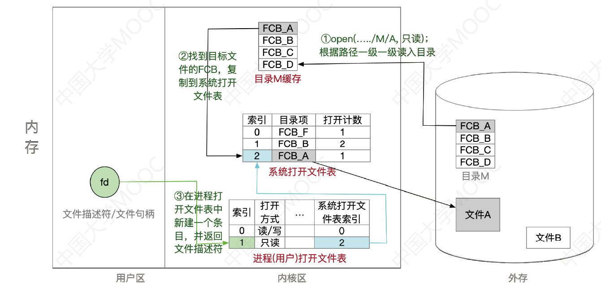

# 4.1 文件系统基础


问题一：一个文件有哪些属性？
* [文件的属性](#文件的属性)

问题二：**文件内部**的数据该如何组织起来？4
* [4.1.5 文件的逻辑结构](#4.1.5%20文件的逻辑结构)

问题三：**文件之间**又应该又应该怎么组织起来？
* 用户可以自己创建一层一层的目录，各层目录中存放相应的文件。系统中的各个文件就通过一层一层的目录合理有序的组织起来了
* 目录其实也是一种特殊的有结构文件（由记录组成），如何实现文件目录是之后会重点探讨的问题

问题四：从下往上看，操作系统应该提供哪些功能才能方便用户、应用程序使用文件？
* [4.1.3 文件的操作](#4.1.3%20文件的操作)

问题五：从上往下看，文件数据应该怎么存放在外存（磁盘）上？
* [4.1.6 文件的物理结构](#4.1.6%20文件的物理结构)
* 与内存一样，外存也是由一个个存储单元组成的，每个存储单元可以存储一定量的数据（如1B）。每个存储单元对应一个物理地址
* 类似于内存分为一个个“内存块”，外存会分为一个个“块/磁盘块/物理块”。每个磁盘块的大小是相等的，每块一般包含2的整数幂个地址（如本例中，一块包含$2^{10}$个地址，即1KB）。同样类似的是，文件的逻辑地址也可以分为（逻辑块号，块内地址），操作系统同样需要将逻辑地址转换为外存的物理地址（物理块号，块内地址）的形式。块内地址的位数取决于磁盘块的大小
* 操作系统以“块”为单位为文件分配存储空间，因此即使一个文件大小只有10B，但它依然需要占用1KB的磁盘块。外存中的数据读入内存时同样以块为单位

其他需要由操作系统实现的文件管理功能

* [文件共享](#4.2.5%20文件共享)：使多个用户可以共享使用一个文件
* [文件保护](#4.1.4%20文件的保护)：如何保证不同的用户对文件有不同的操作权限

## 4.1.1 文件的基本概念

## 4.1.2 文件控制块和索引结点

### 文件的属性
>计算机中存放了各种各样的文件，一个文件有哪些属性？

* **文件名**：由创建文件的用户决定文件名，主要是为了方便用户找到文件，同一目录下不允许有重名文件。
* **标识符**：一个系统内的各文件标识符唯一，对用户来说毫无可读性，因此标识符只是操作系统用于区分各个文件的一种内部名称。
* **类型**：指明文件的类型
* **位置**：文件存放的路径（让用户使用）、在外存中的地址（操作系统使用，对用户不可见）
* **大小**：指明文件大小
* **创建时间**、**上次修改时间**、**文件所有者信息**
* **保护信息**：对文件进行保护的访问控制信息

### 文件控制块


目录本身就是一种有结构文件，由一条条记录组成。每条记录对应一个在该放在该目录下的文件。如：

| 文件名      | 类型 | 存取权限 | ……   | 物理位置    |
| ----------- | ---- | -------- | ---- | ----------- |
| qianlong    | 目录 | 只读     | …    | 外存7号块   |
| QMDownLoad  | 目录 | 读/写    | …    | 外存18号块  |
| …           |      |          | …    |             |
| 照片        | 目录 | 读/写    | …    | 外存643号块 |
| …           |      |          | …    |             |
| 对账单4.txt | txt  | 只读     | …    | 外存324号块 |

目录文件中的一条记录就是一个“**文件控制块**”(FCB)，FCB的有序集合称为“**文件目录**”，一个FCB就是一个文件目录项。

FCB中包含了文件的基本信息（文件名、物理地址、逻辑结构、物理结构等），存取控制信息（是否可读/可写、禁止访问的用户名单等），使用信息（如文件的建立时间、修改时间等）。其中，<u>最重要最基本的还是文件名、文件存放的物理地址</u>。

FCB实现了文件名和文件之间的映射。使用户（用户程序）可以实现“按名存取”

### 索引结点

> FCB的改进

其实在查找各级目录的过程中只需要用到“文件名”这个信息，<u>只有文件名匹配时，才需要读出文件的其他信息。</u>因此可以考虑让目录表“瘦身”来提升效率。

除文件名外，将其他所有的信息放到**索引结点**中（<u>每一个文件都有唯一的索引结点</u>），则目录项只需要记录文件名和索引节点指针

当找到文件名对应的目录项时，才需要将索引结点调入内存，索引结点中记录了文件的各种信息，包括文件在外存中的存放位置，根据“存放位置”即可找到文件。

存放在外存中的索引结点称为“**磁盘索引结点**”，当索引结点放入内存后称为“**内存索引结点**”。相比之下内存索引结点中需要增加一些信息，比如：文件是否被修改、此时有几个进程正在访问该文件等。

## 4.1.3 文件的操作

> 从下往上看，OS应提供哪些功能，才能方便用户、应用程序使用文件？


### 创建文件：`create` 系统调用

进行Create系统调用时，需要提供的几个主要参数：

* 所需的外存空间大小（如：一个盘块，即1KB）
* 文件存放路径（“D:/Demo”）
* 文件名（这个地方默认为“新建文本文档.txt”）

操作系统在处理`Create`系统调用时，主要做了两件事：

* <u>在外存中找到文件所需的空间</u>（结合上小节学习的空闲链表法、位示图、成组链接法等[管理策略](#4.3.3%20外存空闲空间管理)，找到空闲空间）
* 根据文件存放路径的信息找到该目录对应的目录文件（此处就是`D:/Demo`目录），<u>在目录中创建该文件对应的目录项。</u>目录项中包含了文件名、文件在外存中的存放位置等信息。
### 删除文件：`delete` 系统调用

进行Delete系统调用时，需要提供的几个主要参数：

* 文件存放路径（“D:/Demo”）
* 文件名（“test.txt”）

操作系统在处理`Delete`系统调用时，主要做了几件事：

* 根据文件存放路径找到相应的目录文件，<u>从目录中找到文件名对应的目录项</u>。
* 根据该目录项记录的文件在外存的存放位置、文件大小等信息，<u>回收文件占用的磁盘块</u>。（回收磁盘块时，根据空闲表法、空闲链表法、位图法等[管理策略](#4.3.3%20外存空闲空间管理)的不同，需要做不同的处理）
* 从目录表中<u>删除文件对应的目录项</u>。

### 读文件：`read` 系统调用

> 可以“读文件”，<u>将文件数据读入内存，才能让CPU处理</u>（双击后，“记事本”应用程序通过操作系统提供的“读文件”功能，即`read`系统调用，将文件数据从外存读入内存，并显示在屏幕上）

进程使用`read`系统调用完成写操作。需要指明是哪个文件（<u>在支持“打开文件”操作的系统中，只需要提供文件在打开文件表中的索引号即可</u>），还需要指明要读入多少数据（如：读入1KB）、指明读入的数据要放在内存中的什么位置。

操作系统在处理read系统调用时，会<u>从读指针指向的外存中，将用户指定大小的数据读入用户指定的内存区域</u>中。

### 写文件：`write` 系统调用

> 可以“写文件”，将更改过的文件数据写回外存（我们在“记事本”应用程序中编辑文件内容，点击“保存”后，“记事本”应用程序通过操作系统提供的“写文件”功能，即`write`系统调用，将文件数据从内存写回外存）

进程使用`write`系统调用完成写操作，需要指明是哪个文件（在支持“打开文件”操作的系统中，只需要提供文件在打开文件表中的索引号即可），还需要指明要写出多少数据（如：写出1KB）、写回外存的数据放在内存中的什么位置

操作系统在处理`write`系统调用时，会从用户指定的内存区域中，将指定大小的数据写回写指针指向的外存。

### 打开文件：`open` 系统调用

在很多操作系统中，<u>在对文件进行操作之前，要求用户先使用open系统调用“打开文件”</u>，需要提供的几个主要参数：

* 文件存放路径（“D:/Demo”）
* 文件名（“test.txt”）
* 要对文件的操作类型（如：r只读；rw读写等）

操作系统在处理open系统调用时，主要做了几件事：

* 根据文件存放路径找到相应的目录文件，<u>从目录中找到文件名对应的的目录项</u>，并检查该用户是否有指定的操作权限。
* <u>将目录项复制到内存中的“**打开文件表**”中</u>。并将对应表目的编号（即：索引号、文件描述符）返回给用户。之后用户<u>使用打开文件表的编号来指明要操作的文件</u>。
	* 系统的打开文件表（整个系统只有一张）：包含了文件的相关信息，方便实现某些文件管理功能。 ^12e7f4
		* **打开计数器**：记录此时有多少个进程打开了此文件
	* 进程的打开文件表：存储的是进程对文件的使用信息 ^64b38a
		* **系统表索引号**：指向指向系统打开文件表中对应文件的表项
		* 读/写指针：记录了该进程对文件读/写操作进行到的位置
		* 访问权限


打开文件后，对文件的操作不再每次都需要查询目录，可以根据内存中的打开文件表进行操作

### 关闭文件：`close` 系统调用

进程使用完文件后，要“关闭文件”操作系统在处理 `close` 系统调用时，主要做了几件事：

* 将进程的打开文件表相应表项删除
* 回收分配给该文件的内存空间等资源
* 系统打开文件表的打开计数器`count`减1，若 `count==0`，则删除对应表项。

## 4.1.4 文件的保护


### 口令保护

<u>为文件设置一个“口令”</u>（如：abc112233），用户请求访问该文件时必须提供“口令”。

<u>口令一般存放在文件对应的FCB或索引结点中。</u>用户访问文件前需要先输入“口令”，操作系统会将用户提供的口令与FCB中存储的口令进行对比，如果正确，则允许该用户访问文件

优点：保存口令的空间开销不多，验证口令的时间开销也很小。

缺点：正确的“口令”存放在系统内部，不够安全。

### 加密保护

使用某个“密码”对文件进行加密，在访问文件时需要提供正确的“密码”才能对文件进行正确的解密。

如：最简单的加密算法——异或加密

优点：保密性强，不需要在系统中存储“密码”

缺点：编码/译码，或者说加密/解密要花费一定时间。

### 访问控制

在每个文件的FCB（或索引结点）中增加一个**访问控制列表**（Access-Control List, ACL），该<u>表中记录了各个用户可以对该文件执行哪些操作。</u>有的计算机可能会有很多个用户，因此访问控制列表可能会很大，可以用**精简的访问列表**解决这个问题

访问类型：读、写、执行、添加、删除、列表清单

精简的访问列表：<u>以“组”为单位，标记各“组”用户可以对文件执行哪些操作。</u>如：分为系统管理员、文件主、文件主的伙伴、其他用户几个分组。当某用户想要访问文件时，系统会检查该用户所属的分组是否有相应的访问权限。

优点：实现灵活，可以实现复杂的文件保护功能

## 4.1.5 文件的逻辑结构

>在用户看来，文件内部的数据应该是如何组织起来的


### 无结构文件

按文件是否有结构分类，可以分为无结构文件、有结构文件两种。

* **无结构文件**：文件内部的数据就是一系列二进制流或字符流组成。又称“**流式文件**”。如：Windows操作系统中的.txt文件。

文件内部的数据其实就是一系列字符流，没有明显的结构特性。因此也不用探讨无结构文件的“逻辑结构”问题。

### 有结构文件

* **有结构文件**：由一组相似的记录组成，又称“**记录式文件**”。每条记录又若干个数据项组成。如：数据库表文件。一般来说，每条记录有一个数据项可作为关键字（作为识别不同记录的ID）
* 根据各条记录的长度（占用的存储空间）是否相等，又可分为**定长记录**和**可变长记录**两种。

#### 顺序文件

顺序文件：文件中的记录一个接一个地顺序排列（逻辑上），记录可以是定长的或可变长的。各个记录在物理上可以顺序存储或链式存储。（类似顺序表和链表）

* 串结构：记录之间的顺序与关键字无关（通常按照记录存入时间决定记录的顺序）
* 顺序结构：记录之间的顺序按关键字顺序排列

假设：已经知道了文件的起始地址（也就是第一个记录存放的位置）

* **链式存储**：无论是定长/可变长记录，都无法实现随机存取，每次只能从第一个记录开始依次往后查找
* **顺序存储**
	* 可变长记录：无法实现随机存取，每次只能从第一个记录开始依次往后查找
	* 定长记录
		* 可实现随机存取。记录长度为 $L$ ，则第 $i$ 个记录存放的相对位置为$i\times L$
		* 若采用串结构，无法快速找到某关键字对应的记录
		* 若采用顺序结构，则可以根据关键字快速找到对应记录（如折半查找）

#### 索引文件

> 对于可变长记录文件，要找到第 $i$ 个记录，必须先顺序第查找前 $i-1$ 个记录，但是很多应用场景中又必须使用可变长记录。如何解决这个问题？

* 建立一张**索引表**以加快文件检索速度。每条记录对应一个**索引项**
* 文件中的这些记录在物理上可以离散地存放，但索引表的各个表项物理上需要连续存放


<u>索引表本身是定长记录的顺序文件。</u>因此可以快速找到第 $i$ 个记录对应的索引项。

可将关键字作为索引号内容，若按关键字顺序排列，则还可以支持按照关键字折半查找。

每当要增加/删除一个记录时，需要对索引表进行修改。由于索引文件有很快的检索速度，因此<u>主要用于对信息处理的及时性要求比较高的场合。</u>

另外，<u>可以用不同的数据项建立多个索引表。</u>如：学生信息表中，可用关键字“学号”建立一张索引表。也可用“姓名”建立一张索引表。这样就可以根据“姓名”快速地检索文件了。（Eg：SQL就支持根据某个数据项建立索引的功能）

#### 索引顺序文件

> 思考索引文件的缺点：每个记录对应一个索引表项，因此索引表可能会很大。比如：文件的每个记录平均只占8B，而每个索引表项占32个字节，那么索引表都要比文件内容本身大4倍，这样对存储空间的利用率就太低了。

索引顺序文件是索引文件和顺序文件思想的结合。索引顺序文件中，同样会为文件建立一张索引表，但不同的是：并不是每个记录对应一个索引表项，而是<u>一组记录对应一个索引表项。</u>（例如学生记录按照学生姓名的开头字母进行分组。每个分组就是一个顺序文件，分组内的记录不需要按关键字排序）


索引顺序文件<u>的索引项也不需要按关键字顺序排列，这样可以极大地方便新表项的插入</u>

为了进一步提高检索效率，可以为顺序文件建立**多级索引表**。例如，对于一个含$10^{6}$个记录的文件，可先为该文件建立一张低级索引表，每100个记录为一组，故低级索引表中共有10000个表项（即10000个定长记录），再把这10000个定长记录分组，每组100个，为其建立顶级索引表，故顶级索引表中共有100个表项。

## 4.1.6 文件的物理结构

> 在操作系统看来，文件的数据是如何存放在外存中的
>
> 操作系统需要对磁盘块进行哪些管理？
>
> * 对非空闲磁盘块的管理（存放了文件数据的磁盘块）——文件的物理结构/文件分配方式
> * 对空闲磁盘块的管理——[文件存储空间管理](#4.3.3%20外存空闲空间管理)


类似于内存分页，磁盘中的存储单元也会被分为一个个“**块/磁盘块/物理块**”。很多操作系统中，<u>磁盘块的大小与内存块、页面的大小相同</u>

内存与磁盘之间的数据交换（即读/写操作、磁盘I/O）都是以“块”为单位进行的。即每次读入一块，或每次写出一块

在内存管理中，进程的逻辑地址空间被分为一个一个页面同样的，在外存管理中，为了方便对文件数据的管理，<u>文件的逻辑地址空间也被分为了一个一个的文件“块”。</u>

文件的逻辑地址也可以表示为 **(逻辑块号,块内地址)** 的形式

用户通过逻辑地址来操作自己的文件，操作系统要负责实现<u>从逻辑地址到物理地址的映射</u>

### 连续分配

连续分配方式要求<u>每个文件在磁盘上占有一组连续的块</u>

(逻辑块号,块内地址)→(物理块号,块内地址)。<u>只需转换块号就行，块内地址保持不变</u>

<u>文件目录中记录存放的起始块号和长度</u>（总共占用几个块）

逻辑块号→物理块号

1. 用户给出要访问的逻辑块号，操作系统找到该文件对应的目录项（FCB）…
2. **物理块号=起始块号+逻辑块号**
3. 当然，还需要检查用户提供的逻辑块号是否合法（逻辑块号≥ 长度就不合法）

优点

* 连续分配支持顺序访问和直接访问（即随机访问）
* 读取某个磁盘块时，需要移动磁头。访问的两个磁盘块相隔越远，移动磁头所需时间就越长。因此，<u>连续分配的文件在顺序读/写时速度最快</u>

缺点

* 物理上采用连续分配的文件不方便拓展。
* 物理上采用连续分配，存储空间利用率低，会产生难以利用的磁盘碎片。（类似外部碎片）
* 可以用紧凑来处理碎片，但是需要耗费很大的时间代价。

### 链接分配

链接分配<u>采取离散分配的方式，可以为文件分配离散的磁盘块</u>。分为隐式链接和显式链接两种。

#### 隐式链接

> 考试题目中遇到未指明隐式/显式的“链接分配”，默认指的是隐式链接的链接分配

* <u>目录中记录了文件存放的起始块号和结束块号。</u>当然，也可以增加一个字段来表示文件的长度。下图中起始块号为9，结束块号为16
* 除了文件的最后一个磁盘块之外，每个磁盘块中都会<u>保存指向下一个盘块的指针</u>，这些指针对用户是透明的。文件组织关系如下所示：

```tikz
\begin{document}
	\begin{tikzpicture}[scale=2,line width=1.5pt]
	\tikzstyle{every node}=[font=\huge,draw=black,circle,very thick,minimum width=1.5cm, minimum height=1cm]
		\foreach \i in {0,1,2,3}{
			\foreach \j in {0,1,...,5}{  
				%\pgfmathsetmacro{\result}{\i+\j*4};%小数结果
				\pgfmathtruncatemacro{\result}{\i+(5-\j)*4};%整数结果
				\node[rectangle,fill=gray!20] at(\i*1.5,\j) (\result){\result};
			}
		}
		\draw[-latex] (9) -- (2);
		\draw[-latex] (2) -- (23);
		\draw[-latex] (23) -- (14);
		\draw[-latex] (14) -- (16);
	\end{tikzpicture}
\end{document}
```

逻辑块号→物理块号

1. 用户给出要访问的逻辑块号i，操作系统找到该文件对应的目录项(FCB)…
2. 从目录项中找到起始块号（即0号块），将0号逻辑块读入内存，由此知道1号逻辑块存放的物理块号，于是读入1号逻辑块，再找到2号逻辑块的存放位置……以此类推
3. 因此，读入i号逻辑块，总共需要 $i+1$ 次磁盘I/O。

优点

* 很方便文件拓展。
* 所有的空闲磁盘块都可以被利用，不会有碎片问题，外存利用率高。

缺点

* <u>只支持顺序访问，不支持随机访问，查找效率低</u>。
* 指向下一个盘块的指针也需要耗费少量的存储空间

#### 显式链接

把用于链接文件各物理块的指针显式地存放在一张表中，即**文件分配表**(FAT，File Allocation Table)。每个磁盘对应一张。FAT本质上就是[静态链表](第2章%20线性表#2.3.5%20静态链表)

<u>目录中只需要记录文件的起始块号</u>，文件分配表中记录了对应物理块号的下一块，结尾可以用-1标识，空闲可以用-2标识


<u>一个磁盘仅设置一张FAT。开机时，将FAT读入内存，并常驻内存</u>。FAT的各个表项在物理上连续存储，且每一个表项长度相同，因此<u>“物理块号”字段可以是隐含的。</u>

逻辑块号→物理块号

1. 用户给出要访问的逻辑块号i，操作系统找到该文件对应的目录项（FCB）
2. 从目录项中找到起始块号，若i>0，则查询内存中的文件分配表FAT，往后找到i号逻辑块对应的物理块号。逻辑块号转换成物理块号的过程不需要读磁盘操作。

优点

* <u>支持顺序访问，也支持随机访问</u>（想访问i号逻辑块时，并不需要依次访问之前的0 ~ i-1号逻辑块）
* 由于块号转换的过程不需要访问磁盘，因此相比于隐式链接来说，访问速度快很多。
* 不会产生外部碎片，也可以很方便地对文件进行拓展。

缺点

* 文件分配表的使用需要占用一定的存储空间

### 索引分配

> 链接分配中，不能支持有效直接访问（FAT除外）；FAT需要占用较大的内存空间。
>
> 事实上，在打开某个文件时，只需将该文件对应盘块的编号调入内存即可，完全没有必要将整个FAT调入内存

索引分配允许文件离散地分配在各个磁盘块中，<u>系统会为每个文件建立一张**索引表**</u>，索引表中记录了文件的各个逻辑块对应的物理块（索引表的功能类似于内存管理中的页表——建立逻辑页面到物理页之间的映射关系）。

索引表存放的磁盘块称为**索引块**。文件数据存放的磁盘块称为**数据块**。


<u>目录中需要记录文件的索引块是几号磁盘块</u>（多层/混合索引记录的是顶级索引块的块号）

可以用固定的长度表示物理块号（如：假设磁盘总容量为1TB=$2^{40}$ B，磁盘块大小为1KB，则共有$2^{30}$个磁盘块，则可用4B表示磁盘块号），因此，索引表中的“逻辑块号”可以是隐含的。

逻辑块号→物理块号

1. 用户给出要访问的逻辑块号i，操作系统找到该文件对应的目录项(FCB)…
2. 从目录项中可知该文件索引表的存放位置，将索引表从外存读入内存，并查找索引表即可知道i号逻辑块在外存中的存放位置。

优点：索引分配方式可以支持随机访问。文件拓展也很容易实现（只需要给文件分配一个空闲块，并增加一个索引表项即可）

缺点：索引表需要占用一定的存储空间

#### 如何支持大文件

如果文件大小过大，一个磁盘块装不下文件的整个索引表，该如何解决？

* **链接方案**：如果索引表太大，一个索引块装不下，那么可以将多个索引块用指针链接起来存放。
	* 缺点：若文件很大，索引表很长，就需要将很多个索引块链接起来。想要找到 $i$ 号索引块，必须先依次读入 $0\sim i-1$ 号索引块，这就导致磁盘I/O次数过多，查找效率低下。
* **多层索引**：建立多层索引（原理类似于多级页表）。<u>使第一层索引块指向第二层的索引块</u>。还可根据文件大小的要求再建立第三层、第四层索引块。（各层索引表大小仍然不能超过一个磁盘块）
	* 缺点：即使是小文件，访问一个数据块依然需要 $K+1$ 次读磁盘。
* **混合索引**：多种索引分配方式的结合。例如，一个文件的顶级索引表中，既包含直接地址索引（直接
  指向数据块），又包含一级间接索引（指向单层索引表）、还包含两级间接索引（指向两层索引表）。
	* 优点：对于小文件来说，访问一个数据块所需的读磁盘次数更少。

## 逻辑结构vs物理结构


C语言创建无结构文件

```c
FILE *fp = fopen("test.txt", "w");		//打开文件
if(fp == NULL){
	printf("打开文件失败");
	exit(0);
}

//写入10000个Hello world
for(int i=0; i<10000; i++)
	fputs("Hello world!", fp);
fclose(fp);						//关闭文件		
```

找到第16个字符

```tikz
\begin{document}
	\begin{tikzpicture}[scale=1,line width=1.5pt]
	\tikzstyle{every node}=[font=\huge,draw=black,circle,very thick,minimum width=1cm, minimum height=1cm]
		% 字符串
		\def\mystring{H,e,l,l,o, ,w,o,r,l,d,!} 
		% 循环遍历字符串并创建节点 
		\foreach \i in{0,1}{
			\foreach \char [count=\j] in \mystring {
				\node[rectangle] at (\i*12+\j-1,0) {\char};
			}
		}
		\draw [-latex](16,-2) -- (16,-0.5);
	\end{tikzpicture}
\end{document}
```

```c
FILE *fp = fopen("test.txt", "w");		//打开文件
if(fp == NULL){
	printf("打开文件失败");
	exit(0);
}
fseek(fp, 16, SEEK_SET);		//读写指针指向16		//指明了逻辑地址
char c = fgetc(fp);				//从读写指针所指位置读出1个字符
printf("字符：%c", c);			//打印从文件读出的字符
fclose (fp);					//关闭文件
```

`fgetc`底层使用了Read系统调用，操作系统将（逻辑块号，块内偏移量）转换为（物理块号，块内偏移量）

---
C语言创建顺序文件

```c
typedef struct{
	int number;		//学号4B
	char name[30];	//姓名30B
	char major[30];	//专业30B
}Student_info;

//以“写”的方式打开文件
FILE *fp = fopen("students.info", "w");
if(fp == NULL){
	printf("打开文件失败！");
	exit(0);
}
Student_info student[N];	//用数组保存N个学生信息
for(int i=0; i<N; i++){
	student[i].number = i;
	student[i].name[0]='?';
	student[i].major[0]='?';
}

//将N个学生的信息写入文件
fwirte(student, sizeof(Student_info), N, fp);
fclose(fp);
```

```c
//以“读”的方式打开文件
FILE *fp = fopen("students.info", "r");
if(fp == NULL){
	printf("打开文件失败！");
	exit(0);
}
//文件读写指针指向编号为5的学生记录
fseek(fp, 5*sizeof(Student_info), SEEK_SET);		//用逻辑地址访问文件
Student_info stu;
//从文件读出1条记录，记录大小为sizeof(Student_info)
fread(&stu, sizeof(Student_info), 1, fp);
printf("学生编号：%d\n", stu.number);
fclose(fp);
```

---
C语言创建链式文件
```c
typedef struct{
	char name[30];	//姓名
	char major[30];	//专业
	//其他学生信息
	int nest;		//下一个学生记录的存放位置
} Student_info
```
* 文件内部各条记录链式存储：由创建文件的用户自己设计的
* 文件整体用链接分配：由操作系统决定

---
C语言创建索引文件
```c
typedef struct{
	int number;	//学号
	int addr;	//学生记录的地址
} IndexTable;

typedef struct{
	char name[30];	//姓名
	char major[30];	//专业
	//其他学生信息
} Student_info
```

索引表对比
* 索引文件的索引表：用户自己建立的，映射：关键字→记录存放的逻辑地址
* 索引分配的索引表：操作系统建立的，映射：逻辑块号→物理块号

## 4.1.8 本节习题精选

**选择题**：[题目](王道操作系统.pdf#page=253&selection=129,0,134,1)、[答案](王道操作系统.pdf#page=259&selection=128,0,133,1)

**综合题**：[题目](王道操作系统.pdf#page=256&selection=480,0,485,2)、[答案](王道操作系统.pdf#page=262&selection=786,0,791,2)

# 4.2 目录


## 4.2.1 目录的基本概念

## 4.2.2 目录结构

### 单级目录结构

早期操作系统并不支持多级目录，整个系统中只建立一张目录表，每个文件占一个目录项。

单级目录实现了“按名存取”，但是<u>不允许文件重名</u>。

在创建一个文件时，需要先检查目录表中有没有重名文件，确定不重名后才能允许建立文件，并将新文件
对应的目录项插入目录表中。

显然，单级目录结构不适用于多用户操作系统。

### 两级目录结构

早期的多用户操作系统，采用两级目录结构。分为**主文件目录**（MFD，Master File Directory）和**用户文件目录**（UFD，User Flie Directory）。

* 主文件目录记录用户名及相应用户文件目录的存放位置
* 用户文件目录由该用户的文件FCB组成

两级目录结构允许不同用户的文件重名，也可以在目录上实现实现访问限制（检查此时登录的用户名是否匹配）。但是两级目录结构依然缺乏灵活性，用户不能对自己的文件进行分类

### 多级目录结构

又称树形目录结构

用户（或用户进程）<u>要访问某个文件时要用文件路径名标识文件，文件路径名是个字符串</u>。各级目录之间用“/”隔开。从根目录出发的路径称为**绝对路径**。

例如：自拍.jpg的绝对路径是 `/照片/2015-08/自拍.jpg` 
系统根据绝对路径一层一层地找到下一级目录。刚开始从外存读入根目录的目录表；找到“照片”目录的存放位置后，从外存读入对应的目录表；再找到“2015-08”目录的存放位置，再从外存读入对应目录表；最后才找到文件“自拍.jpg”的存放位置。<u>整个过程需要3次读磁盘I/O操作。</u>

很多时候，用户会连续访问同一目录内的多个文件（比如：接连查看“2015-08”目录内的多个照片文件），显然，每次都从根目录开始查找，是很低效的。因此可以设置一个“**当前目录**”。

例如，此时已经打开了“照片”的目录文件，也就是说，这张目录表已调入内存，那么可以把它设置为“当前目录”。当用户想要访问某个文件时，可以使用从当前目录出发的“相对路径”。

在Linux中，“.”表示当前目录，因此如果“照片”是当前目录，则”自拍.jpg”的相对路径为：“./2015-08/自拍.jpg”。从当前路径出发，只需要查询内存中的“照片”目录表，即可知道”2015-08”目录表的存放位置，从外存调入该目录，即可知道“自拍.jpg”存放的位置了。

可见，引入“当前目录”和“相对路径”后，磁盘I/O的次数减少了。这就提升了访问文件的效率。

补充：每个目录文件中默认包含两个目录项，分别是“.“和”..“，分别表示当前目录和上一级目录，根目录的上一级目录指向自身。

### 无环图目录结构

> 树形目录结构可以很方便地对文件进行分类，层次结构清晰，也能够更有效地进行文件的管理和保护。但是，树形结构不便于实现文件的共享。为此，提出了“无环图目录结构”。

在树形目录结构的基础上，增加一些指向同一节点的有向边，使整个目录成为一个**有向无环图**。可以更方便地实现多个用户间的文件共享。

<u>可以用不同的文件名指向同一个文件，甚至可以指向同一个目录</u>（共享同一目录下的所有内容）。

需要为每个共享结点设置一个**共享计数器**，用于记录此时有多少个地方在共享该结点。用户提出删除结点的请求时，只是删除该用户的FCB、并使共享计数器减1，并不会直接删除共享结点。<u>只有共享计数器减为0时，才删除结点。</u>

注意：共享文件不同于复制文件。在共享文件中，由于各用户指向的是同一个文件，因此<u>只要其中一个用户修改了文件数据，那么所有用户都可以看到文件数据的变化</u>。

## 4.2.3 目录的操作

* 搜索：当用户要使用一个文件时，系统要根据文件名搜索目录，找到该文件对应的目录项
* 创建文件：创建一个新文件时，需要在其所属的目录中增加一个目录项
* 删除文件：当删除一个文件时，需要在目录中删除相应的目录项
* 显示目录：用户可以请求显示目录的内容，如显示该目录中的所有文件及相应属性
* 修改目录：某些文件属性保存在目录中，因此这些属性变化时需要修改相应的目录项（如：文件重命名）

## 4.2.4 目录实现

### 线性列表


### 哈希表


## 4.2.5 文件共享


共享vs复制
* 多个用户共享同一个文件，意味着<u>系统中只有“一份”文件数据</u>。并且只要某个用户修改了该文件的数据，其他用户也可以看到文件数据的变化。
* 多个用户都“复制”了同一个文件，那么系统中会有“好几份”文件数据。其中一个用户修改了自己的那份文件数据，对其他用户的文件数据并没有影响。

### 基于索引结点的共享方式（硬链接）

> 如果有其他用户同时访问该文件，文件主即便不需要该文件，也无法直接删除
> 目录项→索引结点→文件
> 建立硬链接时，统一 `count++`

[索引结点](#索引结点)中设置一个链接计数变量 `count` 用于表示链接到本索引结点上的用户目录数量

删除文件

* 若某个用户决定“删除”该文件，则只是要把用户目录中与该文件对应的目录项删除，且索引结点的count值减1。
* 若`count > 0`，说明还有别的用户要使用该文件，暂时不能把文件数据删除，否则会导致指针悬空。
* 当`count == 0` 时系统负责删除文件。

### 基于符号链的共享方式（软链接）

> 只有文件主才拥有指向索引结点的指针，共享该文件的其他用户只有该文件的路径名。
> 目录项→索引结点→Link文件→文件
> 当文件主把一个共享文件删除后，若其他用户试图通过符号链访问该文件时，会访问失败
>
> 建立符号链接时，count 直接复制

创建一个新的**Link类型的文件**，记录了文件1的存放路径“C:/User1/aaa”。类似于Windows操作系统的“快捷方式”。操作系统会根据路径一层层查找目录，最终找到共享文件（补充：共享一个内存索引结点）

即使软链接指向的共享文件已被删除，Link型文件仍然会存在，只是通过Link型文件中的路径取查找共享文件会失败（找不到对应目录项）

由于用软链接的方式访问共享文件时要查询多级目录，会有多次磁盘I/O，因此用软链接访问共享文件的速度要比硬链接更慢

## 4.2.7 本节习题精选

**选择题**：[题目](王道操作系统.pdf#page=271&selection=594,0,599,1)、[答案](王道操作系统.pdf#page=275&selection=17,0,22,0)

**综合题**：[题目](王道操作系统.pdf#page=272&selection=588,0,593,2)、[答案](王道操作系统.pdf#page=276&selection=328,0,333,2)

# 4.3 文件系统

## 4.3.1 文件系统结构


用一个例子来辅助记忆文件系统的层次结构：假设某用户请求删除文件“D:/工作目录/学生信息.xlsx”的最后100条记录。

1. 用户需要通过操作系统提供的接口发出上述请求——**用户接口**
2. 由于用户提供的是文件的存放路径，因此需要操作系统一层一层地查找目录，找到对应的目录
   项——**文件目录系统**
3. 不同的用户对文件有不同的操作权限，因此为了保证安全，需要检查用户是否有访问权限——**存取控制模块**（存取控制验证层）
4. 验证了用户的访问权限之后，需要把用户提供的“记录号”转变为对应的逻辑地址——**逻辑文件系统与文件信息缓冲区**
5. 知道了目标记录对应的逻辑地址后，还需要转换成实际的物理地址——**物理文件系统**
6. 要删除这条记录，必定要对磁盘设备发出请求——**设备管理程序模块**
7. 删除这些记录后，会有一些盘块空闲，因此要将这些空闲盘块回收——**辅助分配模块**

## 4.3.2 文件系统布局


### 文件系统在磁盘中的结构

[磁盘初始化](第5章%20输入输出管理#磁盘初始化)
* **物理格式化**，即低级格式化——划分扇区，检测坏扇区，并用备用扇区替换坏扇区（坏扇区对操作系统透明）
* **逻辑格式化**后，磁盘分区（分卷Volume），完成各分区的文件系统初始化
  注：逻辑格式化后，灰色部分就有实际数据了，白色部分还没有数据


[操作系统引导](第1章%20计算机系统概述#1.5%20操作系统引导)、[引导块](第5章%20输入输出管理#引导块)

* **主引导记录**(Master Boot Record, MBR)，位于磁盘的0号扇区，用来引导计算机。包含：磁盘引导程序和分区表，该表给出每个分区的起始和结束地址
* 表中的一个分区被标记为**活动分区**，当计算机启动时，BIOS读入并执行MBR。MBR做的第一件事就是确定活动分区，读入它的第一块，即引导块。
* [**引导块**](第5章%20输入输出管理#引导块)(boot block)，MBR执行引导块中的程序后，该程序负责启动该分区中的操作系统
* [**超级块**](#成组链接法)(super block)，包含文件系统的所有关键信息，在计算机启动时，或者该文件系统首次使用时，超级块会被载入内存。超级块中点典型信息包括分区的块的数量、块的大小、<u>空闲块的数量和指针、空闲块的FCB数量和FCB指针</u>
* 文件系统中空闲块的信息，可以用[**位示图**](#位示图法)或**指针链接**的形式给出，后面也许跟的是一组i结点，每个文件对应一个结点，**i结点**（iNode结点，即[索引结点](#索引结点)）说明了文件的方方面面。接着可能是**根目录**，它存放文件系统目录树的根部。最后磁盘的其他部分存放了其他所有的目录和文件

### 文件系统在内存中的结构

* 用户区
* 内核区
	* **目录的缓存**：近期访问过的目录文件会缓存在内存中，不用每次都从磁盘读入，这样可以加快目录检索速度
	* [**系统打开文件表**](第4章%20文件管理系统.md#^12e7f4)：包含每个打开文件的FCB副本及其他信息
	* [**进程打开文件表**](第4章%20文件管理系统.md#^64b38a)：包含一个指向整个系统的打开文件表中适当条目的指针，以及其他信息



## 4.3.3 外存空闲空间管理

> 学习时注意从以下三个方面理解：
>
> 1. 用什么方式记录、组织空闲块？
> 2. 如何分配磁盘块？
> 3. 如何回收磁盘块？
> 


### 基本概念

* 存储空间的划分：将物理磁盘划分为一个个文件卷（逻辑卷、逻辑盘）
* 存储空间的初始化：将各个文件卷划分为目录区、文件区
	* 目录区主要存放文件目录信息(FCB)、用于磁盘存储空间管理的信息
	* 文件区用于存放文件数据
* 有的系统支持超大型文件，可支持多个物理磁盘组成一个文件卷

### 空闲表法
```tikz
\begin{document}
	\begin{tikzpicture}[scale=2,line width=1.5pt]
	\tikzstyle{every node}=[font=\huge,draw=black,very thick,rectangle,minimum width=1.5cm, minimum height=1cm]
		\node[fill=gray!20] at(0,5) {0};\node[fill=gray!20] at(1,5) {1};\node[fill=green!20] at(2,5) {2};\node[fill=green!20] at(3,5) {3};
		\node[fill=green!20] at(0,4) {4};\node[fill=green!20] at(1,4) {5};\node[fill=gray!20] at(2,4) {6};\node[fill=gray!20] at(3,4) {7};
		\node[fill=gray!20] at(0,3) {8};\node[fill=green!20] at(1,3) {9};\node[fill=green!20] at(2,3) {10};\node[fill=green!20] at(3,3) {11};
		\node[fill=gray!20] at(0,2) {12};\node[fill=gray!20] at(1,2) {13};\node[fill=gray!20] at(2,2) {14};\node[fill=green!20] at(3,2) {15};
		\node[fill=green!20] at(0,1) {16};\node[fill=green!20] at(1,1) {17};\node[fill=green!20] at(2,1) {18};\node[fill=green!20] at(3,1) {19};
		\node[fill=gray!20] at(0,0) {20};\node[fill=gray!20] at(1,0) {21};\node[fill=gray!20] at(2,0) {22};\node[fill=gray!20] at(3,0) {23};
	\end{tikzpicture}
\end{document}
```
图中绿色为空闲块，对应的空闲盘块表如下：

| 序号 | 第一个空闲盘号 | 空闲盘块数 |
| :--: | :------------: | :--------: |
|  1   |       2        |     4      |
|  2   |       9        |     3      |
|  3   |       15       |     5      |
|  4   |       —        |     —      |

* **如何分配磁盘块？** 与内存管理中的[动态分区分配](第3章%20内存管理#动态分区分配)很类似，为一个文件<u>分配连续的存储空间</u>。同样可采用[首次适应、最佳适应、最坏适应等算法](第3章%20内存管理#动态分区分配算法)来决定为文件分配哪个区间
* **如何回收磁盘块？** 与内存管理中的[动态分区分配](第3章%20内存管理#动态分区分配)很类似，当回收某个存储区时需要由四种情况。总之回收时需要注意表项的合并问题
	* 回收区的前后都没有相邻空闲区；
	* 回收区的前后都是空闲区；
	* 回收区前面是空闲区；
	* 回收区后面是空闲区。

### 空闲链表法

#### 空闲盘块链

以盘块为单位组成一条空闲链，操作系统保存着链头、链尾指针

空闲盘块中记录了下一个盘块的指针

* **如何分配？** 若某文件申请 $K$ 个盘块，则从链头开始依次摘下 $K$ 个盘块分配，并修改空闲链的链头指针
* **如何回收？** 回收的盘块依次挂到链尾，并修改空闲链的链尾指针

适用于离散分配的物理结构。为文件分配多个盘块时可能要重复多次操作

#### 空闲盘区链

以盘区（连续的空闲盘块）为单位组成一条空闲链，操作系统保存着链头、链尾指针

空闲盘区中的第一个盘块内记录了下一个盘区的指针

* **如何分配？** 若某文件申请K个盘块，则可以采用[首次适应、最佳适应等算法](第3章%20内存管理#动态分区分配算法)，从链头开始检索，按照算法规则找到一个大小符合要求的连续空闲块，也可以将不同盘区的盘块同时分配给一个文件。注意分配后可能要修改相应的链指针、盘区大小等数据
* **如何回收？** 类似[空闲表法](#空闲表法)，若回收区和某个空闲盘相邻，则需要将回收区合并到空闲盘区中。若回收区没有和任何空闲区相邻，则将回收区作为单独的一个空闲盘区挂到链尾

离散分配、连续分配都适用。为一个文件分配多个盘块时效率更高

### 位示图法
> 位示图更多的是判断某一特定块是否空闲^[文件系统的布局[03:04](file://Z:/考研/计算机/03.操作系统/04.第四章%20文件管理/12.4.3_2_文件系统布局.mp4#t=184)]

每一个二进制位对应一个盘块，磁盘上所有的盘块都有一个二进制位与之对应。<u>当其值为0是表示盘块空闲，为1时表示盘块已分配。</u>

位示图一般用连续的“字”来表示，如本例中一个字的字长为16位，字中的每一位对应一个盘块，因此可以用 `(字号,位号)` 对应一个盘块位。有些题目中也描述为`(行号,列号)`

```tikz
\begin{document}
	\begin{tikzpicture}[scale=2, line width=1.5pt,
	every node/.style={draw=black, rectangle, very thick, font =\huge, minimum width=3em, minimum height=3em}, 
	]
		\foreach \flag [count=\cnt] in {0,1,0,1,1,1,1,1,1,1,1,1,0,0,0,0}{
			\pgfmathtruncatemacro{\idx}{\cnt-1};
			\ifnum\flag=0
				\node[rectangle,fill=green!20] at(\cnt,0) {\idx};
			\else
				\node[rectangle,fill=gray!20] at(\cnt,0) {\idx};
			\fi
		}

		\foreach \flag [count=\cnt] in {1,1,1,0,0,0,1,1,0,0,0,0,0,0,1,0}{
			\pgfmathtruncatemacro{\idx}{\cnt+15};
			\ifnum\flag=0
				\node[rectangle,fill=green!20] at(\cnt,-1) {\idx};
			\else
				\node[rectangle,fill=gray!20] at(\cnt,-1) {\idx};
			\fi
		}

		\node[rectangle,fill=green!20] at(1,-2) {32};
		\node[rectangle,fill=green!20] at(2,-2) {33};
		\node[draw=none] at(3,-2) {$\cdots$};
	\end{tikzpicture}
\end{document}
```


|       |  0   |  1   |  2   |  3   |  4   |  5   |  6   |  7   |  8   |  9   |  10  |  11  |  12  |  13  |  14  |  15  |
| :---: | :--: | :--: | :--: | :--: | :--: | :--: | :--: | :--: | :--: | :--: | :--: | :--: | :--: | :--: | :--: | :--: |
| **0** |  0   |  1   |  0   |  1   |  1   |  1   |  1   |  1   |  1   |  1   |  1   |  1   |  0   |  0   |  0   |  0   |
| **1** |  1   |  1   |  1   |  0   |  0   |  0   |  1   |  1   |  0   |  0   |  0   |  0   |  0   |  0   |  1   |  0   |
| **2** |  1   |  1   |  ·   |  ·   |  ·   |      |      |      |      |      |      |      |      |      |      |      |

要注意盘块号从0开始还是从1开始

**如何分配？** 若文件需要 $k$ 个块：

1. 顺序扫描位示图，找到 $k$ 个相邻或不相邻的“0”
2. 根据字号、位号算出对应的盘块号，将相应盘块分配给文件，并将相应位设置为“1”

**如何回收？** 根据回收的盘块号计算出对应的字号、位号，将相应二进制位设置为“0”

离散分配、连续分配都适用。


### 成组链接法

> 空闲表法、空闲链法不适用于大型文件系统，因为空闲表或空闲链表可能很大
> Unix系统中采用了成组链接法对磁盘空闲块进行管理
> 类似[混合索引](#如何支持大文件)
> 超级块更多的是迅速找到若干空闲的盘块^[文件系统的布局[03:11](file://Z:/考研/计算机/03.操作系统/04.第四章%20文件管理/12.4.3_2_文件系统布局.mp4#t=191)]

<u>文件卷的目录区中专门用一个磁盘块作为“**超级块**”</u>，当系统启动时需要将超级块读入内存。并且要保证内存与外存中的“超级块”数据一致

超级块中记录了**下一级空闲盘块数**和**空闲盘块号**（超级块充当链头的作用，保存指向下一个分组的信息）

把顺序的 $n$ 个空闲盘块号保存在第一个成组链块中，其中最后一个空闲盘块（作为成组链块）用于保存另一组空闲盘块号，如此继续，直到所有空闲盘块都予以链接

* 若已经没有下一级空闲块，就将空闲盘块号设为某个特殊值（如 $-1$ ）
* 一个分组中的块号不需要连续


* **如何分配？** 检查第一个分组的块数是否足够，如果够的话，就分配第一个分组中的1个空闲块，然后指针指向下一格；若指针指向的是最后一个盘块，则将该盘块读入内存，并将指针指向新的成组链块的第一条记录，然后执行上述分配操作。

* **如何回收？** 成组链块的指针上移一个，再记入回收盘块号；当成组链块的链接数达到 $n$ 时，表示已满，便将现有已记录的 $n$ 个空闲盘块号的成组链块号记入新回收的盘块（作为新的成组链块）。

## 4.3.4 虚拟文件系统


普通文件系统中可能存在着各种不同的文件系统，其函数格式不同

**虚拟文件系统(VFS)的特点**：

* 向上层用户进程提供统一标准的系统调用接口，屏蔽底层具体文件系统的实现差异
* 要求下层的文件系统必须实现某些规定的函数功能，如：open/read/write。一个新的文件系统想要在某操作系统上被使用，就必须满足该操作系统VFS的要求
* 每打开一个文件，VFS就在主存中新建一个**vnode**，用统一的数据结构表示文件，无论该文件存储在哪个文件系统。（不同的文件系统，表示文件数据结构各不相同。打开文件后，其在内存中的表示就不同）
	* 注意：vnode只存在于主存中，而inode既会被调入主存，也会在外存中存储
	* 注意：vnode的函数功能指针指向具体文件系统的函数功能。


**为了实现虚拟文件系统，Linux主要抽象了四种对象类型**：

* 超级块对象：表示一个已安装（或称挂载）的特定文件系统
* 索引结点对象：表示一个特定的文件
* 目录项对象：表示一个特定的目录项
* 文件对象：表示一个与进程相关的已打开文件

## 4.3.5 分区和安装

文件系统挂载（mounting），即文件系统安装/装载——如何将一个文件系统挂载到操作系统中？

文件系统挂载要做的事：

1. 在VFS中注册新挂载的文件系统。**内存中的挂载表**(mount table)包含每个文件系统的相关信息，包括文件系统类型、容量大小等。
2. 新挂载的文件系统，要向VFS提供一个**函数地址列表**
3. 将新文件系统加到**挂载点**(mountpoint)，也就是将新文件系统挂载在某个父目录下
## 4.3.7 本节习题精选
**选择题**：[题目](王道操作系统.pdf#page=286&selection=141,0,146,1)、[答案](王道操作系统.pdf#page=287&selection=179,0,184,1)

**综合题**：[题目](王道操作系统.pdf#page=286&selection=641,0,645,2)、[答案](王道操作系统.pdf#page=288&selection=67,0,73,0)