# 3.1 数据链路层的功能

## 数据链路层的基本概念

* **结点**：主机、路由器
* **链路**：网络中两个结点之间的<u>物理通道</u>，链路的传输介质主要有双绞线、光纤和微波。分为有线链路、无线链路。
* **数据链路**：网络中两个结点之间的<u>逻辑通道</u>，把实现控制数据传输协议的硬件和软件加到链路上就构成数据链路。
* **帧**：链路层的协议数据单元，封装网络层数据报。

数据链路层负责通过一条链路从一个结点向另一个物理链路直接相连的相邻结点传送数据报

## 数据链路层的功能概述

数据链路层在物理层提供服务的基础上向网络层提供服务，其最基本的服务是将源自网络层来的数据可靠地传输到相邻节点的目标机网络层。其主要作用是<u>加强物理层传输原始比特流的功能</u>，将物理层提供的可能出错的物理连接<u>改造成为逻辑上无差错的数据链路</u>，使之对网络层表现为一条无差错的链路。

* 为网络层提供服务。
	* **无确认无连接服务**：无需事先建立连接，接收方不对发送方发来的数据进行确认（适用于通信质量好，有线传输链路）
	* **有确认无连接服务**：无需事先建立连接，但接收方对发送方发来的每一帧都会进行确认，如果发送方在规定时间内没有收到接收方发来的确认，就要重发对应的帧。（适用于错误率较高的信道）
	* **有确认面向连接服务**：需要事先建立连接，发送方发送的每一帧都进行编号，数据链路层保证对发送方所发送的每一帧接收方都准确无误地收到。（有连接一定有确认！）（适用于对通信可靠性要求较高的场景）
* 链路管理。连接的建立、维持、释放（用于面向连接的服务）
* 封装成帧。在一段数据的前后分别添加首部和尾部，以此构成一个帧。
* [透明传输](#3.2%20组装成帧和透明传输)。无论是何种比特组合的数据，都能按照原样没有差错地通过数据链路层
* [流量控制](#3.4%20流量控制和可靠传输机制)。让发送方根据接收方的能力动态调整数据发送的速率
* 差错控制。保证数据传输的可靠性
	* 位错：比特位出错，1变成0，0变成1。——[3.3 差错控制](#3.3%20差错控制)
	* 帧错，以发送帧\[\#1\]-\[\#2\]-\[\#3\]为例——[3.4 流量控制和可靠传输机制](#3.4%20流量控制和可靠传输机制)
		* 帧丢失：收到 \[\#1\]-\[\#3\]
		* 帧重复：收到 \[\#1\]-\[\#2\]-\[\#2\]-\[\#3\]
		* 帧失序：收到 \[\#1\]-\[\#3\]-\[\#2\]

---
数据链路层向上层提供的服务类型
* 不可靠传输服务：仅仅丢弃有误码的帧，其他什么也不做
* 可靠传输服务：想办法实现发送端发送什么，接收端接收什么
* 一般情况下，有线链路的误码率比较低，为了减小开销，并不要求数据链路层向上层提供可靠传输服务。出现了误码时，可靠传输的问题由上层处理
* 无线链路易受到干扰，因此要求数据链路层必须向上层提供可靠传输服务

## 3.1.6 本节习题精选

**选择题**：[题目](4%20计算机网络/王道计算机网络.pdf#page=77&selection=795,0,798,1)、[答案](4%20计算机网络/王道计算机网络.pdf#page=78&selection=347,0,350,1)

# 3.2 组装成帧和透明传输

**封装成帧**：封装成帧就是<u>在一段数据的前后部分添加首部和尾部</u>，这样就构成了一个帧。接收端在收到物理层上交的比特流后，就能根据首部和尾部的标记，从收到的比特流中识别帧的开始和结束。

首部和尾部包含许多的控制信息，他们的一个重要作用：**帧定界**（确定帧的界限）。

**帧同步**：接收方应当能从接收到的二进制比特流中区分出帧的起始和终止。

**组帧的四种方法**
* [字符计数法](#3.2.1%20字符计数法)
* [字符（节）填充法](#3.2.2%20字符填充法)
* [零比特填充法](#3.2.3%20零比特填充法)
* [违规编码法](#3.2.4%20违规编码法)

由于字符计数法中 `Count` 字段的脆弱性（其值若有差错将导致灾难性后果）及字符填充实现上的复杂性和不兼容性，<u>目前普遍使用的帧同步法是比特填充和违规编码法</u>

**透明传输**：透明传输是指不管所传数据是什么样的比特组合，都应当能够在链路上传送。因此，链路层就“看不见”有什么妨碍数据传输的东西。

当所传数据中的比特组合恰巧与某一个控制信息完全一样时，就必须采取适当的措施，使收方不会将这样的数据误认为是某种控制信息。这样才能保证数据链路层的传输是透明的。

## 3.2.1 字符计数法

* **实现思路**：以字节为单位，在每一帧的第一个字节中记录该帧所包含的帧数（包括计数字节本身）。接收方只需读取帧中的第一个字节就可以知道该帧的长度，同时确定该帧的结束位置和下一帧的开始位置。
* 缺点：当计数字段出现错误时，接收方将错误地划分该帧，继而错误读取下一帧的开始位置。一开始的错误会导致连锁反应，其后所有帧的读取都将发生错误。

## 3.2.2 字符填充法

* **组帧实现思路**：以字节为单位，使用特定的字符表示帧的开始和结束。接收方通过这些字符来识别帧的首尾。
	* 如果数据部分是由**可打印的ASCII码**组成，则帧定界符可以使用不可打印的控制字符SOH(Start of Header)和EOT(End of Transmission)，这样数据部分不会出现和控制字符相同的比特序列，从而实现透明传输。
	* 如果数据部分是由**非ASCII码**组成的(如图像、视频等数据)，并且同样使用SOH和EOT作为定界符，那么数据部分某个字节的比特序列可能与定界符相同，将导致接收方错误地判断帧的边界

* **透明传输实现思路**：发送方发送数据前扫描待发送的数据部分，在每一个与`SOH`、`EOT`或`ESC`相同的字节之前添加转义字符`ESC`。接收方收到数据后，数据部分遇到`ESC SOH`、`ESC EOT`、`ESC ESC`时删去前面的转义字符`ESC`，从而还原出原始数据。

## 3.2.3 零比特填充法

* **组帧实现思路**：以比特为单位，使用特定的比特序列`01111110`表示一帧的开始和结束。接收方收到数据后根据序列`01111110`确定帧的边界。
* **透明传输实现思路**：发送方发送数据前扫描待发送的数据部分，如果出现五个连续的1就在后面添加一个0。接收方收到数据后，数据部分每接收到五个连续的1就将后面的一个0删除，从而还原出原始数据。

## 3.2.4 违规编码法

曼切斯特编码中，可以用“**高一高**”，“**低一低**”来定界帧的起始和终止。

## 3.2.5 本节习题精选

**综合题**：[题目](4%20计算机网络/王道计算机网络.pdf#page=80&selection=729,0,732,2)、[答案](4%20计算机网络/王道计算机网络.pdf#page=81&selection=123,0,126,2)

# 3.3 差错控制

**差错来源**：概括来说，传输中的差错都是由于噪声引起的。
* **全局性噪声**：（随机噪声）<u>由于线路本身电气特性所产生的随机噪声（热噪声）</u>，是信道固有的，随机存在的。造成随机差错
	* 解决办法：提高信噪比来减少或避免干扰。（对传感器下手）
* **局部性噪声**：（冲击噪声）<u>外界特定的短暂原因所造成的冲击噪声</u>，是产生<u>差错的主要原因</u>。
	* 解决办法：通常利用编码技术来解决。

**差错控制类型**（比特错）
  * 检错编码：可以用于判断当前数据是否发生错误
	* [奇偶校验码](#奇偶校验码)
	* [循环冗余码](#CRC循环冗余码)
  * 纠错编码：不仅可以判断当前数据是否发生错误，还能确定错误发生的位置
	* [海明码](#海明码)

**编码 VS 编码**：数据链路层编码和物理层的数据编码与调制不同。<u>物理层编码针对的是单个比特</u>，解决传输过程中比特的同步等问题，如曼彻斯特编码。而<u>数据链路层的编码针对的是一组比特</u>，它通过冗余码的技术实现一组二进制比特串在传输过程是否出现了差错。

**冗余编码**：在数据发送之前，先按某种关系附加上一定的冗余位，构成一个符合某一规则的码字后再发送。 当要发送的有效数据变化时，相应的冗余位也随之变化，使码字遵从不变的规则。接收端根据收到码字是否仍符合原规则，从而判断是否出错。

## 3.3.1 检错编码

### 奇偶校验码
> 可联系计算机组成原理相关内容，详见：[2.2.0 奇偶校验码](第2章%20数据的表示和运算#2.2.0%20奇偶校验码)

奇偶校验码： $n-1$ 位信息元、 $1$ 位校验元
* 奇校验码：“1”的个数为奇数
* 偶校验码：“1”的个数为偶数
特点：只能检查出奇数比特错误，且不能确定出错的具体位置和个数

### CRC循环冗余码

* **实现思路**：在一个待发送的 $n$ 位二进制数据序列之后附加一个 $r$ 位的校验码再进行发送，共发送 $n+r$ 位数据
* **帧检验序列**：给定一个 $n$ bit的帧或报文，发送器生成一个 $r$ bit的序列，称为帧检验序列(FCS)。发送方和接收方事先商定 $r+1$ 位的**生成多项式** $G(x)$ （最高位和最低位必须为1）使得这个带检验码的帧刚好能被 $G(x)$ 整除。接收方用生成多项式去除收到的帧，如果无余数，那么认为无差错。

**发送方校验码的计算步骤**
1. 准备待发送的原始数据
2. 每个组都加上冗余码构成帧再发送
	* 加0：在原始数据后面补0。假设生成多项式 $G(x)$ 的阶为 $r$ ，则加 $r$ 个0。如：10011表示为多项式是 $x^{4}+x^{1}+x^{0}$，阶数为4 
	* [模2除法](https://baike.baidu.com/item/模2除法)^[注意是模2除法而不是普通除法，位数相当就够除，结果填1，位数不够就不够除，结果填0]：原始数据补0后除以多项式(异或)，所得到的 $r$ 位余数即为冗余码/FCS/(CRC检验码的比特序列)。若余数位数不够则在余数前面补0来凑足位数
3. 最终发送的数据 = $n$ 位原始数据 + $r$ 位帧检验序列FCS

**举例**：要发送的数据是1101 0110 11，采用CRC校验，生成多项式是10011，那么最终发送的数据应该是？

**接收方检错步骤**
1. 把收到的每一个帧都除以生成多项式 $G(x)$，然后检查得到的余数R。
2. 余数为 0，判定这个帧没有差错，接受。 余数为不为 0，判定这个帧有差错（无法确定到位），丢弃。

FCS的生成以及接收端CRC检验都是由硬件实现，处理很迅速， 因此不会延误数据的传输。

---

在数据链路层仅仅使用循环冗余检验CRC差错检测技术，只能做到对帧的无差错接收，即“<u>凡是接收端数据链路层接受的帧，我们都能以非常接近于1的概率认为这些帧在传输过程中没有产生差错</u>”。接收端丢弃的帧虽然曾收到了，但是最终还是因为有差错被丢弃。“凡是接收端数据链路层接收的帧均无差错”。

“可靠传输”：数据链路层发送端发送什么，接收端就收到什么。

链路层使用CRC检验，<u>能够实现无比特差错的传输，但这还不是可靠传输。</u>（因为有些帧被丢弃了）

## 3.3.2 纠错编码

### 海明码

发现双比特错，纠正单比特错。工作原理：动一发而牵全身。

**海明距离**
* 两个合法编码（码字）的对应位不同的比特数称为这两个码字的海明距离（码距）
	* 计算方法：对两个码字进行异或运算，结果中1的个数即为码距的值
* 一个有效编码集当中，任意两个合法编码（码字）的海明距离的最小值称为该编码集的海明距离（码距）
	* 如：编码集 `{00,01,10,11}` 的海明距离为1，`{000,110,011,101}`的海明距离为2

编码方案的海明距离和检错能力与纠错能力是直接相关的，关系如下：
* 如果要检测 $e$ 个错误，最小码距应该满足：$D\geqslant e+1$ 
* 如果要纠正 $t$ 个错误，最小码距应该满足：$D\geqslant 2t+1$ 
* 如果要检测 $e$ 个错误同时纠正 $t$ 个错误，最小码距应该满足：$D\geqslant e+t+1,~e\geqslant t$ 

**海明码校验实现思路**：海明码设置多个校验位，每个校验位使用偶校验检验一部分数据，通过这些校验位的相互配合来实现检错和纠错。常规的海明码可以检2位错，纠1位错。

**工作流程**
1. 确定检验码位数 $r$。海明不等式： $2^{r} > k+r+1$ （ $r$ 为冗余信息位， $k$ 为信息位）
2. 确定检验码和数据的位置。校验位 $P_{i}$ 放在 $2^{i-1}$ 的位置，$i=1,2,\cdots$ 其余各位为信息位。即：第1个校验位所在位置为 $1=(000{\color{blue}1})_{2}$，第2个校验位所在位置为 $2=(00{\color{blue}1}0)_{2}$，第3个校验位所在位置为 $4=(0{\color{blue}1}00)_{2}$，以此类推
3. 分组以形成校验关系：第 $i$ 个校验位检测海明码中的第 $x$ 位数据，其中 $x$ 满足： $x$ 的二进制表示中第 $i$ 位为 $1$ 。例如对于11位的原始数据，第3个校验位所检验的数据有：第 $5=(0{\color{blue}1}01)_{2}$ 位，第 $6=(0{\color{blue}1}00)_{2}$ 位，第 $7=(0{\color{blue}1}11)_{2}$ 位，第 $12=(1{\color{blue}1}01)_{2}$ 位，第 $13=(1{\color{blue}1}10)_{2}$ 位，第 $14=(1{\color{blue}1}10)_{2}$ 位，第 $15=(1{\color{blue}1}11)_{2}$ 位
4. 求出检验码的值（采用偶校验或异或运算）
5. 检错并纠错：每个校验组分别利用校验位和参与形成该校验位的信息位进行奇偶校验检查，若结果为0说明无错；否则出错且求得的结果即为出错的位对应的位号

**举例**

| 下标 |    1    |    2    |  3   |    4    |  5   |  6   |  7   |    8    |  9   |  10  |  11  |
|:----:|:-------:|:-------:|:----:|:-------:|:----:|:----:|:----:|:-------:|:----:|:----:|:----:|
|      |  0001   |  0010   | 0011 |  0100   | 0101 | 0110 | 0111 |  1000   | 1001 | 1010 | 1011 |
| 数据 | $P_{1}$ | $P_{2}$ |  1   | $P_{3}$ |  0   |  0   |  1   | $P_{4}$ |  0   |  1   |  1   |

1. 以原始数据$1101001$为例，校验码位数 $r=4$
2. 确定校验码和数据的位置，如上表所示
3. 分组：
	* $P_{1}$($000{\color{blue}1}$)：$\color{blue}x_{1}$、$x_{3}$、$x_{5}$、$x_{7}$、$x_{9}$、$x_{11}$，即读1位、隔1位
	* $P_{2}$($00{\color{blue}1}0$)：$\color{blue}x_{2}$、$x_{3}$、$x_{6}$、$x_{7}$、$x_{10}$、$x_{11}$，即读2位、隔2位
	* $P_{3}$($0{\color{blue}1}00$)：$\color{blue}x_{4}$、$x_{5}$、$x_{6}$、$x_{7}$，即读4位、隔4位
	* $P_{4}$(${\color{blue}1}000$)：$\color{blue}x_{8}$、$x_{9}$、$x_{10}$、$x_{11}$，即读8位、隔8位
4. 分别进行偶校验（或异或运算），最终结果为：$110{\color{blue}0}100{\color{blue}1}1{\color{blue}0}{\color{blue}1}$
	* $P_{1}$($000{\color{blue}1}$)：$P_{1}=1\oplus0\oplus1\oplus0\oplus1=1$
	* $P_{2}$($00{\color{blue}1}0$)：$P_{2}=1\oplus1\oplus1\oplus0\oplus1=0$
	* $P_{3}$($0{\color{blue}1}00$)：$P_{3}=1\oplus0\oplus0=1$
	* $P_{4}$(${\color{blue}1}000$)：$P_{4}=1\oplus1\oplus0=0$
5. 如果接收端收到的数据为：$110{\color{blue}0}1{\color{red}1}0{\color{blue}1}1{\color{blue}0}{\color{blue}1}$：
	* $P_{1}$($000{\color{blue}1}$)：$S_{1}={\color{blue}1\oplus}1\oplus0\oplus1\oplus0\oplus1=0$
	* $P_{2}$($00{\color{blue}1}0$)：$S_{2}={\color{blue}0\oplus}1\oplus1\oplus1\oplus1\oplus1=1$
	* $P_{3}$($0{\color{blue}1}00$)：$S_{3}={\color{blue}1\oplus}1\oplus1\oplus0=1$
	* $P_{4}$(${\color{blue}1}000$)：$S_{4}={\color{blue}0\oplus}1\oplus1\oplus0=0$
	* 结果为0110，对应十进制6，说明接收到的数据中第6位出错，将第6位取反即可得到正确的原始数据

## 3.3.3 本节习题精选

**选择题**：[题目](4%20计算机网络/王道计算机网络.pdf#page=83&selection=652,0,657,1)、[答案](4%20计算机网络/王道计算机网络.pdf#page=84&selection=476,0,481,1)

**综合题**：[题目](4%20计算机网络/王道计算机网络.pdf#page=84&selection=379,0,384,2)、[答案](4%20计算机网络/王道计算机网络.pdf#page=85&selection=330,0,335,2)

# 3.4 流量控制和可靠传输机制

## 3.4.1 流量控制、可靠传输与滑动窗口机制

* 流量控制：控制发送速率，使接收方有足够的缓冲空间来接收每一个帧
* 可靠传输：让信息可以在发送方和接收方之间准确无误的传输
* 流量控制和可靠传输机制是密切相关的，二者均使用到了相同的技术，但侧重点不同。
	* 流量控制：控制发送方发送速度（收不下就不给确认，想发也发不了）
	* 可靠传输：确保传输可靠性（发送方自动重传）
---
* **停止-等待协议**SW：发送窗口大小 $W_{T}=1$ ，接收窗口大小 $W_{R}=1$ 
* **后退N帧协议**GBN：发送窗口大小 $W_{T}>1$ ，接收窗口大小 $W_{R}=1$ 
* **选择重传协议**SR：发送窗口大小 $W_{T}>1$ ，接收窗口大小 $W_{R}>1$ 
---
自动请求重传(Automatic Repeat reQuest, ARQ)协议。即重传的请求是发送方自动进行的，而不是接收方请求发送方重传某个误码的数据分组。
* **确认**：接收方收到发送方发来的数据分组后，需要向发送方发回确认分组，表示已准确无误地收到该数据分组
* **超时重传**：当发送方发送某一帧后在规定的时间内没有收到接收方发回的确认帧，则认为接收方没有收到，发送方需要重发该帧。
---
* 发送方发出一个分组后，必须保留它的副本，仅当收到相应的确认后才能将其清除
* 超时重传通过给每一帧设置**超时计时器**来实现：每次发送一个分组就启动一个计时器。一个分组发送之后，发送方等待确认，如果计时器计时满时仍未收到确认，那么再次发送相同的帧。如此重复，直至该数据帧无错误地到达位置。
	* 超时计时器设置的重传时间应当比分组传输的平均往返时间RTT更长一些
* 为了让接收方能够判断所收到的数据分组是否是重复的，需要给数据分组编号。
* 为了让发送方能够判断所收到的确认分组是否是重复的，需要给确认分组编号。
---
性能分析
* **信道利用率**：发送方发送数据所需的时间占整个发送周期的比率，即$\text{信道利用率}U=\dfrac{\text{发送数据的时间}}{\text{发送周期}}$，其中 $\text{发送数据的时间}=\dfrac{\text{数据量}L}{\text{发送速率}C}$，$\text{发送周期}=\text{发送数据的时间}T_{D}+\text{发回确认的时间}T_{A}+\text{往返时延}RTT$ ，忽略确认时间
* **信道吞吐率**：信道利用率 × 发送速率

---
* 虽然现在常用全双工通信方式，但为了讨论问题方便，仅考虑一方发送数据(发送方)，一方接收数据(接收方)。
* 因为是在讨论可靠传输的原理，所以并不考虑数据是在哪一个层次上传送的。

## 3.4.2 停止-等待协议SW

### SW协议中收发双方要做的事

* 无差错情况：发送方发送一个分组，接收方收到分组后发送确认分组ACK，发送方收到确认分组后继续发送下一个分组时。
* 数据分组丢失或检测到误码：等待发送方超时重传或丢弃掉错误分组等待发送方超时重传
* 确认分组ACK丢失：发送方超时重传，接收方丢弃重复的数据分组，并重传确认分组
* 确认分组ACK延迟：发送方超时重传，接收方丢弃重复的数据分组，并重传确认分组；发送方丢弃重复的确认分组

### SW协议性能分析

* 优点：简单
* 缺点：信道利用率太低。信道利用率 $U=\dfrac{T_{D}}{T_{D}+RTT+T_{A}}$ ，而一般情况下 $RTT$ 远大于 $T_{D}+T_{A}$

## 3.4.3 后退N帧协议GBN

> 针对停止等待协议的改进：<u>流水线技术，一次发送多个分组</u>

### GBN协议中的滑动窗口

* 必须增加序号范围
* 发送方需要缓存多个分组
* 发送方发送窗口尺寸 $W_{T}$ 满足：$1 < W_{T} \leqslant 2^{n}-1$，其中 $n$ 为构成分组序号的比特数量。发送方可在未收到接收方确认分组的情况下，将发送窗口内的多个数据分组全部发送出去。若发送窗口尺寸过大，接收方将无法区别新旧分组 ^[提示：以 $n=3$ 为例，若发送窗口 $=8$ ，发送方先发送分组 $0\sim7$，接收方全部接收后返回$ACK_{7}$ 但该确认分组丢失，此时发送方会重传分组 $0\sim7$，但接收方并不能区分这是新的分组还是原分组]
* 接收方接收窗口尺寸 $W_{R}=1$，故接收方只能按序接收分组

**发送窗口**：发送方维持一组连续的允许发送的帧的序号
**接收窗口**：接收方维持一组连续的允许接收的帧的序号

### GBN协议中收发双方要做的事

* 无差错情况：发送方可在未收到接收方确认分组的情况下，将发送窗口内的多个数据分组全部发送出去。接收方只接收序号在接收窗口内且无误码的数据分组，将接收窗口向前滑动一个位置，并发送确认分组。发送方只有收到确认分组后，发送窗口才能向前相应滑动。
	* **累积确认**：接收方可以在连续收到多个按序到达且无误码的数据分组后，才对最后一个数据分组发送确认分组。确认分组 $ACK_{n}$ 表示序号为 $n$ 及以前的所有数据分组都已经正确接收。
	* **捎带确认**：接收方可以在自己有数据分组要发送时才对之前多个按序到达且无误码的数据分组进行捎带确认。
* 数据分组丢失或检测到误码：接收方丢弃分组，并为最近按序接收的分组重新发送$ACK_{i}$。发送方收到了重复的确认后，可以不等超时计时器而立即重传。
	* 接收方无需缓存任何失序帧，只需要维护一个信息：`expectedseqnum`（下一个按序接收的帧序号）。
	* 发送方在发送窗口内某个已发送的数据分组产生超时重发时，其后续在发送窗口内且已发送的数据分组也必须全部重传，这就是后退N帧协议名称由来。
*  超时事件：若出现超时，发送方重传所有已发送但未被确认的帧。

### GBN协议性能分析

* 优点：因连续发送数据帧而提高了信道利用率。
	* 当发送 $n$ 帧所需的时间小于一个发送周期时，信道利用率 $U=\dfrac{nT_{D}}{T_{D}+RTT+T_{A}}$ 
	* 当发送 $n$ 帧所需的时间大于一个发送周期时，信道利用率 $U=100\%$ 
* 缺点：在重传时必须把原来己经正确传送的数据帧重传，使传送效率降低。
* 优化：选择重传协议

**补充**：在信道质量较差（容易出现误码）的情况下，回退N帧协议的信道利用率并不比停止-等待协议的信道利用率高。

## 3.4.4 选择重传协议SR

### SR协议中的滑动窗口

为了进一步提高性能，可设法只重传出现误码的数据分组，因此接收窗口的尺寸 $W_{R}$ 应该大于1，以便接收方先收下失序到达但无误码并且序号落在接收窗口内的那些数据分组，等到所缺分组收齐后在一起送交上层，这就是选择重传协议。
为了使发送方仅重传出现差错的分组，接收方不能再采用累计确认，而要对每个正确收到的数据分组进行逐一确认。

发送窗口最好等于接收窗口（大了会溢出、小了没意义）
要求：$W_{T} + W_{R} \leqslant 2^{n}$ ，且 $W_{T} \geqslant W_{R}$（发送窗口大于接收窗口），通常取 $W_{T\max} = W_{R\max} = 2^{n-1}$ ^[提示：以 $n=3$ 为例，若发送窗口 $=5$ 、接收窗口 $=4$ ，发送方先发送分组 $0\sim4$，接收方全部接收，接收窗口移动至$5,6,7,0,1$ 并返回对应的确认分组，但0号确认分组丢失，超时后发送方会重传0号分组，但接收方并不能区分这是新的分组0还是原分组0]

### SR协议中收发双方要做的事

* 发送方可在未收到接收方确认分组的情况下，将发送窗口内的多个数据分组全部发送出去。接收方可接收未按序到达但没有误码且序号在接收窗口内的数据分组。发送方只有按序收到对已发送数据分组的确认时，发送窗口才能向前相应滑动。
* 数据分组未按序到达：接收方可接收未按序到达但没有误码且序号在接收窗口内的数据分组，并发送对应的确认分组。但只有序号更小的分组都被收到后，接收窗口才能向前滑动。
	* **逐一确认**：为了使发送方仅重传出现差错的分组，接收方需要对每个正确接收到的数据分组进行逐一确认。
* 数据分组越界：如果收到的数据分组在接收窗口外，就返回对应的确认分组 ^[提示：可能是之前发送的确认分组丢失了]
* 确认分组未按序到达：发送方收到未按序到达的确认分组时，对其进行记录，以防止其相应的数据分组超时重发，但发送窗口不能向前滑动。
* 超时事件：每个分组都有自己的定时器，一个超时事件发生后只重传一个分组

# 3.5 介质访问控制

### 传输数据使用的两种链路

* **点对点链路**：两个相邻节点通过一个链路相连，没有第三者。
	* 应用：PPP协议，常用于广域网。
* **广播式链路**：所有主机共享通信介质。
	* 应用：早期的总线以太网、无线局域网，常用于局域网。
	* 典型拓扑结构：总线型、星型（逻辑总线型）

### 介质访问控制

**介质访问控制**MAC：Medium Access Control，对于广播式链路，需要采取一定的措施，使得两对节点之间的通信不会发生相互干扰的情况。介质访问控制在技术上可按如下方法分类：
* [静态划分信道](#3.5.1%20静态划分信道)：信道划分介质访问控制
* 动态分配信道：动态媒体接入控制/多点接入
	* [随机访问介质访问控制](#3.5.2%20随机访问介质访问控制)
	* [轮询访问介质访问控制](#3.5.3%20轮询访问介质访问控制)

%% * 信道划分介质访问控制协议
	* 基于多路复用技术划分资源
	* 网络负载重：共享信道效率高，且公平
	* 网络负载轻：共享信道效率低
* 随机访问MAC协议
	* 用户根据意愿随机发送信息，发送信息时可独占信道带宽
	* 网络负载重：产生冲突开销
	* 网络负载轻：共享信道效率高，单个结点可利用信道全部带宽
* 轮询访问MAC协议/轮流协议/轮转访问MAC协议
	* 既要不产生冲突，又要发送时占全部带宽 %%

## 3.5.1 静态划分信道

* **多路复用技术**：在发送端将多个发送方的信号线进行组合，随后在一条专用的信道上进行传输，最后在接收端将多路复合信号分离出来，分发给对应的接收方。
* 本质：<u>把一条广播信道划分为若干个逻辑上的点对点子信道</u>，这些子信道直接在通信时互不干扰
* 四种多路复用技术
	* [频分多路复用FDM](#频分多路复用FDM)(Frequency Division Multiplexing)
	* [时分多路复用TDM](#时分多路复用TDM)(Time Division Multiplexing)
	* [波分多路复用WDM](#波分多路复用WDM)(Wave Division Multiplexing)
	* [码分多路复用CDM](#码分多路复用CDM)(Code Division Multiplexing)

关于多路复用技术划分资源
* 网络负载重时，共享信道效率高，且公平
* 网络负载轻时，共享信道效率低

### 频分多路复用FDM

* **实现思路**：指将传输信道的总带宽按频率分为若干个互不干扰的子信道，然后分配给不同的主机使用。所有的子信道可以用并行的方式传输数据。
* **优点**：充分利用传输介质带宽，系统效率较高；由于技术比较成熟，实现也比较容易。

### 时分多路复用TDM

* **实现思路**：将全部的传输时间分割为若干个等长的时间片段，称为**TDM帧**；再将每个TDM帧划分出若干等长的时间片段，称为**时隙**。每台主机在每个TDM帧中占用固定需要的时隙，即只能在指定的时间内发送数据，所有主机轮流占用信道。
* **缺点**：若某个主机被分配到的时间片时刚好没有数据需要传输，则只能让传输信道空闲，降低了信道利用率

TDM抗干扰能力强，可以逐级再生整形，避免干扰的积累，而且数字信号比较容易实现自动转换

区别：
* 频分复用：相当于操作系统中的“并行”，更适用于模拟信号
* 时分复用：相当于操作系统中的“并发”，更适用于数字信号

#### 统计时分复用STDM

* **实现思路**：通过**集中器**来实现。发送方各个主机的数据存储到集中器的输入缓存中，集中器按顺序扫描，将缓存中的数据填入STDM帧中，当一个帧的数据填满后就将此帧发送出去。即统计时分复用<u>按序动态分配时隙</u>
* 为了缩短STDM帧填满所需时间，每一个STDM帧中的时隙数小于连接在集中器上的主机数。

### 波分多路复用WDM

* **实现思路**：即<u>光的频分多路复用</u>，在一根光纤中传输多种不同波长的光信号，各路光信号互不干扰，最后再用波长分解复用器将各路波长分解出来。

### 码分多路复用CDM

* 由于码分复用技术主要用于多址接入，因此更常称为：**码分多址CDMA**(Code Division Multiple Access)
* **实现思路**：每台主机使用一个特殊的码型，相互之间不产生干扰，所有主机可以在同一时间使用同样的频带进行通信
	* 在码分多址中，每一个比特时间再划分为 $m$ 个短的间隔，称为**码片**。
	* 使用码分多址的每台主机被指派一个唯一的 $m$ bit码片序列。为了方便计算，通常将码片序列中的 $0$ 写为 $-1$ ， $1$ 写为 $+1$ 
		* 主机如果要发送比特 $1$ ，就发送它自己的 $m$ bit码片序列
		* 主机如果要发送比特 $0$ ，就发送它自己的 $m$ bit码片序列的二进制反码
	* 当多个主机同时发送数据时，<u>信道上的信号为多个主机码片序列或其反码的叠加</u>
	* 为了从信道中分离出每每台主机的信号，给每个站指派码片序列时，必须遵循以下规则：
		* 分配给每个站的码片序列必须各不相同，实际常采用伪随机码序列。 
		* 分配给每个站的码片序列必须**相互正交**，即<u>各码片序列相应的码片向量之间的规格化内积为 $0$ </u>。
			* 规格化内积：$A\cdot B=\dfrac{1}{m}\sum\limits_{i=1}^{m}a_{i}b_{i}$
			* $S\cdot T=0$，$S\cdot\overline{T}=0$，$S\cdot S=1$，$S\cdot \overline{S}=-1$ 
	* 数据分离：将合并的数据和源站规格化内积

**例题**：假设信道上有发送方主机ABC，接收方主机X。X已经提前获知了主机ABC的码片序列。某时刻主机X同时接收到主机ABC发出的信息$A+\overline{B}$（主机A发送1，主机B发送0，主机C未发送数据）。则接收方分离信息的过程如下：
* $(A+\overline{B})\cdot A=A\cdot A+\overline{B}\cdot A=1+0=1$，所以判定主机A发送的是1
* $(A+\overline{B})\cdot B=A\cdot B+\overline{B}\cdot B=0+(-1)=-1$，所以判定主机B发送的是0
* $(A+\overline{B})\cdot C=A\cdot C+\overline{B}\cdot C=0+0=0$，所以判定主机C未发送数据

## 3.5.2 随机访问介质访问控制

所有用户可随机发送信息。发送信息时占全部带宽。
* 网络负载重时，产生冲突开销
* 网络负载轻时，共享信道利用率高，单个结点可利用信道全部带宽

### ALOHA协议
> 不听就说，想说就说
> 命名来源：夏威夷打招呼

* 分类：纯ALOHA协议、时隙ALOHA协议
	* 纯ALOHA比时隙ALOHA吞吐量更低，效率更低。
	* 纯ALOHA想发就发，时隙ALOHA只有在时间片段开始时才能发。

#### 纯ALOHA协议
> 想发就发，随机重发

* **实现思路**：局域网中的所有主机在发送信息前无需进行任何检测，可以直接发送。
	* 如果一定时间内收到接收方发来的确认信息，则认为发送成功。
	* 如果时限内未收到确认信息，则认为发送失败，等待一段随机的时间后重发
* 缺点：发生成功率低

#### 时隙ALOHA协议
> 时隙发送，时隙重发

* **实现思路**：所有用户在时间片开始时刻同步接入网络信道， 若发生冲突，则必须等到下一个时间片开始时刻再发送。
* 优点：控制想发就发的随意性，减少了冲突发生的可能性

### CSMA协议

> 先听再说，<u>发送帧之前，监听信道</u>。

* **实现思路**：在[ALOHA协议](#ALOHA协议)的基础上进行改进，每台主机在发送数据前先使用载波监听装置检测当前信道是否被占用，使用某种策略决定是否发送数据。当发生冲突时，随机等待一段时间后再重新监听信道。
	* 提示：y ALOHA协议中主机不对信道进行检测而直接发送数据，如果此时信道被占用则将导致冲突。如果主机在发送前检测信道是否被占用，仅当未被占用时才开始发送数据，则将大幅降低冲突发生的概率。

CSMA协议全称：载波监听多路访问协议CSMA (Carrier Sense Multiple Access)
* **CS**：载波侦听／监听，每一个站在发送数据之前要检测一下总线上是否有其他计算机在发送数据。
* **MA**：多点接入，表示许多计算机以多点接入的方式连接在一根总线上。

%% 当几个站同时在总线上发送时数据时，总线上的信号电压摆动值将会增大（互相叠加）。当一个站检测到的信号电压摆动值超过一定门限值时，就认为总线上至少有两个站同时在发送数据，表明产生了碰撞，即发生了冲突。 %%

根据监听方式和检测到信道忙之后的处理策略不同，CSMA协议可以分为以下三种：
* [1-坚持CSMA](#1-坚持CSMA)
* [非坚持CSMA](#非坚持CSMA)
* [p-坚持CSMA](#p-坚持CSMA)

#### 1-坚持CSMA
> 1-坚持指的是对于监听信道忙之后的坚持

* **实现思路**：如果一个主机要发送消息，那么它先监听信道：
	* 空闲则直接传输，不必等待。
	* 忙则一直监听，直到空闲马上传输。
	* 冲突（一段时间内未收到确认回复）则等待一个随机长的时间再监听，重复上述过程。
* 优点：只要媒体空闲，站点就马上发送，避免了媒体利用率的损失。
* 缺点：假如有两个或两个以上的站点有数据要发送，冲突就不可避免。

#### 非坚持CSMA
> 非坚持指的是对于监听信道忙之后就不继续监听。

* **实现思路**：如果一个主机要发送消息，那么它先监听信道：
	* 空闲则直接传输，不必等待。
	* 忙则等待一个随机的时间之后再进行监听。
* 优点：采用随机的重发延迟时间可以减少冲突发生的可能性。
* 缺点：可能存在大家都在延迟等待过程中，使得媒体仍可能处于空闲状态，媒体使用率降低。

#### p-坚持CSMA

> p-坚持指的是监听信道空闲时的处理策略。

* **实现思路**：如果一个主机要发送消息，那么它先监听信道：
	* 空闲则以 $p$ 概率直接传输，不必等待；以概率 $1-p$ 推迟到下一个时隙
	* 忙则持续监听 ^[p-坚持CSMA适用于时隙信道，此处持续监听就是推迟到下一个时隙再监听]，直到信道空闲再以 $p$ 概率传输
	* 冲突则等到下一个时隙开始再监听并重复上述过程
* 优点：既能像非坚持算法那样减少冲突，又能像1-坚持算法那样减少媒体空闲时间。
* 缺点：发生冲突后还是要坚持把数据帧发送完，造成了浪费。

### CSMA/CD协议

> 先听后说，边听边说。冲突停说，随机再说
> 在总线型网络或半双工网络中使用

* **实现思路**：在[CSMA协议](#CSMA协议)的基础上进行改进，加入了碰撞检测机制。
	* 适配器对信道进行监听，如果信道忙则持续监听直到信道空闲，然后发送数据
	* 发送过程中适配器持续监听信道，进行碰撞检测
		* 如果从开始传输到所有数据都传输完毕一直未检测到冲突，则数据发送成功
		* 如果检测到冲突，则终止发送并发送一个拥塞信号，让信道中的所有主机都知道
	* 终止发送后适配器进行[截断二进制指数规避算法](#截断二进制指数规避算法)，等待随机时间后重新发送数据

载波监听多点接入/碰撞检测CSMA/CD (carrier sense multiple access with collision detection) 
* **CS**：载波监听，每一个站在<u>发送数据之前以及发送数据时</u>都要检测一下总线上是否有其他计算机在发送数据。
* **MA**：多点接入，表示许多计算机以多点接入的方式连接在一根总线上，竞争使用总线。（总线型网络）
* **CD**：碰撞检测（冲突检测），“边发送边监听”，适配器边发送数据边检测信道上信号电压的变化情况，以便判断自己在发送数据时其他站是否也在发送数据。一旦发现总线上出现碰撞，则立即停止发送，退避一段随机时间后再次发送

#### 争用期

* 主机站点从最多经过时长 $2\tau$（即$\delta\to0$）就可检测出所发送的帧是否遭遇了碰撞。 因此，共享总线以太网的端到端往返时间 $2\tau$ 被称为**争用期**或**碰撞窗口**，其中 $\tau$ 为总线的**传播时延**
* 主机从发送帧开始，经过争用期 $2\tau$ 后还没有检测到碰撞，才能肯定这次发送不会产生碰撞。
* 总线的长度越长（单程端到端传播时延越大），网络中站点数量越多，发生碰撞的概率就越大。 
* 10Mb/s以太网把争用期定为512bit发送时间，即51.2$\mathrm{\mu s}$，因此其总线长度不能超过5120m，但考虑到信号衰减等其他因素，以太网规定总线长度不能超过2500m

#### 最小帧长

* 以太网帧不能太短，来确<u>保发送方在发送数据的同时能检测到可能存在的碰撞</u>，即在发送完帧之前就能收到自己发送出去的数据，即：帧的传输时延至少要两倍于信号在总线中的传播时延
* **最小帧长**：最小帧长 = 争用期 $\times$ 数据传输速率 = 总线传播时延$\tau$ $\times$ 数据传输速率 $\times$ 2
* 以太网规定最短帧长为64B，即512bit(512bit时间即为争用期)。如果要发送的数据非常少，就必须加入填充字节，来使得帧长不少于64B
* 最小帧长保证了主机可在帧发送完成之前就检测到该帧的发送过程中是否遭遇了碰撞
	* 如果在争用期没有检测到碰撞，那么后续发送的数据就一定不会发生碰撞
	* 如果在争用期检测到碰撞，就立即终止发送，此时已经发送出去的数据一定小于64B，因此凡是长度小于64B的帧都是由于碰撞而异常终止的无效帧。

#### 截断二进制指数规避算法
#考前记一记 
> 确定碰撞后的重传时机

1. 确定基本退避（推迟）时间为争用期 $2\tau$。
2. 定义参数 $k$ ，它等于重传次数，但 $k$ 不超过10，即 $k=\min[重传次数，10]$。
3. 从离散的整数集合 $[0,1,\cdots,2^{k} - 1]$ 中随机取出一个数 $r$ ，重传所需要退避的时间为 $2r\tau$。
4. 当重传达16次仍不能成功时，说明网络太拥挤，认为此帧永远无法正确发出，抛弃此帧并向高层报告出错（原点抑制报文）

优点：把后退延时的平均取值与负载的大小联系了起来，考虑了负载对冲突的影响。若连续多次发生冲突，就表明可能有较多的站参与争用信道。使用此算法可使重传需要推迟的平均时间随重传次数的增大而增大，因而减小发生碰撞的概率，有利于整个系统的稳定。

### CSMA/CA协议
> 在无线网络中使用

载波监听多点接入/<u>碰撞避免</u>CSMA/CA (carrier sense multiple access with collision avoidance)

<u>无线局域网中不能使用碰撞检测</u>，原因如下：
* 由于无线信道的传输环境复杂且信号强度的动态范围非常大，无线网卡上接收到的信号强度一般都远远小于发送信号的强度，信号强度甚至相差百万倍。因此，如果要在无线网卡上实现碰撞检测，对硬件的要求非常高
* 存在**隐蔽站**问题：当A和B都检测不到对方的无线信号，所以当A和B同时向终端AP发送信号并产生碰撞时，A和B将无法检测到碰撞（[无线局域网的隐蔽站问题](pictures/第3章%20数据链路层%20无线局域网的隐蔽站问题.png)）

**工作原理**：采用确认/重传(ARQ)方案，即站点每通过无线局域网发送完一帧，就要在收到对方的确认帧后才能发送下一帧，即[停止-等待协议](#3.4.2%20停止-等待协议SW)==待完善==

#### 帧间间隔

为了尽量避免碰撞，802.11规定所有的站完成发送后，必须再等待一段很短的时间（继续监听）才能发送下一帧，这段时间称为**帧间间隔**(InterFrame Space, IFS)。帧间间隔的长短取决于该站要发送的帧的类型。常用帧间间隔如下：
* 短帧间间隔SIFS：最短的帧间间隔，用来分隔属于一次对话的各帧。使用SIFS的帧类型有ACK帧、CTS帧、分片后的数据帧、以及所有回答AP探询的帧和在PCF方式中接入点AP发送出的任何帧
* 点调节功能帧间间隔PIFS：中等长度的帧间间隔，在PCF操作中使用
* 分布调节功能帧间间隔DIFS：最长的帧间间隔，在DCF方式中用于发送数据帧和管理帧RTS

#### 信道预约

为了尽可能减少碰撞的概率和降低碰撞的影响，802.11标准允许要发送数据的站点对信道进行预约。
两种控制帧如下：
* **RTS帧**，Request to Send，包括源地址、目的地址、本次通信所需持续时间
* **CTS帧**，Clear to Send，包括本次通信所需的时间
信道预约的具体流程如下：
1. 发送方监听到信道空闲后，等待DIFS，确认没有其他高优先级的帧在发送之后，发出RTS帧。
2. 接收方收到RTS帧后，等待SIFS，回复CTS帧。
3. 发送方收到CTS帧后，等待SIFS，开始发送数据帧。
4. 接收方收到数据帧后，等待SIFS，回复ACK确认帧。
5. 发送方收到ACK帧就可以进行下一个数据帧的发送，若没有则一直重传至规定重发次数为止（采用[截断二进制指数规避算法](#截断二进制指数规避算法)来确定随机的推迟时间）。
6. 其他站收到CTS帧或数据帧后就推迟接入到无线局域网中，保证了发送端和接收端之间的通信不会被干扰

### CSMA/CD和CSMA/CA比较

* 相同点：CSMA/CD与CSMA/CA机制都从属于CSMA的思路，其核心是先听再说。换言之，两个在接入信道之前都须要进行监听。当发现信道空闲后，才能进行接入。
* 不同点：
	* <u>传输介质不同</u>：CSMA/CD用于总线式以太网【有线】，而CSMA/CA用于无线局域网【无线】。
	* <u>载波检测方式不同</u>：因传输介质不同，CSMA/CD与CSMA/CA的检测方式也不同。CSMA/CD通过电缆中电压的变化来检测，当数据发生碰撞时，电缆中的电压就会随着发生变化；而CSMA/CA采用能量检测（ED)、 载波检测(CS)和能量载波混合检测三种检测信道空闲的方式。
	* <u>CSMA/CD检测冲突，CSMA/CA避免冲突</u>，二者出现冲突后都会进行有上限的重传。

## 3.5.3 轮询访问介质访问控制

**实现思路**：按照一定的次序轮流询问链路中的各个主机，被询问到的主机才能进行数据传输，未被询问的主机必须等待

### 轮询协议
> 集中控制

* **实现思路**：主节点轮流“邀请”从属节点发送数据。
* 存在问题：轮询开销、等待延迟、单点故障（主节点）

### 令牌传递协议
> 分散控制

* **实现思路**：持有令牌的主机发送数据
* **令牌**：一个特殊格式的MAC控制帧，不含任何信息。可以控制信道的使用，确保同一时刻只有一个结点独占信道。
* 特点：
	* 站点只有取得令牌后才能发送数据，因此令牌环网不会发生碰撞/冲突。
	* 每个结点都可以在一定的时间内（令牌持有时间）获得发送数据的权利，并不是无限制地持有令牌。
	* 物理拓扑可以是不是环形网，但逻辑拓扑一定是环形网
* 存在问题 ：令牌开销、等待延迟、单点故障
* 适用范围：采用令牌传送方式的网络常用于负载较重、通信量较大的网络中。

令牌环网中令牌和数据的传递过程如下：

1. 网络空闲时，环路中只有令牌帧在循环传递
2. 令牌传递到有数据要发送的站点时，该站点就修改令牌中的一个标志位，并在令牌中附加自己需要传输的数据，将令牌变成一个数据帧，然后将这个数据帧发送出去。
3. 数据帧沿着环路传输，接收到的站点一边转发数据，一边查看帧的目的地址。如果目的地址和自己的地址相同，接收站就复制该数据帧以便进一步处理
4. 数据帧沿着环路传输，直到到达该帧的源站点。源站点收到自己发出去的帧后便不再转发，同时通过检验返回的帧来查看数据传输过程是否出错，若有错则重传。
5. 源站点传送完数据后，重新产生一个令牌，并传递给下一站点，以交出信道控制权

# 3.6 局域网

## 3.6.1 局域网的基本概念和体系结构

* **局域网**LAN：Local Area Network，指在某一局部区域内由多台计算机互联成的计算机组，使用广播信道。
* 局域网的主要特点
	* 覆盖的地理范围较小，只在一个相对独立的局部范围内联，如一座或集中的建筑群内。
	* 使用专门铺设的传输介质（双绞线、同轴电缆）进行联网，数据传输速率高（10Mb/s- 10Gb/s)。
	* 通信延迟时间短，误码率低，可靠性较高。
	* 各站为平等关系，共享传输信道。
	* 多采用分布式控制和广播式通信，能进行广播和组播。
* 决定局域网特性的主要要素为：[拓扑结构](#局域网拓扑结构)，[传输介质](#局域网传输介质)与[介质访问控制方法](#局域网介质访问控制方法)。

### 局域网拓扑结构

**星型拓扑**

* 优点
	* 中心节点是控制中心，任意两个节点间的通信最多只需两步，传输速度快。
	* 网络构形简单、建网容易、便于控制和管理。
* 缺点
	* 但这种网络系统，网络可靠性低，网络共享能力差（相对总线型）， 有单点故障问题。

**总线型拓扑（主流）**

* 优点
	* 网络可靠性高、网络节点间响应速度快、共享资源能力强。
	* 设备投入量少、 成本低、安装使用方便。
	* 当某个工作站节点出现故障时，对整个网络系统影响小。

**环型拓扑**

* 优点
	* 系统中通信设备和线路比较节省。
* 缺点
	* 有单点故障问题，由于环路是封闭的，所以不便于扩充。
	* 系统响应延时长，且信息传输效率相对较低。

**树形拓扑**

* 易于拓展，易于隔离故障， 也容易有单点故障。

### 局域网传输介质

* 有线局域网常用介质：双绞线、同轴电缆、光纤
* 无线局域网常用介质：电磁波

### 局域网介质访问控制方法

* **CSMA/CD**：常用于总线型局域网，也用于树型网络。
* **令牌总线**：常用于总线型局域网，也用于树型网络。它是把总线型或树形网络中的各个工作站按一定顺序（如按接口地址大小）排列形成一个逻辑环。只有令牌持有者才能控制总线，才有发送信息的权力。
* **令牌环**：用于环形局域网，如令牌环网

### 局域网的分类

* **以太网**(EtherNet)：以太网以太网是应用最为广泛的局域网，包括标准以太网(10Mbps)、快速以太网(100Mbps)、 千兆以太网(1000 Mbps)和lOG以太网，它们都符合IEEE8O2.3系列标准规范。逻辑拓扑总线型，物理拓扑是星型或拓展星型。使用CSMA/CD。
* **令牌环网**（Token Ring）：物理上采用了星形拓扑结构，逻辑上是环形拓扑结构，己是“明日黄花”。
* **FDDI网**（Fiber Distributed Data Interface）：物理上采用了双环拓扑结构，逻辑上是环形拓扑结构。
* **ATM网**（Asynchronous Transfer Mode）：较新型的单元交换技术，使用53字节固定长度的单元进行交换。
* **无线局域网**（Wireless Local Area Network；WLAN）：采用IEEE 802.11标准。

### 局域网相关标准

IEEE 802系列标准是IEEE 802 LAN/MAN标准委员会制定的<u>局域网、城域网技术标准</u>（1980年2月成立）。其中最广泛使用的有以太网、令牌环、无线局域网等。这一系列标准中的每一个子标准都由委员会中的一个专门工作组负责。
* IEEE802.3：[以太网](#3.6.2%20以太网)
* IEEE802.4：令牌总线网
* IEEE802.5：令牌环网
* IEEE802.8：FDDI网
* IEEE802.11：[无线局域网](#3.6.3%20无线局域网)

### LLC子层与MAC子层

为了使数据链路层能更好地适应多种局域网标准，IEE802委员会将数据链路层分为如下两层：
* **LLC子层**：逻辑链路控制子层，Logical Link Control，与传输介质无关，向网络层提供服务。主要功能包括：建立和释放数据链路层的逻辑连接，提供与高层的接口，差错控制，给帧加序号。为网络层提供4种连接服务类型：无确认无连接、 面向连接、带确认无连接、高速传送。
* **MAC子层**：介质访问控制子层，Medium Access Control，与接入传输介质有关的内容都放在该层，向上层屏蔽物理层的差异。主要功能包括：数据帧的封装／卸装，帧的寻址和识别，帧的接收与发送，链路的管理， 帧的差错控制等。

## 3.6.2 以太网

* **以太网**：Ethernet，指的是由Xerox公司创建并由Xerox、Intel和DEC公司联合开发的基带总线局域网规范，是当今现有局域网采用的最通用的通信协议标准。
* 以太网络使用[CSMA/CD协议](#CSMA/CD协议)。 以太网<u>在局域网各种技术中占统治性地位</u>。
* 以太网<u>只实现无差错接收，不实现可靠传输</u>。
	* 无连接：发送方和接收方之间无“握手过程”。
	* 不可靠：不对发送方的数据帧编号，接收方不向发送方进行确认，差错帧直接丢弃，差错纠正由高层（传输层）负责。
* 以太网的优势
	* 造价低廉（以太网网卡不到100块）
	* 是应用最广泛的局域网技术
	* 比令牌环网、ATM网便宜，简单
	* 满足网络速率要求：10Mb/s~10Gb/s
* 根据布局方式的不同，以太网可以分为以下两种
	* **共享式以太网**：所有主机在一个冲突域中，共享信道总带宽
	* **交换式以太网**：每台主机连接交换机的一个接口，独占一个冲突域，独占交换机接口的带宽

### 以太网的传输介质

* 传输介质：粗同轴电缆→细同轴电缆→双绞线+集线器
* 拓扑结构：<u>以太网物理上是星型，逻辑上是总线型</u>

|     参数     |       10BASE5        |       10BASE2        |   10BASE-T   |   10BASE-F   |
| :----------: | :------------------: | :------------------: | :----------: | :-----------: |
|   传输媒体   | 基带同轴电缆（粗缆） | 基带同轴电缆（细缆） | 非屏蔽双绞线 | 光纤对(850mm) |
|     编码     |     曼切斯特编码     |     曼切斯特编码     | 曼切斯特编码 | 曼切斯特编码  |
|   拓扑结构   |        总线形        |        总线形        |     星形     |    点对点     |
|   最大段长   |         500m         |         185m         |     100m     |     2000m     |
| 最多结点数目 |         100          |          30          |      1024       |       1024       |

* BASE前面的数字代表数据传输速率为 10Mbit/s
* BASE代表基带，表示没有使用频分复用技术
* BASE后面的5或2代表每段电缆的最大长度为500m或200m（实际为185m）
* BASE后面的T代表双绞线(Twisted pair)，F代表光纤(optical Fiber)

### 网卡

* **适配器**：主机与局域网中的其他主机进行通信需要使用的硬件设备称为通信适配器(Adapter)，它通常是接入到计算机主板上的一块网络接口卡NIC(Network interface card)，简称**网卡**
* 网卡实现了数据链路层和物理层的功能。针对数据链路层主要有如下功能：
	* 数据串行传输和并性传输的转换
	* 数据缓存
	* 帧的发送与接收
	* 帧的封装与拆封
	* 介质访问控制

### 以太网的物理地址

* **MAC地址**：当多个主机连接在同一个广播信道上，要想实现两个主机之间的通信，则每个主机就必须有一个唯一的标识，即一个数据链路层地址。在每个主机发送的帧中必须携带标识发送主机和接收主机的地址，由于这类地址适用于介质访问控制MAC，因此这类地址被称为MAC地址
	* MAC地址一般被固化在网卡(网络适配器)的电可擦可编程只读存储器EEPROM中，因此MAC地址也被称为**硬件地址**
	* MAC地址有时也被称为物理地址
	* 路由器和交换机往往有多个网络接口，所有拥有多个MAC地址
* **MAC地址格式**：每个适配器有一个全球唯一的48位二进制地址，前24位代表厂家（由IEEE规定），后24位厂家自己指定。常用6个十六进制数表示，如02-60-8c-e4-b1-21。（[通过MAC地址查询厂商信息](https://mac.51240.com)） 
	* 第1字节中 $b_{0}=0,b_{1}=0$ 时，为全球管理单播地址，由厂商生产网络设备时固化在设备中
	* 第1字节中 $b_{0}=0,b_{1}=1$ 时，为全球管理多播地址，由网络管理员分配，优先级高于网络接口的全球单播地址
	* 第1字节中 $b_{0}=1,b_{1}=0$ 时，为本地管理单播地址，交换机、路由器等标准网络设备所支持的多播地址
	* 第1字节中 $b_{0}=1,b_{1}=1$ 时，为本地管理多播地址，可由用户对网卡编程实现，以表明其属于哪些多播组
		* 剩余46为全1时，就是广播地址 `FF-FF-FF-FF-FF-FF`

在使用静态地址的系统中，<u>如果有重复的硬件地址，那么这两个设备都不能正常通信</u>，原因有：
- 目的MAC地址等于本机MAC地址的帧是不会被发送到网络上去的；
- 其他设备的用户发送给一个设备的帧也会被另一个设备接收，其中必有一个设备必须处理不属于本设备的帧，浪费了资源；
- 正确实现的ARP软件都会禁止把同一个MAC地址绑定到两个不同的IP地址，这就使得具有相同MAC地址的设备上的用户在会话时都发生时断时续的现象。

**MAC地址 IP地址与域名**

* **MAC地址**与以太网卡一一对应
* MAC地址与IP地址可以通过ARP转化
* 域名与IP地址可以通过DNS转化
* **域名**就是好记的有意义的主机名

### 以太网的MAC帧

> 以太网有两种标准，MAC帧就有两种格式，最常用的MAC帧是以太网V2格式（第一个标准）。

MAC帧首部+尾部=18B，数据部分46B~1500B

* 前导码：包括两个部分
	* 前同步码：用于实现发送方和接收方的比特同步，每个字节内容均为重复的 `10101010`
	* 帧开始定界符：用于表示后面的信息为MAC帧，内容为 `10101011`
* 目的地址：目的主机的物理地址 ^[提示：联想直通式交换机，看到目的地址正确就放过去，所以目的地址在前]
* 源地址：源主机的物理地址
* 类型：标志上一层使用的协议类型，以便把收到的MAC帧数据上交给对应协议
* 数据字段：长度在46~1500字节之间。最短数据部分加上首部和尾部即为CSMA/CD协议中的最短帧长[最小帧长](#最小帧长)
* 帧检验序列FCS：使用CRC检验除前导码以外的所有信息

%% 与IEEE 802.3的区别：

1．第三个字段是长度/类型
2．当长度/类型字段值小于0x0600时，数据字段必须装入LLC子层。 %%

### 高速以太网

> 速率达到或超过100Mb/s的以太网称为高速以太网。

* **100BASE-T以太网**
	* 在双绞线上传送100Mb/s基带信号的星型拓扑以太网，仍使用IEEE802.3的CSMA/CD协议。
	* 支持全双工和半双工。在全双工模式下时无争用问题，不使用CSMA/CD协议
* **吉比特以太网**
	* 在光纤或双绞线上传送1Gb/s信号。
	* 支持全双工和半双工。在全双工模式下时无争用问题，不使用CSMA/CD协议
	* 物理层的两个标准：IEEE802.3z光纤通道，IEEE802.3ab双绞线
* **10吉比特以太网**
	* 在光纤上传送10Gb/s信号。
	* <u>只支持全双工</u>，无争用问题，不使用CSMA/CD协议

## 3.6.3 无线局域网

无线局域网按照是否有固定基础设施^[基础设施：预先建好的固定基站]主要可以分为以下两类：
* IEEE802.11无线局域网：有固定基础设施，使用802.11系列标准，又称为无线以太网
* 自组网络：无固定基础设施

### IEEE802.11无线局域网

IEEE802.11 标准规定无线局域网的最小构件是**基本服务集**BSS(Basic Service Set)。一个BSS包含一个基站(AP)和若干个移动站。在同一个BSS中的移动站之间可以直接通信，如果一个移动站想要和其他BSS的移动站通信，则需要通过AP。为了识别不同的BSS，每个BSS会被赋予一个BSSID，BSSID通常被设置为该BSS的AP的MAC地址。

* 帧控制：长度为2字节，包含若干标识位，表示帧的类型等信息，其中比较重要的是`To DS` 位和 `From DS` 位
* 持续期：长度为2字节
* MAC地址字段：一共4个，每个字段长6字节，其内容与帧的种类有关
* 顺序控制：长度为2字节，用于数据帧分片后的重组以及丢弃重复帧
* 数据部分：长度范围为0~2312字节
* 帧校验和字段FSC：长度为4字节，用于判断数据传输过程中是否发生差错

根据数据帧的发送方和接收方的不同，可以将数据帧分为4类，这4类主要通过`To DS` 标志和 `From DS` 标志位来区别，分别为： （助记：地址1地址2分别表示对应帧的目的地址和源地址，剩下两个地址看着办）

|      数据帧类型       | To DS | From DS |  Address1  | Address2 | Address3 | Address4 |
|:---------------------:|:-----:|:-------:|:----------:|:--------:|:--------:|:--------:|
|         IBSS          |   0   |    0    |  目的地址  |  源地址  |  BSSID   |    ——    |
|  To AP（基础结构型）  |   1   |    0    | 目的AP地址 |  源地址  | 目的地址 |    ——    |
| From AP（基础结构型） |   0   |    1    |  目的地址  | 源AP地址 |  源地址  |    ——    |
| WDS（无线分布式系统） |   1   |    1    | 目的AP地址 | 源AP地址 | 目的地址 |  源地址  |
#考前记一记 
* IBSS帧：(Independent Basic Service Set)用户自发地形成一个无线局域网进行通信，此时BSSID为一个特定的随机值
* To AP帧：表示BSS中源站点将数据发送至AP，AP将数据经由有线信道发送给目的站点，此时BSSID为AP的MAC地址
* From AP帧：表示源站点经由有线信道将数据发送给目的站点所属的AP，AP将数据发送给目的站点，粗出BSSID为AP的MAC地址
* WDS帧：(Wireless Distribution System)WDS将两个有线网络通过无线网络桥接，使两个网络中的主机可以相互通信。两个网络之间通信就需要使用WDS帧

### 移动自组网络

## 3.6.4 虚拟局域网VLAN

### 传统局域网的局限

* 缺乏流量隔离：即使把组流量局域化到一个单一交换机中，广播流量仍会跨越整个机构网络（ARP、RIP、DHCP协议）
* 管理用户不便：如果一个主机在不同组间移动，必须改变物理布线，连接到新的交换机上
* 路由器成本较高：局域网内使用很多路由器花销较大

**虚拟局域网VLAN**(Virtual Local Area Network)是一种<u>将局域网内的设备划分成与物理位置无关的逻辑组的技术</u>，这些逻辑组有某些共同的需求。每个VLAN是一个单独的广播域/不同的子网

### 虚拟局域网的实现

划分VLAN：
* 基于端口的VLAN技术：将交换机的若干端口划为一个逻辑组
* 基于MAC地址的VLAN技术：按MAC地址将一些主机划分为一个逻辑子网
* 基于IP地址的VLAN技术：根据网络层地址或协议划分VLAN，这样VLAN就可以跨越路由器进行扩展，将多个局域往的主机连接在一起

### 扩展的以太网MAC帧

不同VLAN之间进行通信：在[以太网](#以太网的MAC帧)中插入一个<u>4字节的标识符</u>，称为**VLAN标签**，用来指明发送该帧的计算机属于哪个虚拟局域网，插入的VLAN标签的帧称为**802.1Q帧**

* 标签协议标识符TPID：长度为16比特，其值固定为0x8100，表示该帧是IEEE 802.1Q帧。
* 优先级PRI：长度为3比特，取值范围是0~7，值越大优先级越高。当网络阻塞时，设备优先发送优先级高的 802.1Q帧。
* 规范格式指示符CFI：长度为1比特，取值为0表示MAC地址以规范格式封装，取值为1表示MAC地址以非规范格式封装。对于以太网，CFI的取值为0。
* 虚拟局域网标识符VID：长度为12比特，标识该帧属于哪个VLAN，取值范围是0~4095，其中0和4095保留不使用。
* IEEE802.1Q帧是由交换机来处理的，而不是由用户主机来处理的（即主机和交换机之间只交换普通的以太网帧）
	* 当交换机收到普通的以太网帧时，会将其插入4字节的VLAN标记转变为802.1Q帧，简称“打标签”
	* 当交换机转发802.1Q帧时，可能会删除其4字节VLAN标记转变为普通以太网帧，简称“去标签”

# 3.7 广域网

## 3.7.1 广域网的基本概念

**广域网**WAN(Wide Area Network)，通常跨接很大的物理范围，所覆盖的范围从几十公里到几千公里，它能连接多个城市或国家，或横跨几个洲并能提供远距离通信，形成国际性的远程网络。

广域网由<u>结点交换机</u>和连接这些交换机的链路组成。结点之间都是点对点连接，因此广域网数据链路层使用的是点对点信道
广域网的通信子网<u>主要使用分组交换技术</u>。广域网的通信子网可以利用公用分组交换网、卫星通信网和无线分组交换网，它<u>将分布在不同地区的局域网或计算机系统互连起来</u>，达到资源共享的目的。如因特网(Internet) 是世界范围内最大的广域网。

广域网常用链路层协议
* [PPP协议](#3.7.2%20PPP协议)
* [HDLC协议](#3.7.3%20HDLC协议)（不考）

### 广域网、局域网、虚拟局域网对比

联系与相似点
* 广域网和局域网都是互联网的重要组成构件，从互联网的角度上看，二者平等（不是包含关系）
* 连接到一个广域网或一个局域网上的主机在该网内进行通信时，只需要使用其网络的物理地址

|          | 广域网                     | 局域网                 | 虚拟局域网         |
|:--------: | -------------------------- | ---------------------- | ------------------ |
| 覆盖范围 | 很广，通常跨区域           | 较小，通常在一个区域内 | 无范围限制         |
| 通信方式 | 点对点信道通信             | 广播信道通信           | 逻辑上广播信道通信 |
| OSI层次  | 物理层，数据链路层，网络层 | 物理层，数据链路层     | 由实现方式决定     |
| 着重点   | 强调资源共享               | 强调数据传输           | 强调逻辑分组       |

## 3.7.2 PPP协议

点对点协议PPP (Point-to-Point Protocol) 用于点对点数据链路层，为通信双方建立点对点的连接。PPP协议是一个面向字节的、只支持<u>点对点全双工</u>链路的数据链路层协议，有连接不可靠。

### PPP协议的组成部分

* 一个将IP数据报封装到串行链路的方法：PPP帧的信息部分，其长度受最大传送单元MTU限制
* **链路控制协议LCP**：(Link Control Protocol)建立并维护数据链路连接，实现身份验证功能。
* **网络控制协议NCP**：(Network Control Protocol)PPP可<u>支持多种网络层协议</u>，每个不同的网络层协议都要一个相应的NCP来配置，为网络层协议建立和配置逻辑连接。

### PPP协议的工作状态

1. PPP从链路静止状态开始，此时通信双方不存在物理层的连接。
2. 发起方将会向接受方发出一个信号，当接受方在链路中检测到载波信号时，双方建立物理连接。PPP进入链路建立状态，建立起链路层的LCP连接。
3. 在链路建立状态中，双方通过LCP配置请求帧来协商链路的配置选项（包括最大帧长等信息)。如果协商成功，则成功建立了LCP链路。PPP进人鉴别阶段。
4. 鉴别阶段主要是验证双方的身份。如果鉴别成功或者无需鉴别，则进入网络层协议状态。
5. 在网络层协议状态中，双方根据NCP互相交换特定的网络控制分组（如P对应的NCP为P控制协议PCP）。如果NCP配置协商成功，则成功建立了NCP链路，进入链路打开状态。
6. 在链路打开状态下双方可以进行数据传输。当数据传输结束后，一方发出终止请求，另一方发回终止确认后，PPP进人链路终止状态。
7. 当裁波停止后，PPP从链路终止阶段返回链路静止状态。

### PPP协议的帧格式

* 标志(Flag)字段：PPP帧的定界符，取值为0x7E。 
* 地址(Address)字段：取值为0xFF，预留（目前没有什么作用）。 
* 控制(Control)字段：取值为0x03，预留（目前没有什么作用）。
* 协议(Protocol)字段：其值用来指明帧的数据载荷应向上交付给哪个协议处理。 
	* 取值0x0021表示：帧的数据部分为IP数据报
	* 取值0xC021表示：帧的数据部分为LCP数据报
	* 取值0x8021表示：帧的数据部分为NCP数据报
* 帧检验序列FCS(Frame Check Sequence)字段：其值是使用循环冗余校验CRC计算出的检错码。

**透明传输的实现**：PPP 是面向字节的，当信息字段出现和标志字段一致的比特组合时，PPP有两种不同的处理方法：
* 面向字节的异步链路使用[字节填充](#3.2.2%20字符填充法)来实现透明传输
* 面向比特的同步链路使用[零比特填充](#3.2.3%20零比特填充法)来实现透明传输

**差错检测**：PPP协议能够使用CRC校验接收端接收到的帧，并丢弃错误帧。但不提供纠错功能，不使用序号和确认机制，只保证接收到的数据无差错，是不可靠的传输协议。

## 3.7.3 HDLC协议*

高级数据链路控制(High-Level Data Link Control或简称HDLC)，是一个在同步网上传输数据、面向比特的数据链路层协议，它是由国际标准化组织（ISO）根据IBM公司的SDLC(SynchronousData Link Control)协议扩展开发而成的。数据报文可透明传输，用于实现透明传输的[“0比特插入法”](#3.2.3%20零比特填充法)易于硬件实现。<u>采用全双工通信</u>。

所有帧采用CRC检验，对信息帧进行顺序编号，可防止漏收或重份，传输可靠性高。

### HDLC的站

* **主站**：主要功能是发送命令（包括数据信息）帧、接收响应帧，并负责对整个链路的控制系统的初启、流程的控制、差错检测或恢复等。
* **从站**：主要功能是接收由主站发来的命令帧，向主站发送响应帧，并且配合主站参与差错恢复等链路控制。
* **复合站**：主要功能是既能发送，又能接收命令帧和响应帧，并且负责整个链路的控制。

### 三种数据操作方式

* 正常响应方式
* 异步平衡方式
* 异步响应方式

### HDLC帧格式

* **信息帧**：(I) 第1位为0，用来传输数据信息，或使用捎带技术对数据进行确认。
* **监督帧**：(S) 10，用于流量控制和差错控制，执行对信息帧的确认、请求重发和请求暂停发送等功能。
* **无编号帧**：(U) 11，用于提供对链路的建立、拆除等多种控制功能。

### PPP协议 VS HDLC协议

**相同点**

* HDLC、PPP都只支持全双工链路。
* 都可以实现透明传输。
* 都可以实现差错检测，但不纠正差错。

**不同点**

* **帧格式**：<u>PPP面向字节，HDLC面向比特</u>
* **协议字段**：PPP有2个字节，HDLC没有
* **编号与确认机制**：PPP没有，HDLC有
* **传输可靠性**：PPP不可靠，HDLC可靠（HDLC少用主要是因为避免资源浪费，减低传输延迟）

# 3.8 数据链路层设备

## 物理层扩展以太网

**使用光纤**：主机——光纤调制器——光纤解调器——集线器

**使用主干集线器**

优点：① 跨域通信，② 扩大以太网覆盖的地理范围

缺点：通信效率变低、发生冲突概率变高

**优化**：使用链路层扩展以太网

## 链路层扩展以太网

### 网桥

> 交换机前身

作用：<u>网桥根据MAC帧的目的地址对帧进行转发和过滤</u>。当网桥收到一个帧时，并不向所有接口转发此帧，而是先检查此帧的目的MAC地址，然后再确定将该帧转发到哪一个接口，或者是把它丢弃（即过滤）。

**网段**：一般指一个计算机网络中使用同一物理层设备 （传输介质，中继器，集线器等）能够直接通讯的那一部分。

#### 网桥的优点

* 过滤通信量，增大吞吐量。
* 扩大了物理范围。
* 提高了可靠性。
* 可互连不同物理层、不同MAC子层和不同速率的以太网。

#### 网桥的分类

* **透明网桥**：“透明”指以太网上的站点并不知道所发送的帧将经过哪几个网桥，是一种即插即用设备——自学习（转发表）。
* **源路由网桥**：在发送帧时，把详细的最佳路由信息（路由最少/时间最短）放在帧的首部中。

  方法：源站以广播方式向欲通信的目的站发送一个发现帧。

### 交换机

> 多接口网桥–以太网交换机

检测从以太端口来的数据帧的源和目的地的MAC地址，然后与系统内部的动态查找表进行比较。若数据帧的MAC地址不再查找表中，则将该地址加入查找表中，并将数据帧发送给相应的目的端口

以太网交换机是一种即插即用设备，当通电启动时其内部的帧交换表是空的。随着网络中各主机之间的通信，以太网交换机通过自学习算法逐渐建立起帧交换表。**以太网交换机自学习和转发帧的流程**如下：
1. 收到帧后进行登记。登记的内容为帧的源MAC地址及进入交换机的接口号
2. 根据帧的目的MAC地址和交换机的帧交换表对帧进行转发，有以下三种情况：
	* 明确转发：交换机知道应当从哪个端口转发该帧
	* 盲目转发：交换机不知道应当从哪个端口转发帧，只能将其通过除进入交换机的接口外的其他所有接口转发（也称为泛洪）
	* 明确丢弃：交换机直到不应当转发该帧，将其丢弃

**老化机制**：帧交换表中每条记录都有自己的有效时间，到期删除。原因如下：
* 交换机的接口可能改接另一台主机
* 主机可能会更换网卡

补充
* 交换机不能隔离广播域，但利用交换机可以实现VLAN，不仅可以隔离冲突域，而且可以隔离广播域
* 对于<u>半双工的</u>端口带宽n b/s的交换机，若拥有<u>N对</u>端口，则总容量为N×n b/s

#### 两种交换方式

* **直通式交换机** #考前记一记 
	* 查完目的MAC地址(6B)就立刻转发。
	* 优点：延迟小
	* 缺点：可靠性低，无法支持具有不同速率的端口的交换。
* **存储转发式交换机**
	* 将帧放入高速缓存，并检查否正确，正确则转发，错误则丢弃。
	* 优点：可靠性高，可以支持具有不同速率的端口的交换。
	* 缺点：延迟大

