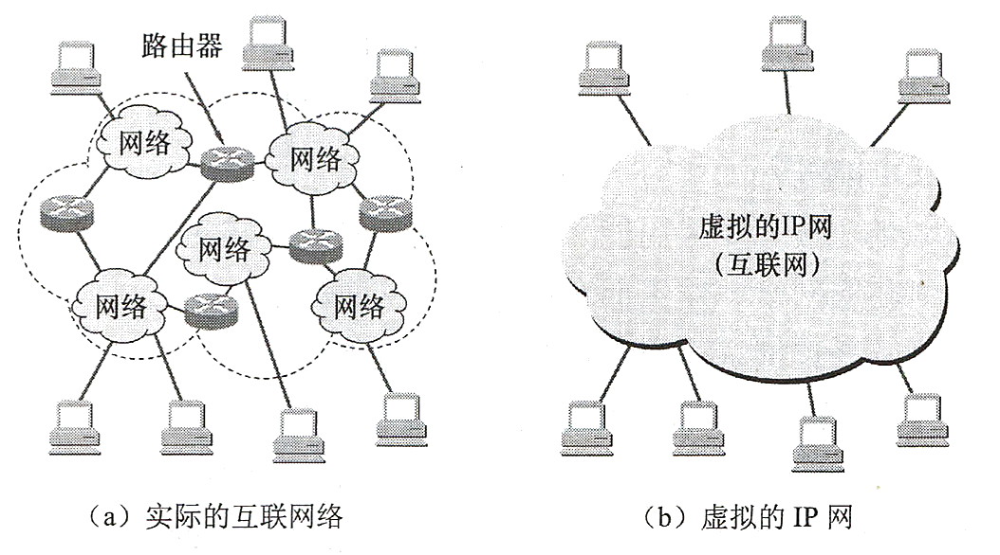

网络层的主要任务是把分组从源端传到目的端，为分组交换网上的不同主机提供通信服务。网络层的传输单位是数据报（不可靠）

# 4.1 网络层功能

网络层的功能：
* 异构网络互联；
* 路由选择与分组转发；
* 拥塞控制。

## 4.1.1 异构网络互联

网络的互联是指将两个以上的计算机网络，通过一定的方法，用一种或多种通信处理设备(即中间设备)相互联接起来，以构成更大的网络系统。

### 中继系统

<u>中间设备又称为中间系统或中继系统</u>。 根据中继系统所在层次，有以下四种不同的中继系统：
* 物理层中继系统：中继器，集线器 (Hub)。
* 数据链路层中继系统：网桥或交换机 。
* 网络层中继系统：[路由器](#4.8.2%20路由器的组成和功能)。
* 网络层以上的中继系统：网关。

### 虚拟互联网络

<u>网络互联通常是指用路由器进行网络互联和路由选择</u>。路由器就是一台专用计算机，用于在互联网中进行路由选择。

TCP/IP体系在网络互联上采用的做法是<u>在网络层(即IP层)采用了标准化协议，但相互联接的网络则可以是异构的。</u>图(a)表示有许多计算机网络通过一些路由器进行互联。由于参加互联的计算机网络都使用相同的网际协议IP (Internet Protocol)，因此可以把互联以后的计算机网络看成是如图(b)所示的一个**虚拟互联网络**。（物理层、数据链路层、网络层的协议可以不同，<u>网络层以上的高层协议必须相同</u>）

**虚拟互联网络**也就是逻辑互联网络，它的意思就是互联起来的各种物理网络的异构性本来是客观存在的，但是通过使用IP协议就可以使这些性能各异的网络在网络层上看起来好像是一个统一的网络。这种使用IP协议的虚拟互联网络可简称为**IP网络**。

使用虚拟互联网络优点：当互联网上的主机进行通信时，就好像在一个网络上通信一样， 而看不见互联的具体的网络异构细节(如具体的编址方案、路由选择协议等)。

## 4.1.2 路由与转发

路由器主要完成两个功能：一个是路由选择(确定哪一条路径)，另一个是分组转发(当一个分组到达时所采取的动作)。
* **路由选择**：路由选择是根据特定的路由选择协议构造出路由表，同时经常或定期地和相邻路由器交换路由信息而不断地更新和维护路由表，分析到达目的网络的最优转发路径，它涉及很多个路由器。
* **分组转发**：路由器根据转发表把收到的IP数据报从合适的端口转发出去，它仅涉及一个路由器。
[4.8.3 路由表和转发表](#4.8.3%20路由表和转发表)

网络层对分组的处理过程称为**交付**，交付可分为**直接交付**和**间接交付**。若主机或路由器转发时发现下一跳恰好为目的主机，则此次交付称为直接交付，否则为间接交付。

## 4.1.3 SDN的基本概念

### 网络层两大平面

可以把网络层抽象地划分为数据层面（也称转发层面）和控制层面
* **数据层面**：数据层面对于数据处理过程中各种具体处理转发过程——转发是数据层面实现的功能（时间短，通常硬件解决）
	* 数据平面执行的主要功能是根据转发表进行转发，这是路由器的本地动作
* **控制平面**：控制平面用于控制和管理网络协议的运行，比如OSPF协议、RIP协议、BGP协议——路由选择是控制层面实现的功能（时间长，通常软件解决）

### 传统网络与软件定义网络SDN

* **传统网络**：传统的网络主要包括数据平面和控制平面。即路由器既有转发表又有路由选择软件。
* **软件定义网络SDN**：Software-Defined Networking，SDN将数据平面和控制平面分开，<u>只将数据平面保留在网络层设备中，即路由器仅包含转发表</u>。
	* 数据平面的设备仅需实现转发功能。
	* 控制平面包含一个逻辑上的**SDN控制器**，掌握各主机和整个网络的状态，为每个分组计算出最佳路由
	* 路由器通过交换包含转发表和其他路由选择信息的报文与**远程控制器**通信。因为计算转发并与路由器交互的控制器使用软件实现的，所以网络是“软件定义的”
	* SDN路由器中，<u>路由选择处理器负责与远程控制器通信</u>，目的是接收远程控制器计算的转发表项

### SDN控制平面

1. **网络控制应用程序**：根据SDN控制器提供的方法，这些应用程序通过这些方法能够监视、编程和控制下面的网络设备
2. **SDN控制器**：维护准确的网络状态信息（远程链路、路由器和主机的状态）；为运行在控制平面中的网络控制应用程序提供这些信息（逻辑集中，在多台服务器上实现）
	1. **对网络控制应用程序的接口**：SDN控制器通过<u>“北向接口”与网络控制应用程序交互</u>。该API允许网络控制应用程序在状态管理层之间读写网络状态
	2. **网络范围状态管理层**：由SDN控制平面作出的最终控制决定，将要求控制器具有有关网络的主机、链路等最新状态信息
	3. **通信层**：SDN控制器与<u>受控网络设备之间的通信(OpenFlow 协议)，包含“南向接口”</u>
3. **受控网络设备**

### SDN的特点

SDN允许网络管理员在不手动处理网络硬件的前提下，使用集中化程序重新规划网络，控制复杂网络拓扑以及网络流量。它打破了传统基础架构的限制，将传统的分布式规则计算演变为集中计算。

SDN的优势包括：
* 降低成本：以软件方式实现集中化网络控制，数据层面的设备复杂性降低，需要的物理硬件更少，更利于资源整合，降低总体成本
* 简化管理：将全局控制信息集中到一台设备上管理，避免在分散的设备上修改
* 灵活性高且可扩展性强：通过SDN架构方式，可根据需要对网络设备资源进行水平扩展或收缩

SDN的不足之处：
* 安全问题：相比于传统的封闭式网络设备，开放式的网络接口更容易被入侵
* 性能瓶颈问题：目前采用分布式的控制器来避免单一控制器的性能瓶颈，但使用分布式的控制器也带来了控制器之间的同步问题

## 4.1.4 拥塞控制

在通信子网中，由于出现过量的分组而引起网络性能下降的现象称为**拥塞**。

### 分组发送速率与时延的关系

考虑一种情况，某个路由器所在链路的带宽为R B/s，如果IP分组只从它的某一个端口进入，其速率为 r~in~ B/s。 当 $r_\mathrm{in} = R$ 时，可能看起来是件“好事”，因为链路带宽被充分利用。但是当分组到达路由器的速率接近R时，平均时延急剧增加，并且会有大量的分组被丢弃(路由器端口的缓冲区是有限的)，整个网络的吞吐量会骤降，源与目的地之间的平均时延也会变得近乎无穷大。

### 拥塞判断

判断网络是否进入拥塞状态的方法是<u>观察网络的吞吐量与网络负载的关系</u>：

* 如果随着网络负载的增加，网络的吞吐量明显小于正常的吞吐量，那么网络就可能进入了**轻度拥塞**状态；
* 如果网络的吞吐量随着网络负载的增大反而下降，网络就可能进入**拥塞状态**；
* 如果网络的负载继续增大，而网络的吞吐量下降到零，网络就可能进入了**死锁状态**。

### 拥塞控制

拥塞控制主要解决的问题是如何获取网络中发生拥塞的信息，从而利用这些信息进行控制，以避免由于拥塞而出现分组的丢失以及严重拥塞而产生网络死锁的现象。

拥塞控制是确保子网能够承载所达到的流量，这是一个全局性的过程，涉及各方面的行为：主机、路由器及路由器内部的转发处理过程等。 单一的增加资源井不能解决拥塞。

拥塞控制方法

* **开环控制**：在设计网络时事先将有关发生拥塞的因素考虑周到，力求网络在工作时不产生拥塞。 <u>它是一种静态的预防方法</u>。一旦整个系统启动并运行起来，中途就不再需要修改。 开环控制手段可包括确定何时可接收新流量、何时可丢弃分组及丢弃哪些分组，确定何种调度决策等。 <u>所有这些手段的共性是：在做决定时不考虑当前网络的状态。</u>
* **闭环控制**：事先不考虑有关发生拥塞的各种因素，采用监测网络系统去监视，及时检测到哪里发生拥塞，然后将拥塞信息传到合适的地方，以便调整网络系统的运行，并解决出现的问题。<u>闭环控制是基于反馈环路的概念，它是一种动态的方法。</u>

### 流量控制和拥塞控制的区别

* **流量控制**：往往是指在发送端和接收端之间的点对点通信量的控制。流量控制所要做的就是<u>抑制发送端发送数据的速率</u>，以便使接收端来得及接收。
* **拥塞控制**：必须确保通信子网能够传送待传送的数据，是一个全局性的问题，<u>涉及网络中所有的主机、路由器以及导致网络传输能力下降的所有因素。</u>

# 4.2 路由算法

注：“最佳”只能是相对于某一种特性要求下得出的较为合理的选择而已

## 4.2.1 静态路由与动态路由

路由器转发分组是通过路由表转发的，而路由表是通过各种算法得到的。从能否随网络的通信量或拓扑自适应地进行调整变化来划分，路由算法可分为两大类：[静态路由算法](#静态路由算法) & [动态路由算法](#动态路由算法)。

### 静态路由算法

* **静态路由算法**：又称为**非自适应路由算法**，<u>指由网络管理员手工配置的路由信息</u>。当网络的拓扑结构或链路的状态发生变化时，网络管理员需要手工去修改路由表中相关的静态路由信息。
* 优点： 简便、可靠，在负荷稳定、拓扑变化不大的网络中运行效果很好，广泛用于高度安全性的军事网络和较小的商业网络。
* 缺点：路由更新慢，大型和复杂的网络环境不适用。一方面，网络管理员难以全面地了解整个网络的拓扑结构；另一方面，当网络的拓扑结构和链路状态发生变化时，路由器中的静态路由信息需要大范围地调整，这一工作的难度和复杂程度非常高。

使用静态路由配置可能出现以下导致产生**路由环路**的错误。
* 配置错误——[生存时间TTL](#^240a44)
* 聚合了不存在的网络——配置黑洞路由
* 网络故障——配置黑洞路由

### 动态路由算法

* **动态路由算法**：又称为**自适应路由算法**，指路由器上的路由表项是<u>通过相互联接的路由器之间彼此交换信息，然后按照一定的算法优化出来的</u>，而这些路由信息是在一定时间间隙里不断更新，以适应不断变化的网络，以随时获得最优的寻路效果。
* 优点：路由更新快，适用大型网络，及时响应链路费用或网络拓扑变化，能改善网络的性能并有助于流量控制。
* 缺点：算法复杂，会增加网络的负担，有时因对动态变化的反应太快而引起振荡，或反应太慢而影响网络路由的一致性。

常用的动态路由算法可分为两类：距离-向量路由算法和链路状态路由算法。
* 分散性：[距离向量路由算法](#4.2.2%20距离向量路由算法)——使用[RIP协议](#4.5.3%20RIP协议)，路由器只掌握物理相连的邻居及链路费用信息。
* 全局性：[链路状态路由算法](#4.2.3%20链路状态路由算法)——使用[OSPF协议](#4.5.4%20OSPF协议)，所有路由器掌握完整的网络拓扑和链路费用信息。

## 4.2.2 距离向量路由算法
> 距离向量路由算法中，每个路由器只知道其邻居的距离信息，不知道网络整体的拓扑情况。分组经过每个路由器都被转发给代价最低的下一跳，即每个路由器掌握最佳路径的一部分

在距离-向量路由算法中，所有的结点都定期地将它们的整个路由选择表传送给所有与之直接相邻的结点。这种路由选择表包含：<u>① 每条路径的目的地(另一结点)；② 路径的代价(也称距离) 。</u>

注意：这里的距离是一个抽象的概念，如RIP就将距离定义为“跳数”。跳数指从源端口到达目的端口所经过的路由个数，经过一个路由器跳数加1。

**算法触发条件**
在这种算法中，所有的结点都必须参与距离向量交换，以保证路由的有效性和一致性，也就是说，所有的结点都监听从其他结点传送来的路由选择更新信息，并在下列情况下更新它们的路由选择表：
* 被通告一条新的路由，该路由在本结点的路由表中不存在，此时本地系统加入这条新的路由。
* 发送来的路由信息中有一条到达某个目的地的路由，该路由比当前使用的路由有较短的距离(较小的代价)。此种情况下，就用经过发送路由信息的结点的新路由替换路由表中达到那个目的地的现有路由。

**算法优劣**
距离-向量路由算法的实质是迭代计算一条路由中的站段数或延迟时间，从而得到到达一个目标的最短(最小代价)通路。它要求每个结点在每次更新中都将它的全部路由表发送给其所有相邻结点。显然，更新报文的大小与通信子网的结点个数成正比，大的通信子网将导致很大的更新报文。由于更新报文发给直接邻接的结点，所以所有的结点都将参加路由选择信息交换。基于这些原因，在通信子网上传送的路由选择信息的数量很容易变得非常大。

最常见的距离-向量路由算法的例子是[RIP协议](#4.5.3%20RIP协议)，它采用“跳数”作为距离的度量。

## 4.2.3 链路状态路由算法
> 链路状态路由算法中，每个路由器都具有完全的网络拓扑信息，最终使用Dijstra算法计算得到源点到各个结点的最短路径

链路状态路由算法要求每个参与该算法的结点都有完全的网络拓扑信息，它们执行下述两项任务：
1. **主动测试所有邻接结点的状态**。(两个共享一条链接的结点是相邻结点，它们连接到同一条链路， 或者连接到同一广播型物理网络。)
2. **定期地将链路状态传播给所有其他的结点 (或称路由结点)**。典型的链路状态算法是OSPF算法。

**算法主要特征**
* 向本自治系统中所有路由器发送信息，这里使用的方式是**泛洪法**，即路由器通过所有端口向所有相邻的路由器发送信息。而每一个相邻路由器又将此信息发往其所有相邻路由器(但不再发送给刚刚发来信息的那个路由器)
* 发送的信息就是<u>与路由器相邻的所有路由器的链路状态</u>，但这只是路由器所知道的部分信息。所谓“链路状态”就是说明本路由器都和哪些路由器相邻以及该链路的“度量”。对于OSPF算法，链路状态的“度量”主要用来表示费用、距离、时延、带宽等。
* 只有当链路状态发生变化时，路由器才向所有路由器发送此消息。

由于一个路由器的链路状态只涉及相邻路由器的连通状态，因而与整个互联网的规模并无直接关系，因此链路状态路由算法可以用于大型的或路由信息变化聚敛的互联网环境。

**算法优点**
1、每个路由结点都使用同样的原始状态数据独立地计算路径， 而不依赖中间结点的计算。
2、链路状态报文不加改变地传播，易于查找故障。当一个结点从所有其他结点接收到了报文时，它可以在本地立即计算正确的通路，保证一步会聚。
3、由于链路状态报文仅运载来自单个结点关于直接链路的信息，其大小与网络中的路由结点数目无关，因此，链路状态算法比距离-向量算法有更好的规模可伸展性。

**算法比较**
* 在距离-向量路由算法中，每个结点仅与它的直接邻居交谈，它为它的邻居提供了从自己到网络中所有其他结点的最低费用估计。
* 在链路状态路由算法中，每个结点通过广播的方式与所有其他结点交谈，但它仅告诉它们与它直接相连的链路的费用。相较之下，距离-向量路由算法有可能遇到路由环路等问题。

## 4.2.4 层次路由

背景：当网络规模扩大时，路由器的路由表成比例地增大。这不仅消耗越来越多的路由器缓冲区空间，而且需要用更多CPU时间来扫描路由表，用更多的带宽来交换路由状态信息。因此路由选择必须按照层次的方式进行。

因特网采取分层次的路由选择协议：自治系统内部的路由选择称**域内路由选择**，自治系统之间的路由选择称**域间路由选择**。
* **内部网关协议IGP** ( Interior Gateway Protocol)：在一个自治系统内部使用的路由选择协议，也称为域内路由选择，它与互联网中其他自治系统选用什么路由选择协议无关。目前这类路由选择协议使用得最多，如[RIP协议](#4.5.3%20RIP协议)和[OSPF协议](#4.5.4%20OSPF协议)。
* **外部网关协议EGP** ( External Gateway Protocol, EGP )：在自治系统之间所使用的路由选择协议，也称为域间路由选择。用于不同自治系统之间的路由器交换路由信息。目前使用最多的外部网关协议是[BGP-4](#4.5.5%20BGP协议)。 

# 4.3 IPv4

## 4.3.1 IPv4 分组

IPv4，即现在普遍使用的IP协议(版本为4)。IP协议定义数据传送的基本单元一一IP分组及其确切的数据格式。IP协议也包括一套规则，指明分组如何处理、错误怎样控制。特别是，IP协议还包含非可靠投递的思想，以及与此关联的分组路由选择的思想。

### IP数据报格式

一个IP分组由首部和数据两部分组成。首部的前一部分是固定长度的，共20字节，是所有IP分组必须具有的。在首部固定部分的后面是一些可选宇段，其长度是可变的，用来提供错误检测及安全等机制。

IP首部重要字段含义：

* **版本**：占4位。指IP协议的版本，目前广泛使用的版本号为4，即IPv4。
* **首部长度**：占4位。<u>单位为4B</u>，最小取值为5，即20B，最大取值为15，即60B。最常用的首部长度是20B，此时不使用任何选项(即可选字段)。<!--一种八片的首饰-->
* 区分服务：占8位。指示期望获得哪种类型的服务（优先级）
* **总长度**：占16位。<u>单位为1B</u>，故数据报的最大长度为 $2^{16}-1=65535$ 字节。表示IP数据报的总长度(首部和数据部分)，以太网帧的最大传送单元 MTU为1500字节，因此当一个IP数据报封装成帧时，数据报的总长度一定不能超过下面数据链路层的MTU值。
* **标识**：占16位。属于同一个数据报的各分片数据报应该具有相同的标识。它是一个计数器，每产生一个数据报就加1，并赋值给标识字段。但它并不是 “序号” (因为IP是无连接服务)。当一个数据报长度超过网络的MTU时，必须[分片](#IP数据报分片)，此时每个数据报片都复制一次标识号以便能正确重装成原来的数据报。
* **标志**：占3位。
	* 标志字段的第一位为保留字段，必须设置为0；
	* 标志字段的中间一位为DF(Don’t Fragment)，`DF=0` 表示不允许分片，`DF=0` 表示允许分片；
	* 标志字段的最后一位为MF(More Fragment)，`MF=1` 表示后面还有分片，`MF=0` 表示最后一个分片/没有分片；
* **片偏移**：占13位。<u>单位为8B</u>。它指出较长的分组在分片后，某片在原分组中的起始位置。除了最后一个分片，每个分片的长度一定是8字节(64位)的整数倍。
* **生存时间TTL**：占8位。单位为跳数，即数据报在网络中可通过的路由器数的最大值，标识分组在网络中的寿命，以确保分组不会永远在网络中循环。路由器在转发分组之前，先把TTL减1。若TTL被减为0，则该分组必须丢弃。 ^240a44
* **协议**：占8位。指出此分组携带的数据是使用何种协议，即分组的数据部分应交给哪个传输层协议，如TCP, UDP等。

| 协议名 | [ICMP](#网际控制报文协议ICMP) | IGMP | [TCP](第5章%20传输层.md#5.3%20TCP协议) | EGP  | IGP  | [UDP](第5章%20传输层.md#5.2%20UDP协议) | IPv6 | ESP  | OSPF |
| :----: | :--: | :--: | :-----: | :--: | :--: | :-----: | :--: | :--: | :--: |
| 字段值 |  1   |  2   |  **6**  |  8   |  9   | **17**  |  41  |  50  |  89  |

* **首部检验和**：占16位。用来检测传输过程中首部是否出现差错。比CRC检验码简单，称为因特网检验和
	* IP数据报每经过一个路由器，路由器都要重新计算首部检验和，因为某些字段的取值可能发生变化
* **源地址**：占32位。标识发送方的IP地址。
* **目的地址**：占32位。标识接收方的IP地址。
* **可选字段**：0~40B，用来支持排错、测量以及安全等措施。
* **填充**：全0，用于把首部填充成4B的整数倍。

### IP数据报分片

* **最大传送单元MTU**：一个链路层数据报能承载的最大数据量称为最大传送单元(MTU)。因为IP数据报被封装在链路层数据报中，故链路层的MTU严格地限制着IP数据报的长度，而且在IP数据报的源与目的地路径上的各段链路可能使用不同的链路层协议，有不同的MTU。
* 当IP数据报的总长度大于链路MTU时：
	* **分片**：若DF=0，则将数据报中的数据分装在两个或更多个较小的IP数据报中，这些较小的数据报叫做片。
	* 丢弃分组：若DF=1，则丢弃该分组，并且使用[ICMP差错报文](#ICMP差错报告报文)向源主机报告
* 分片后，目的主机使用IP首部中的标识、标志和片偏移字段来完成对片的重组。
* 注意：片偏移字段以8B为单位，因此分片后数据报长度要为8B的整数倍

【例】某个IPv4数据报总长度为3820字节，采用20字节固定首部，根据数据链路层要求，需要将该IPv4数据报分片为长度不超过1420字节的数据报片。

|              | 总长度  | 标识  | MF  | DF  |   片偏移   |
|:------------:|:-------:|:-----:|:---:|:---:|:----------:|
| 原IPv4数据报 | 20+3800 | 23333 |  0  |  0  |   0/8=0    |
| 分片数据报1  | 20+1400 | 23333 |  1  |  0  |   0/8=0    |
| 分片数据报2  | 20+1400 | 23333 |  1  |  0  | 1400/8=175 |
| 分片数据报3  | 20+1400 | 23333 |  0  |  0  | 2800/8=350 |

### 网络层转发分组的流程

网络层的路由器执行的分组转发算法如下：

1. 从数据报的首部提取目的主机的IP地址D，得出目的网络地址为N。
2. 若网络N与此路由器直接相连，则把数据报直接交付目的主机D，这就叫路由器的**直接交付**；否则是**间接交付**，执行步骤3。
3. 若路由表中有目的地址为D的特定主机路由(对特定的目的主机指明一个特定的路由，通常是为了控制或测试网络，或出于安全考虑才采用的)，则把数据报传送给路由表中所指明的下一跳路由器；否则，执行步骤4。
4. 若路由表中有到达网络N的路由，则把数据报传送给路由表指明的下一跳路由器；否则，执行步骤5。
5. 若路由表中有一个**默认路由**，则把数据报传送给路由表中所指明的默认路由器；否则，执行步骤6。
6. 报告转发分组出错。

## 4.3.2 IPv4地址与NAT

### IPv4地址

IPv4地址就是给因特网上每一台主机或路由器的每一个接口分配一个在全世界范围内唯一的32bit的标识符

#### IP地址的历史阶段

1. [分类编址](#分类的IP地址)
2. [划分子网](#子网划分)
3. [无分类编址：构成超网](#构成超网)

#### 分类的IP地址

IP地址由网络号和主机号两部分组成。 即 `IP地址::={＜网络号＞,＜主机号＞}`。
* **网络号**标志主机（或路由器）所连接到的网络。一个网络号在整个因特网范围内必须是唯一的。
* **主机号**标志该主机（或路由器）。一个主机号在它前面的网络号所指明的网络范围内必须是唯一的。
 由此可见，一个IP地址在整个因特网范围内是唯一的。

* 只有A类、B类和C类地址可以分配给网络中的主机或路由器的各个接口
* 主机号全0的地址为**网络地址**，表示网络本身，不能分配给主机或路由器的各个接口
* 主机号全1的地址为**广播地址**，用于广播分组，不能分配给主机或路由器的各个接口

##### IP地址的使用范围

* A类地址可用的网络数为 $2^{7}-2$ ，减2的原因是：网络号为0的IP地址是保留地址，为本主机在本网络上的源地址；网络号为127的IP地址为本地环回测试地址，表示任意主机本身
* B类地址可用网络数为 $2^{14}$ ^[提示：根据2002年9月发表的RFC 3330文档，`128.0` 这个网络号已经可以分配了]
* C类地址可用网络数为 $2^{21}$ ^[提示：根据2002年9月发表的RFC 3330文档，`192.0.0` 这个网络号已经可以分配了]

| 网络类别 | 最大可用网络数 | 第一个可用的网络号 | 最后一个可用的网络号 | 每个网络中的最大主机数 |
| :------: | :------------: | :----------------: | :------------------: | :--------------------: |
|    A     |   $2^{7}-2$    |         1          |         126          |        $2^{24}-2$         |
|    B     |   $2^{14}$   |       128.0        |       191.255        |        $2^{16}-2$         |
|    C     |   $2^{21}$   |      192.0.0       |     223.255.255      |         $2^{8}-2$         |

##### 特殊用途的IP地址

在各类IP地址中，有一些IP地址用于表示特殊用途，不用于做主机 IP 地址：

* 32位全为0，即 `0.0.0.0` 表示**本主机**在本网络上的源地址 ^[提示：封装有DHCP Discovery报文的IP分组的源地址使用`0.0.0.0`]； `0.0.0.0` 也用来表示整个网络所有主机 ^[提示：路由表中的默认路由表项使用 `0.0.0.0`表示接受所有IP地址]
* 32位全为1，即 `255.255.255.255` 表示整个TCP/IP网络的广播地址，又称**受限广播地址**。实际使用时由于路由器对广播域的隔离，`255.255.255.255` 等效为本网络的广播地址。
* 主机号全为0表示**本网络本身**。主机号全为1表示本网络的广播地址，又称**直接广播地址**。
* 以127开头且后面三个字节非全0或全1的IP地址是一类特殊的IPv4地址，用于本地软件环回测试，如常用的环回测试地址 `127.0.0.1`
* 局域网内部私有地址。经过[NAT转换](#网络地址转换(NAT))，私有地址被隐藏在内部网络中。

| NetID网络号 |  HostID主机号   | 作为IP分组源地址 | 作为IP分组目的地址 |                                用途                                |
|:-----------:|:---------------:|:----------------:|:------------------:|:------------------------------------------------------------------|
|     全0     |       全0       |       可以       |       不可以       | 本网范围内表示主机；路由表中用于表示默认路由(表示整个Internet网络) |
|     全0     |     特定值      |       可以       |       不可以       |                       表示本网内某个特定主机                       |
|     全1     |       全1       |      不可以      |        可以        |                    本网广播地址（路由器不转发）                    |
|   特定值    |       全0       |      不可以      |       不可以       |                       网络地址，表示一个网络                       |
|   特定值    |       全1       |      不可以      |        可以        |            直接广播地址，对特定网络上的所有主机进行广播            |
|     127     | 任何数(非全0/1) |       可以       |        可以        |                 用于本地软件环回测试，称为环回地址                 |

##### IP地址重要特点
* 每个IP地址都由网络号和主机号两部分组成， 因此IP地址是一种分等级的地址结构。
	* 分等级的好处是：① IP地址管理机构在分配IP地址时只分配网络号(第一级)，而主机号(第二级)则由得到该网络的单位自行分配，方便了IP地址的管理；② 路由器仅根据目的主机所连接的网络号来转发分组(而不考虑目标主机号)，从而减小了路由表所占的存储空间。
* IP地址是标志一个主机(或路由器) 和一条链路的接口。
	* 当一个主机同时连接到两个网络时，该主机就必须同时具有两个相应的IP地址， 每个IP地址的网络号必须与所在网络的网络号相同，且这两个IP地址的网络号是不同的。因此<u>IP网络上的一个路由器必然至少应当具有两个IP地址</u> (路由器每个端口必须至少分配一个IP地址)。
* 用转发器或桥接器(网桥等)连接起来的若干个LAN仍然是同一个网络(同一个广播域)，因此该LAN中所有主机的IP地址的网络号必须相同，但主机号必须不同。
* 在IP地址中，所有分配到网络号的网络(无论是LAN或WAN)都是平等的。
* 在同一个局域网上的主机或路由器的IP地址中的网络号必须是一样的。路由器总是具有两个或两个以上的IP地址，路由器的每一个端口都有一个不同网络号的IP地址。

#### 网络地址转换NAT

##### 私有IP地址

为了网络安全，划出了部分IP地址为私有IP地址。<u>私有IP地址只用于LAN，不用于WAN连接</u>(因此私有IP地址不能直接用于 Internet，必须通过网关利用NAT把私有IP地址转换为 Internet 中合法的全球IP地址后才能用于 Internet)，并且允许私有IP地址被LAN重复使用。这有效地解决了IP地址不足的问题。

| 地址类别 |          地址范围           | 网段个数 |
| :------: | :-------------------------: | :------: |
|   A类    |   10.0.0.0~10.255.255.255   |    1     |
|   B类    |  172.16.0.0~172.31.255.255  |    16    |
|   C类    | 192.168.0.0~192.168.255.255 |   256    |

在因特网中的所有路由器，对目的地址是私有地址的数据报一律不进行转发。这种采用私有IP地址的互联网络称为专用互联网或本地互联网。私有IP地址也称**可重用地址**。

##### 网络地址转换

**网络地址转换**NAT (Network Address Translation)，<u>是通过在路由器上安装NAT软件，将专用网络地址 (如企业内部 Intranet) 转换为公用地址(如Internet)</u>，从而对外隐藏了内部管理的IP地址，安装了NAT软件的路由器叫**NAT路由器**，它至少有一个有效的**外部全球IP地址**。

当使用本地地址的主机在和外界通信时， NAT路由器使用**NAT转换表**<u>将本地地址转换成全球地址，或将全球地址转换成本地地址</u>。 NAT转换表中存放着 `{本地IP地址: 端口}` 到 `{全球IP地址: 端口}` 的映射。通过{IP地址: 端口}这样的映射方式，就可以让多个私有IP地址映射到同一个全球IP地址 。

由于绝大多数的网络应用都是使用传输层协议TCP或UDP来传送数据，因此可以利用传输层的端口号和IP地址一起进行转换，这样用一个全球IP地址就可以使多个拥有本地地址的主机同时和因特网上的主机进行通信。这种将端口号和IP地址一起进行转换的技术叫做网络地址与端口号转换NAPT

> 补充：NAT的表项需要管理员来添加

注意：普通路由器在转发 IP 数据报时，不改变其源IP地址和目的IP地址。 而NAT路由器在转发IP数据报时，一定要更换其IP地址（转换源 IP地址或目的IP地址）。<u>普通路由器仅工作在网络层，而NAT路由器转发数据报时需要查看和转换传输层的端口号</u>。

优点
* 它使得整个专用网只需要一个全球IP地址就可以与因特网连通，由于专用网本地IP地址是可重用的，所以NAT大大节省了IP地址的消耗。
* 它隐藏了内部网络结构，从而降低了内部网络受到攻击的风险。

**示例**：假设一个宿舍办理了 2Mb/s 的电信宽带，那么这个宿舍就获得了一个全球IP地址 (如138.76.29.7)，而宿舍内4台主机使用私有地址(如 192.168.0.0 网段)。 宿舍的网关路由器应该开启NAT功能，当路由器从LAN端口收到源IP及源端口号为 192.168.0.2:2233 的数据报时，就将其映射成 138.76.29.7:5001， 然后从WAN端口发送到因特网上。当路由器从WAN端口收到目的IP及目的端口号为 138.76.29.7: 5060 的数据报时，就将其映射成 192.168.0.3:1234，然后从LAN端口发送给相应的本地主机。这样，只需要一个全球地址，就可以让多台主机同时访问英特网。

NAT转换表

|      WAN端       |      LAN端       |
| :--------------: | :--------------: |
| 138.76.29.7:5001 | 192.168.0.2:2233 |
| 138.76.29.7:5060 | 192.168.0.3:1234 |
|        ……        |        ……        |

## 4.3.3 子网划分与子网掩码、CIDR

### 子网划分

分类IP地址的缺点：
* IP地址空间的利用率有时很低；
* 给每一个物理网络分配一个网络号会使路由表变得太大因而使网络性能变坏；
* 两级的IP地址不够灵活。

从1985年起，在IP地址中又增加了一个“**子网号字段**”，使两级IP地址变成为三级IP地址。这种做法叫做划分子网。划分子网己成为因特网的正式标准协议。

**划分子网的基本思路**

* 划分子网纯属一个单位内部的事情。单位<u>对外仍然表现为没有划分子网的网络</u>。
* <u>从主机号借用若干个比特作为子网号</u>，当然主机号也就相应减少了相同的比特。
	* 三级IP地址的结构 : `IP地址={<网络号>，<子网号>，<主机号>}`。
* 使用**子网掩码**来标识IPv4地址中哪些位为网络号及子网号

* 凡是从其他网络发送给本单位某个主机的IP数据报，仍然是根据IP数据报的目的网络号，先找到连接在本单位网络上的路由器。然后此路由器在收到IP数据报后，再按目的网络号和子网号找到目的子网。最后就把IP数据报直接交付给目的主机。

注意：
* 划分子网只是把IP地址的主机号这部分进行再划分，而不改变地址原来的网络号。因此，从一个IP地址本身或IP数据报的首部，并无法判断源主机或目的主机所连接的网络是否进行了子网划分。
* 主机号不能全0或全1，所以主机号至少两位
* 不论是分类的IPv4地址还是CIDR，其子网中的主机号为全0或全1的地址都不能被指派。子网中的主机号全0的地址为子网的网络号，主机号全1的地址为子网的广播地址。

**例题**：已知某个网络的地址为145.13.0.0，使用子网掩码255.255.192.0对其进行子网划分，请给出划分细节。

### 子网掩码

* **子网掩码**：子网掩码是一个与IP地址相对应的长32bit的二进制串，它由一串1和跟随的一串0组成。其中，<u>1对应于IP地址中的网络号及子网号，而0对应于主机号</u>，计算机只需<u>将IP地址和其对应的子网掩码逐位相“与”</u>(逻辑AND运算)，就可得出相应子网的网络地址。
* **默认子网掩码**：现在的因特网标准规定：所有的网络都必须使用子网掩码。如果一个网络没有划分子网，那么就采用默认子网掩码。

由于子网掩码是一个网络或一个子网的重要属性，所以路由器在相互之间交换路由信息时，必须把自己所在网络（或子网）的子网掩码告诉对方。路由表中的每一个条目，除了要给出目的网络地址和下一跳地址外，还需要同时给出该目的网络的子网掩码。

**使用子网掩码情况**
1. 一个主机在设置IP地址信息的同时，必须设置子网掩码。
2. 同属于一个子网的所有主机以及路由器的相应端口，必须设置相同的子网掩码。
3. 路由器的路由表中，所包含的信息其主要内容必须有：<u>目的网络地址、子网掩码、下一跳地址</u>。

**使用子网掩码路由器分组转发算法**：联系[网络层转发分组的流程](#网络层转发分组的流程)
1. 从收到的分组的首部提取目的IP地址，记为D。
2. 先判断是否为直接交付。对路由器直接相连的网络逐个进行检查：用各网络的子网掩码和D逐位相与，看结果是否和相应的网络地址匹配。若匹配，则将分组直接交付，否则就是间接交付，执行步骤3。
3. 若路由表中有目的地址为D的特定主机路由，则将分组传送给路由表中所指明的下一跳路由器；否则，执行步骤4。
4. 对路由表中的每一行(目的网络地址，子网掩码，下一跳地址) 中的子网掩码和D逐位相“与”，其结果为N。若N与该行的目的网络地址匹配，则将分组传送给该行指明的下一跳路由器；否则，执行步骤5。
5. 若路由表中有一个默认路由，则将分组传送给路由表中所指明的默认路由器；否则，执行步骤6。
6. 报告转发分组出错。

### 无分类编址CIDR

**无分类域间路由选择**CIDR(Classless Inter-Domain Routing)是在变长子网掩码的基础上提出的一种消除传统A、B、C类网络划分，并且可以在软件的支持下实现超网构造的一种IP地址的划分方法。
* 消除了传统的A、B、C类地址以及划分子网的概念，因而可以更加有效地分配IPv4的地址空间。（**网络号+子网号=网络前缀**，主机号不变）
	* CIDR使用“网络前缀”的概念代替子网络的概念。这样IP地址的无分类两级编址为 `IP::={<网络前缀>，<主机号>}`。
	* CIDR使用 “斜线记法”(或称**CIDR记法**：<u>IP地址后加上“/”，然后写上网络前缀的位数</u>，如`128.14.32.0/20`)。
	* <u>CIDR 虽然不使用子网，但仍然使用“掩码”这一名词</u>。“CIDR不使用子网” 是指CIDR并没有在32位地址中指明若干位作为子网字段。但分配到一个CIDR地址块的组织，仍可以在本组织内根据需要划分出一些子网。
* 融合子网地址和子网掩码，将网络前缀都相同的连续的IP地址组成 “**CIDR地址块**”，方便子网划分。
* CIDR地址块中的地址数一定是2的整数次幂，实际可指派的地址数通常为$2^{N}-2$，N 表示主机号的位数，主机号全0代表网络号，主机号全1为广播地址。
* 一个CIDR地址块可以表示很多地址，这种地址的聚合称为**路由聚合**，或称为构成超网。路由聚合使得路由表中的一个项目可以表示很多个原来传统分类地址的路由，有利于减少路由器之间的路由选择信息的交换，从而提高网络性能。

### 构成超网

> 划分子网：少→多；构成超网：多→少

**路由聚合**：即合并多个网络的路由信息，有效减少路由表项，从而提高网络性能。与子网划分相反，路由聚合将多个网络合并为一个更大的网络，因此又称作**构成超网**

方法：将网络前缀缩短（所有网络地址取交集），如：206.1.0.0/17+206.1.128.0/17→206.1.0.0/16

CIDR的优点在于网络前缀长度的灵活性。由于上层网络的前缀长度较短，因此相应的路由表的项目较少。而内部又可采用延长网络前缀的方法来灵活的划分子网。

* **最长匹配原则**：使用CIDR时，路由表中的每个项目由 “网络前缀” 和 “下一跳地址” 组成。<u>在查找路由表时可能会得到不止一个匹配结果。应当从匹配结果中选择具有最长网络前缀的路由</u>，因为网络前缀越长，其地址块就越小，因而路由就越具体。
* CIDR查找路由表的方法：为了进行更加有效的查找最长前缀匹配，通常是将无分类编址的路由表存放在一种层次的数据结构中，然后自上而下地按层次进行查找。这里最常用的数据结构就是[线索二叉树](第5章%20树与二叉树#5.3.2%20线索二叉树)。

## 4.3.4 ARP协议、DHCP协议与ICMP协议

### IP地址与硬件地址

在网络层及网络层之上使用IP地址，网络层之下使用MAC地址来标识主机。

**寻址过程**
1. 每个路由器依据其路由表(依靠静态路由或动态路由协议生成)选择到目标网络(即主机号全为0的网络地址) 需要转发到的下一跳(路由器的物理端口号或下一网络地址)。
2. 而IP分组通过多次路由转发到达目标网络后，则改为在目标网络LAN中通过数据链路层的MAC地址以广播方式寻址。这样可以提高路由选择的效率。

**特点**
1. 在IP层抽象的互联网上只能看到IP数据报。
2. 虽然在IP数据报首部中有完整的源IP地址和目的IP地址，但路由器只根据目的IP地址的网络号进行路由选择。
3. 在局域网的链路层，只能看见MAC帧。而通过路由器转发IP分组时，此IP分组在每个网络中都被路由器解封装和重新封装。因此IP数据报在被路由器转发时其数据链路层封装所使用的MAC地址是在不断改变的。这也决定了<u>无法使用MAC地址跨网络通信</u>。
4. 尽管互联在一起的网络的硬件地址体系各不相同，但IP层抽象的互联网却屏蔽了下层这些很复杂的细节。只要在网络层上讨论问题，就能够使用统一的、抽象的IP地址研究主机与主机或路由器之间的通信。

注意：<u>路由器由于互联多个网络，因此它不仅有多个IP地址，也有多个硬件地址</u>。 

### 地址解析协议ARP

* 在网络层及网络层之上使用IP地址，网络层之下使用MAC地址来标识主机。
* IP分组在转发分组时必须掌握IP地址，而在实际网络的链路上传送数据帧时，必须使用硬件地址。所以需要一种方法来完成IP地址到MAC地址的映射，这就是**地址解析协议ARP**(Address Resolution Protocol)。
* 每个主机都设有一个ARP高速缓存，存放本局域网上各主机和路由器的IP地址到MAC地址的映射表，称**ARP表**。使用ARP协议来动态维护此ARP表。

#### ARP协议工作原理

1. 当主机A欲向本局域网上的某个主机B发送IP数据报时，就先在其ARP高速缓存中查看有无主机B的IP地址。
	* 如果有：查出其对应的硬件地址，再将此硬件地址写入MAC帧，然后通过局域网将该MAC帧发往此硬件地址。
	* 如果没有：通过使用目的MAC地址为 `FF-FF-FF-FF-FF-FF` 的帧来封装并广播**ARP请求分组**，可以使同一个局域网里的所有主机收到ARP请求。
2. 当主机B收到该ARP请求后，就会向主机A单播一个**ARP响应分组**，分组中包含主机B的IP与MAC地址的映射关系。
3. 主机A在收到后将此映射写入ARP缓存中 (10-20min更新一次) ，然后按查询到的硬件地址发送MAC帧。

注意：
* ARP是解决同一个局域网上的主机或路由器的IP地址和硬件地址的映射问题。如果所要找的主机和源主机不在同一个局域网上，那么就要<u>通过ARP协议找到一个位于本局域网上某个路由器的硬件地址，然后把分组发送给这个路由器</u>，让这个路由器把分组转发给下一个网络。剩下的工作就由下一个网络来做。
* 尽管<u>ARP请求分组是广播发送</u>的，但是<u>ARP响应分组是普通的单播</u>，即从一个源地址发送到一个目的地址。

#### ARP协议4种典型情况

* 发送方是主机，要把IP数据报发送到本网络上的另一个主机。这时用ARP找到目的主机的硬件地址；
* 发送方是主机，要把IP数据报发送到另一个网络上的一个主机。这时用ARP找到本网络上的一个路由器的硬件地址，剩下的工作由这个路由器来完成；
* 发送方是路由器，要把IP数据报转发到本网络上的一个主机。这时用ARP找到目的主机的硬件地址；
* 发送方是路由器，要把IP数据报转发到另一个网络上的一个主机。这时用ARP找到本网络上的一个路由器的硬件地址，剩下的工作由找到的这个路由器完成。

<u>从IP地址到硬件地址的解析是自动进行的，主机的用户对这种地址解析过程是无感知的</u>。只要主机或路由器要和本网络上的另一个己知IP地址的主机或路由器进行通信，ARP协议就会自动地将这个IP地址解析为链路层所需要的硬件地址。

### 动态主机配置协议DHCP

**动态主机配置协议DHCP** ( Dynamic Host Configuration Protocol)是基于UDP的应用层协议，负责IP地址的集中管理与自动分配 

DHCP提供即插即用联网的机制，主机可以从服务器动态获取IP地址、子网掩码、默认网关、DNS服务器与IP地址，<u>允许地址重用，支持移动用户加入网络，支持在用地址续租</u>

地址分配可分为以下两种：
* 静态分配：固定地址可永久使用。例如：管理员通常为DNS服务器、FTP服务器等指定固定IP地址
* 动态分配：DHCP服务器每次向主机分配具有使用期限的地址，期限长短由DHCP服务端决定，到期后客户端释放分配得到的地址

DHCP服务器为客户端选取地址遵循如下优先顺序
1. 静态绑定地址
2. 上一次使用的地址
3. 最先找到的可用地址

#### DHCP服务器聚合客户端交换过程

1. 主机广播<u>DHCP发现报文</u>：DHCP客户机广播 “DHCP发现” 消息，试图找到网络中的DHCP服务器，获得一个IP地址。 ^[本地网络上所有主机都能收到此广播报文，但只有DHCP服务器才回答此广播报文。]
> 有没有DHCP服务器呀？
2. DHCP服务器广播<u>DHCP提供报文</u>：DHCP服务器收到 “DHCP发现” 消息后，就向网络中广播 “DHCP提供” 消息，其中包括提供DHCP客户机的IP地址和相关配置信息。
> 有！有！有！
3. 主机广播<u>DHCP请求报文</u>：DHCP客户机收到 “DHCP提供” 消息，如果接受DHCP服务器所提供的相关参数，则通过广播 “DHCP请求” 消息向DHCP服务器请求提供IP地址。
> 我用你给我的IP地址啦？
4. DHCP服务器广播<u>DHCP确认报文</u>：DHCP服务器广播 “DHCP确认” 消息，将IP地址分配给DHCP客户机。
> 用吧！

* DHCP协议允许网络上配置多台DHCP服务器，当DHCP客户机发出DHCP请求时，有可能收到多个应答消息。这时，DHCP客户机只会挑选其中一个，通常挑选最先到达的。
* DHCP服务器分配给DHCP客户的IP地址是临时的，因此DHCP客户只能在一段有限的时间内使用这个分配到的IP地址。DHCP称这段时间为**租用期**。租用期的数值应由DHCP服务器自己决定，DHCP客户也可在自己发送的报文中提出对租用期的要求。
* DHCP协议的客户端和服务端需要<u>通过广播方式来进行交互</u>，原因是在DHCP协议执行期间，客户端和服务端都没有标识自己身份的IP地址，因此不可能通过单播的形式进行交互。
* DHCP协议采用UDP而不采用TCP，因为TCP协议需要建立连接，但连对方的IP地址都不知道，更不可能通过双方的套接字建立连接。
* DHCP中继代理：如果在每一个网络上都设置一个DHCP服务器会使得DHCP服务器太多。因此现在每个网络中都至少有一个DHCP中继代理（通常是路由器），它配置了DHCP服务器的IP地址信息，作为各网络中计算机与DHCP服务器的桥梁

### 网际控制报文协议ICMP

<u>为了提高IP数据报交付成功的机会</u>，在网络层使用了**网际控制报文协议ICMP** (Internet Control Message Protocol, ICMP)来允许主机或路由器报告差错和异常情况。ICMP报文作为IP层数据报的数据，加上数据报的首部，组成IP数据报发送出去。

虽然ICMP工作在网络层，但ICMP报文不直接交至数据链路层，而是先基于IP协议封装为IP分组。

ICMP报文的种类有两种 ，即：**ICMP差错报告报文**和**ICMP询问报文**，分别对应差错报告和主机查询两大功能

#### ICMP差错报告报文

ICMP差错报告报文用于目标主机或到目标主机路径上的路由器向源主机报告差错和异常情况。

发送ICMP差错报告报文五种类型： #考前记一记 
* **终点不可达**：当路由器或主机<u>不能交付数据报时</u>就向源点发送终点不可达报文。
* **源点抑制**：当路由器或主机<u>由于拥塞而丢弃数据报时</u>，就向源点发送源点抑制报文，使源点知道应当把数据报的发送速率放慢。
* **时间超过**：<u>当路由器收到生存时间 `TTL=0` 的数据报时</u>，除丢弃该数据报外，还要向源点发送时间超过报文。<u>当终点在预先规定的时间内不能收到一个数据报的全部数据报片时</u>，就把己收到的数据报片部分都丢弃，并向源点发送时间超过报文。
* **参数问题**：当路由器或目的主机收到IP数据报后，根据其首部中的检验和字段发现<u>首部在传输过程中出现了误码</u>，就丢弃该数据报，并向源点发送参数问题报文。
* **改变路由(重定向)**：路由器把<u>改变路由报文</u>发送给主机，让主机知道下次应将数据报发送给另外的路由器(可通过更好的路由) 。

不应发送ICMP差错报告报文的几种情况：
* <u>对ICMP差错报告报文</u>不再发送ICMP差错报告报文。
* 对第一个分片的数据报片的<u>所有后续数据报片</u>都不发送ICMP差错报告报文。
* 对<u>具有多播地址的数据报</u>都不发送ICMP差错报告报文。
* 对<u>具有特殊地址 (如127.0.0.0或 0.0.0.0) 的数据报</u>不发送ICMP差错报告报文。

#### ICMP询问报文

ICMP询问报文有四种类型，最常用的是前两类。
* **回送请求和回答报文**：用于测试目的站是否可达及了解其有关状态。主机或路由器向特定目的主机发出的询问，收到此报文的主机必须给源主机或路由器发送ICMP回答报文。
* **时间戳请求和回答报文**：用于进行时钟同步和测量时间。请求某个主机或路由器回答当前的日期和时间。
* **掩码地址请求和回答报文**
* **路由器询问和通告报文**

#### ICMP应用

ICMP的两个常见的应用是**分组网间探测PING**和**跟踪路由traceroute**。 #考前记一记 
* **PING(Packet Internet Groper)**：用于测试两个主机之间的连通性，应用层直接使用网际层的ICMP协议，使用的是<u>ICMP回送请求和回答报文</u>。
* **traceroute**：用于测试IP数据报从源主机到达目的主机要经过哪些路由器。
	* Unix中为`traceroute`命令，在传输层使用UDP协议，仅使用ICMP差错报告报文
	* Windows中为`tracert`命令，应用层直接使用网际层ICMP协议，使用了ICMP的回送请求和回答报文以及差错报告报文。

# 4.4 IPv6

要解决IP地址耗尽的问题的措施有以下三种：
* 采用[无分类编址CIDR](#无分类编址CIDR)，使IP地址的分配更加合理。
* 采用[网络地址转换NAT](#网络地址转换NAT)以节省全球IP地址。
* 采用具有更大地址空间的新版本的IP协议[IPv6](#4.4%20IPv6)。
其中前两种方法只是延长了IPv4地址分配结束的时间，只有第三种方法从根本上解决了IP地址的耗尽问题。

## 4.4.1 IPv6主要特点

### IPv6主要变化

* 更大的地址空间。IPv6将地址从IPv4的32位增大到了128位。
* 扩展的地址层次结构。相较于IPv4，IPv6地址空间划分更加复杂，且更长的地址允许划分为更多的字段
* 灵活的首部格式。基本首部字段较少，可灵活选用扩展首部以满足不同的功能需求。由于路由器不处理扩展首部，分组处理效率相对较高。
* 改进的选项。IPv6基本首部长度固定，将选项加入扩展首部中。IPv6扩展首部共6中，所以提供的功能多余IPv4首部选项字段。
* 允许协议继续扩充。IPv6协议支持继续扩展功能，而IPv4功能固定无法扩展。
* 支持地址的自动配置。主机可自动配置IPv6地址，也可借助DHCPv6协议进行配置。
* 支持资源的预分配。IPv6可保障对带宽、时延有一定要求的应用的通信质量。
* 分片只发生在源主机。源主机事先探测路径的最大传送单元，将分组划分为合适大小。中间路由器不实行分片，也不处理扩展首部。
* 首部8字节对齐。IPv6首部长度必须是8B的整数倍，而IPv4首部是4B的整数倍。
* 安全性提升。IPv6支持鉴别、加密安全有效载荷(ESP)两种扩展首部，可有效鉴别发送方，并保障分组的完整性、机密性。

### IPv6主要优势

* <u>IPv6有比IPv4长得多的地址</u>。 IPv6的地址用16个字节表示，地址空间是IPv4的 $2^{128-32} = 2^{96}$ 倍，从长远的未来来说，这些地址是绝对够用的。
* <u>改进首部格式，更好地支持选项</u>。一些从前是必要的段现在变成了可选，此外，表示选项的方式的改变还能加快分组的处理速度。
* <u>简化了IP分组头，能更快速处理/转发数据报</u>。它包含8个域 (IPv4是12个域)。这一改变使得路由器能够更快的处理分组，从而可以改善吞吐率。
* 支持**QOS算法** (Quality of Service，QOS，指一个网络能够利用各种基础技术，为指定的网络通信提供更好的服务能力，是网络的一种安全机制，是用来解决网络延迟和阻塞等问题的一种技术)。

## 4.4.2 IPv6 地址

### IPv6数据报格式

固定40B基本首部，路由器处不能分片

IPv6数据报首部字段
* **版本**：指明了协议版本，总是6。
* **优先级**：区分数据报的类别和优先级。
* **流标号**：“流”是互联网络上从特定源点到特定终点的一系列数据报。所有属于同一个流的数据报都具有同样的流标号。
* **有效载荷长度**：扩展首部+数据 的大小
* **下一个首部**：标识下一个扩展首部或上层协议首部。
* **跳数限制**：相当于IPv4的TTL。

### IPv6首部 与 IPv4 首部区别

* IPv6取消了首部长度。IPv6的基本首部长度固定为40字节
* IPv6取消了总长度字段，改用有效载荷长度字段。
* IPv6取消了分片相关字段，分片信息记入专用的分片扩展首部
* IPv6取消了服务类型字段。
* IPv6取消了协议字段，改成下一个首部字段。
* IPv6取消了校验和字段彻底移除，以减少每跳的处理时间。
* IPv6将IPv4的可选字段移出首部，变成了扩展首部。

### IPv6地址表示形式

* 一般形式（冒号十六进制记法）：4BF5:AA12:0216:FEBC:BA5F:039A:BE9A:2170。
* 压缩形式：4BF5:0000:0000:0000:BA5F:039A:000A:2176 -> 4BF5:0:0:0:BA5F:39A:A:2176。
* 零压缩：一连串连续的0可以被一对冒号取代。如 FF05:0:0:0:0:0:0: B3 -> FF05::B3。
	* <u>双冒号表示法在一个地址中仅可出现一次</u>。

注意：IPv4 地址通常使用点分十进制表示法。

### IPv6基本地址类型

* **单播**：点对点通信，即一对一通信，可做源地址＋目的地址。
* **多播**：一对多通信，分组被交付到一组计算机的每一个，可做目的地址。
* **任播**：一对任一通信，IPv6增加的一种类型，任播的目的站是一组计算机，但数据报在交付时只交付其中的一台计算机，通常是距离最近的一台。属于一对多中的一个通信，可做目的地址。

### IPv4向IPv6过渡的策略

* **双栈协议**：双协议栈技术就是指在一台设备上同时启用IPv4协议栈和IPv6协议栈。这样的话，这台设备既能和IPv4网络通信，又能和IPv6网络通信。如果这台设备是一个路由器，那么这台路由器的不同接口上，分别配置了IPv4地址和IPv6地址，并很可能分别连接了IPv4网络和IPv6 网络。如果这台设备是一个计算机，那么它将同时拥有IPv4地址和IPv6地址，并具备同时处理这两个协议地址的功能。
* **隧道技术**：通过使用互联网络的基础设施在网络之间传递数据的方式。使用隧道传递的数据（或负载）可以是不同协议的数据帧或包。隧道协议将其它协议的数据帧或包重新封装然后通过隧道发送。（主机-IPv6路由器-IPv4路由器-IPv4路由器-IPv6路由器）

# 4.5 路由协议

## 4.5.1 自治系统

**自治系统AS**：Autonomous system，又称自治域，由一组IP网络和连接网络的路由器组成，是一个路由策略单元。
* 自治系统内使用统一确定的路由策略，具体包括路由选择协议、代价度量方式等细节。
* 自治系统之间相互独立，在互联网中每个自治系统拥有全局唯一的自治系统号ASN。

## 4.5.2 域内路由与域间路由

自治系统内部的路由选择称**域内路由选择**，自治系统之间的路由选择称**域间路由选择**。详见[4.2.4 层次路由](#4.2.4%20层次路由)

## 4.5.3 RIP协议
> 个人感觉路由更新过程类似数据结构中的[Dijkstra算法](第6章%20图#单源最短路径问题——Dijkstra算法)

RIP是一种分布式的基于[距离向量](#4.2.2%20距离向量路由算法)的路由选择协议，<u>最大优点是简单</u>。

### RIP协议规定

* RIP协议使用**跳数**作为度量来衡量到达目的网络的距离
	* 路由器到直接连接网络的距离为1。
	* 路由器到非直接连接网络的距离为所经过路由器数+1。
	* 允许一条路径最多只能包含15个路由器（即最多允许15跳）。<u>距离等于16时，表示网络不可到达</u>。因此RIP协议只适用于小型互联网。 ^[距离向量路由可能会出现环路的情况，规定路径上的最高跳数的目的是为了防止数据报不断循环在环路上，减少网络拥塞的可能性。]
* 网络中每一个路由器都要维护<u>从它自己到其他每一个目的网络的唯一最佳距离记录</u>（即一组距离，称为距离向量）。
* 路由表表项的字段包含：目的网络、跳数、下一跳IP地址
* RIP认为好的路由就是距离短的路由，即所通过的路由器的数量最少的路由
* 当到达同一目的网络有多条距离相等的路由时，可以进行等价负载均衡

RIP包含以下三个要点：
* 和谁交换信息：相邻路由器
* 交换什么信息：自己的路由表
* 何时交换信息：周期性交换，如每30秒

### RIP协议工作过程

1. 路由器刚开始工作时，只知道自己到直接连接网络的距离为1
2. 每个路由器仅和相邻路由器周期性交换并更新路由信息
3. 经过若干次交换和更新后，所有路由器都知道到达本自治系统内各网络的最短距离和下一跳路由器的地址，即“**收敛**”。

### 路由条目更新规则

路由器对于每一个相邻路由器发送过来的[RIP报文](#RIP协议报文格式)，进行以下步骤：
1. 修改相邻路由器发来的RIP报文中所有表项：对地址为X的相邻路由器发来的RIP报文，先修改此报文中的所有项目：把“下一跳” 字段中的地址都改为X， 并把所有的“距离”字段的值加1。
2. 对修改后的RIP报文中的每一个项目，进行以下步骤：
	* 原来的路由表中没有目的网络N时，把该项目添加到路由表中。
	* 当原来的路由表中有目的网络N时，
		* 若下一跳路由器地址是X，则用收到的项目替换原路由表中的项目，即以新的为标准；
		* 若下一跳路由器地址不是X，原来距离比从X走的距离更近，不作处理。
		* 若下一跳路由器地址不是X，原来距离与从X走的距离相同，等价负载均衡。
		* 若下一跳路由器地址不是X，原来距离比从X走的距离更远，更新路由表。

### 坏消息传得慢

  如：R1通过R2与网络相连，如果R2原本与网络的距离为1，则R1与网络的距离为2，当R2无法连接到网络时，会以为可以通过R1能连接到网络，所以距离会变成3，然后R1与网络的距离更新成4，R2再更新成5，直到二者与网络的距离均变为不可达

 

* 坏消息传得慢又称为路由环路或距离无穷计数问题，这是距离向量算法的一个固有问题，可以采用以下措施来减少出现该问题的概率或减小该问题带来的危害
	* 限制最大路径距离为15，16表示不可达
	* 当路由表发生变化时就立刻发送更新报文，即触发更新，而不仅是周期性发送
	* 让路由器记录收到某特定路由信息的接口，而不让同一路由信息再通过此接口反方向发送，即水平分割

### RIP协议特点
> 注意与[OSPF的特点](#OSPF协议的基本特点)对比

* <u>仅和相邻路由器交换信息</u>。
* 路由器交换的信息是当前本路由器所知道的全部信息，<u>即自己的路由表</u>。
* 按固定的时间间隔交换路由信息，如每30秒交换一次路由信息，然后路由器根据新信息更新路由表。
* 若180s （RIP默认超时时间为180秒） 还没收到相邻路由器X的更新路由表，则把此相邻路由器记为不可达的路由器，即<u>把距离置为16</u> （距离为16表示不可达）。

**优点**：实现简单，开销小，收敛过程较快。
**缺点**：
* RIP限制了网络的规模，它能使用的最大距离为15 (16表示不可达)。
* 路由器之间交换的是路由器中的完整路由表，因此网络规模越大，开销也越大。
* 当网络出现故障时，会出现<u>慢收敛现象</u>（即需要较长时间才能将此信息传送到所有路由器，即距离逐渐增加到16），俗称“坏消息传得慢“，使更新过程的收敛时间长。

RIP是应用层协议，它使用UDP传送数据 (端口520)。 RIP协议选择的路径不一定是时间最短的，但一定是具有最少路由器的路径。因为它是根据最少的跳数进行路径选择。

### RIP协议报文格式

RIP协议是<u>应用层协议，使用UDP传送数据</u>（RIP报文作为UDP的数据部分）。

一个RIP报文最多个包括25个路由。如超过，必须再用一个RIP报文传送。

## 4.5.4 OSPF协议

**开放最短路径优先OSPF** (Open Shor  Path First, OSPF) 协议是为了克服RIP的缺点在1989年开发出来的
* “开放” 标明OSPF协议不是受某一家厂商控制，而是公开发表的；
* “最短路径优先” 是因为使用了Dijkstra提出的最短路径算法SPF。

通过链路状态信息来建立全网的拓扑结构图，然后使用Dijkstra算法计算从自己到各个目的网络的最优路径

<u>OSPF最主要的特征就是使用分布式的链路状态协议</u>，是使用分布式[链路状态](#4.2.3%20链路状态路由算法)路由算法的典型代表 ，它也是内部网关协议IGP的一种。

### OSPF协议的基本特点

* <u>OSPF向本自治系统中所有路由器发送信息</u> ，这里使用的方法是**洪泛法**（即路由器通过广播方式，向通过输出端口向所有相邻的路由器发送信息，而每一个相邻路由器又再次将此信息发往其所有的相邻路由器） 。
> 对比：RIP协议仅向自己相邻的几个路由器发送信息。
* <u>发送的信息就是与本路由器相邻的所有路由器的链路状态</u>（**链路状态**是指本路由器和哪些路由器相邻，以及相应链路的度量/代价，如：费用、距离、时延、带宽等) 。
  对比：在RIP协议中，发送的信息是本路由器所知道的全部信息，即整个路由表。
* <u>只有当链路状态发生变化时，路由器才用洪泛法向所有路由器发送此信息</u>，并且更新过程收敛得快，不会出现RIP协议 “坏消息传得慢”的问题。
  对比：在RIP协议中，不管网络拓扑是否发生变化，路由器之间都会定期交换路由表的信息。
* <u>OSPF是网络层协议</u>，它不使用UDP或TCP，而是直接IP数据报传送 (其IP数据报首部的协议段为89)。
  对比：RIP是应用层协议，它在传输层使用UDP协议。
* OSPF对不同的链路可根据IP分组的不同服务类型 (TOS) 而设置成不同的代价。因此，OSPF对于不同类型的业务可计算出不同的路由，因此十分灵活。
* 如果到同一个目的网络有多条相同代价的路径，那么可以将通信量分配给这几条路径。 这叫做多路径间的**负载平衡**。
* 所有在OSPF路由器之间交换的分组都具有鉴别的功能，因而保证了仅在可信赖的路由器之间交换链路状态信息。
* 支持可变长度的子网划分和无分类编址ClDR。
* 每一个链路状态都带上一个32位的序号，序号越大状态就越新。
---
* OSPF采用SPF算法计算路由，从算法上保证了不会产生路由环路。
* OSPF不限制网络规模，更新效率高，收敛速度快
* OSPF通过指定路由器(DR, designated router)、备用的指定路由器(BDR, backup designated router)来减少洪泛的通信代价，即：所有的非DR/BDR路由器只与DR/BDR建立邻居关系，非DR/BDR路由器之间通过DR/BDR交换信息
* 为了确保链路状态数据库与全网的状态保持一致，OSPF还规定每隔一段时间，如<u>30分钟要刷新一次数据库中的链路状态。</u>
* 由于一个路由器的链路状态只涉及到与相邻路由器的连通状态，因而与整个互联网的规模并无直接关系。因此<u>当互联网规模很大时，OSPF协议要比距离向量协议RIP好得多。</u>

### OSPF的工作原理

1. 在路由器刚开始工作时，OSPF让每一个路由器使用数据库描述分组和相邻路由器交换本数据库中己有的链路状态摘要信息。
2. 路由器就使用链路状态请求分组，向对方请求发送自己所缺少的某些链路状态项目的详细信息。
3. 经过一系列的这种分组交换，所有的路由器最终都能建立一个链路状态数据库。这个数据库实际上就是全网的拓扑结构图， 它在全网范围内是一致的 (这称为链路状态数据库的同步)。
4. 每个路由器就根据这个全网拓扑结构图，使用 Dijkstra最短路径算法计算从自己到各目的网络最优路径，以此构造自己的路由表。
	* 注意：虽然使用Dijkstra算法能计算出完整的最优路径，但是路由表中不会存储完整路径，而只存储 “下一跳” (只有到了下一跳路由器，才能知道再下一跳应当怎样走)。
5. 在此之后，当链路状态发生变化时，每个路由器重新计算到各目的网络的最优路径，构造新的路由表。

链路信息更新过程
1. 每个路由器发现它的邻居结点【hello问候组】，并了解邻居结点的网络地址。
2. 设置到它的每个邻居的成本度量 `metric`。
3. 构造【DD数据库描述分组】，向邻站给出自己的链路状态数据库中的所有链路状态项目的摘要信息。
4. 如果DD分组中的摘要自己都有，则邻站不做处理；
   如果有没有的或者是更新的，则发送【LSR链路状态请求分组】 请求自己没有的和比自己更新的信息。
5. 收到邻站的LSR分组后，发送【LSU链路状态更新分组】进行更新。
6. 更新完毕后，邻站返回一个【LSAck链路状态确认分组】进行确认。
7. 只要一个路由器的链路状态发生变化：
	* 泛洪发送【LSU链路状态更新分组】进行更新。
	* 更新完毕后，其他站返回一个【LSAck链路状态确认分组】进行确认。

### OSPF的区域

* 为了使OSPF能够用于规模很大的网络，OSPF将一个自治系统再划分为若干个更小的范围，叫做**区域**。
* 这些区域也有层次之分。处在上层的域叫主干区域，负责连通其他下层的区域，并且还连接其他自治域。
* 每一个区域都有一个32位的区域标识符 (用点分十进制表示)。
* 区域不能太大，一个区域内的路由器最好不超过200个。
* **优点**：将利用洪泛法交换链路状态信息的范围局限于每一个区域而不是整个的自治系统，这就减少了整个网络上的通信量，因而使OSPF协议能够用于规模很大的自治系统中。
---
路由器
* 区域内路由器IR，如图中区域1内的R1和R2，区域2内的R8，区域3内的R9
* 区域边界路由器ABR，如图中的R3、R4、R7
* 主干路由器BBR，如图中的R3、R4、R5、R6、R7
* 自治系统边界路由器ASBR，如图中的R6

### OSPF五种分组类型

- **问候分组**，用来发现和维持邻站的可达性。通常每隔10秒，每两个相邻路由器要交换一次问候分组，以便知道哪些站可达。
- **数据库描述分组**，向邻站给出自己的链路状态数据库中的所有链路状态项目的摘要信息。
- **链路状态请求分组**，向对方请求发送某些链路状态项目的详细信息。
- **链路状态更新分组**，用洪泛法对全网更新链路状态。
- **链路状态确认分组**，对链路更新分组的确认。

### OSPF协议分组格式

注意：OSPF协议不使用UDP数据报传送，而是<u>直接使用IP数据报传送</u>。

## 4.5.5 BGP协议

**边界网关协议 (Border Gateway Protocol, BGP)** 是**不同自治系统**的路由器之间交换路由信息的协议。它是一种外部网关协议，边界网关协议常常应用于互联网的网关之间。路由表包含己知路由器的列表、路由器能够达到的地址以及到达每个路由器的路径的跳数。

内部网关协议主要是设法使数据报在一个AS中尽可能有效地从源站选送到目的站。在一个AS内部也不需要考虑其他方面的策略。然而 BGP使用的环境却不同，主要因为：
* 因特网的规模太大，使得自治系统之间路由选择非常困难。
* 在不同自治系统内，度量路由的“代价”可能不同，因此对于自治系统之间的路由选择，使用“代价”作为度量来寻找最佳路由是不可行的
* 自治系统之间的路由选择必须考虑相关策略（如：政治、经济、安全等）。
因此<u>边界网关协议BGP只能是力求寻找一条能够到达目的网络且比较好的路由 (不能兜圈子)，而并非要寻找一条最佳路由</u>。BGP采用的是**路径向量路由选择协议**，它与距离向量协议和链路状态协议有很大的区别。<u>BGP协议是应用层协议，它是基于TCP的</u>。（BGP是一个外部网关协议，在不同的自治系统之间交换路由信息，由于网络环境复杂，需要保证可靠传输，所以采用TCP）

### BGP协议工作原理

* 每一个自治系统的管理员要选择至少一个路由器 (可以有多个) 作为该自治系统的 “**BGP发言人**”。
* 一个BGP发言人与其他自治系统中的BGP发言人要交换路由信息，就要先建立TCP连接 (可见BGP报文是通过TCP传送，也就是说BGP报文是TCP报文的数据部分)。
	* 在此连接上交换BGP报文以建立BGP会话，利用BGP会话交换路由信息。（包含目的网络前缀，下一跳路由器以及到达该目的网络所要经过的各个自治系统序列）!
	* 使用TCP连接交换路由信息的两个BGP发言人，彼此称为对方的邻站或对等站
* 每一个BGP发言人除了必须运行BGP协议外，还必须运行该AS所使用的内部网关协议，如OSPF或RIP。
* 当所有BGP发言人都相互交换网络可达性的信息后，各BGP发言人就可找出到达各个自治系统的比较好的路由。
* BGP所交换的网络可达性信息就是要到达某个网络 (用网络前缀表示) 所要经过的一系列AS。

上图中的`(AS1, AS2)`称为**路径向量**。AS3的BGP发言人收到这条路径向量信息后，如果发现AS3自身也包含在其中，则不能采用这条路径，否则会兜圈子。

### BGP协议特点

* <u>BGP协议与其他AS的邻站BGP发言人交换信息</u>
* 交换的是网络可达性的信息，即到达某个网络所要经过的一系列AS
* <u>只在发生变化时更新有变化的部分</u>
* BGP协议交换路由信息的结点数量级是自治系统的数量级，这要比这些自治系统中的网络数少很多。
* 每一个自治系统中BGP发言人 (或边界路由器) 的数目是很少的。这样就使得自治系统之间的路由选择不致过分复杂。
* BGP支持CIDR，因此BGP的路由表也就应当包括目的网络前缀、下一跳路由器，以及到达该目的网络所要经过的各个自治系统序列。
* 在BGP刚运行时，BGP的邻站是交换整个的BGP路由表。但以后只需要在发生变化时更新有变化的部分。这样做对节省网络带宽和减少路由器的处理开销方面都有好处。

### BGP-4报文种类

* **打开报文** (Open)：用来与相邻的另一个BGP发言人建立关系，使通信初始化。
* **更新报文** (Update)：用来通告某一路由的信息，以及列出要撤销的多级路由。
* **保活报文** (Keepalive)：用来会话保活，周期性地证实邻站的联通性；也可用于回应打开报文。
* **通知报文** (Notification)：用来报告先前报文的差错；也可用于关闭连接。

### BGP报文格式

一个BGP发言人与其他自治系统中的BGP发言人要交换路由信息，<u>就要先建立TCP连接，即通过TCP传送，然后在此连接上交换BGP报文以建立BGP会话（session)，利用BGP会话交换路由信息</u>。

BGP是应用层协议，借助TCP传送。

## 三种路由协议的比较

* RIP是一种分布式的基于距离向量的内部网关路由选择协议，通过广播UDP报文来交换路由信息。
* OSPF是一个内部网关协议，要交换的信息量较大，应使报文的长度尽量短，所以不使用传输层协议 (UDP或TCP)，而是直接采用IP。
* BGP是一个外部网关协议，在不同的自治系统之间交换路由信息，由于网络环境复杂，需要保证可靠传输，所以采用TCP。

|   协议   | RIP                                        | OSPF                                 | BGP                                    |
| :------: | :----------------------------------------- | ------------------------------------ | -------------------------------------- |
|   类型   | 内部                                       | 内部                                 | 外部                                   |
| 路由算法 | [距离向量](#4.2.2%20距离向量路由算法)      | [链路状态](#4.2.3%20链路状态路由算法)  | 路径-向量                              |
| 传递协议 | UDP（应用层）                              | IP（网络层）                         | TCP（应用层）                          |
| 路径选择 | 跳数最少                                   | 代价最低                             | 较好，非最佳                           |
| 交换结点 | 和本结点相邻的路由器                       | 网络中的所有路由器                   | 和本结点相邻的路由器                   |
| 交换内容 | 当前本路由器知道的全部信息，即自己的路由表 | 与本路由器相邻的所有路由器的链路状态 | 非首次：有变化的部分；首次：整个路由表 |

# 4.6 IP组播

### IP数据报的三种传输方式

* **单播**：单播用于发送数据包到单个目的地，且每发送一份单播报文都使用一个单播IP地址作为目的地址。是一种<u>点对点传输方式</u>
* **广播**：广播是指发送数据包到同一广播域或子网内的所有设备的一种数据传输方式，是一种<u>点对多点传输方式</u>
* **组播（多播）**：当网络中某些用户需要特定数据时，组播数据发送者仅发送一次数据，借助组播路由协议为组播数据包建立组播分法树，被传递的数据到达距离用户端尽可能近的节点后才开始复制和分发，<u>是一种点对多点传输方式</u>

## 4.6.1 组播的概念

当网络中的某些用户需要特定数据，像视频点播和视频会议这样的多媒体应用时， 网络必须实施某种有效的组播机制，即让源计算机一次发送的单个分组可以抵达用一个组地址标识的若干台目标主机，并被它们正确接收。

<u>组播是基于UDP的</u>，数据发送者仅发送一次数据，借助组播路由协议为组播数据包建立组播分发树，被传递的数据到达距离用户端尽能近的节点后才开始复制和分发，用户主机可以选择加入或离开一个组，从而一个主机可以同时属于多个组，是一种点对多点传输方式。

**组播的结构**
* 组播源：负责产生组播数据，一个组播源可以向一个或多个组发送组播数据
* 组播路由器：支持组播功能的路由器，提供组播的路由功能
* 组播组：用IP组播地址标识的一个集合。只要主机加入了组播组，就是这个组的成员，组播成员可以选择加入或离开组。

## 4.6.2 IP组播地址

* 组播发送IP数据包时，源地址为组播源的服务器IP地址，目的地址为IP组播地址
* 属于同一多播组的设备将被分配一个组播组IP地址
* IP组播使用**D类地址**，前4位是固定的前缀1110，代表组播标识
* <u>并非所有的D类地址都可作为组播地址</u>。
* <u>组播地址只能用于目的地址，而不能用于源地址</u>
* <u>对组播数据报不产生ICMP差错报文</u>。因此，若在 PING命令后面键入组播地址，将永远不会收到响应。

### IP组播地址映射到MAC地址

IP组播可以分为两种：只在本局域网上进行硬件组播；在因特网的范围内进行组播。在因特网上进行组播的最后阶段，还是要把组播数据报在局域网上用硬件组播交付给组播组的所有成员。

TCP/IP协议使用的以太网多播地址的范围是从`01-00-5E-00-00-00` 到 `01-00-5E-7F-FF-FF`。由于组播MAC地址以十六进制值 **`01-00-5E`** 打头，<u>余下的6个十六进制位是根据IP组播组地址的最后23位转换得到的</u>，所以在每一个地址中，只有23位可用作组播，和D类IP地址中的23位是**一一对应关系**。（D类地址一共32位，前4位固定为：1110，然后空出5位不使用，剩余23位用作组播） #考前记一记 

由于组播IP地址与以太网硬件地址的映射关系不是唯一的，因此收到组播数据报的主机，还要在IP层利用软件进行过滤，把不是本主机要接收的数据报丢弃 。

## 4.6.3 IGMP协议与组播路由算法

### IGMP协议

**互联网组管理协议IGMP**(Internet Group Management Protocol)是TCP/IP协议族中负责IPv4组播成员管理的协议。IGMP运行在主机和组播路由器之间，通过在接收者主机和与其直接相邻的组播路由器之间交互IGMP报文来建立和维护组播组成员关系。IGMP报文封装在IP报文中。
IGMP协议让路由器知道本局域网上是否有主机 参加或退出了某个组播组。（只知道有无，但不知道个数和具体在哪些网络）

**IGMP工作的两个阶段**
1. 新成员加入组播组：当组播组中有主机加入时，该主机应该组的组播地址发送一个IGMP报文，表明自己要成为该组的成员。本地组播路由器收到IGMP报文后，利用组播路由选择协议把组成员关系发给互联网上的其他组播路由器。
2. 周期性更新组播成员关系：本地组播路由器为了获取某一时刻下组的成员关系，要周期性探询本地局域网上的主机
	* 若至少有一个主机的响应，则组播路由器就认为该组处于活跃状态；
	* 如果经过多次探询后仍没有主机响应，组播路由器就认为本网络上的主机都已经退出了该组，因此将不再向其他组播路由器转发组的成员关系。

注意：组播路由器知道的成员关系只是所连接的局域网中有无组播组的成员。

### 组播路由选择协议

* <u>组播路由协议目的是找出以源主机为根节点的**组播转发树**</u>。 其中每一个分组在每条链路上只传送一次 （即在组播转发树上的路由器不会收到重复的组播数据报）。
	* 构造树可以避免在路由器之间兜圈子。
	* 对不同的多播组对应于不同的多播转发树；同一个多播组，对不同的源点也会有不同的多播转发树。

**主要路由算法**
* 基于链路状态的路由选择。
* 基于距离-向量的路由选择。
* 协议无关的组播 (PIM) ，建立在任何路由器协议之上
	* 稀疏型、密集型

# 4.7 移动IP

## 4.7.1 移动IP的概念

**移动IP**：是一种能让移动设备用户能从一个网段移动到另一个网段，仍保持原有设备的IP地址不变的网络传输协议标准。

IP编址在设计之初是基于主机固定在某地，并且连接到某个特定的网络。如果这个网络改变了，则主机之前分配的IP地址就会失效。为了实现主机移动到另一个网络后仍能维持正常的通信，IP编址的方式就需要进行修改。移动IP采用了基于“两个地址”的解决方案：
* **归属地址**：主机在归属网络中的归属地址(原始地址)。归属地址是永久的，它与主机的归属网络相关联。
* **转交地址**：主机在外部网络时的转交地址(临时地址)。转交地址是临时的，当主机移动到其他网络时，转交地址就会改变，使其与主机所移动到的外地网络相关联。
除了两个地址外，移动IP还需要两个代理，分别与归属网络和外地网络相连接
* **归属代理**：又称为本地代理，通常指连接到归属网络上的路由器。当远程主机向移动主机发送分组时，归属代理会接收该分组并将其转发给外地代理
* **外部代理**：又称为外地代理，通常指连接到外地网络上的路由器。外地代理负责接收归属代理转发过来的分组并将其移交给移动主机

## 4.7.2 移动IP通信过程

1. 第一阶段：代理发现阶段。代理发现是移动IP通信的第一个阶段，包括两部分：
	* 归属代理发现：移动主机离开归属网络之前需要获取到归属代理的地址。
	* 外地代理发现：移动主机到达外地网络之后需要获取到外地代理的地址以及自己临时的转交地址。
2. 第二阶段：登记阶段。登记是移动IP通信的第二个阶段，主要包含以下几个部分：
	* 代理登记：
		* 外部代理登记：移动主机到达外地网络并获取到外地代理地址后必须要向外地代理进行登记。
		* 归属代理登记：移动主机到达外地网络后，还必须要向自已的归属代理进行登记，通常由外地代理向归属代理转发请求来完成登记。
		* 更新登记：截止期到了需要更新登记。
	* 取消登记：移动主机回到归属网络时需要取消登记。
3. 第三阶段：数据传送阶段。代理发现和登记阶段之后，移动主机即可与远程主机进行通信。当移动主机在归属网络，远程主机向移动主机发送分组时的目的地址为移动主机在归属网络上分配的地址，两者按照传统的TCP/IP方式进行通信。我们重点讨论当移动主机在外地网貉时的通信过程，整个过程分为以下几个阶段。
	* 远程主机向移动主机发送分组（远程主机->归属代理->外地代理->移动主机）：
		* 远程主机到归属代理：远程主机给移动主机发送分组时，会认为移动主机仍然连接在其归属网络上，所以发送分组的目的地址仍然是移动主机的归属地址。该分组在发送到移动主机的本地网络前会被归属代理截获。
		* 归属代理到外地代理：归属代理收到远程主机发来的分组后，会向外地代理构建一条“隧道”，把收到的IP分组封装到一个新的IP分组中并通过该隧道进行传送，这个新IP分组的源地址为归属代理自己的地址，目的地址为外地代理的地址。
		* 外地代理到移动主机：当外地代理收到归属代理转发过来的新IP分组后，会解除它的封装，从中取出原来的分组。取出来的分组的目的地址依然是移动主机的归属地址，外地代理需要查询登记表，找出移动主机的转交地址，否则这个分组就会又发回到归属网络，然后向转交地址即移动主机发送分组。
	* 移动主机向远程主机发送分组（移动主机->远程主机)：当移动主机要发送分组给远程主机时，源地址为其归属地址，目的地址为远程主机的地址，然后直接发送即可。

# 4.8 网络层设备

## 4.8.1 冲突域和广播域

* **冲突域**：在同一个冲突域中的每一个节点都能收到所有被发送的帧。 简单的说就是同一时间内只能有一台设备发送信息的范围。
* **广播域**：网络中能接收任一设备发出的广播帧的所有设备的集合。简单的说如果站点发出一个广播信号，所有能接收收到这个信号的设备范围称为一个广播域。

### 三层设备的区别

* 路由器可以互联两个网络层协议不同的网段。
* 网桥可以互联两个物理层和链路层不同的网段。
* 集线器不能互联两个物理层不同的网段。

|                            | 能否隔离冲突域 | 能否隔离广播域 |
| -------------------------- |:--------------:|:--------------:|
| 物理层设备：中继器、集线器 |       ✘        |       ✘        |
| 链路层设备：网桥、交换机   |       ✔        |       ✘        |
| 网络层设备：路由器         |       ✔        |       ✔        |

## 4.8.2 路由器的组成和功能

**路由器**是一种具有多个输入端口和多个输出端口的专用计算机，其任务是连接不同的网络 （连接异构网络）并完成路由转发。在多个逻辑网络 （即多个广播域）互联时必须使用路由器。路由器也可以作为最基础的包过滤防火墙应用。

在同一个网络中传递数据无需路由器的参与，而跨网络通信必须通过路由器进行转发：
1. 当源主机要向目标主机发送数据报时，路由器先检查源主机与目标主机是否连接在同一个网络上。
2. 如果源主机和目标主机在同一个网络上（子网地址相同），则**直接交付**而<u>无需通过路由器</u>。
3. 如果源主机和目标主机不在同一个网络上，则路由器按照转发表（路由表）指出的路由将数据报转发给下一个路由器，称为**间接交付**。

**路由器体系结构**

* **路由选择**（宏观，外部)
	* 结构：也叫控制部分，其核心构件是路由选择处理机。
	* 功能：根据所选定的路由选择协议构造出路由表，同时经常或定期地和相邻路由器交换路由信息而不断地更新和维护路由表。
* **分组转发**（微观，内部）
	* 结构：由交换结构、输入端口、输出端口三部分组成。
	* 功能：通过路由器的数据流，关键操作是转发表查询、转发以及相关的队列管理和任务调度等。
	* **交换结构**：是路由器的关键部件，它根据转发表（由路由表得来）对分组进行处理，将某个输入端口进入的分组从一个合适的输出端口转发出去。交换结构本身就是一个网络。
		* 常用交换方法：通过存储器进行交换、通过总线进行交换和通过互联网络进行交换。
	* **输入端口**：把从物理层接收到的比特流中提取出链路层帧，进而从帧中提取出网络层数据报。<u>输入端口中的查找和转发功能在路由器的交换功能中是最重要的</u> 。
	* **输出端口**：与输入端口执行相反。若路由器处理分组的速率赶不上分组进入队列的速率，则队列的存储空间最终必定减少到零，这就使后面再进入队列的分组由于没有存储空间而只能被丢弃。
      
		* <u>路由器中的输入或输出队列产生溢出是造成分组丢失的重要原因</u>。

## 4.8.3 路由表和转发表

### 路由表

路由表：是指路由器中存储着的指向特定网络地址路径的表格，它包含了网络的拓扑信息，可以看作是一个记录路径信息、并为需要这些信息的节点提供服务的数据库。

路由表<u>根据路由选择算法得出</u>，主要用途是路由选择，总是用软件来实现。 

标准的路由表具有四个项目：目的网络IP地址、子网掩码、下一跳IP地址、接口。<!--注意是目的网络不是目的主机-->

| 目的网络IP地址 | 子网掩码 | 下一跳IP地址 | 接口 |
|:--------------:|:--------:|:------------:|:----:|
|                |          |              |      |

* 路由条目的类型
	* 直连网络
	* 静态路由（人工配置）
	* 动态路由（路由选择协议）
* 特殊的静态路由条目
	* 默认路由：目的网络为`0.0.0.0`，地址掩码为`0.0.0.0`
	* 特定主机路由：目的网络为特定主机的IP地址，地址掩码为`255.255.255.255`
	* 黑洞路由：下一跳为`null0`

### 转发表

转发表：用于将目的地址映射称输出链路。
转发表<u>由路由表得来</u>，其表项和路由表项有直接对应关系。转发表必须包含完成转发功能所必需的信息，在转发表的每一行必须包含从要到达的目的网络到输出端口和某些MAC地址信息的映射。

转发表中含有一个分组将要发往的目的地址，以及分组的下一跳（即下一步接收者的目的地址，实际为MAC地址）。

为了减少转发表的重复项目，可以使用一个**默认路由**代替所有具有相同的 “下一跳” 的项目，并设置默认路由比其他项目的优先级低

注意：分组的实际转发是靠直接查找转发表，而不是直接查找路由表。

### 转发vs路由

**转发表与路由表的区别**
* 格式不同：路由表则需要对网络拓扑变化的计算最优化，转发表的结构应当使查找过程最优化。
* 实现不同：路由表总是用软件来实现；转发表可以用软件实现，甚至也可以用特殊的硬件来实现。

注：在讨论路由选择的原理时，往往不去区分转发表和路由表，而是笼统地使用路由表这一名词

# 4.9 小结

---
易错：注意划分子网时，路由器的各个端口都各自需要一个IP地址，即使是两个路由器之间的端口