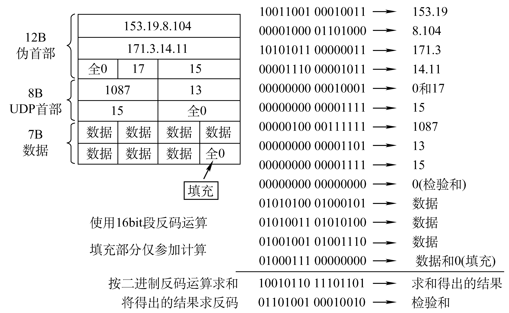

# 5.1 传输层提供的服务

## 5.1.1 传输层的功能

从通信和信息处理的角度看，传输层向它上面的应用层提供通信服务，它属于面向通信部分的最高层，同时也是用户功能中的最低层。

传输层位于网络层之上，它为运行在不同主机上的进程之间提供了逻辑通信，而网络层提供了主机之间的逻辑通信。显然，即使当网络层协议是不可靠的，也就是<u>即使网络层协议会使分组丢失、混乱和重复，传输层同样也能为应用程序提供可靠的服务</u>。

传输层的功能
* 传输层提供应用进程之间的逻辑通信，即端到端的通信。
* 复用和分用功能
* 传输层提供面向连接或无连接的服务。
* 传输层对收到的报文进行差错检测。

### 逻辑通信

* 对比：网络层提供的是主机与主机之间的逻辑通信，传输层提供的是应用进程与应用进程之间的逻辑通信
* 当传输层采用面向连接的TCP时，尽管下面的网络是不可靠的，但这种逻辑通信信道就相当于是一条全双工的可靠信道。但当传输层采用无连接的UDP时，这种逻辑通信信道仍然是一条不可靠信道。

### 复用与分用

* 发送方的复用和接收方的分用
	* **复用**：是指发送方不同的应用进程都可以使用同一个传输层协议传送数据；
	* **分用**：是指接收方的传输层在剥去报文的首部后能够把这些数据正确交付到目的应用进程。

### 差错检测

* 不论是面向连接的TCP协议还是无连接的UDP协议，都会对首部以及数据部分进行CRC校验
	* TCP协议中，接收方如果发现报文段出错，则会要求发送方重发该报文段
	* UDP协议中，接收方如果发现数据报出错，则会直接丢弃
* 对比：传输层会对首部和数据部分进行差错检测，而网络层只检查IP数据报的首部。

## 5.1.2 传输层的寻址与端口

### 端口号

* 端口能够让应用层的各种应用进程将其数据通过端口向下交付给传输层，以及让传输层知道应当将其报文段中的数据向上通过端口交付给应用层相应的进程。
* 端口号就是传输层服务访问点TSAP，<u>标识主机中的应用进程</u>。
* 对比：数据链路层的SAP是MAC地址，网络层的SAP是IP地址，传输层的SAP是端口号。
* 硬件端口与软件端口：硬件端口是不同硬件设备进行交互的接口，而软件端口是应用层的各种协议进程与传输实体进行层间交互的一种地址。传输层使用的是软件端口。

TCP/IP体系的传输层使用**端口号**来区分应用层的不同进程。端口号长度为16bit，能够表示65536($2^{16}$)个不同的端口号。
端口号只具有本地意义，即端口号只是为了标志本计算机应用层中的各进程，不同计算机的相同端口号是没有联系的。

根据端口号范围可将端口分为两类：
* **服务端使用的端口号**：这一类端口号是静态规定的，这样用户就可以提前知道某个服务器应用程序对应的端口号。这些端口号又可以分为两类：
	* **熟知端口号**：数值为0~1023，互联网地址指派机构(IANA)把这些端口号指派给了TCP/IP中最重要的一些应用程序，让所有的用户都知道。  
	* **登记端口号**：数值为1024~49151。这类端口号是为没有熟知端口号的应用程序使用的，使用这类端口号之前必须在IANA 登记，以防止重复。
* **客户端使用的端口号**：又叫**短暂端口号**，数值为49152~65535，这一类端口号是在客户端进程运行时动态选择的，当通信结束后，该端口号就恢复空闲，可以被其他应用进程使用。

| 应用层协议 |  [FTP](第6章%20应用层.md#6.3%20文件传输协议FTP)  | TELNET | SMTP | [DNS](第6章%20应用层.md#6.2%20域名解析系统DNS) | [DHCP](第4章%20网络层.md#动态主机配置协议DHCP)  | TFTP | [HTTP](第6章%20应用层.md#6.5.2%20超文本传输协议HTTP) | [POP3](第6章%20应用层.md#POP3协议) | SNMP | [BGP](第4章%20网络层.md#4.5.5%20BGP协议) | HTTPS | [RIP](第4章%20网络层.md#4.5.3%20RIP协议)|
|:----------:|:-----:|:------:|:----:|:---:|:-----:|:----:|:----:|:----:|:----:|:---:|:-----:| --- |
|  网络层协议  |  TCP  |  TCP   | TCP  | UDP |  UDP  | UDP  | TCP  | TCP  | UDP  | TCP |  TCP  | UDP |
| 熟知端口号 | 20/21 |   23   |  25  | 53  | 67/68 |  69  |  80  | 110  | 161  | 179 |  443  | 520 |

### 套接字

网络中通过IP地址来标识和区别不同的主机，通过端口号来标识和区分一台主机中的不同应用进程，因此可以利用发送方和接收方的**套接字**(Socket) 组合来识别端点。

套接字实际上是一个通信端点，即`套接字 = (主机IP地址，端口号)`，<u>唯一地标识了网络中的一个主机和其上的一个应用进程</u>。

## 5.1.3 无连接服务与面向连接服务

* **面向连接服务**：是在通信双方进行通信之前，必须先建立连接，在通信过程中，整个连接的情况一直被实时地监控和管理。当通信结束后 ，则应该释放这个连接。—— 可靠，面向连接，时延大，适用于大文件
* **无连接服务**：两个实体之间的通信不需要先建立好连接，需要通信的时候，直接将信息发送到“网络”中，让该信息的传递在网上尽力而为地往目的地传送。——不可靠，无连接，时延小，适用于小文件。

TCP/IP 协议族在IP层之上使用了**两个传输协议** ：
* 面向连接的传输控制协议TCP。 当采用TCP时，传输层向上提供的是一条全双工的可靠逻辑信道。
* 无连接的用户数据报协议UDP。当采用UDP 时，传输层向上提供的是一条不可靠的逻辑信道。

---
**可靠与不可靠**
* 如果一个协议使用确认机制对传输的数据进行确认，那么可以认为它是一个可靠的协议。如：TCP
* 如果一个协议采用尽力而为的传输方式，那么是不可靠的。如：UDP

**IP数据报和UDP数据报的区别**
* IP数据报在网络层要经过路由的存储转发；UDP数据报是在传输层的端到端的逻辑信道中传输，而封装成IP数据报在网络层传输时，UDP数据报的信息对路由是不可见的。
* IP数据报只能找到目的主机而无法找到目的进程；UDP提供端口功能及复用和分用功能，可以将数据报投递给对应的进程

**网络层虚电路和TCP的区别**
* TCP报文段是在传输层抽象的逻辑信道中传输，对路由器不可见；
* 虚电路所经过的交换结点都必须保存虚电路状态信息。在网络层若采用虚电方式，则无法提供无连接服务；
* 而传输层采用TCP协议不影响网络层提供无连接服务。
### TCP vs UDP

* TCP面向连接，UDP无连接
* TCP仅支持一对一通信，UDP支持一对一、一对多、多对一和多对多交互通信
* TCP面向字节流，UDP对应用层交付的报文直接打包
* TCP向上提供面向连接可靠的传输服务，UDP向上提供无连接不可靠的传输服务
* TCP首部最小20字节最大60字节，UDP首部8字节

# 5.2 UDP协议

> UDP协议号17

\[RFC 768\]定义的UDP只是做了传输协议能够做的最少工作，只在IP的数据报服务之上增加了两个最基本的服务：<u>复用和分用以及差错检测</u>。

**UDP特点**
* UDP是<u>无连接的</u>，减少开销和发送数据之前的时延。
* UDP使用最大努力交付，即<u>不保证可靠交付</u>。（可靠性由应用层保证）
* UDP是<u>面向报文的</u>，适合一次性传输少量数据的网络应用。（对于应用层发送来的报文，UDP仅添加一个首部就交付给网络层，不会拆分合并；对于网络层上交的数据报，UDP也仅将首部去除后就交给应用层）
* UDP<u>无拥塞控制</u>，适合很多实时应用 。
* UDP首部只有8B，相比于TCP的20B<u>首部开销小</u>。

**UDP适用场景**
* 允许数据有少量丢失，但不接受较大时延的实时应用，如直播、视频通话等。
* 只进行简单的请求-响应通信的过程。
* 某些路由选择更新协议，如RIP协议。
* 需要进行多播的应用。

## 5.2.1 UDP数据报

UDP数据报包含两个部分：UDP首部和用户数据，整个UDP数据报作为IP数据报的数据部分封装在IP数据报中。

**UDP的首部格式**：UDP首部8个字节，由4个字段组成，每个字段的长度都是两个字节。各字段意义如下：
* **源端口**：源端口号。在需要对方回信时选用。不需要时可填入全0。
* **目的端口**：目的端口号。在终点交付报文时必须要使用到。
	* 当传输层从IP层收到UDP数据报时，就根据首部中的目的端口，把UDP数据报通过相应的端口，上交给应用进程。
	* 如果接收方UDP发现收到的报文中的目的端口号不正确（即不存在对应于端口号的应用进程），就丢弃该报文，并由ICMP发送 “端口不可达” 差错报文给发送方。
* **长度**：UDP数据报的长度（包括首部和数据）。其最小值是8，此时仅有首部而没有数据部分。
* **校验和**：用于差错检测，有错就丢弃。该字段是可选的，若源主机不想计算校验和，则直接令该字段为全0。

## 5.2.2 UDP校验

为了进行差错检测，UDP需要计算校验和，并将结果存储在UDP数据报首部的校验和字段中。
* UDP计算校验和时，要将首部和数据部分一起检验。
* UDP计算校验和与IP计算首部校验和相似，都使用二进制反码运算求和再取反。
* UDP计算校验和时，要在UDP数据报之前增加12个字节的<u>伪首部</u>（类似IP首部）。^[伪首部并不是UDP真正的首部。只是在计算校验和时，临时添加在UDP数据报的前面，得到一个临时的UDP数据报。校验和就是按照这个临时的UDP数据报计算的。伪首部既不向下传送也不向上递交，而仅仅是为了计算校验和。这样的校验和，既检查了UDP数据报，又对IP数据报的源IP地址和目的IP地址进行了检验。]
	* 17：封装UDP报文的IP数据报首部协议字段是17
	* UDP长度：UDP首部8B + 数据部分长度（不包括伪首部）

**UDP校验和计算过程**

在发送端：
1. 填上伪首部
2. 全0填充检验和字段
3. 若UDP报文总长度不是偶数，则在数据部分添加一个全0的字节(但不发送)。
4. 每两个字节为一组，使用二进制反码求和来计算校验和^[从低位到高位逐列进行带进位的加法，最高位的进位补到最低位]
5. 把和求反码填入检验和字段（如果校验和的计算结果恰好为0，就将校验和字段置为全1）
6. 去掉伪首部，发送

在接收端：
1. 填上伪首部
2. 若UDP报文总长度不是偶数，则在数据部分添加一个全0的字节
3. 每两个字节为一组，使用二进制反码求和（与发送端的计算相比，只有校验和字段不同）
4. <u>结果全为1则无差错</u>，否则丢弃数据报/交给应用层附上出差错的警告。

# 5.3 TCP协议

> TCP协议号6

## 5.3.1 TCP协议的特点

TCP是在不可靠的IP层之上实现的可靠的数据传输协议，它主要解决传输的可靠、有序、 无丢失和不重复的问题。主要特点如下：
* TCP是面向连接（虚连接）的传输层协议。
* TCP是一对一的。每一条TCP连接只能有两个端点，每一条TCP连接只能是点对点的。
* TCP提供可靠交付的服务。保证传送的数据无差错、不丢失、不重复、按序到达。
* TCP提供全双工通信。TCP 允许通信双方的应用进程在任何时候都能发送数据，为此TCP连接的两端都设有发送缓存和接收缓存 ，用来临时存放双向通信的数据。
	* 发送缓存：准备发送的数据；己发送但尚未收到确认的数据。
	* 接收缓存：按序到达但尚未被接受应用程序读取的数据；不按序到达的数据。
* TCP是面向字节流的。虽然应用程序和TCP的交互是一次一个数据块（大小不等）， 但TCP把应用程序交下来的数据看成仅仅是一连串的无结构的字节流。（**流**：流入到进程或从进程流出的字节序列）。

## 5.3.2 TCP报文段

TCP是面向字节流的，传送的数据单元为**报文段**。一个TCP报文段分为TCP首部和TCP数据两部分，整个TCP段作为IP数据报的数据部分封装在IP数据报中。
* 首部的前20字节是固定的。TCP报文段的首部最短为20字节，后面有4N字节是根据需要而增加的选项，长度为4字节的整数倍。
* TCP报文段既可以用来运载数据，也可以用来建立连接、释放连接和应答。

### TCP报文段首部

各字段意义：
* **源端口和目的端口字段**：各占16位。分别表示发送方进程使用的端口号和接收方进程使用的端口号
* **序号字段**：占32位。TCP是面向字节流的，所以TCP连接中传送的数据流中的每一个字节按序编号。<u>序号字段存储的是本报文段数据部分第一个字节的序号</u>。
* **确认号字段**：占32位。表示期望的下一个报文段中数据部分的第一个字节的序号。 若确认号 $=N$ ，则表明到序号 $N-1$ 为止的所有数据都己正确收到，期望接收序号为 $N$ 的数据。
* **数据偏移字段**：占4位，单位为4字节。表示首部长度，即TCP报文段数据部分起始处与报文段起始处的距离。当此字段的值为15时， 达到TCP首部的最大长度60字节。
* **保留字段**：占6位。保留为今后使用，但目前应置为0。
* **6个控制位**
	* **紧急位URG**：URG=1时，代表此报文段中有紧急数据，需要尽快传送，不用在缓存里排队。URG与紧急指针配套使用。
	* **确认位ACK**：ACK=1时，确认号字段有效，否则无效。TCP规定，在连接建立后所有传送的报文段都必须把ACK置为1。
	* 推送位PSH：PSH=1时，接收方应该报文段尽快交付接收应用进程，不再等到缓存填满再向上交付。
	* 复位RST：RST=1时，表明TCP连接中出现严重差错，必须释放连接，然后再重新建立传输链接。RST=1也可用于拒绝一个非法的报文段或拒绝打开一个TCP连接
	* **同步位SYN**
		* SYN=1时，表示这是一个连接请求或连接接收报文。
			* 当SYN=1，ACK=0时，表明这是一个连接请求报文；
	* **终止位FIN**：FIN=1时，表明此报文段发送方数据己发完，要求释放连接。
* **窗口字段**：占16位，单位为字节。它指出了现在允许对方发送的数据量，接收方的数据缓存空间是有限的，故用窗口值作为接收方让发送方设置其发送窗口的依据，单位为字节。
* **检验和字段**：占16位。检验和字段检验的范围包括首部和数据这两部分。
* **紧急指针字段**：占 16 位，单位为字节。URG=1时才有意义，指出在本报文段中紧急数据长度。规定紧急数据在报文段数据部分的最前面，因此从第一个字节到紧急指针所指字节就是紧急数据。
* **选项字段**：长度可变。
	* 最大报文段长度MSS选项：Maximum Segment Size，即TCP报文段中数据部分的最大长度
	* 窗口扩大选项：为了扩大窗口，提高吞吐率
	* 时间戳选项：计算往返时间以及处理序号超范围的情况
	* 选择确认选项：实现选择确认功能
* **填充字段**：整个首部长度必须是4字节的整数倍，不足的部分就用填充字段补齐。

## 5.3.3 TCP连接管理

TCP是面向连接的协议。因此每一个TCP连接都有<u>三个阶段：连接建立、数据传送和连接释放</u>。TCP连接的管理就是使运输连接的建立和释放都能正常进行。

TCP连接的建立采用<u>客户/服务器方式</u>。 主动发起连接建立的应用进程叫做客户机(Client)，而被动等待连接建立的应用进程叫做服务器(Server)。

### TCP连接建立

连接的建立经历以下 3 个步骤，通常称为“<u>三次握手</u>”：

TCP的连接建立要解决以下三个问题：
* 使TCP双方能够确知对方的存在
* 使TCP双方能够协商一些参数（如最大窗口值、是否使用窗口扩大选项和时间戳选项以及服务质量等）
* 使TCP双方能够对运输实体资源（如缓存大小、连接表中的项目等）进行分配

0. 阶段0：服务器首先先要进入LISTEN状态，等待客户端的连接。
1. 阶段1：客户端向服务器发送一个**连接请求报文段**，进入SYN-SENT阶段——`SYN=1, seq=x(随机)`
	* 连接请求报文段不携带数据，但要消耗掉一个序号 。
2. 阶段2：服务器收到连接请求段后，如同意建立连接，就向客户端发回**确认报文段**，进入SYN-RCVD阶段，并为该TCP连接分配TCP缓存和变量——`SYN=1, ACK=1, seq=y(随机), ack=x+1`
	* 确认报文段不携带数据，但也要消耗掉一个序号。
3. 阶段3：客户端收到确认报文段后，向服务器发送**确认报文段**，且给该连接分配缓存和变量，进入ESTABLISHED阶段。服务器收到确认报文段后也进入ESTABLISHED阶段——`SYN=0，ACK=1，seq=x+1, ack=y+1`^[提示：采用“三报文握手”而不是“两报文握手”来建立TCP连接，是为了防止已失效的TCP连接请求报文段突然又传送到了TCP服务器进程，因而导致错误。]
	* 该确认报文段如果不携带数据则不消耗序号。 

注意：
* TCP提供的是全双工通信，因此通信双方的应用进程在任何时候都能发送数据。
* 补充：如果两个端口之间已经建立了TCP连接，再次建立连接会建立失败，且不影响原本建立连接的传输
* 服务器端的资源是在完成第二次握手时分配的，而客户端的资源是在完成第三次握手时分配的。这就使得服务器易于受到SYN洪泛攻击。

### SYN洪泛攻击

SYN洪泛攻击发生在OSI第四层，这种方式利用TCP协议的特性，就是三次握手。<u>攻击者发送 TCP SYN， SYN是TCP三次握手中的第一个数据包，而当服务器返回ACK后，该攻击者就不对其进行再确认，那这个TCP连接就处于挂起状态</u>，也就是所谓的半连接状态，服务器收不到再确认的话，还会重复发送ACK给攻击者。这样更加会浪费服务器的资源。攻击者就对服务器发送非常大量的这种TCP连接，由于每一个都没法完成三次握手，所以在服务器上，这些TCP连接会因为挂起状态而消耗CPU和内存，最后服务器可能死机，就无法为正常用户提供服务了。

解决方法：SYN cookie

### TCP连接释放

参与一条TCP连接的两个进程中的任何一个都能终止该连接，连接结束后，主机中的“资源”（缓存和变量）将被释放。TCP连接释放的过程通常称为“<u>四次挥手</u>”。

1. 阶段1：若客户端打算关闭连接，就向服务器发送**连接释放报文段**，进入FIN-WAIT-1阶段——`ACK=1，FIN=1, seq=u`
	* 注意：FIN报文段即使不携带数据，也要消耗掉一个序号。
2. 阶段2：服务器收到连接释放请求后，向客户端发送一个**确认报文段**，进入CLOSE-WAIT阶段。客户端收到确认报文段后，进入FIN-WAIT-2阶段——`ACK=1, seq=v, ack=u+1`。
	* 此时，从客户机到服务器这个方向的连接就释放了，<u>TCP连接处于半关闭状态</u>。但服务器若发送数据，客户机仍要接收，即从服务器到客户机这个方向的连接并未关闭。
3. 阶段3：若服务器已经没有要发送的数据，就向客户端发送**连接释放报文段**，进入LAST-ACK阶段。`FIN=1，ACK=1，seq=w，ack=u+1` 。
	* 如果没有要发送的数据，则阶段二三可以合并。
4. 阶段4：客户机收到连接释放请求后，向服务器发送**确认报文段**，进入TIME-WAIT阶段——`ACK=1, seq=u+1, ack=w+1`。注意此时 TCP连接还没有释放掉，必须经过时间等待计时器设置的时间2MSL(最长报文段寿命)后， A才进入到连接关闭状态。 ^[提示：时间等待阶段的设置，是为了避免客户机发送的确认报文丢失而导致服务器反复重传释放报文，确保TCP服务进程可以收到最后一个确认报文而进入关闭状态]

## 5.3.4 TCP可靠传输

<u>TCP的任务是在IP层的不可靠的、尽力而为服务的基础上建立一种可靠数据传输服务</u>。TCP提供的可靠数据传输服务就是要保证接收方进程从缓存区读出的字节流与发送方发出的字节流是完全一样的。TCP使用了<u>校验、序号、确认和重传</u>等机制来达到这个目的。

### 计算校验和

计算校验和的过程类似[UDP校验](#5.2.2%20UDP校验)，要在TCP报文段的前面加上12字节的伪首部，只不过将第4个字段改为6，第5个字段改为TCP长度。

### 按字节编号

TCP首部的序号宇段用来保证数据能有序提交给应用层，TCP把数据看成一个无结构但是有序的字节流，而<u>序号是建立在传送的字节流之上</u>，而不是建立在报文段之上。

TCP会按顺序对字节流中的每一个字节都编上序号。序号字段的值则指的是本报文段所发送的数据的第一个字节的序号。假设A和B之间建立了一条TCP连接，A的发送缓存区中总共有10个字节，序号从0开始标号，第一个报文包含第0~2个字节，则该TCP报文段的序号是0；第二个报文段的序号是3。

### 确认机制

* TCP首部的**确认号**是期望收到对方的下一个报文段的数据的第一个字节的序号。发送方缓存区会继续存储那些已经发送但未收到确认的报文段，以便在需要的时候重传。
* TCP的差错恢复机制可以理解为是[GBN协议](第3章%20数据链路层.md#3.4.3%20后退N帧协议(GBN))和[SR协议](第3章%20数据链路层.md#3.4.4%20选择重传协议(SR))的混合体，使用**累计确认**，但又保留失序的报文。例如收到了123,78，则首部确认号字段仍为4，而且收到56后78不需要重传

### 重传机制

有两种事件会导致TCP对报文段进行重传：**超时**和**冗余ACK**。

#### 超时重传

TCP的超时重传机制与[3.4.2 停止-等待协议](第3章%20数据链路层.md#3.4.2%20停止-等待协议)中介绍的基本一致。发送方会给发送的每一个报文段都设置一个超时计时器，只要计时器设置的重传时间到期但还没有收到确认，就要重传这一报文段。
* 由于TCP的下层是一个互联网环境，IP数据报所选择的路由变化很大。因而传输层的往返时延的方差也很大。为了计算超时计时器的重传时间，TCP采用一种自适应算法，它记录一个报文段发出的时间，以及收到相应确认的时间，这两个时间之差叫做报文段的**往返时间RTT**(Round-Trip Time)。
* TCP保留了RTT的一个**加权平均往返时间**$RTT_{S}$，当第一次测量RTT样本时，$RTT_{S}$值就为所测量到的RTT样本的值，但以后每测量一个新的 RTT样本，就重新计算一次$RTT_{S}$。
	* 公式：$新的RTT_{S}=(1-\alpha)\cdot (旧的RTT_S)+\alpha\cdot(新的RTT样本)$
	* 参数：$0\leq\alpha\leq1$ ，若 $\alpha$ 接近于0，表示新的$RTT_{S}$值和旧的$RTT_{S}$值相比变化不大，而受新的RTT样本影响较小（RTT 值更新较慢）；若 $\alpha$ 接近于1，则表示新的$RTT_{S}$值受新的RTT样本的影响较大 （RTT值更新较快）。$\alpha$ 的推荐值为0.125。
* 超时计时器设置的**超时重传时间**$RTO$ (Retransmission Time-Out) 应略大于加权平均往返时间$RTT_{S}$：
	* 公式：$RTO=RTT_{S}+4\cdot RTT_{D}$
	* 参数：$RTT_{D}$ 是RTT的偏差的加权平均值，它与$RTT_{S}$和新的RTT样本之差有关。当第一次测量时，$RTT_{D}$取为测量到的RTT样本值的一半。但以后每测量一个新的 RTT样本，就重新计算一次$RTT_{D}$。
	* 公式：$新的 RTT_D=(1-\beta)\cdot(旧的RTT_D)+\beta\cdot|RTT_S-新的RTT样本|$
	* 参数：$\beta$ 是个小于1的系数，它的推荐值是0.25。
* 往返时间RTT测不准的问题：针对出现超时重传时无法测准往返时间RTT的问题，Karn提出了一个算法：在计算加权平均往返时间$RTT_{S}$时，只要报文段重传了，就不采用其往返时间RTT样本。也就是说出现重传时，不重新计算$RTT_{S}$，进而超时重传时间RTO也不会重新计算
* Karn算法带来的问题：如果报文段的时延突然增大了很多，并且之后很长一段时间都保持这种时延，因此在原来得出的RTO内，不会收到确认报文段，于是就重传报文段。但根据Karn算法，不考虑重传的报文段的RTT样本，因此RTO就无法更新，这会导致报文段反复被重传。因此对Karn算法进行修正，方法是：报文段每重传一次，就把RTO增大一些。典型的做法是将新RTO的值取为旧RTO的2倍。 

#### 冗余ACK重传

TCP规定每当比期望序号大的失序报文段到达时，发送一个**冗余ACK**，指明下一个期待字节的序号。 冗余ACK就是再次确认某个报文段的ACK，而发送方先前已经收到过该报文段的确认。

TCP规定<u>当发送方收到对同一个报文段的3个冗余ACK时，就可以认为跟在这个被确认报文段之后的报文段已经丢失</u>。^[收到3个冗余的ACK是指收到第一个ACK后又收到了三个重复的ACK，所以发送方一共收到了4个相同的ACK]如：发送方己发送1, 2, 3, 4, 5报文段
1. 接收方收到1，返回给1的确认（确认号为2的第一个字节）
2. 接收方收到3，仍返回给1的确认（确认号为2的第一个字节）
3. 接收方收到4，仍返回给1的确认（确认号为2的第一个字节）
4. 接收方收到5，仍返回给1的确认（确认号为2的第一个字节）
5. 发送方收到3个对于报文段1的冗余ACK，则认为2报文段丢失，重传2号报文段（快速重传）

## 5.3.5 TCP的流量控制

TCP提供了**流量控制**服务以消除发送方使接收方缓存区溢出的可能性，因此可以说流量控制是一个速度匹配服务(匹配发送方的发送速率与接收方的读取速率)。TCP利用**滑动窗口机制**实现流量控制。
* 在通信过程中，<u>接收方根据自己接收缓存的大小，动态地调整发送方的发送窗口大小</u>，这就是**接收窗口rwnd**，即调整TCP报文段首部中的“窗口”字段值，来限制发送方向网络注入报文的速率。
* 同时，发送方根据其对当前网络拥塞程序的估计而确定的窗口值，称为**拥塞窗口 cwnd**，其大小与网络的带宽和时延密切相关。<u>发送方的发送窗口取接收窗口rwnd和拥塞窗口cwnd的最小值</u>。
* 注：即使接收窗口为0，也必须接收零窗口探测报文段、确认报文段以及携带有紧急数据的报文段。

示例：A向B发送数据，连接建立时，B告诉A：“我的rwnd=400(字节)"，假设每一个报文段100B，报文段序号初始值为1。

* 假设：当响应主机B的滑动窗口值为0时，主机A会一直等待B的确认。如此时主机B发送报文来调整滑动窗口值，但该报文丢失时，就会形成一个死锁局面。即：主机A等待主机B发送非零窗口的通知，主机B等待主机A发送数据
* 解决：
	* TCP为每一个连接设有一个持续计时器，只要TCP连接的一方收到对方的零窗口通知，就启动持续计时器。
	* 若持续计时器设置的时间到期， 就发送一个零窗口探测报文段。 接收方收到探测报文段时给出现在的窗口值。
	* 若窗口仍然是0，那么发送方就重新设置持续计时器，如果不是0即可破坏死锁。

注意：**传输层 & 数据链路层流量控制的区别**
* 数据链路层的流量控制是点对点的，传输层的流量控制是端到端的
* 数据链路层中接收方收不下就不回复确认，传输层中接收方会发送窗口公告
* 数据链路层中滑动窗口协议的窗口大小不能动态变化，传输层则可以动态变化。

补充：滑动窗口大小对主机的影响
* 滑动窗口设置过小，会产生过多的ACK（因为窗口大可以累积确认，ACK更少）
* 滑动窗口设置过大，会由于传送的数据过多而使路由器变得拥挤，导致主机可能丢失分组

## 5.3.6 TCP拥塞控制

出现拥塞的条件：对资源需求的总和＞可用资源

网络中有许多资源同时呈现供应不足 -> 网络性能变坏 -> 网络吞吐量将随输入负荷增大而下降

<u>拥塞控制就是防止过多的数据注入网络中</u>，这样可以使网络中的路由器或链路不致过载。当出现拥塞时，端点并不能了解到拥塞发生的细节，对通信连接的端点来说，拥塞往往表现为通信时延的增加。当然拥塞控制和流量控制也有相似的地方，都是通过控制发送方发送数据的速率来达到效果的。

**拥塞控制 & 流量控制区别**
* 拥塞控制：是让网络能够承受现有的网络负荷，它是一个<u>全局性的</u>过程，涉及所有的主机、所有的路由器，以及与降低网络传输性能有关的所有因素。
* 流量控制：往往是指<u>点对点的</u>通信量的控制，即接收端控制发送端，它所要做的就是抑制发送端发送数据的速率，以便使接收端来得及接收。

为了更好地对传输层进行拥塞控制，因特网建议标准定义了以下四种算法：**慢开始、拥塞避免、快重传、快恢复**

<u>发送方</u>在确定发送报文段的速率时，既要根据接收方的接收能力，又要从全局考虑不要使网络发生拥塞。因此，TCP协议要求发送方维护以下两个窗口：
* **接收窗口rwnd**：<u>接收方</u>根据目前接收缓存大小所许诺的最新的窗口值，<u>反映了接收方的容量</u>。由接收方根据其放在TCP报文的首部的窗口字段通知发送方。
* **拥塞窗口cwnd**：<u>发送方</u>根据自己估算的网络拥塞程度而设置的窗口值，<u>反映了网络的当前容量</u>。只要网络没有出现拥塞，拥塞窗口就再增大一些，以便把更多的分组发送出去。但只要网络出现拥塞，拥塞窗口就减小一些，以减少注入网络中的分组数。^[判断拥塞的依据：没有按时接收到应当到达的确认报文，即重传计时器超时，发生了超时重传]
* **发送窗口**的上限值取接收窗口rwnd和拥塞窗口cwnd中较小的一个：$发送窗口上限值=\min[rwnd，cwnd]$ 

假定如下条件：
* 数据单方向传送，而另一个方向只传送确认
* 接收方总是有足够大的缓存空间，即发送窗口的大小取决于网络的拥塞程度
* 以最大报文段MSS的个数为讨论问题的单位，而不是以字节为单位

### 慢开始和拥塞避免

* 传输轮次：发送了一批报文段并收到它们的确认所经历的时间（一个往返时延RTT）
* **慢开始算法**：每收到一个对新的报文段的确认后，cwnd值$+1$，即每个传输轮次后cwnd值$\times2$，使cwnd按指数规律增长。用这样的方法逐步增大发送方的拥塞窗口cwnd，可以使分组注入到网络的速率更加合理。
	* 注意：一个传送轮次内如果拥塞窗口到达了ssthresh就不再增大，并在下一轮次开始执行拥塞避免算法
* **拥塞避免算法**：每个传输轮次后cwnd值$+1$而不是加倍，使cwnd按线性规律缓慢增长
* **网络拥塞的处理**：当网络出现拥塞时，<u>把慢开始门限ssthresh设置为出现拥塞时的发送方cwnd值的一半</u>（但不能小于2）。 然后<u>把拥塞窗口cwnd重新设置为1，执行慢开始算法</u>。^[这样做的目的就是要迅速减少主机发送到网络中的分组数，使得发生拥塞的路由器有足够时间把队列中积压的分组处理完毕]

根据 cwnd 的大小执行不同的算法，可归纳如下：
* 在 TCP刚刚连接好，开始发送TCP报文段时，先令拥塞窗口cwnd=1，使用慢开始算法
* 当 cwnd < ssthresh 时，使用慢开始算法。
* 当 cwnd > ssthresh 时，停止使用慢开始算法而改用拥塞避免算法。
* 当 cwnd = ssthresh 时，既可使用慢开始算法，也可使用拥塞避免算法(通常做法)。

---
* 慢开始是指一开始向网络注入的报文段少，并不是指拥塞窗口cwnd增长速度慢
* 拥塞避免是指在拥塞避免阶段把拥塞窗口控制为按线性规律增长，使网络比较不容易出现拥塞，并不是指能完全能避免拥塞。

**慢开始和拥塞避免算法的实现举例**

1. 初始时，拥塞窗口置为1，即cwnd=1，慢开始门限置为16，即ssthresh=16。慢开始阶段，cwnd初值为1，以后发送方每收到一个确认ACK，cwnd值 $+1$ ，也即经过每个传输轮次cwnd值$\times2$
2. 当拥塞窗口cwnd增长到慢开始门限ssthresh时(即cwnd=16)，改用拥塞避免算法，cwnd 按线性规律加性增长，每个传送轮次 $+1$。
3. 假定cwnd=24时，网络发生拥塞，则更新ssthresh值为12 (即 $\mathrm{ssthresh}=\dfrac{\mathrm{cwnd}}{2}=12$)，cwnd重置1，并执行重新执行慢开始算法。
4. 当拥塞窗口cwnd增长到新的慢开始门限时(即cwnd=12)，改用拥塞避免算法。

### 快重传和快恢复

> 快重传和快恢复算法是对慢开始和拥塞避免算法的改进。

有时，个别报文段会在网络中丢失，但实际上网络并未发生拥塞，这将导致发送方超时重传，并误认为网络发生了拥塞，错误地启动慢开始算法，因而降低了传输效率

* **快重传**：所谓快重传，是指令发送方尽快进行重传，而不是等超时计时器超时再重传
	* 要求接收方不要等待自己发送数据时才进行捎带确认，而是要立即发送确认，即使收到了失序的报文段也要立即发出对已收到的报文段的重复确认。
	* 发送方一旦收到3个连续的重复确认，就将相应的报文段立即重传，而不是等该报文段的重传计时器超时再重传。
* **快恢复**：发送方一旦收到3个重复确认，就知道现在只是丢失了个别的报文段，于是不启动慢开始算法，而是执行快恢复算法。
	* 发送方将慢开始门限ssthresh值和拥塞窗口cwnd的值调整为当前窗口的一半，开始执行拥塞避免算法 

---

实际上，慢开始、拥塞避免算法、快重传和快恢复几种算法应该是同时应用在拥塞控制机制之中的，当发送方检测到超时的时候就采用慢开始和拥塞避免， 当发送方接收到冗余ACK的时候就采用快重传和快恢复。

# 5.4 小结

> 知识架构

