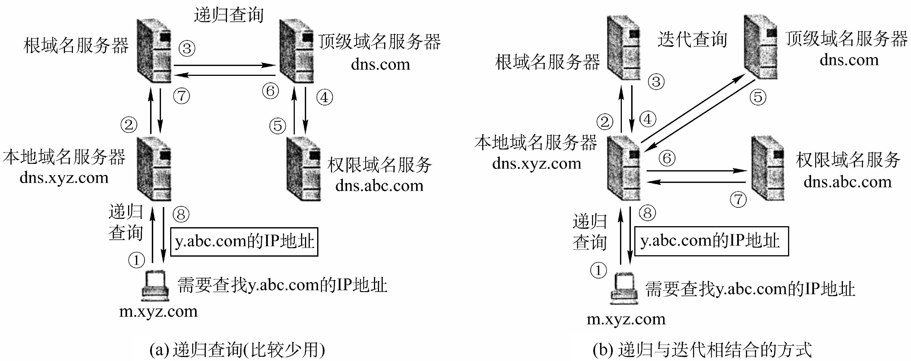
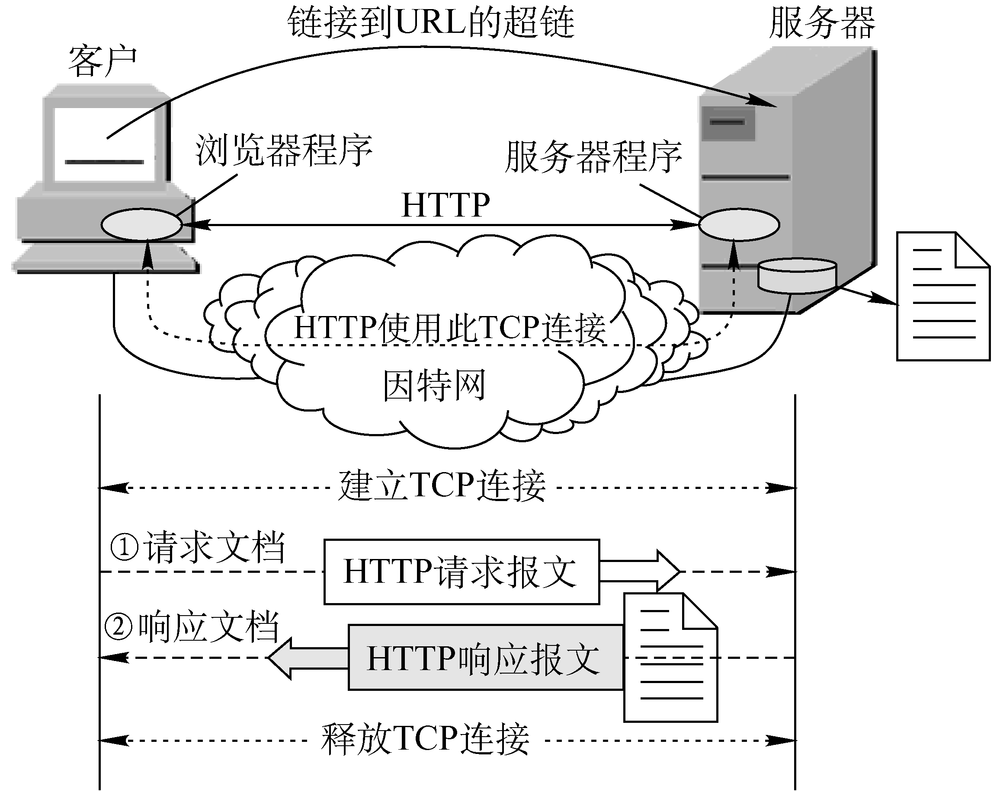

应用层对应用程序的通信提供服务

应用层协议定义：
* 应用进程交换的报文类型，请求还是响应？
* 各种报文类型的语法，如报文中的各个字段及其详细描述。
* 字段的定义，即包含在字段中的信息的含义。
* 进程何时、如何发送报文，以及对报文进行响应的规则。

应用层功能：
* 文件传输、访问和管理
* 电子邮件
* 虚拟终端
* 查询服务和远程作业登录

应用层重要协议
* FTP
* SMTP、POP3
* HTTP

# 6.1 网络应用模型

开发一种新的网络应用首先考虑的问题就是网络应用程序在各终端系统上的组织方式和它们之间的关系。目前流行的主要有以下两种：
* 客户服务器方式(Client/Server, C/S)
* 对等方式(Peer-to-Peer, P2P)

## 6.1.1 客户/服务器模型(C/S)

在客户/服务器(Client/Server, C/S)模型中，有一个总是打开的主机称为**服务器** ， 它服务于许多来自其他称为**客户机**的主机请求。

客户/服务器模型最主要的特征是：<u>客户是服务请求方，服务器是服务提供方</u>。

**服务器**：提供计算服务的设备。
* 服务器总是处于运行状态，并等待客户的服务请求
* 服务器具有固定端口号，而运行服务器的主机也具有固定的IP地址

**客户机**：请求计算服务的主机。
* 与服务器通信，使用服务器提供的服务
* 间歇性接入网络
* 可能使用动态IP地址
* 不与其他客户机直接通信

常见的使用客户/服务器模型的应用包括 Web、文件传输 (FTP)、远程登录和电子邮件等。

### C/S模型的主要特点

* 网络中各计算机的地位不平等，服务器可以通过对用户权限的限制来达到管理客户机的目的，使它们不能随意存储/删除数据，或进行其他受限的网络活动。整个网络的管理工作由少数服务器担当，故网络的管理非常集中和方便。
* 客户机相互之间不直接通信。例如，在 Web 应用中两个浏览器并不直接通信。
* 可扩展性不佳。受服务器硬件和网络带宽的限制，服务器支持的客户机数有限。

## 6.1.2 对等模型(P2P)

在 P2P模型中，没有固定的服务请求者与服务提供者，分布在网络边缘各端系统中的应用进程是对等的，被称为**对等方**。对等方相互之间直接通信，每个对等方既是服务的请求者，又是服务的提供者。

P2P模型从本质上来看仍然是使用客户/服务器方式，<u>每个结点既作为客户访问其他结点的资源，也作为服务器提供资源给其他结点访问</u>。当前比较流行的P2P应用主要包括：P2文件共享、即时通信、P2P流媒体、分布式存储等

### P2P模型的主要特点

* 不存在永远在线的服务器
* 每个主机既可以提供服务，也可以请求服务
* 任意端系统/节点之间可以直接通讯
* 节点间歇性接入网络
* 节点可能改变IP地址
* 可扩展性好
* 网络健壮性强

## P2P & C/S 比较

优点

* 减轻了服务器的计算压力，消除了对某个服务器的完全依赖，可以将任务分配到各个结点上，因此大大提高了系统效率和资源利用率。
	* 例如，播放流媒体时对服务器的压力过大，而通过P2P模型，可以利用大量的客户机来提供服务。
* 多个客户机之间可以直接共享文档。
* 可扩展性好，传统服务器有响应和带宽的限制，因此只能接受一定数量的请求。
* 网络健壮性强，单个结点的失效也不会影响其他部分的结点。

缺点：在获取服务的同时，还要给其他结点提供服务，因此会占用较多的内存，影响整机速度。
## 6.1.3 本节习题精选

**选择题**：[题目](4%20计算机网络/王道计算机网络.pdf#page=262&selection=680,0,683,1)、[答案](4%20计算机网络/王道计算机网络.pdf#page=263&selection=573,0,576,1)

# 6.2 域名解析系统DNS

**域名系统 DNS** (Domain Name System) 是因特网使用的命名系统，用来把便于人们记忆的含有特定含义的主机名 (如 www.cskaoyan.com) 转换为便于机器处理的IP地址。相对于IP地址，人们更喜欢使用具有特定含义的字符串来标识因特网上的计算机。<u>DNS 系统采用客户/服务器模型，其协议运行在UDP 之上，使用 53 号端口</u>。

DNS分为3个部分：层次域名空间、域名服务器和解析器。

## 6.2.1 层次域名空间

因特网采用层次树状结构的命名方法，并使用分布式的域名系统DNS。采用这种命名方法，任何一个连接在因特网上的主机或路由器，都有一个唯一的层次结构的名字，即**域名** (Domain Name)。 “域” (Domain) 是名字空间中一个可被管理的划分。

| www.     | cskaoyan. | com      |
| -------- | --------- | -------- |
| 三级域名 | 二级域名  | 顶级域名 |

域名中使用标号注意点
* 域名的结构由若干分量组成，各分量之间用点 (“.”) 隔开，分别代表不同级别的域名。
* 每一级域名都是由英文字母和数字组成，不区分大小写
* 每级域名不超过63个字符，完整域名不超过255个字符。
* 级别最低的域名写在最左边，而级别最高的顶级域名写在最右边。
* 各级域名由其上一级域名管理机构管理，而最高的顶级域名则由因特网名称与数字地址分配机构ICMNN进行管理

### 顶级域名

顶级域名 (Top Level Domain, TLD) 有以下三大类
* 国家顶级域名 nTLD。国家和某些地区的域名，如 “.en” 表示中国，“.us” 表示美国，“.uk” 表示英国，“.hk’’ 表示中国香港特区。
* 通用顶级域名 gTLD。常见的有 “.com”(公司企业)、“.net”(网络服务机构)、“.org”(非营利性的组织)、“int”(国际组织)、“edu”(美国教育机构)、 “.gov” (美国的政府部门)、“mil”(美国军事部门)等。
* 基础结构域名。这种顶级域名只有一个，即arpa，用于反向域名解析，即将IP地址解析为域名，因此又称为反向域名。

### 二级域名

国家顶级域名下注册的二级域名均由该国家自行确定。
我国将二级域名划分为以下两类：
* 类别域名。ac（科研机构）、com（工、商、金融等企业）、edu（教育机构）、gov（政府部门）、net（提供网络服务的机构）、mil（军事机构）和org（非营利性组织）。
* 行政区域名。共34个，适用于我国的各省、自治区、直辖市。例如：bj为北京市、sh为上海市、js为江苏省，等等。

在域名系统中，每个域分别由不同的组织进行管理。每个组织都可以将它的域再分成一定数目的子域，并将这些子域委托给其他组织去管理 。 例如，管理CN域的中国将 EDU.CN 子域授权给中国教育和科研计算机网 CERNET 来管理。

## 6.2.2 域名服务器

因特网的域名系统被设计成一个联机分布式的数据库系统，并采用客户/服务器模型。域名到IP地址的解析是由运行在域名服务器上的程序完成的，每一个域名服务器不但能够进行一些域名到IP地址的解析，而且还必须具有连向其他域名服务器的信息。

DNS 使用了大量的域名服务器，它们以层次方式组织。没有一台域名服务器具有因特网上所有主机的映射，相反，该映射分布在所有的 DNS 服务器上。采用分布式设计的DNS系统，是一个在因特网上实现分布式数据库的精彩范例。

### 域名服务器类型

本地域名服务器→根域名服务器→顶级域名服务器→权限域名服务器

1. 根域名服务器：根域名服务器是最高层次的域名服务器，每个根域名服务器都知道所有的顶级域名服务器的域名及其IP地址。
	* 根域名服务器用来管辖顶级域 (如.com)，通常不直接把待查询的域名直接转换成IP地址， 而是告诉本地域名服务器下一步应当找哪一个顶级域名服务器进行查询。
2. 顶级域名服务器：<u>负责管理在该顶级域名服务器注册的所有二级域名</u>。
	* 当收到DNS查询请求时就给出相应的回答，可能是最后的结果，也可能是下一级权限域名服务器的IP地址。
3. 授权域名服务器（权限域名服务器）：<u>负责一个区的域名服务器</u>。
	* 每一个主机的域名都必须在某个权限域名服务器处注册登记。因此权限域名服务器知道其管辖的域名与IP地址的映射关系。
	* 另外，权限域名服务器还知道其下级域名服务器的地址。
4. 本地域名服务器（不属于层次结构）：
	* 当一个主机发出DNS查询请求时，这个查询请求报文就首先被发送给该主机的本地域名服务器。
	* 每一个因特网服务提供者ISP，或一个大学，甚至一个大学里的系，都可以拥有一个本地域名服务器。
	* 本地域名服务器离用户较近，一般不超过几个路由器的距离，也有可能就在同一个局域网中。本地域名服务器的IP地址需要直接配置在需要域名解析的主机中。

### DNS域名服务器层次结构

## 6.2.3 域名解析过程

域名解析是指把域名映射成为IP地址或把IP地址映射成为域名的过程。前者称为**正向解析**，后者称为**反向解析**。当客户端需要域名解析时，通过本机的DNS客户瑞构造一个DNS请求报文，以UDP数据报方式发往本地域名服务器。

域名解析有两种方式：递归查询和递归与迭代相结合的查询。
* **递归查询**：主机向本地域名服务器的查询采用的是递归查询。（靠别人）
* **迭代查询**：本地域名服务器向根域名服务器的查询采用法代查询。（靠自己）

* 为了提高DNS的查询效率，并减轻根域名服务器的负荷和减少因特网上的DNS查询报文数量，在域名服务器中广泛地使用了**高速缓存**。高速缓存用来存放最近查询过的域名以及从何处获得域名映射信息的记录。
* 由于域名到IP地址的映射关系并不是永久不变，为保持高速缓存中的内容正确，域名服务器应为每项内容设置计时器并删除超过合理时间的项（例如，每个项目只存放两天）。
* 不但在本地域名服务器中需要高速缓存，在用户主机中也很需要。许多用户主机在启动时从本地域名服务器下载域名和IP地址的全部数据库，维护存放自己最近使用的域名的高速缓存，并且只在从缓存中找不到域名时才向域名服务器查询。同理，主机也需要保持高速缓存中内容的正确性。
## 6.2.4 本节习题精选

**选择题**：[题目](4%20计算机网络/王道计算机网络.pdf#page=268&selection=17,0,22,1)、[答案](4%20计算机网络/王道计算机网络.pdf#page=269&selection=303,0,308,1)

**综合题**：[题目](4%20计算机网络/王道计算机网络.pdf#page=269&selection=173,0,178,2)、[答案](4%20计算机网络/王道计算机网络.pdf#page=270&selection=819,0,825,1)

# 6.3 文件传输协议FTP

* 文件传送协议FTP, File Transfer Protocol
* 简单文件传送协议TFTP, Trivial File Transfer Protocal

两种协议都是文件共享协议中的一个大类，即<u>复制整个文件</u>。其特点是：若要存取一个文件，就必须先获得一个本地的文件副本。如果要修改文件，只能对文件的副本进行修改，然后再将修改后的文件副本传回到原结点 

## 6.3.1 FTP的工作原理

**文件传输协议FTP** (File Transfer Protocol) 是一个用于在计算机网络中在客户端和服务器之间进行文件传输的协议，<u>允许客户指明文件的类型与格式，并允许文件具有存取权限</u>。它屏蔽了各计算机系统的细节，因而适合于在异构网络中任意计算机之间传送文件。

FTP提供的功能：
* 提供不同种类主机系统（硬、软件体系等都可以不同）之间的文件传输能力。
* 以用户权限管理的方式提供用户对远程 FTP 服务器上的文件管理能力。
* 以匿名FTP的方式提供公用文件共享的能力。

FTP的服务组成
* FTP采用客户/服务器的工作方式，它使用TCP可靠的传输服务。一个FTP服务器进程可同时为多个客户进程提供服务。
* FTP 的服务器进程由两大部分组成：一个主进程，负责接收新的请求；若干个从属进程，分别处理各自的请求。

**FTP服务器连接的基本过程**
1. FTP服务器打开控制端口 21，这是后主进程就一直运行在后台等待客户进程来连接。
2. 收到客户进程发出的连接请求后，服务器启动从属进程来处理客户进程的请求，之后主进程与从属进程并发执行，从属进程对客户进程的请求处理完毕后即断开。
3. 服务器继续等待来自其他客户进程的请求。

FTP 服务器必须在整个会话期间保留用户的状态信息。特别是服务器必须把指定的用户账户与控制连接联系起来，服务器必须追踪用户在远程目录树上的当前位置。

## 6.3.2 控制连接与数据连接

### 匿名登录

互连网中有很大一部分FTP服务器被称为**匿名FTP服务器** 。这类服务器的目的是向公众提供文件拷贝服务，不要求用户事先在该服务器进行登记注册，也不用取得FTP服务器的授权。 Anonymous（匿名文件传输）能够使用户与远程主机建立连接并以匿名身份从远程主机上拷贝文件，而不必是该远程主机的注册用户。

用户使用特殊的用户名 `anonymous`登陆FTP服务，就可访问远程主机上公开的文件。

### 控制连接与数据连接

* **控制连接**：服务器监听在21号端口，等待客户连接，建立在这个端口上的连接称为控制连接。
	* 控制连接主要负责控制信息(如连接请求、传送请求等)的传输，以7位ASCII格式传输，在整个会话期间一直保持打开状态。
* **数据连接**：服务器端的控制进程在接收到FTP客户发送来的文件传输请求后就创建“数据传送进程”和 “数据连接”。
	* 数据连接用来连接客户端和服务器端的数据传送进程，数据传送进程实际完成文件的传送，<u>在传送完毕后关闭“数据传送连接”并结束运行</u>。
* **带外传送**：带内控制(In-Band)是指数据和控制信息在同一条连接上传播。FTP使用的是分离的控制连接， 所以也称FTP的控制信息是带外(Out-of-Bnad)传送的。

### 两种传输模式

* 数据连接包含两种传输模式，选择权在客户端
	* **主动方式PORT**：服务器使用默认端口20传输数据，由服务器连接到客户端端口
	* **被动方式PASV**：服务器所用端口协商决定，由客户端连接到服务器临时端口号

## 6.3.3 本节习题精选

**选择题**：[题目](4%20计算机网络/王道计算机网络.pdf#page=272&selection=620,0,625,1)、[答案](4%20计算机网络/王道计算机网络.pdf#page=274&selection=18,0,23,1)

**综合题**：[题目](4%20计算机网络/王道计算机网络.pdf#page=273&selection=658,0,663,2)、[答案](4%20计算机网络/王道计算机网络.pdf#page=275&selection=8,0,13,2)

# 6.4 电子邮件

## 6.4.1 电子邮件系统的组成结构

**电子邮件**：电子邮件(E-mail)是一种异步通信方式，通信时不需要双方同时在场。电子邮件把邮件发送到收件人使用的邮件服务器，并放在其中的收件人邮箱中，收件人可以随时上网到自己使用的邮件服务器进行读取。

一个电子邮件系统应具有三个最主要的组成构件：用户代理、 邮件服务器和电子邮件使用的协议， 如 SMTP、POP3 (或IMAP) 等
* **用户代理UA**：(User Agent)用户与电子邮件系统的接口，用户代理使用户能够通过一个很友好的接口来发送和接收邮件，其至少应当具有<u>撰写、显示、处理和通信</u>的功能。通常情况下，用户代理就是一个运行在PC上的程序，常见的有 Outlook、Foxmail 和 Thunderbird 等。
* **邮件服务器MS**：(Mail Server)<u>负责发送和接收邮件</u>，同时还要向发信人报告邮件传送的情况（己交付、被拒绝、丢失等）。邮件服务器组成了电子邮件系统的核心。
	* 邮件服务器采用客户/服务器方式工作，但它能够同时充当客户和服务器。
* **电子邮件协议**：一组规则，帮助邮件客户端正确地将邮件传输到邮件服务器或从邮件服务器读取邮件。主要包含以下两类：
	* **邮件发送协议**：用于用户代理向邮件服务器发送邮件或在邮件服务器之间发送邮件，如：[SMTP协议](#SMTP协议)
	* **邮件读取协议**：用于用户代理从邮件服务器读取邮件，如：[POP3协议](#POP3协议)

## 6.4.3 SMTP协议&POP3协议

### 电子邮件发送接收过程

1. 发信人调用用户代理来撰写和编辑要发送的邮件，再使用SMTP协议把邮件传送给发送方邮件服务器。
2. 发送方邮件服务器将邮件放入邮件缓存队列中，等待发送。
3. 运行在发送方邮件服务器的SMTP客户进程，发现在邮件缓存中有待发送的邮件，就向运行在接收方邮件服务器的SMTP服务器进程发起建立TCP连接。
4. TCP连接建立后，SMTP客户进程开始向远程的SMTP服务器进程发送邮件。当所有的待发送邮件发完了，SMTP就关闭所建立的TCP连接。
5. 运行在接收方邮件服务器中的SMTP服务器进程收到邮件后，将邮件放入收信人的用户邮箱中， 等待收信人在方便时进行读取。
6. 收信人在打算收信时，调用用户代理，使用POP3 (或IMAP) 协议将自己的邮件从接收方邮件服务器的用户邮箱中的取回 (如果邮箱中有来信的话)。

### SMTP协议
> SMTP协议是一个“推”协议，只能发送邮件

**简单邮件传输协议**：简单邮件传输协议SMTP (Simple Mail Transfer Protocol) 是一种提供可靠且有效的电子邮件传输的协议，规定了在两个相互通信的SMTP进程之间应该如何交换信息。
SMTP规定了14条命令（几个字母）和21种应答信息（三位数字代码+简单文字说明）

由于SMTP使用<u>客户/服务器方式</u>， 因此负责发送邮件的SMTP进程就是SMTP客户，而负责接收邮件的SMTP进程就是SMTP服务器。<u>SMTP用的是TCP连接，端口号25</u>。

#### SMTP传输过程

1. 发件人的邮件发送到发送方邮件服务器的邮件缓存后，SMTP客户就每隔一定时间对邮件缓存扫描一次。
2. 如发现有邮件，就使用SMTP的熟知端口号 (25) 与接收方邮件服务器建立TCP连接。
3. 在连接建立后，接收方发出 “220 Service ready" 表示服务就绪，发送方回复HELO命令并附上发送方的主机名表明发件人身份。
4. 发送方将发件人地址通过MAIL命令发送给接收方，若接收方准备好接收邮件则回复 “250 OK”。
5. 接着发送方发送一个或多个RCPT (recipient)命令标识邮件收件人， 格式为 RCPT TO: <收件人地址>。接收方针对每一个RCPT命令分别判断用户是否存在，若存在则回复 “250 OK”，不存在则回复 “550 No such user here"。
6. 若发送方收到接收方 `250 OK` 的回复，就可以通过 `DATA` 命令表明将要开始邮件传送。接收方回复`354 Start mail input; end with <CRLF>.<CRLF>` 指示发送方可以开始传输邮件内容，并以 `<CRLF>.<CRLF>`作为结束标志
7. 邮件内容发送完毕后，发送方通过 `QUIT` 命令指示接收方退出TCP连接，接收方则返回`221`(服务关闭)同意释放。
补充：
* SMTP不使用中间的邮件服务器。TCP连接总是在发送方和接收方这两个邮件服务器之间直接建立，而不管它们相隔有多远。当接收方的邮件服务器因故障暂时不能建立连接时，发送方的邮件服务器只能等待一段时间后再次尝试连接。
* RCPT命令的作用：弄清接收方系统是否己做好接收邮件的准备，然后才发送邮件。不至于发送了很长的邮件以后才知道是地址错误，以避免浪费通信资源。

#### STMP缺点

* STMP不能传送可执行文件或者其他二进制对象
* STMP只限于传送7位ASCII码，不能传送其他非英语国家的文字
* STMP服务器会拒绝超过一定长度的邮件

改良：[通用因特网邮件扩充MIME](#多用途网际邮件扩充MIME)

### POP3协议
> POP协议是一个“拉”协议，能够接拉取邮件

**邮局协议**：邮局协议POP(Post Office Protocol)是一个非常简单、但功能有限的邮件读取协议，现在使用的是它的<u>第3个版本POP3</u>。POP3采用的是 “拉” (Pull) 的通信方式，当用户读取邮件时，用户代理向邮件服务器发出请求，“拉”取用户邮箱中的邮件。

POP 也使用客户/服务器的工作方式，<u>在传输层使用TCP协议，端口号110</u>。在接收方计算机中的用户代理必须运行POP客户程序，而在接收方的邮件服务器上则运行POP服务器程序。

POP有两种工作方式：“下载并保留” 和 “下载并删除模式”。（由用户选择）
* **“下载并保留” 模式**：用户从邮件服务器上读取了邮件之后，邮件依然会保存在邮件服务器上，用户下次可以再次从服务器上读取该邮件。
* **“下载并删除” 模式**：邮件一旦被读取之后，就被从邮件服务器上删除了，用户不能再次从服务器上读取了。

### 因特网邮件访问协议IMAP

**因特网邮件访问协议**：因特网邮件访问协议IMAP(Internet Message Access Protocol)是一种比POP3更复杂且功能更强大的邮件访问协议，IMAP4是其第4个版本。
* IMAP提供而来在远程邮件服务器中创建或更改文件夹的命令，用户在自己的计算机上就可以操控邮件服务器中的邮件。
* IMAP提供了获取报文部分内容的命令。例如：可以通过只读取报文首部来决定接下来对邮件的操作。

补充：IMAP、POP3都使用明文传输密码

### 基于万维网的电子邮件

* 通过浏览器登录（提供用户名和口令）邮件服务器万维网网站就可以撰写、收发、阅读和管理电子邮件。这种工作模式与IMAP很类似，不同的是用户计算机无需安装专门的用户代理程序，只需要使用通用的万维网浏览器。
* 邮件服务器网站通常都提供非常强大和方便的邮件管理功能，用户可以在邮件服务器网站上管理和处理自己的邮件，而不需要将邮件下载到本地进行管理。
* <u>用户浏览器与邮件服务器之间的发送或接收邮件是使用HTTP协议</u>，而仅在不同邮件服务器之间传送邮件才使用SMTP协议 。

## 6.4.2 电子邮件格式与 MIME

### 电子邮件格式

<u>电子邮件包含首部和主体两个部分</u>。
* 邮件的主体部分由用户自由撰写。
* 邮件的首部格式固定，提供了邮件所需的基本信息。其中包含一些首部行，每个首部行由一个关键字后跟冒号再后跟值组成。有些关键字是必需的，有些则是可选的，如：
	* From：发信人的邮件地址，必填。格式为：发件人邮箱名@邮箱所在主机的域名。
	* To：收信人的邮件地址，必填。格式为：收件人邮箱名@邮箱所在主机的域名。
	* Subject：邮件的主题，反映邮件的主要内容，可选。

### 多用途网际邮件扩充MIME

由于SMTP只能传送一定长度的ASCII码，许多其他非英语国家的文字（如中文、俄文，甚至带重音符号的法文或德文）就无法传送，且无法传送可执行文件及其他二进制对象，因此提出了**多用途网络邮件扩充MIME** (Multipurpose Internet Mail Extensions)。
MIME在发送端将非ASCII码数据转换为7位ASCII码数据，并将其传递给客户端SMTP，如下所示：

MIME 主要包括内容：
* 5个新的邮件首部字段，包括MIME版本、内容描述、内容标识、内容传送编码和内容类型。
* 定义了许多邮件内容的格式，对多媒体电子邮件的表示方法进行了标准化。
* 定义了传送编码，可对任何内容格式进行转换，而不会被邮件系统改变。

通用因特网邮件扩充MIME，使电子邮件系统可以支持声音、图像、视频、多种国家语言等等，使得传输内容丰富多彩。
## 6.4.4 本节习题精选

**选择题**：[题目](4%20计算机网络/王道计算机网络.pdf#page=278&selection=839,0,844,1)、[答案](4%20计算机网络/王道计算机网络.pdf#page=280&selection=342,0,347,1)

**综合题**：[题目](4%20计算机网络/王道计算机网络.pdf#page=279&selection=674,0,679,2)、[答案](4%20计算机网络/王道计算机网络.pdf#page=281&selection=652,0,657,2)

# 6.5 万维网 WWW

## 6.5.1 WWW 的概念与组成结构

万维网WWW (World Wide Web) 是一个大规模的、联机式的信息储藏所/资料空间，是无数个网络站点和网页的集合。在这个空间中：一样有用的事物，称为 一样“资源”；并且<u>由一个全域 “统一资源定位符” (URL) 标识</u>。这些资源通过超文本传输协议 (HTTP) 传送给使用者，而后者通过点击链接来获取资源。

### 万维网内核部分构成标准

万维网的内核部分是由三个标准构成的
* **统一资源定位符 (URL)**：代表了网络上给定资源的地址，每个有效的URL都指向一个唯一的资源。URL相当于一个文件名在网络范围的扩展。URL的一般形式为：`<协议>://<主机>:<端口>/<路径>`
	* 协议：常见的有 http、ftp等。
	* 主机：存放资源的主机在因特网中的域名，也可以是IP地址。
	* 端口 & 路径：有时可以省略。
* **超文本传输协议 (HTTP)**：一种用于获取网络资源的应用层协议，使用TCP连接进行可靠的传输，是万维网客户程序和服务器程序之间交互所必须严格遵守的协议 。
* **超文本标记语言 (HTML)**：一种用于创建网页的标准标记语言，使用一些约定的标记对页面上的各种信息(包括文字、声音、图像、视频等)、格式进行描述。

> 万维网工作模式

万维网以客户/服务器方式工作。浏览器是在用户计算机上的万维网客户程序，而万维网文档所驻留的计算机则运行服务器程序，这个计算机称**万维网服务器**。客户程序向服务器程序发出请求，服务器程序向客户程序送回客户所要的文档。

> 万维网工作流程

1. Web用户使用浏览器 (指定URL) 与Web服务器建立连接，并发送浏览请求。
2. Web服务器把URL转换为文件路径，并返回信息给Web浏览器。
3. 通信完成，关闭连接。

万维网是无数个网络站点和网页的集合，它们在一起构成了因特网最主要的部分（因特网也包括电子邮件、Msenet以及新闻组）。

%% ### 使用Cookie记录信息

* 早期的万维网应用非常简单，仅仅是用户查看存放在不同服务器上的各种静态的文档。因此HTTP被设计为一种无状态的协议。这样可以简化服务器的设计。
* 现在，用户可以通过万维网进行各种复杂的应用，如网上购物、电子商务等。这些应用往往需要万维网服务器能够识别用户。
* Cookie提供了一种机制使得万维网服务器能够“记住”用户，而无需用户主动提供用户标识信息。也就是说，Cookie是一种对无状态的HTTP进行状态化的技术。

### 万维网缓存与代理服务器

* 在万维网中还可以使用缓存机制以提高万维网的效率。
* 万维网缓存又称为Web缓存（Web Cache），可位于客户机，也可位于中间系统上，位于中间系统上的Web缓存又称为**代理服务器**(Proxy Server)。
* Web缓存把最近的一些请求和响应暂存在本地磁盘中。当新请求到达时，若发现这个请求与暂时存放的请求相同，就返回暂存的响应，而不需要按URL的地址再次去因特网访问该资源。 %%

## 6.5.2 超文本传输协议HTTP

**HTTP 协议**定义了浏览器 (万维网客户进程) 怎样向万维网服务器请求万维网文档，以及服务器怎样把文档传送给浏览器。

从层次的角度看，HTTP是面向事务的 (Transaction - oriented) 应用层协议，它规定了在浏览器和服务器之间的请求和响应的格式和规则，它是万维网上能够可靠地交换文件(包括文本、声音、图像等各种多媒体文件)的重要基础。

 **HTTP的操作过程**
1. 每个万维网站点都有一个服务器进程， 它不断地监听TCP的端口80 (默认)， 当监听到连接请求后便与浏览器建立连接。
2. TCP连接建立后，浏览器就向服务器发送请求获取某一 Web页面的HTTP请求。
3. 服务器收到HTTP请求后， 将构建所请求的Web页必需的信息， 并通过HTTP响应返回给浏览器。
4. 浏览器再将信息进行解释， 然后将Web页显示给用户。最后，TCP连接释放。

### 万维网的工作过程

0. 用户输入URL或点击超链接
1. 浏览器分析URL
2. 浏览器向DNS请求解析IP地址
3. DNS解析出IP地址
4. 浏览器与服务器建立TCP连接
5. 浏览器发出取文件命令
6. 服务器响应
7. 释放TCP连接
8. 浏览器显示

在浏览器和服务器之间的请求和响应的交互，必须按照规定的格式和遵循一定的规则，这些格式和规则就是HTTP。

HTTP有两类报文：**请求报文** (从Web客户端向Web服务器发送服务请求) **和响应报文** (从Web服务器对Web客户端请求的回答)。

### HTTP协议特点

* HTTP协议是无状态的。
	* HTTP的无状态特性简化了服务器的设计，使服务器更容易支持大量并发的HTTP请求。
	* 在实际应用中 ，通常使用Cookie加数据库的方式来跟踪用户的活动 (如记录用户最近浏览的商品等) 
	* Cookie是<u>存储在用户主机中的文本文件</u>，记录一段时间内某用户的访问记录，用于Web服务识别用户
* HTTP采用TCP作为运输层协议，保证了数据的可靠传输。
* HTTP 既可以使用非持久连接，也可以使用持久连接。[典型例题](../【删】模拟卷/湖科大模拟卷/2024%20年全国硕士研究生入学统一考试模拟题04解析.md#^8bb0fd) #考前记一记 
	* 对于**非持久连接(Close)**：每一个网页元素对象的传输都需要单独建立一个TCP连接。同时，请求一个万维网文档所需的时间是该文档的传输时间加上两倍往返时间RTT（<u>一个RTT用于TCP连接，另一个RTT用于请求和接收文档</u>）。HTTP/1.0只支持非持久连接。
	* 对于**持久连接(Keep-alive)**：（HTTP/1.1支持）万维网服务器在发送响应后仍然保持这条连接， 使同一个客户和服务器可以继续在这条连接上传送后续的HTTP请求和响应报文。持久连接又分为非流水线和流水线两种方式。HTTP/1.1默认模式是使用带流水线的持续连接。
		* **非流水线方式**：客户端只在收到前一个请求的响应后才会发出新的请求。
		* **流水线方式**：在同一条持续连接上一个接一个紧挨着连续发出请求，不用等待响应返回后再发送，这样就可以同时并行发送多个请求，而不需要一个接一个地响应了。

### HTTP报文结构

HTTP是面向文本的 (Text-Oriented) ， 因此在<u>报文中的每个字段都是一些ASCII码串</u>，并且每个字段的长度都是不确定的。

有两类HTTP报文：
* **请求报文**：从客户向服务器发送的请求报文。
* **响应报文**：从服务器到客户的回答。

* 开始行：用于区分是请求报文还是响应报文。在请求报文中的开始行称为请求行，在响应报文中的开始行称为状态行。最后的CR和LF分别代表回车和换行
* 首部行：用于说明浏览器、服务器或报文主体的一些信息
* 实体主体：在请求报文中一般不用这个字段，而在响应报文中也可能没有这个字段
* 请求本文中常用方法
	* GET：请求读取由URL所标志的信息
	* HEAD：请求读取由URL所标志的信息的首部。类似GET，但不返回请求对象
	* POST：给服务器添加信息（例如，注释）。类似GET，但实体不为空
	* PUT：上传对象 
	* CONNECT：用于代理服务器
	* DELETE：删除对象
	* OPTIONS：请求一些选项信息
	* TRACE：进行环回测试
	* PATCH：对PUT方法的补充，用来对已知资源进行局部更新
* 响应报文中常用状态码
	* 1xx表示通知信息的，如请求收到了或正在处理。
	* 2xx表示成功，如接受或知道了。如：202Accepted
	* 3xx表示重定向，如要完成请求还必须采取进一步的行动。如：301 Moved Permanently
	* 4xx表示客户的差错，如请求中有错误的语法或不能完成。如：404Not Found
	* 5xx表示服务器的差错，如服务器失效无法完成请求。
## 6.5.3 本节习题精选

**选择题**：[题目](4%20计算机网络/王道计算机网络.pdf#page=286&selection=189,0,194,1)、[答案](4%20计算机网络/王道计算机网络.pdf#page=289&selection=403,0,408,1)

**综合题**：[题目](4%20计算机网络/王道计算机网络.pdf#page=287&selection=611,0,616,2)、[答案](4%20计算机网络/王道计算机网络.pdf#page=291&selection=8,0,13,2)

# 6.6 小结

> 客户进程端口号与服务器进程端口号关系

通常我们所说的熟知端口号是指应用层协议在服务器端的默认端口号。而客户端进程的端口号是由客户端进程任意指定的(临时的)。

当客户进程向服务器进程发出建立连接请求时，要寻找连接服务器进程的熟知端口号，同时还要告诉服务器进程自己的临时端口号，以用于建立连接。接着，服务器进程就用自己的熟知端口号与客户进程所提供的端口号建立连接。

> 互联网、因特网和万维网的区别

互联网( internet)泛指由多个计算机网络，按照一定的通信协议，相互连接而成一个大型计 算机网络。

因特网 (Internet)：是指在ARPA网基础上发展而来的世界上最大的全球性互联网络。因特网和其他类似的由计算机相互连接而成的大型网络系统，都可算是“互联网”，因特网只是互联网中最大的一个。

万维网：是无数个网络站点和网页的集合，它们在一起构成了因特网最主要的部分(因特网也包括电子邮件、 Msenet以及新闻组)。

> DNS高速缓存是什么

每个域名服务器都维护一个高速缓存，存放最近用过的名字以及从何处获得名字映射信息的记录。可大大减轻根域名服务器的负荷，使因特网上的DNS查询请求和回答报文的数量大为减少。

为保持高速缓存中的内容正确，域名服务器应为每项内容设置计时器，并处理超过合理时间的项(如每个项目只存放两天)。当权限域名服务器回答一个查询请求时，在响应中，都指明绑定有效存在的时间值。增加此时间值可减少网络开销，而减少此时间值可以提高域名转换的准确性。

> 知识架构

